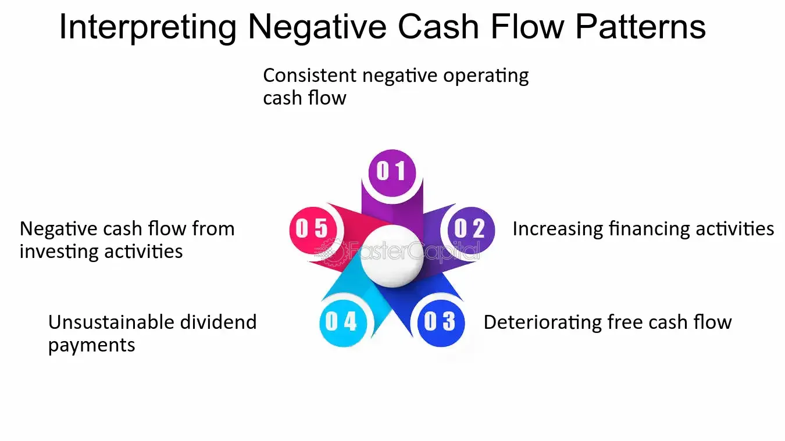

## Table of Contents

## What is cash flow from investments?

Cash flow from investments, also known as cash flow from investing activities, is the section of a company's cash flow statement that shows the money spent on and received from long-term investments. This includes buying and selling assets like property, equipment, and investments in other companies. It helps investors understand how much money a company is putting into its future growth and how it is managing its long-term assets.

When a company buys new equipment or invests in another business, it uses cash, which shows up as a negative number in this section of the cash flow statement. On the other hand, if the company sells an asset, like a building or a piece of equipment, it receives cash, which is shown as a positive number. By looking at the cash flow from investments, you can see whether a company is investing heavily in its future or if it is selling off assets to raise cash.

## Why might a company have negative cash flow from investments?

A company might have negative cash flow from investments because it is spending more money on buying new things than it is getting from selling old things. These new things could be machines, buildings, or even other companies. When a company buys these, it uses up cash, which makes the cash flow from investments negative. This is often a sign that the company is trying to grow and invest in its future.

For example, if a car company decides to build a new factory, it will spend a lot of money on construction and new equipment. This spending will show up as a negative number in the cash flow from investments section of its financial statements. Even though it looks bad to have negative cash flow, it can actually be a good thing if these investments help the company make more money in the long run.

## How can negative cash flow from investments impact a company's financial health?

Negative cash flow from investments can affect a company's financial health in different ways. If a company spends a lot of money on new things like machines or buildings, it might not have enough cash for other important things, like paying bills or buying supplies. This can make it hard for the company to keep running smoothly. If the company can't pay its bills, it might need to borrow money or sell more stock, which can add more problems.

But, negative cash flow from investments isn't always bad. If the company is spending money wisely on things that will help it grow and make more money later, then it can be a good sign. For example, if a company builds a new factory that helps it make more cars, the money spent now might lead to more profits in the future. So, it's important to look at why the cash flow is negative and if the investments will pay off in the long run.

## What are common reasons for a company to invest in negative cash flow projects?

Companies often invest in projects that lead to negative cash flow because they believe these investments will help them grow in the future. For example, a company might build a new factory or buy new machines to make more products. Even though it costs a lot of money now, the company hopes that these new things will help them make more money later. They think that the extra money they will earn will be more than what they spent at the start.

Another reason companies invest in negative cash flow projects is to stay competitive. If other companies in the same industry are investing in new technology or expanding, a company might need to do the same to keep up. If they don't, they might lose customers to their competitors. So, even though it means spending a lot of money now, it can be necessary to keep the company strong and able to compete in the market.

Sometimes, companies also invest in negative cash flow projects to enter new markets or develop new products. This can be risky, but if successful, it can open up new ways to make money. For example, a car company might start making electric cars, which requires a lot of investment in research and new factories. If electric cars become popular, the company could see big profits in the future, making the initial negative cash flow worth it.

## How do you differentiate between short-term and long-term negative cash flow from investments?

Short-term negative cash flow from investments usually happens when a company spends money on things that will help it right away. For example, a company might buy new machines that help them make more products faster. This spending shows up as negative cash flow, but it's expected to turn into positive cash flow soon because the new machines will help the company make more money in the next few months or a year. So, short-term negative cash flow is often about quick fixes or improvements that will pay off in the near future.

Long-term negative cash flow from investments is when a company spends money on things that will take a long time to start making money. This might be building a new factory, doing research for new products, or buying another company. These investments can take years to start paying off, so the cash flow stays negative for a longer time. But, if these long-term investments work out, they can help the company grow a lot and make a lot more money in the future. So, long-term negative cash flow is about planning for the future and making big changes that will help the company over many years.

## What financial ratios should be used to evaluate companies with negative cash flow from investments?

When looking at companies with negative cash flow from investments, it's helpful to use a few key financial ratios. One important ratio is the Return on Investment (ROI). This tells you how much money the company is making from its investments compared to how much it spent. A good ROI means the company's investments are paying off, even if cash flow is negative right now. Another useful ratio is the Debt to Equity Ratio. This shows how much the company is borrowing to fund its investments. If this ratio is high, it might mean the company is taking on too much debt, which could be risky.

Another ratio to consider is the Capital Expenditure (CapEx) to Sales Ratio. This ratio helps you understand how much of the company's sales are being used for big investments like new equipment or buildings. A high ratio might mean the company is investing a lot in its future, but it could also mean it's spending too much and not making enough money from its sales. Finally, the Free Cash Flow to Operating Cash Flow Ratio can give insights into how much cash the company has left after its investments. If this ratio is low, it might mean the company is using up all its cash on investments, which could be a problem if it needs money for other things.

By looking at these ratios, you can get a better idea of whether a company's negative cash flow from investments is a sign of smart growth or a potential problem. Each ratio gives a different piece of the puzzle, helping you see the bigger picture of the company's financial health and future prospects.

## How can an investor assess the potential future benefits of current negative cash flow from investments?

An investor can assess the potential future benefits of a company's current negative cash flow from investments by looking at the company's plans and goals. If the company is spending money on things like new factories or research for new products, the investor should think about how these things might help the company make more money in the future. For example, if a car company is building a new factory to make electric cars, the investor should look at how big the market for electric cars might be and if the company can sell a lot of them. This helps the investor decide if the negative cash flow now will turn into positive cash flow later.

Another way to assess future benefits is by looking at the company's financial ratios and past performance. Ratios like Return on Investment (ROI) can show if the company's investments are likely to pay off. If the ROI is good, it means the company is making smart investments, even if they cost a lot of money right now. Also, looking at how the company has done in the past can help. If the company has a history of making good investments that led to growth, it's more likely that the current negative cash flow will also lead to future benefits. By putting all these pieces together, an investor can get a clearer picture of whether the company's negative cash flow from investments is a good sign for the future.

## What are the industry benchmarks for acceptable levels of negative cash flow from investments?

Industry benchmarks for acceptable levels of negative cash flow from investments can vary a lot depending on the type of industry. For example, in industries like technology or pharmaceuticals, it's common to see high levels of negative cash flow because these companies often spend a lot on research and development. They might not make money right away, but if their new products or technologies are successful, they can make a lot of money in the future. So, in these industries, investors might be okay with more negative cash flow if they believe in the company's long-term plans.

In other industries, like manufacturing or retail, the benchmarks might be different. These industries might not need to spend as much on long-term projects, so investors might expect less negative cash flow. They might want to see that the company is using its money to make more products or improve its stores, which can lead to more sales and profits sooner. But even in these industries, some negative cash flow can be okay if it's for things like new equipment that will help the company grow and make more money over time.

## How do companies with negative cash flow from investments manage their liquidity?

Companies with negative cash flow from investments often need to manage their liquidity carefully to make sure they have enough money to keep running. One way they do this is by using their cash reserves. If a company has saved up some money, it can use this to pay for the things it needs while it's spending a lot on new projects. Another way is by borrowing money. Companies might take out loans or issue bonds to get the cash they need. This can help them keep going, but it also means they have to pay back the money later, which can be risky if their investments don't pay off.

Another way companies manage liquidity is by selling off assets. If a company owns things like buildings or equipment that it doesn't need anymore, it can sell these to get cash quickly. This can help them cover their costs and keep their business running. Sometimes, companies also try to speed up their cash flow from other parts of their business. For example, they might try to get customers to pay their bills faster or delay paying their own bills. By doing these things, companies can make sure they have enough money to keep going, even when they're spending a lot on investments that won't pay off right away.

## What are the strategic considerations a company must weigh before deciding to sustain negative cash flow from investments?

Before a company decides to keep going with negative cash flow from investments, it needs to think about its long-term goals and how these investments will help reach them. The company should look at whether the new factories, machines, or research projects will make more money in the future. If the company thinks these investments will lead to big profits down the road, it might be worth spending the money now, even if it means less cash in the short term. The company also needs to think about how its competitors are doing. If other companies in the same industry are spending a lot on new things, the company might need to do the same to stay competitive and not lose customers.

Another important thing to consider is how the company will handle its money while it's spending a lot on investments. It needs to make sure it has enough cash to keep the business running smoothly. This might mean using money it has saved up, borrowing from a bank, or selling things it doesn't need anymore. The company also needs to think about the risks. If the investments don't work out as planned, the company could be in trouble. So, it's important to have a backup plan and be ready to change course if things don't go well. By thinking about all these things, a company can decide if it's a good idea to keep going with negative cash flow from investments.

## How can advanced financial modeling help in predicting the outcomes of negative cash flow from investments?

Advanced financial modeling can help a company predict what might happen if it keeps spending money on investments that lead to negative cash flow. By using special computer programs and math, the company can create detailed plans that show how much money it will spend and how much it might make back in the future. These models can look at different situations, like what happens if the new factory makes a lot of products or if it doesn't. This helps the company see if the investments will be worth it in the long run and if it can handle the costs without running out of money.

These models also let the company play out different scenarios to see how things could go wrong and what they can do about it. For example, if the new product doesn't sell well, the model can show how much money the company might lose and what it can do to fix the problem, like cutting costs or finding new ways to make money. By using advanced financial modeling, a company can make smarter choices about its investments and feel more confident that the negative cash flow now will lead to positive results later.

## What are the best practices for reporting and communicating negative cash flow from investments to stakeholders?

When a company has negative cash flow from investments, it's important to tell its stakeholders about it in a clear and honest way. The company should explain why it's spending money on new things like factories or research, and how these investments are expected to help the company grow in the future. It's helpful to use simple words and examples that everyone can understand. For example, the company might say, "We're building a new factory to make more cars, which will help us make more money in the next few years." This helps stakeholders see the big picture and understand that the negative cash flow is part of a plan to do better in the future.

The company should also use numbers and charts to show how the investments are expected to pay off. This could include financial projections that show how much money the company might make from its new projects. It's important to be open about any risks, too. The company can say, "We think this will work, but if it doesn't, here's what we'll do to fix it." By sharing both the good and the bad, the company can build trust with its stakeholders. Regular updates, like quarterly reports or meetings, can keep everyone informed about how the investments are going and whether the plan is working out as expected.

## What is Negative Cash Flow in Investments?

Negative cash flow occurs when an investment's expenses exceed its income during a specific period. In financial terms, this is represented mathematically as:

$$
\text{Cash Flow} = \text{Cash Inflows} - \text{Cash Outflows}
$$

When the cash flow is negative, $\text{Cash Outflows} > \text{Cash Inflows}$.

**Implications on Investment Portfolios:**

Negative cash flow can impact investment portfolios by affecting [liquidity](/wiki/liquidity-risk-premium), leading to potential financial strain if not managed properly. It may necessitate additional funding or capital injection to sustain the investment. While traditionally seen as a red flag, negative cash flow is not always detrimental. Certain investments, during their growth phases, might naturally experience negative cash flows before reaching profitability, offering potentially substantial returns in the long term.

**Reasons for Negative Cash Flow:**

Several factors can lead to negative cash flow in investments:

1. **High Initial Costs:** Certain investments, like real estate developments or startups, incur significant initial expenditures that outweigh incoming revenues during early stages.

2. **Operational Expenses:** Ongoing costs such as salaries, utilities, and rent in businesses or maintenance in real estate can contribute to cash outflows surpassing inflows, especially in low-revenue periods.

3. **Capital Expenditures:** Investments requiring substantial upgrades or asset purchases may exhibit temporary negative cash flows.

4. **Economic Conditions:** External economic factors, such as recessions or market volatility, can reduce revenue while costs remain static or increase.

**Risks and Rewards:**

Investments with negative cash flow [carry](/wiki/carry-trading) inherent risks, including potential insolvency, increased borrowing costs, and financial instability. Investors may face challenges in maintaining liquidity or might need to divert capital from other investments.

However, rewards can offset these risks. Investments like startups or growth-oriented real estate projects often see significant appreciation post-cash flow negativity. Early investment during these phases can result in high returns once the venture reaches positive cash flow, leveraging the investor's risk tolerance and strategic patience.

**Typical Negative Cash Flow Investments:**

- **Real Estate:** Properties requiring rehabilitation or located in developing areas tend to start with negative cash flow, with potential long-term value appreciation.

- **Startups:** Early-stage enterprises often prioritize growth over immediate profit, resulting in an initial cash flow deficit.

By examining these examples, it becomes clear that negative cash flow is inherent in certain high-risk-high-reward investment strategies.

**Debunking Myths:**

A common misconception is that negative cash flow is synonymous with poor investment decisions or imminent failure. In reality, many successful companies experienced prolonged periods of negative cash flow as they scaled operations. Panic and rash decisions can exacerbate the situation rather than mitigate it. Understanding the nature of the investment and accurately forecasting future cash flows play vital roles in discerning calculated risks from poor financial health. 

In conclusion, negative cash flow should be analyzed contextually within investment strategies and goals. While indicative of financial strain, it does not inherently spell doom for an investment.

## What are the Financial Analysis Techniques for Negative Cash Flow?

Understanding and evaluating investments with negative cash flow require sophisticated financial analysis techniques that offer insights into both present and future performance. A meticulous breakdown of cash flow statements, alongside the application of financial ratios and advanced metrics, is essential to assess these investments' viability.

**Cash Flow Statements Analysis**

Cash flow statements are critical in understanding the inflow and outflow of resources within a business. These statements are divided into three sections: operating, investing, and financing activities. Analyzing each section allows investors to gain a comprehensive understanding of how a business generates and uses cash. Negative cash flow in the operating activities section might indicate inefficiencies in core business operations or a strategic choice to prioritize growth, while negative cash flow from investing activities might suggest significant reinvestment in future expansion.

**Key Financial Ratios and Metrics**

Several financial ratios and metrics are indispensable in evaluating investment viability, especially for those with negative cash flow. The current ratio, calculated as current assets divided by current liabilities, offers insights into a company's liquidity position. A ratio less than one could be a warning sign but might be acceptable for companies heavily investing in growth. Additionally, the quick ratio, which excludes inventory from current assets, offers a sterner test of liquidity. Meanwhile, the debt-to-equity ratio, computed by dividing total liabilities by shareholder's equity, indicates the degree of financial leverage and risk. A high ratio might amplify concerns in a negative cash flow scenario, yet it could also imply high growth prospects if managed well.

**Discounted Cash Flow Analysis**

Discounted Cash Flow (DCF) analysis is paramount in assessing future investment performance, even with current negative cash flow. The DCF method estimates the present value of expected future cash flows, adjusting for the time value of money. The formula for calculating the present value of cash flows is:

$$
PV = \sum \frac{CF_t}{(1 + r)^t}
$$

where $CF_t$ represents the cash flow in period $t$, and $r$ is the discount rate. This approach helps investors estimate whether the potential returns surpass the current investment outlay, thus ascertaining the investment's worthiness despite negative cash flow indicators.

**Sensitivity Analysis**

Sensitivity analysis is employed to predict how different variables impact investment outcomes under various scenarios. By adjusting assumptions and inputs—such as growth rates, discount rates, and cash flow projections—investors can gauge the robustness of their models and plan for potential risks. This method is particularly useful in uncertain environments where cash flows are currently negative, as it highlights the flexibility and resilience of an investment strategy.

In summary, financial analysis for negative cash flow investments involves comprehensive cash flow statement review, insightful application of financial ratios, forward-looking discounted cash flow models, and robust sensitivity analyses to navigate uncertainties. These methods collectively offer a framework to assess whether continued or increased investment could yield long-term gains.

## How can you turn negative cash flow into a profitable opportunity?

Negative cash flow in investments often deters investors due to the apparent financial strain it represents. However, strategic actions can transform these situations into profitable opportunities. This section presents actionable strategies for optimizing negative cash flow investments.

### Restructuring and Innovation

Restructuring involves critically evaluating and reorganizing an investment to enhance its performance. This may include streamlining operations, renegotiating contracts, or divesting non-core assets. By implementing innovation, such as adopting new technologies or pivoting towards a more scalable business model, companies can improve their cash flow efficiencies. For instance, tech startups may innovate by optimizing their software platforms to attract a broader user base, thereby increasing revenue.

### Decision-Making: Hold, Sell, or Diversify

Investors must decide whether to hold, sell, or diversify an investment based on comprehensive cash flow analysis. A critical metric is the cash flow yield (CFY), calculated as:

$$
\text{CFY} = \frac{\text{Cash Flow}}{\text{Investment Value}}
$$

Investments with a positive CFY or potential for future cash flow improvements may be worth holding. Conversely, investments with consistently negative CFY could signal a need to sell. Diversification can mitigate risks associated with negative cash flow by spreading investments across various assets, reducing exposure to any single underperforming asset.

### Enhancing Profitability Through Operational Efficiency

Increasing operational efficiency can lead to significant cash flow improvements. This involves optimizing processes to reduce costs and eliminate waste, improving profit margins. For example, deploying automation in manufacturing can cut labor costs, enhance production speed, and reduce error rates. A retailer might use data analytics to optimize stock levels and logistics, reducing holding costs while ensuring customer demand is met.

### Strategic Partnerships and Alliances

Collaborations can be instrumental in turning negative cash flow into profit. Strategic partnerships provide access to new markets, technologies, and expertise, while sharing the costs and risks associated with these ventures. A company struggling with negative cash flow could partner with a technology firm to co-develop a product, thus distributing development costs and capitalizing on each other’s strengths. Alliances with suppliers might offer discounts or more favorable terms, further improving cash flow.

By employing these strategies, investors and companies can not only curb the detrimental effects of negative cash flow but also pave the way toward profitability and growth.

## References & Further Reading

[1]: Bergstra, J., Bardenet, R., Bengio, Y., & Kégl, B. (2011). ["Algorithms for Hyper-Parameter Optimization."](https://papers.nips.cc/paper/4443-algorithms-for-hyper-parameter-optimization) Advances in Neural Information Processing Systems 24.

[2]: ["Advances in Financial Machine Learning"](https://www.amazon.com/Advances-Financial-Machine-Learning-Marcos/dp/1119482089) by Marcos Lopez de Prado

[3]: ["Evidence-Based Technical Analysis: Applying the Scientific Method and Statistical Inference to Trading Signals"](https://www.amazon.com/Evidence-Based-Technical-Analysis-Scientific-Statistical/dp/0470008741) by David Aronson

[4]: ["Machine Learning for Algorithmic Trading"](https://github.com/stefan-jansen/machine-learning-for-trading) by Stefan Jansen

[5]: ["Quantitative Trading: How to Build Your Own Algorithmic Trading Business"](https://www.amazon.com/Quantitative-Trading-Build-Algorithmic-Business/dp/1119800064) by Ernest P. Chan