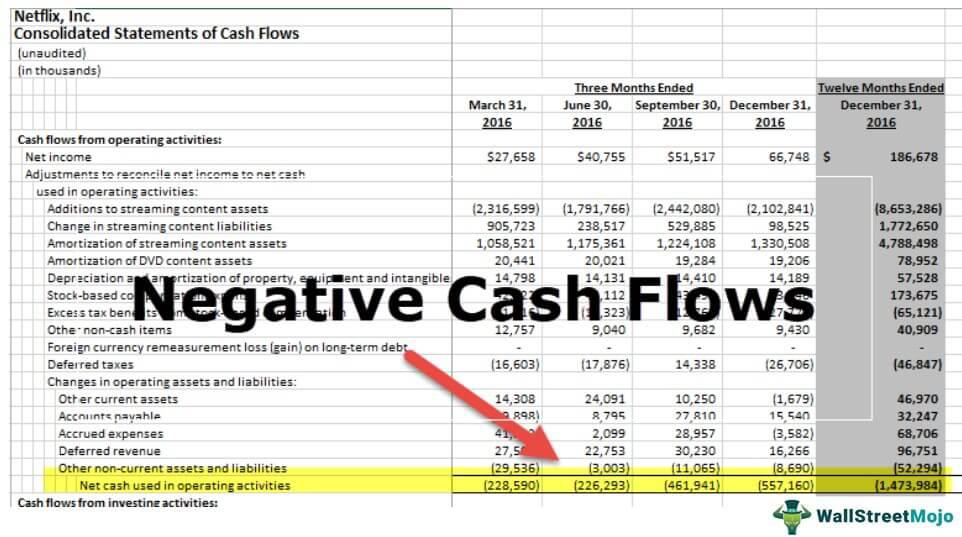

Investments with negative cash flow often represent a paradox for investors. On one hand, negative cash flow indicates that an investment is not generating positive income relative to its expenses in the short term. On the other hand, these investments can open doors to future growth potential and diversification opportunities. Understanding how to effectively manage and evaluate such investments is essential in building a diversified and robust portfolio.

Financial analysis plays a crucial role in evaluating the viability and potential of negative cash flow investments. Through comprehensive evaluation techniques, investors can discern the long-term prospects of these investments beyond the immediate cash flow challenges. For instance, examining the cash flow statements can highlight areas where costs might be reduced or revenue increased, thus improving the financial health of an investment over time.



Moreover, advanced technology has transformed the approach to dealing with negative cash flow assets. Algorithmic trading, in particular, has introduced a new dimension of strategic management, enabling investors to optimize entry and exit points automatically based on predefined criteria. By utilizing complex algorithms and historical data patterns, this technology can identify potential roles and trajectories of negative cash flow investments that may not be immediately apparent through traditional financial analysis alone.

As we explore the intricacies of evaluating and managing such investment strategies, it becomes evident that integrating traditional financial analysis with modern algorithmic trading tools is crucial. This hybrid approach not only aids in risk management but also enhances decision-making capabilities, allowing investors to navigate the complexities of negative cash flow investments with confidence.

Through this article, we aim to provide insights into the methods and strategies used to assess and potentially capitalize on investments characterized by negative cash flow. This includes examining financial analysis techniques, leveraging algorithmic trading, and employing advanced technology tools, all geared toward turning potential drawbacks into profitable opportunities.

## Table of Contents

## What is Negative Cash Flow in Investments?

Negative cash flow occurs when an investment's expenses exceed its income during a specific period. In financial terms, this is represented mathematically as:

$$
\text{Cash Flow} = \text{Cash Inflows} - \text{Cash Outflows}
$$

When the cash flow is negative, $\text{Cash Outflows} > \text{Cash Inflows}$.

**Implications on Investment Portfolios:**

Negative cash flow can impact investment portfolios by affecting [liquidity](/wiki/liquidity-risk-premium), leading to potential financial strain if not managed properly. It may necessitate additional funding or capital injection to sustain the investment. While traditionally seen as a red flag, negative cash flow is not always detrimental. Certain investments, during their growth phases, might naturally experience negative cash flows before reaching profitability, offering potentially substantial returns in the long term.

**Reasons for Negative Cash Flow:**

Several factors can lead to negative cash flow in investments:

1. **High Initial Costs:** Certain investments, like real estate developments or startups, incur significant initial expenditures that outweigh incoming revenues during early stages.

2. **Operational Expenses:** Ongoing costs such as salaries, utilities, and rent in businesses or maintenance in real estate can contribute to cash outflows surpassing inflows, especially in low-revenue periods.

3. **Capital Expenditures:** Investments requiring substantial upgrades or asset purchases may exhibit temporary negative cash flows.

4. **Economic Conditions:** External economic factors, such as recessions or market volatility, can reduce revenue while costs remain static or increase.

**Risks and Rewards:**

Investments with negative cash flow [carry](/wiki/carry-trading) inherent risks, including potential insolvency, increased borrowing costs, and financial instability. Investors may face challenges in maintaining liquidity or might need to divert capital from other investments.

However, rewards can offset these risks. Investments like startups or growth-oriented real estate projects often see significant appreciation post-cash flow negativity. Early investment during these phases can result in high returns once the venture reaches positive cash flow, leveraging the investor's risk tolerance and strategic patience.

**Typical Negative Cash Flow Investments:**

- **Real Estate:** Properties requiring rehabilitation or located in developing areas tend to start with negative cash flow, with potential long-term value appreciation.

- **Startups:** Early-stage enterprises often prioritize growth over immediate profit, resulting in an initial cash flow deficit.

By examining these examples, it becomes clear that negative cash flow is inherent in certain high-risk-high-reward investment strategies.

**Debunking Myths:**

A common misconception is that negative cash flow is synonymous with poor investment decisions or imminent failure. In reality, many successful companies experienced prolonged periods of negative cash flow as they scaled operations. Panic and rash decisions can exacerbate the situation rather than mitigate it. Understanding the nature of the investment and accurately forecasting future cash flows play vital roles in discerning calculated risks from poor financial health. 

In conclusion, negative cash flow should be analyzed contextually within investment strategies and goals. While indicative of financial strain, it does not inherently spell doom for an investment.

## Financial Analysis Techniques for Negative Cash Flow

Understanding and evaluating investments with negative cash flow require sophisticated financial analysis techniques that offer insights into both present and future performance. A meticulous breakdown of cash flow statements, alongside the application of financial ratios and advanced metrics, is essential to assess these investments' viability.

**Cash Flow Statements Analysis**

Cash flow statements are critical in understanding the inflow and outflow of resources within a business. These statements are divided into three sections: operating, investing, and financing activities. Analyzing each section allows investors to gain a comprehensive understanding of how a business generates and uses cash. Negative cash flow in the operating activities section might indicate inefficiencies in core business operations or a strategic choice to prioritize growth, while negative cash flow from investing activities might suggest significant reinvestment in future expansion.

**Key Financial Ratios and Metrics**

Several financial ratios and metrics are indispensable in evaluating investment viability, especially for those with negative cash flow. The current ratio, calculated as current assets divided by current liabilities, offers insights into a company's liquidity position. A ratio less than one could be a warning sign but might be acceptable for companies heavily investing in growth. Additionally, the quick ratio, which excludes inventory from current assets, offers a sterner test of liquidity. Meanwhile, the debt-to-equity ratio, computed by dividing total liabilities by shareholder's equity, indicates the degree of financial leverage and risk. A high ratio might amplify concerns in a negative cash flow scenario, yet it could also imply high growth prospects if managed well.

**Discounted Cash Flow Analysis**

Discounted Cash Flow (DCF) analysis is paramount in assessing future investment performance, even with current negative cash flow. The DCF method estimates the present value of expected future cash flows, adjusting for the time value of money. The formula for calculating the present value of cash flows is:

$$
PV = \sum \frac{CF_t}{(1 + r)^t}
$$

where $CF_t$ represents the cash flow in period $t$, and $r$ is the discount rate. This approach helps investors estimate whether the potential returns surpass the current investment outlay, thus ascertaining the investment's worthiness despite negative cash flow indicators.

**Sensitivity Analysis**

Sensitivity analysis is employed to predict how different variables impact investment outcomes under various scenarios. By adjusting assumptions and inputs—such as growth rates, discount rates, and cash flow projections—investors can gauge the robustness of their models and plan for potential risks. This method is particularly useful in uncertain environments where cash flows are currently negative, as it highlights the flexibility and resilience of an investment strategy.

In summary, financial analysis for negative cash flow investments involves comprehensive cash flow statement review, insightful application of financial ratios, forward-looking discounted cash flow models, and robust sensitivity analyses to navigate uncertainties. These methods collectively offer a framework to assess whether continued or increased investment could yield long-term gains.

## Algorithmic Trading and Its Role in Managing Negative Cash Flow

Algorithmic trading refers to the use of computer algorithms to automate trading activities in financial markets. By executing pre-programmed trading instructions accounting for variables such as timing, price, and [volume](/wiki/volume-trading-strategy), [algorithmic trading](/wiki/algorithmic-trading) minimizes human intervention and enhances decision-making efficiency. Its significance in modern financial markets cannot be overstated, as it provides increased speed, reduced transaction costs, and the ability to analyze vast datasets at unprecedented scales.

For portfolios with negative cash flow, algorithmic trading strategies can be particularly advantageous. These strategies can be customized to dynamically manage and adjust investment positions based on real-time market conditions and historical data trends. By automating the trade execution process, algorithmic systems help investors take advantage of fleeting market opportunities, potentially offsetting the adverse effects of negative cash flow.

Machine learning and data analytics play pivotal roles in predicting cash flow patterns. Machine learning models can be trained on historical financial data, including macroeconomic indicators and company-specific metrics, to identify patterns and trends that may signal future cash flow movements. By analyzing these patterns, algorithms can forecast periods of negative or positive cash flow, allowing investors to proactively adjust their strategies. For instance, a [machine learning](/wiki/machine-learning) model could process a time series of cash flow data to anticipate downturns, ensuring that trading algorithms adjust positions accordingly.

Risk management in algorithmic trading systems involves a multifaceted approach to ensure that automated strategies do not expose portfolios to undue risk. Techniques such as stop-loss orders, position sizing, and diversification are embedded within the trading algorithms to control potential losses. Moreover, portfolio rebalancing algorithms monitor and adjust asset allocations to maintain desired risk levels constantly. These automated systems can execute risk mitigation strategies instantaneously, which is crucial during episodes of financial market [volatility](/wiki/volatility-trading-strategies).

Case studies highlight the efficacy of algorithmic trading in mitigating negative cash flow surprises. For example, a [hedge fund](/wiki/hedge-fund-trading-strategies) utilizing algorithmic trading strategies managed a portfolio of energy stocks, traditionally characterized by volatile cash flows due to fluctuating oil prices. By employing predictive analytics and automated trade adjustments, the fund was able to hedge against adverse price movements effectively, thereby stabilizing cash flow and increasing overall portfolio resilience.

In summary, algorithmic trading offers sophisticated and highly efficient tools for managing portfolios with negative cash flow. By integrating machine learning and advanced data analytics, these systems enhance predictive capabilities and provide robust risk management, ensuring investors can navigate the challenges of negative cash flow environments effectively.

## Evaluating Investments with Advanced Tools and Technology

The evaluation of investments with negative cash flow has significantly evolved with the advent of advanced tools and technology. These innovations allow investors to more accurately estimate potentials and risks, bridging gaps traditionally filled by experience and intuition.

Technology has revolutionized traditional financial analysis methods by automating and enhancing data processing capabilities. Advanced algorithms can now scrutinize vast datasets far more efficiently than manual analysis. Techniques such as machine learning provide predictive insights by identifying patterns and trends in financial data, assisting investors in making informed decisions. Through these analytical advancements, investors can more effectively identify anomalous activities or trends indicative of negative cash flow issues.

Real-time data has become crucial in investment analysis, allowing for timely and agile decision-making. With continuous data streams from global markets, investors can track their investments' performance minute-by-minute, enabling them to act swiftly to mitigate potential losses or capitalize on emerging opportunities. Platforms such as Bloomberg Terminal and Reuters Eikon offer real-time analysis and updates, making them indispensable tools for modern investors.

Several platforms and software solutions provide comprehensive support for investment analysis, offering features like trend analytics, forecasting, and scenario modeling. Platforms such as Morningstar Direct and FactSet integrate large datasets with sophisticated analytical tools, enabling investors to observe and manipulate data in ways that provide deeper insights into potential investments.

For precise evaluation and timing, investors can leverage these tools through strategies such as algorithmic trading, which employs automated trading systems to execute trades based on predefined criteria. This ensures that trades are conducted at optimal times without human errors or delays. Algorithms can incorporate complex variables, allowing for a nuanced approach to handling investments with negative cash flow, adjusting dynamically to market conditions. For example:

```python
import pandas as pd
from sklearn.linear_model import LinearRegression

# Example of using historical data to predict future cash flow
historical_data = pd.read_csv('historical_cash_flow.csv')
X = historical_data[['period']].values
y = historical_data['cash_flow'].values

# Linear regression model for prediction
model = LinearRegression().fit(X, y)
next_period = [[6]]  # Predict cash flow for next period
predicted_cash_flow = model.predict(next_period)

print(f"Predicted cash flow for the next period: {predicted_cash_flow}")
```

This Python example demonstrates the use of linear regression for predicting future cash flows based on historical data, enabling investors to anticipate potential negative cash flow scenarios and prepare accordingly.

Overall, these advanced tools and technologies not only enhance the precision with which investors evaluate potential opportunities but also extend their capability to optimize the timing of their decisions, transforming potential negative cash flow challenges into manageable, and even profitable, opportunities.

## Strategies for Turning Negative Cash Flow into a Profitable Opportunity

Negative cash flow in investments often deters investors due to the apparent financial strain it represents. However, strategic actions can transform these situations into profitable opportunities. This section presents actionable strategies for optimizing negative cash flow investments.

### Restructuring and Innovation

Restructuring involves critically evaluating and reorganizing an investment to enhance its performance. This may include streamlining operations, renegotiating contracts, or divesting non-core assets. By implementing innovation, such as adopting new technologies or pivoting towards a more scalable business model, companies can improve their cash flow efficiencies. For instance, tech startups may innovate by optimizing their software platforms to attract a broader user base, thereby increasing revenue.

### Decision-Making: Hold, Sell, or Diversify

Investors must decide whether to hold, sell, or diversify an investment based on comprehensive cash flow analysis. A critical metric is the cash flow yield (CFY), calculated as:

$$
\text{CFY} = \frac{\text{Cash Flow}}{\text{Investment Value}}
$$

Investments with a positive CFY or potential for future cash flow improvements may be worth holding. Conversely, investments with consistently negative CFY could signal a need to sell. Diversification can mitigate risks associated with negative cash flow by spreading investments across various assets, reducing exposure to any single underperforming asset.

### Enhancing Profitability Through Operational Efficiency

Increasing operational efficiency can lead to significant cash flow improvements. This involves optimizing processes to reduce costs and eliminate waste, improving profit margins. For example, deploying automation in manufacturing can cut labor costs, enhance production speed, and reduce error rates. A retailer might use data analytics to optimize stock levels and logistics, reducing holding costs while ensuring customer demand is met.

### Strategic Partnerships and Alliances

Collaborations can be instrumental in turning negative cash flow into profit. Strategic partnerships provide access to new markets, technologies, and expertise, while sharing the costs and risks associated with these ventures. A company struggling with negative cash flow could partner with a technology firm to co-develop a product, thus distributing development costs and capitalizing on each other’s strengths. Alliances with suppliers might offer discounts or more favorable terms, further improving cash flow.

By employing these strategies, investors and companies can not only curb the detrimental effects of negative cash flow but also pave the way toward profitability and growth.

## Conclusion

In analyzing investments with negative cash flow, the central role of financial analysis and algorithmic trading cannot be overstated. Financial analysis offers a structured approach to understanding cash flow patterns, employing tools such as cash flow statements and financial ratios to assess investment viability. Techniques like discounted cash flow analysis and sensitivity analysis provide a framework to evaluate potential returns and risks. These methods form the backbone of informed decision-making, enabling investors to pinpoint opportunities and craft strategic responses to financial challenges.

Simultaneously, algorithmic trading emerges as a powerful ally in managing negative cash flow portfolios. By leveraging advanced algorithms and data analytics, investors can predict cash flow trends and automate decision-making processes for optimal outcomes. Machine learning facilitates deeper insights into market conditions, refining strategy and risk management. This integration of technology streamlines the evaluation and implementation of investment strategies, enhancing responsiveness to market shifts.

The convergence of traditional financial techniques and modern technology creates a comprehensive toolkit for investors. It is crucial for investors to harness both approaches, balancing the tried-and-true methods with emerging technological advancements. As markets evolve, so too does the necessity for continuous learning and adaptation. The landscape of negative cash flow investments is dynamic, demanding diligent engagement with new tools and practices.

Looking forward, the future of managing negative cash flow investments lies in embracing innovation and fostering a culture of agility. Investors must remain vigilant, consistently updating their knowledge base and methodologies to stay competitive. This ongoing educational endeavor positions investors to not only manage negative cash flow effectively but also to capitalize on the inherent opportunities such investments may present.

## References & Further Reading

[1]: Bergstra, J., Bardenet, R., Bengio, Y., & Kégl, B. (2011). ["Algorithms for Hyper-Parameter Optimization."](https://papers.nips.cc/paper/4443-algorithms-for-hyper-parameter-optimization) Advances in Neural Information Processing Systems 24.

[2]: ["Advances in Financial Machine Learning"](https://www.amazon.com/Advances-Financial-Machine-Learning-Marcos/dp/1119482089) by Marcos Lopez de Prado

[3]: ["Evidence-Based Technical Analysis: Applying the Scientific Method and Statistical Inference to Trading Signals"](https://www.amazon.com/Evidence-Based-Technical-Analysis-Scientific-Statistical/dp/0470008741) by David Aronson

[4]: ["Machine Learning for Algorithmic Trading"](https://github.com/stefan-jansen/machine-learning-for-trading) by Stefan Jansen

[5]: ["Quantitative Trading: How to Build Your Own Algorithmic Trading Business"](https://www.amazon.com/Quantitative-Trading-Build-Algorithmic-Business/dp/1119800064) by Ernest P. Chan