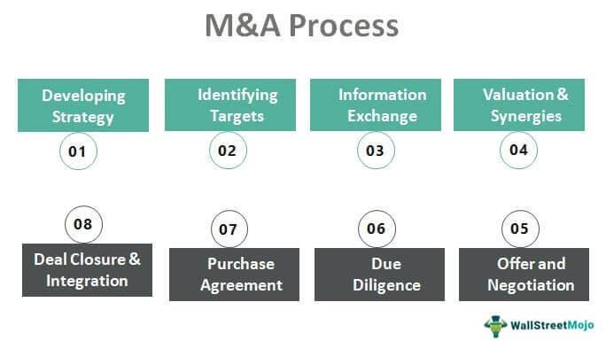

Acquisition analysis is a critical step in the strategic growth of companies, enabling them to evaluate potential targets for mergers or acquisitions. By conducting a thorough acquisition analysis, businesses can assess a target company's value, determine the strategic fit, and weigh the potential benefits and risks associated with the acquisition. This process is essential for making informed business decisions that can significantly impact a company's competitive position and market presence.

To conduct a comprehensive acquisition analysis, it is crucial to focus on key elements such as financial analysis, market assessment, and risk management. Financial analysis involves examining the financial health of the target company, including its revenue streams, profitability, and cash flow. This helps in understanding the financial viability of the acquisition and identifying potential synergies that may arise from combining the operations of the acquiring and target companies.



Market assessment involves analyzing the competitive landscape and market dynamics to determine the strategic positioning of the target company. This includes evaluating market size, growth potential, and customer base, which are critical factors that influence the long-term success of the acquisition.

Risk management is another vital component of acquisition analysis. It involves identifying and mitigating potential risks, such as financial, operational, or regulatory challenges, that could affect the success of the acquisition. A thorough risk assessment ensures that companies are prepared to address any obstacles that may arise during the integration process, thereby reducing the likelihood of post-acquisition failures.

Understanding these elements helps companies make informed acquisition decisions and enhances the likelihood of achieving desired outcomes. By carefully analyzing potential acquisition targets through financial scrutiny, market insights, and risk mitigation strategies, businesses can identify the most suitable opportunities for expansion and growth.

## Table of Contents

## Understanding the Importance of Acquisition Analysis

Acquisition analysis is a foundational aspect of corporate strategy, enabling companies to systematically evaluate the merits and challenges associated with acquiring another enterprise. By engaging in thorough acquisition analysis, firms can determine how well a potential target aligns with their strategic goals, assess the target's financial health, and evaluate the cultural compatibility between the organizations.

A critical component of this analysis is evaluating the strategic fit. The concept of strategic fit involves assessing how well the target company complements the acquiring firm's existing operations and long-term objectives. This includes examining synergies that could arise from the merger or acquisition, such as enhanced market reach, improved product offerings, or operational efficiencies. Evaluating strategic fit ensures that the acquisition contributes meaningfully to the acquirer's overall corporate strategy.

Financial performance is another vital aspect of acquisition analysis. By conducting a detailed financial examination, the acquirer can assess the target company's profitability, revenue streams, and overall financial stability. This involves reviewing financial statements, understanding historical financial trends, and predicting future financial performance. Accurate financial assessments are essential for determining whether the acquisition will deliver the anticipated financial gains and justify the investment.

Cultural compatibility between the acquirer and the target is equally important. Cultural disparities can lead to integration challenges post-acquisition if not properly addressed. Understanding the organizational cultures of both entities helps in anticipating potential conflicts and devising strategies to harmonize the workforce and operational practices.

Acquisition analysis extends beyond internal assessments, incorporating insights from various stakeholders, including shareholders, customers, and regulators. Shareholders are primarily concerned with value creation and return on investment, while customers may focus on how the acquisition impacts product quality or service levels. Regulators, on the other hand, evaluate whether the acquisition complies with legal frameworks and competition laws. Understanding these diverse perspectives aids companies in crafting a well-rounded acquisition strategy that satisfies all parties involved.

Furthermore, a robust acquisition analysis equips businesses with the tools to identify optimal candidates for acquisition and devise effective negotiation strategies. By evaluating potential targets against well-defined acquisition criteria and understanding the negotiation dynamics, companies can negotiate terms that maximize value and facilitate smooth integration.

In summary, thorough acquisition analysis supports informed decision-making by evaluating strategic fit, financial performance, and cultural compatibility. It also helps accommodate the perspectives of various stakeholders and elucidates optimal acquisition candidates and negotiation strategies. These elements collectively empower companies to undertake acquisitions that bolster strategic goals and offer significant business value.

## Key Concepts and Terminology

Acquisition analysis is a systematic approach to evaluating potential targets for mergers or acquisitions. At its core, it involves assessing whether a target company aligns strategically and financially with the acquiring company’s objectives. Understanding key concepts and terminology is vital for effective acquisition analysis.

The acquirer is the company initiating the acquisition, while the target is the company being considered for purchase. A merger is a mutual consolidation of two companies into one entity, whereas an acquisition involves one company taking over another, which can either be friendly or hostile.

Strategic fit is a crucial concept, referring to the degree to which the target complements the acquirer’s long-term objectives. This can involve entering new markets, acquiring new technologies, or achieving economies of scale.

Financial performance indicators such as revenue, profitability, and cash flow are examined to evaluate the target's health. Valuation methods are essential tools used to estimate the worth of a target company. Common techniques include:

1. **Comparable Company Analysis (CCA)**: This market-based method assesses a target’s value by comparing it with similar companies.

2. **Discounted Cash Flow (DCF) Analysis**: An income-based method that estimates the present value of expected future cash flows using a specific discount rate. The DCF formula can be represented as:
$$
   V = \sum \frac{CF_t}{(1 + r)^t}

$$

   Where $V$ is the estimated value, $CF_t$ is the cash flow at time $t$, and $r$ is the discount rate.

3. **Net Asset Value (NAV)**: An asset-based approach that calculates the target's value by subtracting liabilities from total assets.

Understanding synergies, which are potential benefits realized post-acquisition, is crucial. These can manifest as cost savings (e.g., through streamlined operations), revenue growth (e.g., by accessing new customer bases), or improved capabilities (e.g., enhanced technological resources).

Identifying risks and challenges is critical for a successful acquisition. This includes financial risks such as unanticipated debts, operational risks like integration difficulties, and cultural risks stemming from incompatible corporate cultures. A thorough risk assessment can guide effective risk management strategies, ultimately contributing to the success of the acquisition process.

## Identifying and Collecting Relevant Information

Gathering relevant data is a fundamental aspect of acquisition analysis, as it allows for an accurate assessment of a target company's value and associated risks. This process begins by defining specific data needs through the use of due diligence checklists, which encompass financial, market, and operational insights. These checklists guide the collection of comprehensive and relevant information, necessary for informed decision-making.

Primary data collection involves direct interactions, such as interviews and surveys, which provide firsthand insights into the target company's operations, management, and market presence. These data sources offer unique perspectives that can uncover areas not immediately visible through secondary data sources.

Secondary data, on the other hand, is accessed through publicly available records, industry reports, financial statements, and market analyses. This data provides a broader context and benchmarks necessary for comparative analysis.

Documenting the data collection process is critical to maintaining the consistency and quality of the analysis. A well-structured document trail ensures traceability and verifies the authenticity and reliability of the data collected. It also facilitates the review and validation of information by stakeholders involved in the acquisition process.

Analyzing the collected data requires the use of appropriate tools and methodologies. Spreadsheets are commonly employed for quantitative data analysis, allowing for the organization and manipulation of large datasets. Databases facilitate the storage and retrieval of extensive records and enable complex queries to identify trends and patterns. These tools support the evaluation of the target’s financial health, market positioning, and operational efficiencies.

Python is frequently used for data analysis due to its powerful libraries such as Pandas for data manipulation, NumPy for numerical computations, and Matplotlib for data visualization. These tools can enhance the depth of analysis and provide clear visual representations of data trends and simulations. For example, Python code might aggregate financial data to evaluate profitability trends over time:

```python
import pandas as pd
import matplotlib.pyplot as plt

# Load financial data
data = pd.read_csv('financial_data.csv')

# Calculate annual profitability
annual_profitability = data.groupby('Year')['Profit'].sum()

# Plot profitability over time
plt.plot(annual_profitability.index, annual_profitability.values, marker='o')
plt.title('Annual Profitability Trend')
plt.xlabel('Year')
plt.ylabel('Profit')
plt.grid(True)
plt.show()
```

By employing a blend of primary and secondary data sources and utilizing advanced tools for analysis, businesses can conduct a thorough evaluation of potential acquisition targets, enhancing their ability to make strategic acquisition decisions.

## Evaluating the Financial Viability of an Acquisition

Evaluating the financial viability of an acquisition is a critical component of the acquisition analysis process, offering insight into whether a target company is a sound investment. This assessment begins with a thorough examination of the target's financial statements, focusing on cash flow, profitability, and balance sheet metrics to establish a holistic understanding of its financial health.

Cash flow analysis is particularly important, as it reveals the [liquidity](/wiki/liquidity-risk-premium) and operational efficiency of the business. It involves evaluating operational cash flow, which can be calculated using the formula:

$$
\text{Operating Cash Flow} = \text{Net Income} + \text{Non-Cash Expenses} - \text{Changes in Working Capital}
$$

Profitability assessment involves scrutinizing ratios such as gross margin, operating margin, and net profit margin. These ratios provide insights into how well the company transforms revenues into profits at different stages.

Analyzing the balance sheet involves assessing assets, liabilities, and equity to determine the company’s financial stability and debt levels. Key ratios such as the current ratio and debt-to-equity ratio are utilized:

$$
\text{Current Ratio} = \frac{\text{Current Assets}}{\text{Current Liabilities}}
$$

$$
\text{Debt-to-Equity Ratio} = \frac{\text{Total Liabilities}}{\text{Shareholder's Equity}}
$$

Identifying potential synergies is another critical step. Synergies refer to the additional value generated from an acquisition, manifested as cost reductions, enhanced revenue, or improved capabilities. These can arise from economies of scale, combined talent, or complementary product lines. Synergies are evaluated for their impact on value creation, often using financial models.

Conducting due diligence entails a review of historical financial statements to understand past performance and projected statements to anticipate future trends. This analysis is essential for uncovering hidden liabilities or unsustainable financial practices.

Financial models, such as discounted cash flow (DCF), are employed to project future cash flows and ascertain their present value. The sensitivity analysis then explores how changes in key assumptions, such as revenue growth rates or discount rates, affect a company's valuation. In Python, sensitivity analysis can be performed using libraries like numpy and pandas to handle calculations and data manipulation efficiently.

Conclusively, this comprehensive financial review allows companies to make informed decisions about potential acquisitions, ensuring strategic alignment and financial soundness. Proper analysis not only identifies lucrative opportunities but also mitigates risks associated with overvaluation or unattainable synergies.

## Assessing the Market Potential and Competitive Landscape

To make informed acquisition decisions, it is crucial to comprehend the market dynamics and competitive landscape associated with a potential target. This understanding aids in assessing the market potential, including market size, growth prospects, and segmentation, which are pivotal in determining the strategic value of an acquisition.

Analyzing the market size involves estimating the total sales [volume](/wiki/volume-trading-strategy) or revenue the market can generate. This estimate can be derived from industry reports, government publications, and market research studies. The growth potential of the market is another critical [factor](/wiki/factor-investing), reflecting the expected future expansion rate. Historical growth rates and forecasts from trusted research firms can provide a foundation for this analysis.

Target market segmentation is essential to refine acquisition strategies. It involves categorizing the potential customer base into distinct groups based on characteristics such as demographics, purchasing behavior, or geographic location. This segmentation allows for a more focused approach in tailoring products or services to meet specific needs, thereby increasing the chances of market penetration and success.

Competitive analysis is a vital component of assessing the market landscape. It involves identifying both direct and indirect competitors within the industry and evaluating their strengths, weaknesses, strategies, and market positioning. By understanding the competitive environment, a company can formulate strategies to differentiate itself, such as through pricing, product features, or customer service enhancements.

Identifying market opportunities is integral to strategic positioning and product differentiation. Opportunities might arise from unmet customer needs, technological advancements, regulatory changes, or shifts in consumer behavior. Identifying these opportunities can help the acquirer position itself advantageously in the market, offering unique or superior value propositions compared to competitors.

Evaluating industry trends provides insights into the target company's market position. This evaluation includes examining technological developments, regulatory impacts, economic factors, and social trends that could influence business operations and market dynamics. Companies should pay attention to predictive analytics to anticipate future trends, allowing them to adapt and align their acquisition strategies to maintain or improve market standing.

In summary, assessing market potential and the competitive landscape involves a comprehensive understanding of current and projected market conditions, competitive dynamics, and emerging opportunities. It is a foundational step in acquisition analysis, allowing companies to make strategic decisions that align with their long-term business goals.

## Conducting a Thorough Investigation of the Target Company

Conducting a thorough investigation of the target company is a critical component of acquisition analysis. This comprehensive process, commonly known as due diligence, is essential for evaluating the financial, legal, operational, and strategic aspects of a potential acquisition target.

Financial due diligence is the cornerstone of the investigation. It involves a meticulous review of the target company's financial statements, including the balance sheet, income statement, and cash flow statement. The objective is to verify the accuracy of reported figures, assess historical financial performance, and identify any potential liabilities that may not be readily apparent. Key areas of focus include revenue recognition practices, quality of earnings, and the sustainability of financial performance. Financial ratios and metrics, such as the current ratio, debt-to-equity ratio, and return on equity, can aid in evaluating the company's financial health.

Legal due diligence involves scrutinizing the target company's compliance with applicable laws and regulations. This aspect of the investigation seeks to uncover potential legal risks, including ongoing or pending litigation, intellectual property disputes, and regulatory infractions. A thorough examination of contracts, licenses, permits, and corporate governance documents is conducted to ensure legality and protection against future liabilities.

Operational analysis examines the efficiency and scalability of the target company's existing business model. It involves assessing supply chain logistics, production processes, and human resources management. The potential challenges associated with integrating these operations into the acquirer’s framework are also evaluated. Efficiency metrics and SWOT analysis (Strengths, Weaknesses, Opportunities, Threats) help identify operational strengths and weaknesses.

Strategic due diligence focuses on the broader compatibility of the two companies involved in the transaction. This involves an evaluation of the cultural fit, alignment of business objectives, and the target company's competitive position within its industry. Understanding the strategic advantage or disadvantage the acquisition may create is essential for long-term success. The evaluation may include market position, brand equity, and customer base analysis.

By conducting a thorough investigation across these areas, companies can make informed decisions regarding potential acquisitions. This meticulous approach mitigates risks and enhances the likelihood of successful post-acquisition integration.

## Identifying and Mitigating Risks Associated with the Acquisition

Risk assessment is a vital component of the acquisition process, serving to identify and manage potential operational, financial, and legal risks that could impact the success of the merger or acquisition. The primary objective is to evaluate these risks based on their likelihood and potential impact, enabling businesses to prioritize mitigation efforts effectively.

**Evaluating Risks**: The evaluation process involves a systematic analysis of each identified risk. This involves calculating both the probability of occurrence and the severity of its impact, often expressed as a risk score. Risk scores can be used to prioritize which risks require immediate attention. For instance, high-probability and high-impact risks are usually prioritized over those with lower scores.

**Risk Mitigation Strategies**: Developing risk mitigation strategies is crucial to address the prioritized risks. Common strategies include:

- **Avoidance**: Eliminating a risk by altering plans to avoid its occurrence.
- **Reduction**: Implementing measures to reduce the likelihood or impact of a risk.
- **Transfer**: Shifting the risk to a third party, such as through insurance or outsourcing.
- **Acceptance**: Acknowledging the risk and preparing to manage its impact without additional action.

A hypothetical example in Python could demonstrate how risk scores are calculated and how strategies are applied:

```python
# Sample data of risks with probabilities and impact levels
risks = [
    {"name": "Operational", "probability": 0.3, "impact": 8},
    {"name": "Financial", "probability": 0.5, "impact": 5},
    {"name": "Legal", "probability": 0.2, "impact": 9}
]

# Calculate risk score
for risk in risks:
    risk['score'] = risk['probability'] * risk['impact']

# Sort risks by score to prioritize
sorted_risks = sorted(risks, key=lambda x: x['score'], reverse=True)

# Display prioritized risks
for risk in sorted_risks:
    print(f"Risk: {risk['name']}, Score: {risk['score']}")
```

**Effective Risk Management**: Effective risk management enhances the prospects of a successful acquisition by ensuring that potential issues are addressed proactively. It involves integrating risk management into the broader strategic and operational planning processes of the acquisition.

**Continuous Monitoring**: The risk landscape can evolve as the business environment changes or as new information becomes available during the acquisition process. Continuous monitoring is thus imperative, allowing for the prompt identification and management of emerging risks. This can involve regular reviews and updates to the risk management plan, ensuring it remains relevant and effective.

In conclusion, a structured approach to risk assessment and mitigation plays an instrumental role in fostering a successful acquisition. By prioritizing risks and implementing appropriate strategies, companies can navigate the complexities of acquisitions with greater confidence and security.

## Determining the Fair Value of the Target Company

Estimating the fair value of a target company is a fundamental aspect of acquisition analysis, which involves applying various valuation methods tailored to the specific circumstances of the company and its industry. Three primary valuation approaches are commonly used: market-based methods, income-based methods, and asset-based methods.

### Market-Based Methods

Market-based methods derive the value of a company by comparing it with similar companies or recent transactions in the market. This approach assumes that similar assets should sell for similar prices when their characteristics are comparable. Two prevalent types of market-based methods are the Comparable Company Analysis (CCA) and the Precedent Transactions Analysis (PTA).

- **Comparable Company Analysis (CCA):** This method involves evaluating the target company against publicly traded companies in the same industry, considering their price multiples such as Price-to-Earnings (P/E), Price-to-Sales (P/S), and Enterprise Value-to-EBITDA (EV/EBITDA).

- **Precedent Transactions Analysis (PTA):** This approach looks at past transactions involving similar companies. Factors such as acquisition premiums and market conditions at the time of those transactions are taken into account to estimate the target company's value.

### Income-Based Methods

Income-based methods focus on the expected future earnings of a company. The most common approach is the Discounted Cash Flow (DCF) method, which calculates the present value of projected future cash flows.

- **Discounted Cash Flow (DCF):** DCF analysis involves estimating the future cash flows the company is expected to generate and discounting them back to their present value using a discount rate, often based on the company's weighted average cost of capital (WACC). The formula for DCF is:
$$
  \text{DCF} = \sum_{t=1}^{n} \frac{CF_t}{(1 + r)^t}

$$

  where $CF_t$ is the cash flow at time $t$, $n$ is the number of periods, and $r$ is the discount rate.

This method is particularly useful for companies with stable and predictable cash flow and requires a thorough understanding of the company's business model and market environment.

### Asset-Based Methods

Asset-based methods involve determining the fair value of a company by analyzing its net asset value (NAV). This approach can be particularly relevant for asset-intensive companies or those undergoing liquidation.

- **Net Asset Value (NAV):** This is calculated by subtracting the total liabilities from the total assets of the company. Adjustments may be necessary to account for differences between book values and market values of assets and liabilities.
$$
  \text{NAV} = \text{Total Assets} - \text{Total Liabilities}

$$

Asset-based methods may also include liquidation values, particularly when a company's value is better measured by the worth of its tangible assets than its ongoing business operations.

### Selecting the Right Method

Choosing the appropriate valuation method involves understanding the unique features of the target company and its industry. Factors such as the company's growth stage, the predictability of its earnings, its asset structure, and the dynamics of its market will influence the choice of valuation techniques. Often, a combination of methods is used to triangulate and validate the estimated fair value.

In conclusion, determining the fair value of a target company requires a nuanced approach, combining various valuation methods to achieve a comprehensive understanding of its worth. This process not only aids in making informed acquisition decisions but also supports effective negotiation strategies.

## Making Informed Decisions Based on the Acquisition Analysis

The acquisition analysis process plays a pivotal role in guiding strategic decisions and negotiations. The first step in this process is defining clear acquisition objectives and criteria. This involves setting specific goals that the acquisition is intended to achieve, such as expanding market share, acquiring new technologies, or entering new geographic markets. Well-defined objectives ensure that potential target companies align with the overall strategic direction of the acquiring company.

Conducting comprehensive due diligence is essential in verifying information and evaluating risks associated with potential acquisition targets. Due diligence typically includes examining financial statements, assessing legal compliance, and understanding operational processes. Accurate and thorough due diligence helps identify any undisclosed liabilities or risks, enabling the acquiring company to make more informed decisions.

In the negotiation phase, the focus should be on terms that facilitate a smooth integration and establish clear management arrangements. This involves discussing aspects such as the integration of teams, organizational structure, and retention of key personnel. Effective negotiation also requires the development of structured agreements that protect the interests of both parties while laying the groundwork for long-term collaboration.

Successful acquisitions are often characterized by effective communication and performance monitoring. Transparent communication between stakeholders helps maintain trust and ensures that all parties are aligned on key objectives and integration plans. Regular performance monitoring facilitates tracking progress against acquisition goals and allows for timely adjustments to strategies when necessary.

In summary, making informed decisions in the acquisition process requires a clear articulation of objectives, detailed due diligence, strategic negotiation of terms, and ongoing communication and performance assessment. These elements collectively enhance the likelihood of a successful acquisition and integration.

## References & Further Reading

[1]: Damodaran, A. (2012). ["Investment Valuation: Tools and Techniques for Determining the Value of Any Asset."](https://books.google.com/books/about/Investment_Valuation.html?id=5SRHAAAAQBAJ) Wiley.

[2]: DePamphilis, D. (2019). ["Mergers, Acquisitions, and Other Restructuring Activities: An Integrated Approach to Process, Tools, Cases, and Solutions."](https://www.sciencedirect.com/book/9780128016091/mergers-acquisitions-and-other-restructuring-activities) Academic Press.

[3]: Gaughan, P. A. (2015). ["Mergers, Acquisitions, and Corporate Restructurings."](https://onlinelibrary.wiley.com/doi/book/10.1002/9781119380771) Wiley.

[4]: Koller, T., Goedhart, M., & Wessels, D. (2015). ["Valuation: Measuring and Managing the Value of Companies."](https://www.wiley.com/en-us/Valuation%3A+Measuring+and+Managing+the+Value+of+Companies%2C+7th+Edition-p-9781119610885) McKinsey & Company Inc., Wiley.

[5]: Bruner, R. F. (2004). ["Applied Mergers and Acquisitions."](https://papers.ssrn.com/sol3/papers.cfm?abstract_id=553561) Wiley.

[6]: Weston, J. F., Mitchell, M. L., & Mulherin, J. H. (2004). ["Takeovers, Restructuring, and Corporate Governance."](https://archive.org/details/takeoversrestruc0000west_t3m1) Prentice Hall.