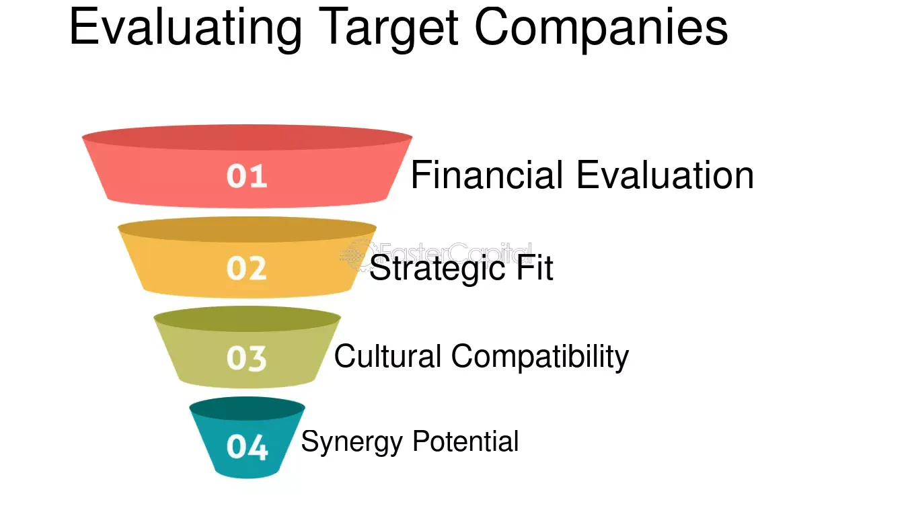

## Table of Contents

## What is company acquisition?

Company acquisition is when one company buys another company. It's like when someone buys a new toy or a piece of furniture. The buying company, called the acquirer, pays money to the company being bought, called the target. This can happen for many reasons, like wanting to grow bigger, get new technology, or enter new markets.

When a company is acquired, it can change a lot. Sometimes, the target company keeps its name and continues to operate as before, but now it's part of the bigger company. Other times, the target company might be merged into the acquirer, and its name might disappear. The employees of the target company might keep their jobs or they might not. It all depends on the plans of the acquirer.

## Why do companies consider acquisitions?

Companies consider acquisitions because they want to grow bigger and stronger. When a company buys another, it can quickly get bigger without having to build everything from scratch. This can help them sell more products or services, reach more customers, or enter new markets where they weren't before. It's like adding a new piece to a puzzle, making the picture more complete and stronger.

Another reason is to get new technology or skills that the company doesn't have. Sometimes, a smaller company might have a cool new invention or a special way of doing things that the bigger company wants. By buying the smaller company, the bigger one can use these new tools or skills to improve their own business. It's like borrowing a friend's toy because it's really fun and useful.

Lastly, acquisitions can help a company save money. When two companies join together, they can share resources and cut down on costs. For example, they might not need two offices or two factories anymore. By combining, they can work more efficiently and save money, which is good for the business. It's like sharing a pizza with friends; everyone gets a slice, and it's cheaper than buying separate pizzas.

## What are the basic steps in evaluating a company for acquisition?

When a company wants to buy another company, they first need to figure out if it's a good idea. They start by looking at the target company's money situation. This means checking their profits, debts, and how much money they make from selling things. They also look at the target company's future plans and see if they fit well with their own plans. It's like checking if a new toy will fit with the toys you already have and if it's worth the price.

Next, they do a deeper check called due diligence. This is where they look at everything about the target company, from their legal papers to their employee contracts. They want to make sure there are no big problems or surprises that could cause trouble later. It's like checking a used car to see if it has any hidden damage before you buy it. If everything looks good, they start talking about the price and how the acquisition will work.

Once they agree on a price, they make a plan for how the two companies will work together after the acquisition. This can include decisions about who will be in charge, what will happen to the employees, and how they will combine their businesses. It's like planning how to put together a new piece of furniture so it fits well in your room. If everything goes smoothly, they finalize the deal and the acquisition is complete.

## How do you assess the financial health of a target company?

To assess the financial health of a target company, you start by looking at their financial statements. These include the income statement, balance sheet, and cash flow statement. The income statement shows how much money the company made and spent over a period of time, helping you see if they are making a profit. The balance sheet shows what the company owns and owes, which helps you understand their assets and liabilities. The cash flow statement shows how money moves in and out of the company, which is important to see if they can pay their bills and keep running smoothly.

Next, you look at key financial ratios. These ratios help you understand the company's performance better. For example, the debt-to-equity ratio shows how much the company relies on borrowed money, which can tell you if they are in a risky financial position. The profit margin shows how much profit they make from each dollar of sales, which helps you see how efficiently they are making money. You also look at the return on assets (ROA) and return on equity (ROE) to see how well the company is using its resources to generate profit. By putting all this information together, you can get a clear picture of the target company's financial health and decide if it's a good acquisition.

## What are the key cultural factors to consider in an acquisition?

When a company wants to buy another company, they need to think about the culture of both companies. Culture is like the personality of a company. It includes things like how people work together, what they value, and how they make decisions. If the cultures of the two companies are very different, it can be hard to make the acquisition work well. For example, if one company is very formal and strict, but the other is relaxed and flexible, the employees might have a hard time getting along. So, it's important to look at the culture of the target company and see if it will fit with the acquiring company's culture.

Another important thing to consider is how the employees feel about the acquisition. If the employees of the target company are happy and feel good about their work, they are more likely to stay and help make the acquisition successful. But if they are worried or unhappy, they might leave, which can cause problems. The acquiring company should talk to the employees and try to understand their feelings and concerns. By doing this, they can help make the transition smoother and keep the employees happy and motivated.

## How can you evaluate the strategic fit of an acquisition target?

To evaluate the strategic fit of an acquisition target, you first need to see if the target company's goals and plans match well with your own company's goals. Think of it like trying to fit a puzzle piece into your puzzle. You want to make sure that the target company's products, services, or technology can help you grow your business or enter new markets. For example, if your company makes cars and the target company makes car batteries, that could be a good fit because it helps you offer a better product to your customers.

Another important part of evaluating strategic fit is looking at how the target company can help you save money or make more money. This means checking if you can use the target company's resources, like factories or offices, more efficiently after the acquisition. It's like sharing a pizza with friends; you can cut down on costs and make more profit. You also need to think about how the target company's customers and markets can help you sell more of your own products or services. By looking at all these things, you can decide if the acquisition target is a good strategic fit for your company.

## What legal and regulatory issues should be considered during an acquisition?

When a company wants to buy another company, they need to think about the rules and laws that could affect the deal. One big thing to consider is antitrust laws. These laws are there to make sure that one company doesn't get too big and start controlling the market too much. If the acquisition could make the market less competitive, the government might not let it happen. The companies also need to look at any industry-specific regulations. For example, if the target company is in the healthcare industry, there might be special rules about patient privacy that need to be followed.

Another important thing is making sure all the legal paperwork is in order. This means checking contracts, licenses, and any other legal documents that the target company has. If there are any lawsuits or legal problems, the acquiring company needs to know about them before they buy. They also need to think about how the acquisition will affect their employees and customers. There might be laws about how to treat employees during a change in ownership, and the company needs to make sure they follow these rules. By looking at all these legal and regulatory issues, the company can make sure the acquisition goes smoothly and doesn't cause any big problems.

## How do you perform due diligence in an acquisition process?

Due diligence in an acquisition is like doing a big checkup on the company you want to buy. It starts with looking at the target company's financials. You want to see their income statements, balance sheets, and cash flow statements to understand if they are making money and if they can pay their bills. You also check their debts and see if there are any big financial risks. It's important to look at their taxes too, to make sure everything is in order and there are no surprises waiting for you.

Next, you need to look at the legal side of things. This means checking all their contracts, licenses, and any ongoing lawsuits. You want to make sure there are no legal problems that could cause trouble later. You also need to check if the target company is following all the industry rules and regulations. For example, if they are in the food business, you need to see if they are following food safety laws. This part of due diligence helps you avoid any legal headaches after the acquisition.

Finally, you should look at the target company's operations and culture. This means understanding how they do their work, how they treat their employees, and what their company culture is like. You want to see if their way of doing things will fit well with your own company. You also need to check their technology and intellectual property to see if it's valuable and if you can use it to grow your business. By doing a thorough due diligence, you can make sure the acquisition is a good decision and will help your company grow.

## What are the common valuation methods used in acquisitions?

When a company wants to buy another company, they need to figure out how much the target company is worth. One common way to do this is by using the market approach. This means looking at similar companies that have been bought or sold recently and seeing how much they were worth. It's like checking the price of similar toys in a store to see how much a new toy should cost. Another method is the income approach, which looks at how much money the target company makes. This can be done by calculating the present value of future cash flows, which is a fancy way of saying how much the money the company will make in the future is worth today. It's like guessing how much a piggy bank will be worth once it's full.

Another method is the asset-based approach, which focuses on what the target company owns. This means adding up the value of all the company's assets, like buildings, machines, and money in the bank, and then subtracting any debts they have. It's like figuring out how much your toy collection is worth by adding up the value of each toy and then taking away any money you owe. Each of these methods has its own way of looking at the target company's value, and the acquiring company might use one or all of them to get a good idea of how much to pay for the acquisition.

## How do you negotiate acquisition terms effectively?

When you want to negotiate acquisition terms effectively, you need to start by understanding what both companies want. The acquiring company wants to buy the target company at a good price, while the target company wants to get the best deal possible. It's important to talk openly and honestly about what each side needs. You should also do your homework and know a lot about the target company's value, so you can make a fair offer. If you can find common ground and show that the acquisition will be good for both companies, it will be easier to agree on the terms.

Once you start negotiating, it's helpful to be flexible and willing to make some compromises. Sometimes, the price might not be the only thing that matters. You might need to talk about other things, like how the target company will be run after the acquisition or what will happen to the employees. It's good to have a plan, but also be ready to change it if needed. By listening carefully and trying to solve problems together, you can reach an agreement that makes both companies happy. Remember, the goal is to make sure the acquisition is a win-win situation for everyone involved.

## What are the potential risks and challenges in company acquisitions?

Company acquisitions can be risky because they can be hard to do right. One big risk is that the two companies might not work well together after the acquisition. If the cultures of the two companies are very different, the employees might not get along, and it can be hard to make the new, bigger company run smoothly. Another risk is that the acquiring company might pay too much for the target company. If they don't do a good job figuring out the target company's value, they might end up spending more money than the company is worth, which can hurt their own business.

Another challenge is dealing with all the legal and regulatory issues that come with an acquisition. The government might not let the deal happen if it thinks it will make the market less competitive. There can also be a lot of paperwork and legal checks that need to be done, which can take a long time and cost a lot of money. On top of that, the acquisition might not go as planned. The target company might not make as much money as expected, or there might be hidden problems that come up after the deal is done. All these risks and challenges mean that companies need to be very careful and do a lot of work before they decide to go through with an acquisition.

## How can advanced data analytics be used to enhance acquisition decision-making?

Advanced data analytics can help companies make better decisions about acquisitions by looking at a lot of information quickly and finding patterns that might be hard to see otherwise. For example, data analytics can look at the target company's financials to see if they are making money and if they can keep doing so in the future. It can also check how the target company's customers behave and predict if they will keep buying products after the acquisition. By using data analytics, companies can get a clearer picture of the target company's value and make a smarter offer.

Another way data analytics can help is by looking at how well the two companies will fit together. It can study things like the target company's culture and how its employees work, and see if it matches well with the acquiring company. Data analytics can also look at the market and see if the acquisition will help the company grow or enter new areas. By using all this information, companies can make better plans for how to combine the two businesses and avoid problems that might come up after the acquisition.

## What are the key concepts and terminology?

Acquisition analysis is a systematic approach to evaluating potential targets for mergers or acquisitions. At its core, it involves assessing whether a target company aligns strategically and financially with the acquiring company’s objectives. Understanding key concepts and terminology is vital for effective acquisition analysis.

The acquirer is the company initiating the acquisition, while the target is the company being considered for purchase. A merger is a mutual consolidation of two companies into one entity, whereas an acquisition involves one company taking over another, which can either be friendly or hostile.

Strategic fit is a crucial concept, referring to the degree to which the target complements the acquirer’s long-term objectives. This can involve entering new markets, acquiring new technologies, or achieving economies of scale.

Financial performance indicators such as revenue, profitability, and cash flow are examined to evaluate the target's health. Valuation methods are essential tools used to estimate the worth of a target company. Common techniques include:

1. **Comparable Company Analysis (CCA)**: This market-based method assesses a target’s value by comparing it with similar companies.

2. **Discounted Cash Flow (DCF) Analysis**: An income-based method that estimates the present value of expected future cash flows using a specific discount rate. The DCF formula can be represented as:
$$
   V = \sum \frac{CF_t}{(1 + r)^t}

$$

   Where $V$ is the estimated value, $CF_t$ is the cash flow at time $t$, and $r$ is the discount rate.

3. **Net Asset Value (NAV)**: An asset-based approach that calculates the target's value by subtracting liabilities from total assets.

Understanding synergies, which are potential benefits realized post-acquisition, is crucial. These can manifest as cost savings (e.g., through streamlined operations), revenue growth (e.g., by accessing new customer bases), or improved capabilities (e.g., enhanced technological resources).

Identifying risks and challenges is critical for a successful acquisition. This includes financial risks such as unanticipated debts, operational risks like integration difficulties, and cultural risks stemming from incompatible corporate cultures. A thorough risk assessment can guide effective risk management strategies, ultimately contributing to the success of the acquisition process.

## Is the Financial Viability of an Acquisition Evaluable?

Evaluating the financial viability of an acquisition is a critical component of the acquisition analysis process, offering insight into whether a target company is a sound investment. This assessment begins with a thorough examination of the target's financial statements, focusing on cash flow, profitability, and balance sheet metrics to establish a holistic understanding of its financial health.

Cash flow analysis is particularly important, as it reveals the [liquidity](/wiki/liquidity-risk-premium) and operational efficiency of the business. It involves evaluating operational cash flow, which can be calculated using the formula:

$$
\text{Operating Cash Flow} = \text{Net Income} + \text{Non-Cash Expenses} - \text{Changes in Working Capital}
$$

Profitability assessment involves scrutinizing ratios such as gross margin, operating margin, and net profit margin. These ratios provide insights into how well the company transforms revenues into profits at different stages.

Analyzing the balance sheet involves assessing assets, liabilities, and equity to determine the company’s financial stability and debt levels. Key ratios such as the current ratio and debt-to-equity ratio are utilized:

$$
\text{Current Ratio} = \frac{\text{Current Assets}}{\text{Current Liabilities}}
$$

$$
\text{Debt-to-Equity Ratio} = \frac{\text{Total Liabilities}}{\text{Shareholder's Equity}}
$$

Identifying potential synergies is another critical step. Synergies refer to the additional value generated from an acquisition, manifested as cost reductions, enhanced revenue, or improved capabilities. These can arise from economies of scale, combined talent, or complementary product lines. Synergies are evaluated for their impact on value creation, often using financial models.

Conducting due diligence entails a review of historical financial statements to understand past performance and projected statements to anticipate future trends. This analysis is essential for uncovering hidden liabilities or unsustainable financial practices.

Financial models, such as discounted cash flow (DCF), are employed to project future cash flows and ascertain their present value. The sensitivity analysis then explores how changes in key assumptions, such as revenue growth rates or discount rates, affect a company's valuation. In Python, sensitivity analysis can be performed using libraries like numpy and pandas to handle calculations and data manipulation efficiently.

Conclusively, this comprehensive financial review allows companies to make informed decisions about potential acquisitions, ensuring strategic alignment and financial soundness. Proper analysis not only identifies lucrative opportunities but also mitigates risks associated with overvaluation or unattainable synergies.

## How can we determine the fair value of the target company?

Estimating the fair value of a target company is a fundamental aspect of acquisition analysis, which involves applying various valuation methods tailored to the specific circumstances of the company and its industry. Three primary valuation approaches are commonly used: market-based methods, income-based methods, and asset-based methods.

### Market-Based Methods

Market-based methods derive the value of a company by comparing it with similar companies or recent transactions in the market. This approach assumes that similar assets should sell for similar prices when their characteristics are comparable. Two prevalent types of market-based methods are the Comparable Company Analysis (CCA) and the Precedent Transactions Analysis (PTA).

- **Comparable Company Analysis (CCA):** This method involves evaluating the target company against publicly traded companies in the same industry, considering their price multiples such as Price-to-Earnings (P/E), Price-to-Sales (P/S), and Enterprise Value-to-EBITDA (EV/EBITDA).

- **Precedent Transactions Analysis (PTA):** This approach looks at past transactions involving similar companies. Factors such as acquisition premiums and market conditions at the time of those transactions are taken into account to estimate the target company's value.

### Income-Based Methods

Income-based methods focus on the expected future earnings of a company. The most common approach is the Discounted Cash Flow (DCF) method, which calculates the present value of projected future cash flows.

- **Discounted Cash Flow (DCF):** DCF analysis involves estimating the future cash flows the company is expected to generate and discounting them back to their present value using a discount rate, often based on the company's weighted average cost of capital (WACC). The formula for DCF is:
$$
  \text{DCF} = \sum_{t=1}^{n} \frac{CF_t}{(1 + r)^t}

$$

  where $CF_t$ is the cash flow at time $t$, $n$ is the number of periods, and $r$ is the discount rate.

This method is particularly useful for companies with stable and predictable cash flow and requires a thorough understanding of the company's business model and market environment.

### Asset-Based Methods

Asset-based methods involve determining the fair value of a company by analyzing its net asset value (NAV). This approach can be particularly relevant for asset-intensive companies or those undergoing liquidation.

- **Net Asset Value (NAV):** This is calculated by subtracting the total liabilities from the total assets of the company. Adjustments may be necessary to account for differences between book values and market values of assets and liabilities.
$$
  \text{NAV} = \text{Total Assets} - \text{Total Liabilities}

$$

Asset-based methods may also include liquidation values, particularly when a company's value is better measured by the worth of its tangible assets than its ongoing business operations.

### Selecting the Right Method

Choosing the appropriate valuation method involves understanding the unique features of the target company and its industry. Factors such as the company's growth stage, the predictability of its earnings, its asset structure, and the dynamics of its market will influence the choice of valuation techniques. Often, a combination of methods is used to triangulate and validate the estimated fair value.

In conclusion, determining the fair value of a target company requires a nuanced approach, combining various valuation methods to achieve a comprehensive understanding of its worth. This process not only aids in making informed acquisition decisions but also supports effective negotiation strategies.

## References & Further Reading

[1]: Damodaran, A. (2012). ["Investment Valuation: Tools and Techniques for Determining the Value of Any Asset."](https://books.google.com/books/about/Investment_Valuation.html?id=5SRHAAAAQBAJ) Wiley.

[2]: DePamphilis, D. (2019). ["Mergers, Acquisitions, and Other Restructuring Activities: An Integrated Approach to Process, Tools, Cases, and Solutions."](https://www.sciencedirect.com/book/9780128016091/mergers-acquisitions-and-other-restructuring-activities) Academic Press.

[3]: Gaughan, P. A. (2015). ["Mergers, Acquisitions, and Corporate Restructurings."](https://onlinelibrary.wiley.com/doi/book/10.1002/9781119380771) Wiley.

[4]: Koller, T., Goedhart, M., & Wessels, D. (2015). ["Valuation: Measuring and Managing the Value of Companies."](https://www.wiley.com/en-us/Valuation%3A+Measuring+and+Managing+the+Value+of+Companies%2C+7th+Edition-p-9781119610885) McKinsey & Company Inc., Wiley.

[5]: Bruner, R. F. (2004). ["Applied Mergers and Acquisitions."](https://papers.ssrn.com/sol3/papers.cfm?abstract_id=553561) Wiley.

[6]: Weston, J. F., Mitchell, M. L., & Mulherin, J. H. (2004). ["Takeovers, Restructuring, and Corporate Governance."](https://archive.org/details/takeoversrestruc0000west_t3m1) Prentice Hall.