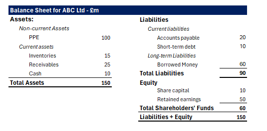

## Table of Contents

## What is a balance sheet and why is it important for evaluating a company?

A balance sheet is a financial statement that shows what a company owns and what it owes at a specific time. It lists the company's assets, like money, buildings, and equipment, on one side. On the other side, it shows the company's liabilities, which are debts like loans and bills, and the owner's equity, which is the money that the owners have put into the business or earned from it. The balance sheet is called that because the two sides must always be equal, showing that the company's assets are financed by its liabilities and equity.

The balance sheet is important for evaluating a company because it gives a clear picture of its financial health. By looking at the balance sheet, investors and managers can see if the company has enough assets to cover its debts. This helps them understand if the company is stable and able to pay its bills. It also shows how the company is using its resources, which can help in making decisions about future investments or changes in the business. Overall, the balance sheet is a key tool for anyone who needs to understand a company's financial position.

## How do you read a balance sheet and what are its main components?

Reading a balance sheet is like looking at a snapshot of a company's financial health at a certain time. The balance sheet has three main parts: assets, liabilities, and equity. Assets are things the company owns that have value, like cash, buildings, or equipment. Liabilities are what the company owes, like loans or bills. Equity is the value that's left for the owners after you subtract the liabilities from the assets. The balance sheet always balances because the total assets must equal the total liabilities plus equity.

To read a balance sheet, start by looking at the assets. They are usually listed in order of how quickly they can be turned into cash. Cash and things that can be sold quickly, like inventory, are called current assets. Things like buildings or equipment, which take longer to turn into cash, are called non-current assets. Next, look at the liabilities. Current liabilities are debts that need to be paid soon, like bills or short-term loans. Non-current liabilities are debts that don't need to be paid right away, like long-term loans. Finally, look at the equity. This shows how much of the company's value belongs to the owners. By understanding these parts, you can see if the company has enough assets to cover its debts and how it's using its resources.

## What is the difference between assets, liabilities, and equity on a balance sheet?

Assets, liabilities, and equity are the three main parts of a balance sheet. Assets are things that a company owns and that have value. This can include cash, buildings, equipment, or even things like patents or trademarks. Assets are what the company uses to run its business and make money. They are split into current assets, which can be turned into cash quickly, like inventory or money in the bank, and non-current assets, which take longer to turn into cash, like buildings or machinery.

Liabilities, on the other hand, are what the company owes to others. This can include loans, bills that need to be paid, or any other debts. Liabilities are also split into current liabilities, which need to be paid soon, like short-term loans or bills, and non-current liabilities, which don't need to be paid right away, like long-term loans. The difference between assets and liabilities is that assets add value to the company, while liabilities take value away because they need to be paid.

Equity is what's left over after you subtract the liabilities from the assets. It represents the value that belongs to the owners of the company. If you sell all the assets and use the money to pay off all the liabilities, the equity is what you'd have left. Equity can come from money that the owners put into the business or from profits that the company has made and kept. On a balance sheet, the total assets must equal the total liabilities plus equity, which is why it's called a balance sheet.

## How can you assess a company's liquidity using the balance sheet?

You can assess a company's [liquidity](/wiki/liquidity-risk-premium) by looking at the balance sheet and comparing its current assets to its current liabilities. Liquidity means how easily a company can pay its short-term bills. On the balance sheet, current assets are things like cash, money in the bank, and inventory that can be turned into cash quickly. Current liabilities are the bills and debts that need to be paid soon, like short-term loans or money owed to suppliers. By comparing these, you can see if the company has enough quick cash to cover its short-term debts.

A common way to measure liquidity is by using the current ratio. You find the current ratio by dividing the total current assets by the total current liabilities. If the current ratio is more than 1, it means the company has more current assets than current liabilities, which is good because it shows the company can pay its short-term bills. If the current ratio is less than 1, it means the company might have trouble paying its bills on time. So, by looking at the balance sheet and calculating the current ratio, you can get a good idea of how liquid a company is and whether it can handle its short-term financial needs.

## What are current and non-current assets and how do they impact a company's financial health?

Current assets are things a company owns that can be turned into cash quickly, usually within a year. These include cash, money in the bank, inventory, and accounts receivable, which is money that customers owe the company. Current assets are important because they show how much money a company can use to pay its bills and keep running day to day. If a company has a lot of current assets, it can easily cover its short-term debts and is considered liquid. This is good for the company's financial health because it means they can handle unexpected costs or take advantage of new opportunities without worrying about money.

Non-current assets are things that a company owns but cannot be turned into cash quickly. These include things like buildings, equipment, and long-term investments. Non-current assets are important for a company's long-term financial health because they help the company make money over time. For example, a factory helps a company make products, and those products can be sold for profit. While non-current assets don't help with immediate cash needs, they are crucial for the company's growth and stability. A company with strong non-current assets is likely to be financially healthy in the long run because it has the tools and resources it needs to keep making money.

## How do you calculate and interpret the debt-to-equity ratio from a balance sheet?

The debt-to-equity ratio is a way to see how much a company is borrowing compared to what the owners have put into it. You can find this ratio by looking at the balance sheet. First, add up all the liabilities, which are the debts the company owes. Then, look at the equity, which is the money the owners have in the company. To calculate the debt-to-equity ratio, divide the total liabilities by the total equity. For example, if a company has $100,000 in liabilities and $50,000 in equity, the debt-to-equity ratio would be $100,000 divided by $50,000, which equals 2.

Interpreting the debt-to-equity ratio helps you understand how the company is using money to grow. A high debt-to-equity ratio, like the example above, means the company is using a lot of borrowed money compared to the money the owners have put in. This can be risky because the company has to pay back the loans, and if it can't, it could get into trouble. On the other hand, a low debt-to-equity ratio means the company is not borrowing as much and is relying more on the owners' money. This is usually seen as less risky, but it might also mean the company is not growing as fast as it could if it used more borrowed money. So, the debt-to-equity ratio gives you a quick look at the company's financial risk and how it's balancing growth with stability.

## What insights can be gained from analyzing the working capital on a balance sheet?

Working capital is a key number you can find on a balance sheet. It's the difference between a company's current assets and its current liabilities. Current assets are things like cash and inventory that can be turned into cash quickly. Current liabilities are bills and debts that need to be paid soon. By looking at working capital, you can see if a company has enough money to pay its short-term bills and keep running smoothly. A positive working capital means the company has more current assets than current liabilities, which is good because it shows the company can handle its day-to-day costs.

Analyzing working capital gives you insights into a company's short-term financial health. If working capital is high, it means the company is in a good position to pay its bills, buy new supplies, or even take on new projects. But if working capital is low or negative, it might mean the company could struggle to pay its bills on time. This can be a warning sign that the company might need to find more money or cut costs. So, by keeping an eye on working capital, you can get a good idea of how well a company is managing its money in the short term.

## How does the balance sheet help in understanding a company's solvency?

The balance sheet helps in understanding a company's solvency by showing if the company can pay its long-term debts. Solvency means the company can keep going without running out of money. On the balance sheet, you look at the total assets and compare them to the total liabilities. If the total assets are more than the total liabilities, it means the company has enough value to cover its debts. This is a good sign of solvency because it shows the company is financially stable and can pay what it owes over time.

You can also use the balance sheet to calculate the debt-to-equity ratio, which helps with understanding solvency. The debt-to-equity ratio is found by dividing total liabilities by total equity. A lower debt-to-equity ratio means the company is using less borrowed money and more of the owners' money, which is usually a sign of good solvency. A high debt-to-equity ratio might mean the company is at risk because it has a lot of debt to pay back. By looking at these numbers on the balance sheet, you can tell if a company is likely to stay solvent or if it might face financial trouble in the future.

## What are off-balance sheet items and how do they affect the evaluation of a company?

Off-balance sheet items are things that a company uses or owes but doesn't show on its balance sheet. These can include things like operating leases, where a company rents equipment or buildings, or guarantees that the company has made to other businesses. They are not listed on the balance sheet because they don't meet the rules for being counted as assets or liabilities, but they can still affect the company's finances.

These off-balance sheet items can make a big difference when you're trying to understand a company's financial health. For example, if a company has a lot of operating leases, it might look like it has less debt than it really does. This can make the company seem more financially stable than it actually is. So, when you're evaluating a company, it's important to look at both the balance sheet and any off-balance sheet items to get the full picture of its financial situation.

## How can you use vertical and horizontal analysis on a balance sheet to track financial performance over time?

Vertical analysis helps you see what part each item on the balance sheet plays in the big picture. You do this by turning each number into a percentage of the total assets. For example, if cash is $10,000 and total assets are $100,000, then cash is 10% of total assets. By doing this for each year, you can see how the balance of different parts of the company changes over time. If the percentage of cash goes up over the years, it might mean the company is saving more money. If the percentage of debt goes up, it might mean the company is borrowing more. This helps you understand how the company's financial structure is changing.

Horizontal analysis, on the other hand, looks at how each item on the balance sheet changes from one year to the next. You do this by finding the difference between the numbers for two different years and then figuring out the percentage change. For example, if cash was $10,000 last year and $12,000 this year, that's a $2,000 increase, which is a 20% rise. By doing this for each item on the balance sheet, you can see which parts of the company are growing or shrinking. This helps you track the company's financial performance over time and see trends, like if the company is getting more or less liquid or if it's taking on more debt.

## What are the limitations of using only a balance sheet for company evaluation?

Using just a balance sheet to evaluate a company can be tricky because it only shows a snapshot of the company's financial health at one moment. It doesn't tell you how the company is doing over time, like how much money it's making or losing. For example, a company might have a lot of assets but still be losing money every month. The balance sheet won't show you that. It also doesn't show how well the company is using its assets to make money, which is important for understanding if the company is growing or not.

Another problem with relying only on the balance sheet is that it doesn't include everything that might affect the company's value. There are things called off-balance sheet items, like leases or guarantees, that can have a big impact but aren't shown on the balance sheet. Also, the balance sheet doesn't tell you about the company's reputation, its employees, or how happy its customers are. These things can make a big difference to the company's success but won't show up in the numbers on the balance sheet. So, while the balance sheet is helpful, it's not enough by itself to fully understand a company's health and potential.

## How do advanced financial ratios derived from the balance sheet, such as return on assets (ROA) and return on equity (ROE), provide deeper insights into a company's operational efficiency and profitability?

Advanced financial ratios like return on assets (ROA) and return on equity (ROE) give a deeper look into how well a company is using its resources to make money. ROA is found by dividing the company's net income by its total assets. This ratio shows how much profit the company makes for each dollar of assets it owns. A higher ROA means the company is using its assets efficiently to generate profit. For example, if a company has a lot of equipment but isn't making much money, its ROA will be low, showing that it's not using its assets well.

ROE, on the other hand, measures how much profit a company makes for each dollar of equity, which is the money the owners have put into the business. You find ROE by dividing net income by total equity. A high ROE means the company is good at turning the owners' money into profit. If a company has a high ROE, it shows that it's doing a good job of making money from the money the owners have invested. Both ROA and ROE help investors see how well a company is managing its money and resources, which is key to understanding its overall health and potential for growth.

## What are the key components and metrics in balance sheet analysis?

The balance sheet serves as a financial statement that provides a snapshot of a company's financial standing at a specific point in time. This statement is fundamental for understanding the financial health and stability of a business. It comprises three key components—assets, liabilities, and shareholders' equity, which are interconnected through the fundamental accounting equation:

$$
\text{Assets} = \text{Liabilities} + \text{Equity}
$$

A thorough balance sheet analysis enables investors and analysts to assess the liquidity, performance, and financial risks associated with a company. 

Several metrics derived from balance sheet data are essential for evaluating asset performance and efficiency. One of these is the cash conversion cycle (CCC), which measures the time it takes for a company to convert its investments in inventory and other resources into cash flows from sales. A shorter CCC indicates a more efficient operational process.

Another crucial metric is the fixed asset turnover ratio, which assesses how efficiently a company is using its fixed assets to generate sales revenue. It is calculated as:

$$
\text{Fixed Asset Turnover Ratio} = \frac{\text{Net Sales}}{\text{Average Net Fixed Assets}}
$$

The return on assets (ROA) ratio, calculated as the net income divided by total assets, provides insights into how effectively a company is using its assets to generate profit. The formula is:

$$
\text{Return on Assets (ROA)} = \frac{\text{Net Income}}{\text{Total Assets}}
$$

Understanding working capital, which is the difference between current assets and current liabilities, further adds to robust financial analysis. It indicates the company's short-term liquidity position and its ability to cover short-term obligations.

Another critical aspect of balance sheet analysis is assessing the capitalization structure. This involves evaluating the company's long-term debt relative to equity to understand its financial leverage and risk profile.

However, balance sheet analysis comes with its challenges. One notable challenge is the accounting for intangible assets, such as patents and trademarks, which might not be fully captured in the financial statements despite their value. Additionally, variability in industry practices and accounting standards can impact the comparability of balance sheets across different companies. Therefore, careful consideration and contextual understanding are essential for accurate analysis and interpretation.

By incorporating these key components and metrics, stakeholders can develop a comprehensive understanding of a company's financial position, guiding informed decision-making and strategic planning.

## References & Further Reading

- Investopedia offers a comprehensive source of articles covering a wide array of financial terms and strategies essential for understanding key financial concepts. These resources provide foundational knowledge in areas such as balance sheet analysis and algorithmic trading, helping readers build a robust understanding of financial markets and decision-making processes.

- "Algorithmic Trading and DMA" by Barry Johnson is a pivotal resource for those interested in the mechanics of algorithmic trading. The book explores the technical infrastructure needed for algorithmic trading, offering insights into direct market access and the automation of trading strategies. This book serves as a guide for developing and implementing trading algorithms with a focus on risk management and execution efficiency.

- "Financial Statement Analysis and Security Valuation" by Stephen Penman is a detailed guide to the valuation of companies using financial statements. Penman’s work provides a framework for analyzing a company’s balance sheet, income statement, and cash flow statement to extract valuable insights about its financial health. This book is instrumental for investors and analysts aiming to evaluate company value and assess risks, honing strategic investment decisions.

