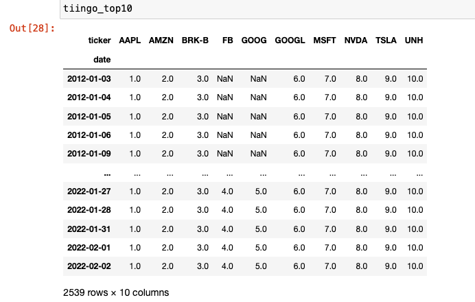

In recent years, algorithmic trading has revolutionized the financial markets by allowing traders and investors to leverage technology for executing trades with enhanced precision and speed. This approach reduces human error and optimizes decision-making processes by relying on complex algorithms that analyze a wide array of data points. A crucial factor in successful algorithmic trading is access to comprehensive and reliable financial data. Tiingo, a notable player in this field, provides a robust platform offering an extensive range of financial data and analytical tools tailored to the needs of traders and investors. 

Tiingo stands out by delivering real-time and historical market data, as well as financial statements, sentiment analysis, and news—all critical components for developing and testing trading strategies. The platform is distinguished by its accessibility, offering both web-based tools and API access that facilitate custom integrations. Founded by fintech enthusiasts, Tiingo is dedicated to democratizing financial data access, ensuring that traders at all levels—whether seasoned or newcomers—have the means to enhance their trading strategies with quality information.



This article examines Tiingo's role in supporting algorithmic trading. We will explore its various features and benefits, demonstrating how it can be integrated effectively into trading systems to provide a competitive edge. In a trading environment that increasingly relies on data-driven decision-making, understanding how platforms like Tiingo can improve trading processes is essential for any trader aiming to optimize their performance and achieve superior outcomes.

## Table of Contents

## What is Tiingo?

Tiingo is a comprehensive financial data platform, recognized primarily for providing affordable yet high-quality data feeds essential for algorithmic trading. The platform offers an extensive range of data sets tailored to the needs of modern traders and investors. These data sets include historical market data, which is critical for backtesting trading strategies and analyzing market trends over time. Additionally, it supplies financial statements, offering insights into a company's financial health, which are pivotal for [fundamental analysis](/wiki/fundamental-analysis).

One of the standout features of Tiingo is its sentiment analysis capabilities. By analyzing news and social media content, Tiingo helps traders gauge the market mood, which can significantly influence trading decisions. For instance, a positive sentiment might be an indicator of rising stock prices, while negative sentiment could suggest a downturn. This analysis is complemented by the platform's comprehensive news coverage, ensuring traders have access to timely and relevant information.

Tiingo is designed with user accessibility in mind, offering both web-based tools and API access. This dual accessibility enables traders to either interact with the data through a web interface or integrate the data directly into their custom-built trading systems using the API. The flexibility in data retrieval and usage empowers traders to tailor their trading strategies to specific market conditions and personal preferences.

Founded by fintech enthusiasts, Tiingo has a mission to democratize access to financial data, making it accessible to traders at all levels—from novices to seasoned professionals. This commitment is reflected in the platform's pricing model, which aims to provide top-tier data without prohibitive costs. As a result, Tiingo is trusted by a diverse group of users, ranging from individual traders to institutional investors, who rely on its transparency and quality.

In summary, Tiingo's blend of affordability, comprehensive data offerings, and user-friendly design has established it as a cornerstone resource in the financial trading community, facilitating informed and data-driven trading decisions.

## Features of Tiingo in Algo Trading

Tiingo's platform is tailored to enhance [algorithmic trading](/wiki/algorithmic-trading) through a variety of features that cater to both data accessibility and advanced analytical needs. Central to its offering is the API, which facilitates seamless integration with numerous algorithmic trading platforms, thereby supporting efficient data retrieval essential for automated trading operations. This API ensures that users can programmatically access a broad spectrum of financial data, which is critical for developing and [backtesting](/wiki/backtesting) trading strategies.

The platform provides access to real-time and historical data, pivotal for backtesting and strategy development processes. Reliable historical data is the backbone of effective backtesting, allowing traders to simulate how a strategy would have performed in the past, thus formulating expectations about future performance. Moreover, real-time data ensures that trading decisions are based on the most current information available, reducing potential delays that could impact the profitability of time-sensitive trades.

A standout feature of Tiingo is its sentiment analysis capabilities. By evaluating public sentiment, traders can gauge market mood and potentially forecast [volatility](/wiki/volatility-trading-strategies) that arises from collective investor actions or reactions to market news. Such insights can be integral in making informed decisions, particularly in strategies where sentiment-driven market movements are a key consideration.

Tiingo also offers customizable alerts and comprehensive news updates, facilitating a proactive approach to trading. These notifications can trigger trading algorithms automatically or provide valuable context to traders about events that might impact their investments. This capability is crucial in algorithmic trading environments where speed and timing are often critical to capturing market opportunities.

The extensive suite of analytics tools available on Tiingo supports traders in conducting rigorous quantitative analysis. These tools enable users to refine their strategies with precision. By leveraging these analytics capabilities, traders can perform detailed assessments of their trading models, optimize strategies for risk-adjusted returns, and improve the robustness of algorithmic interventions.

In conclusion, Tiingo equips traders with critical features that not only streamline data acquisition but also enhance the strategic and analytical components of algorithmic trading.

## How Tiingo Enhances Algorithmic Trading Strategies

Tiingo's extensive and varied data sets serve as a crucial asset for traders aiming to enhance their algorithmic trading strategies. By providing historical data across multiple market variables, Tiingo enables traders to backtest their strategies with high accuracy. This accuracy is significant in improving the reliability of algorithmic models, as it allows traders to simulate trades and forecast performance under different market conditions. Backtesting involves running a trading strategy against past market data to evaluate its efficacy, which is vital for understanding potential risks and rewards.

The platform supports a wide range of trading strategies, making it suitable for both novice and expert traders. From basic techniques like moving averages to intricate quantitative models involving [machine learning](/wiki/machine-learning) algorithms, Tiingo's comprehensive data sets allow traders to explore and test these strategies effectively. For instance, a moving average crossover strategy, which is popular among traders, can be easily implemented and tested using Tiingo's historical price data. The logic in Python might resemble:

```python
import pandas as pd
import numpy as np

# Fetch historical data using Tiingo API (example code)
# data = fetch_tiingo_data('AAPL', '2021-01-01', '2022-01-01')

# Example moving average calculation
data['SMA_50'] = data['close'].rolling(window=50).mean()
data['SMA_200'] = data['close'].rolling(window=200).mean()

# Generate buy and sell signals
data['Signal'] = np.where(data['SMA_50'] > data['SMA_200'], 1, 0)
data['Position'] = data['Signal'].diff()
```

In addition to strategy development and backtesting, Tiingo's API streamlines the automation of these trading strategies. Automated trading reduces human error and ensures trades are executed at optimal prices, offering a significant advantage in fast-moving markets. Automation allows traders to remain responsive to the latest market developments without the need for constant manual monitoring.

The affordability of access to premium data sources positions Tiingo as a cost-effective solution. For small traders and large institutions alike, the ability to access high-quality data without the financial burden typically associated with major data providers can lead to significant cost savings.

Real-time data feeds are another critical feature of Tiingo that supports the enhancement of algorithmic strategies. Having access to the latest market information is paramount for traders to adjust their strategies promptly in response to market changes. This real-time capability ensures that traders can capitalize on emerging opportunities and protect themselves against unforeseen market shifts. By combining real-time data with efficient analytical tools, Tiingo empowers traders to make timely and informed decisions, maintaining a competitive edge in the dynamic trading environment.

## Case Studies: Success Stories with Tiingo

Numerous traders and small hedge funds have reported significant improvements in their trading accuracy and profitability after utilizing Tiingo's data services. Tiingo's comprehensive data offerings, particularly its sentiment analysis and real-time data feeds, have notably contributed to the success of these trading entities.

One illustrative case involves a day trader who successfully increased returns by 15% through employing Tiingo’s sentiment analysis. By integrating sentiment signals into their trading algorithm, the trader could better gauge market moods and anticipate price movements, optimizing the timing of equity trades. The sentiment data effectively complemented traditional technical indicators, allowing the trader to enhance decision-making precision.

In another example, an algorithmic trading firm leveraged Tiingo’s real-time data feeds to refine their execution strategy. By accessing up-to-the-minute market data, the firm reduced slippage— the difference between the expected price of a trade and the actual price—and achieved better order fill rates. Consequently, the firm improved its execution efficiency, aligning trades more closely with their intended strategy parameters and minimizing market impact.

Tiingo's flexibility in offering customizable tools and data sets allows traders to dynamically adjust their strategies based on backtested empirical evidence. Traders can iteratively test and refine their algorithms by accessing comprehensive historical data, enabling them to validate strategies under varied market conditions. This adaptability ensures that traders remain competitive, continuously evolving their approaches to better navigate market fluctuations.

These cases exemplify how Tiingo's robust data services provide a competitive edge, facilitating improvements in both trading accuracy and profitability. By integrating Tiingo’s offerings, traders can enhance their algorithmic trading systems, achieving superior performance outcomes.

## Comparing Tiingo with Other Financial Data Providers

Tiingo is a compelling choice among financial data providers, especially when compared to industry giants such as Bloomberg, Reuters, and Quandl. Each of these platforms has unique offerings that cater to different segments of the market, but Tiingo distinguishes itself on several fronts.

Firstly, Tiingo's pricing structure is notably more accessible than that of competitors like Bloomberg, which is known for its high subscription fees that can be prohibitive for individual traders and smaller firms. Tiingo manages to offer high-quality data without the hefty price tag, making advanced trading tools and comprehensive data more accessible to a broad spectrum of traders.

The ease of use and flexibility of Tiingo's API is another highlight. For traders looking for straightforward integration and customization, Tiingo offers an API that is intuitive and easy to implement into various trading platforms. This flexibility is particularly advantageous for tech-savvy traders who wish to develop customized trading algorithms or integrate multiple data sources into their trading systems. For example, a simple Python script could be used to access Tiingo's daily stock prices:

```python
import requests

def get_tiingo_data(api_key, ticker):
    url = f"https://api.tiingo.com/tiingo/daily/{ticker}/prices"
    headers = {'Content-Type': 'application/json', 'Authorization': f'Token {api_key}'}
    response = requests.get(url, headers=headers)
    return response.json()

# Example usage
api_key = 'YOUR_API_KEY'
ticker = 'AAPL'
data = get_tiingo_data(api_key, ticker)
print(data)
```

In contrast to some of its competitors, Tiingo maintains a strong community and support network. This focus on community is evident in the way Tiingo facilitates user engagement, whether it be through forums, direct support, or extensive documentation. This robust support system ensures that users can quickly address any technical challenges they face, enhancing overall user experience.

While platforms like Bloomberg and Reuters are well-established and cater to institutional clients with comprehensive service offerings, Tiingo provides a more tailored experience for traders who prioritize cost-effectiveness and adaptability. Quandl, another key player, offers a marketplace for a wide range of data, but lacks the dedicated community support that Tiingo is known for. 

In summary, Tiingo provides a unique blend of affordability, ease of use, and community support, making it a popular choice among traders and small financial firms that require reliable data and flexible integration without incurring significant costs.

## Getting Started with Tiingo in Algo Trading

To embark on your journey with Tiingo in algorithmic trading, begin by registering for a free account. This allows users to familiarize themselves with the platform's fundamental features, including access to preliminary datasets and basic analytical tools. However, to fully leverage Tiingo's comprehensive offerings, such as advanced data feeds and API access, upgrading to a premium account is advisable. This upgrade unlocks a broader spectrum of data necessary for crafting and refining sophisticated trading strategies.

Integrating Tiingo with existing trading platforms primarily involves the configuration of API keys, a process that facilitates secure and efficient data retrieval. The API key, which acts as a unique identifier, is essential for authenticating requests made to Tiingo's servers. Once the key is in place, users can configure their systems to regularly query Tiingo's extensive database for real-time and historical data, thereby feeding their algorithmic models with the necessary inputs.

Tiingo distinguishes itself by providing extensive documentation and tutorials, designed to guide both novice and experienced traders through the complexities of setting up algorithmic strategies. These resources cover a wide array of topics, from basic API integration techniques to advanced data manipulation and backtesting methodologies. For instance, Tiingo's API documentation typically includes sample code snippets, such as in Python, which illustrate how to execute data requests and handle the returned datasets. This hands-on guidance ensures that traders can effectively utilize the platform's capabilities to enhance their trading operations.

```python
import requests

# Example of making a request to Tiingo's API
headers = {
    'Content-Type': 'application/json',
    'Authorization': 'Token YOUR_API_TOKEN_HERE'
}

response = requests.get("https://api.tiingo.com/tiingo/daily/AAPL/prices", headers=headers)

data = response.json()

# Output the fetched data
print(data)
```

This example demonstrates how traders might initiate a data request to retrieve historical price data for a specific stock, such as Apple Inc. (AAPL), using Tiingo's API. The ease of accessing necessary trading data positions Tiingo as an invaluable tool for those seeking to automate and optimize their algorithmic trading strategies.

## Conclusion

Tiingo is recognized as a dynamic and cost-effective data provider that enhances the development of algorithmic trading strategies. Leveraging its comprehensive suite of real-time and historical data, along with sophisticated analytical tools, Tiingo provides a solid framework for improving trading performance. These resources enable traders to access critical insights, optimize strategies, and make well-informed decisions swiftly.

Traders across various levels of expertise can benefit from Tiingo's offerings. Whether a novice or seasoned professional, the platform's accessible data feeds and analytical capabilities facilitate the execution of timely and precise trading decisions. By integrating Tiingo's data into trading systems, users can effectively analyze market trends and adapt strategies to capitalize on emerging opportunities.

As the landscape of algorithmic trading continues to advance, Tiingo's dedication to innovation and customer satisfaction positions it as an enduring resource within the trading industry. Its commitment to providing quality, affordable financial data underscores its role as a valuable tool, empowering traders to navigate the complexities of modern markets adeptly.

## References & Further Reading

[1]: Bergstra, J., Bardenet, R., Bengio, Y., & Kégl, B. (2011). ["Algorithms for Hyper-Parameter Optimization."](https://papers.nips.cc/paper/4443-algorithms-for-hyper-parameter-optimization) Advances in Neural Information Processing Systems 24.

[2]: ["Advances in Financial Machine Learning"](https://www.amazon.com/Advances-Financial-Machine-Learning-Marcos/dp/1119482089) by Marcos Lopez de Prado

[3]: Aronson, D. R. (2007). ["Evidence-Based Technical Analysis: Applying the Scientific Method and Statistical Inference to Trading Signals"](https://onlinelibrary.wiley.com/doi/book/10.1002/9781118268315). John Wiley & Sons.

[4]: Jansen, S. (2018). ["Machine Learning for Algorithmic Trading: Predictive Models to Extract Signals from Market and Alternative Data for Systematic Trading Strategies with Python"](https://www.amazon.com/Machine-Learning-Algorithmic-Trading-alternative/dp/1839217715). Packt Publishing.

[5]: Chan, E. P. (2009). ["Quantitative Trading: How to Build Your Own Algorithmic Trading Business"](https://github.com/ftvision/quant_trading_echan_book). John Wiley & Sons.