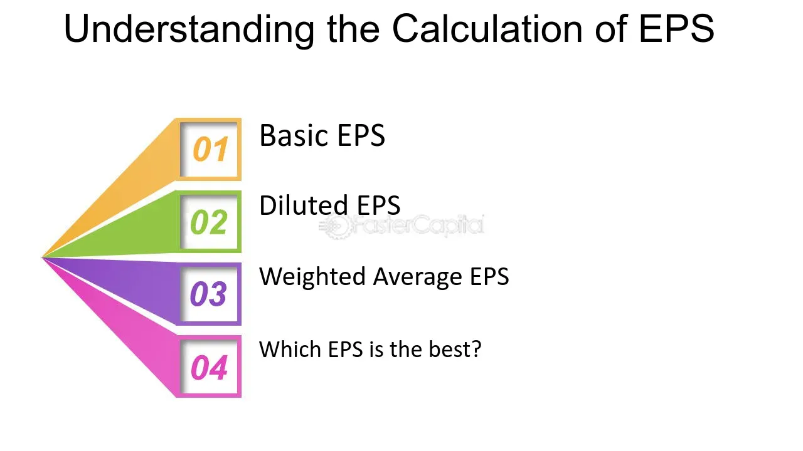

## Table of Contents

## What is EPS and why is it important for investors?

EPS stands for Earnings Per Share. It is a way to figure out how much money a company makes for each share of its stock. You find EPS by taking the company's total earnings and dividing it by the number of shares. It's like looking at how much profit each piece of the company is making.

EPS is important for investors because it helps them see how well a company is doing. If the EPS is going up, it usually means the company is making more money and growing. Investors like to see a high or growing EPS because it can mean the company's stock might be a good investment. It helps them decide if they should buy, hold, or sell the stock.

## How is EPS calculated and what are the different methods used?

To calculate EPS, you take the company's total earnings and divide them by the number of shares of stock the company has. Total earnings are the profits the company makes after paying all its expenses. The number of shares can be the total number of shares outstanding or the weighted average number of shares over a period. For example, if a company made $100 million in profit and has 50 million shares, the EPS would be $100 million divided by 50 million, which equals $2 per share.

There are two main ways to calculate EPS: basic EPS and diluted EPS. Basic EPS uses the number of shares that are currently out there. It's simple and gives a clear picture of what each share is earning right now. Diluted EPS, on the other hand, takes into account things like stock options or convertible securities that could turn into more shares in the future. This method shows what the EPS might be if all those extra shares were created. Both methods are important because they give different views of the company's earnings per share, helping investors make better decisions.

## What are the common pitfalls in interpreting EPS figures?

One common pitfall when looking at EPS figures is not considering the big picture. EPS can be affected by things like one-time events or changes in the number of shares. For example, a company might sell off a part of its business and show a big profit for that year, making the EPS look better than it really is. Or, a company might buy back its own shares, which makes the EPS go up because there are fewer shares to divide the earnings by. So, it's important to look at more than just the EPS number to understand what's really going on.

Another mistake is comparing EPS from different companies without thinking about the context. Companies in different industries might have very different EPS numbers, and that's normal. For instance, a tech company might have a higher EPS than a grocery store chain, but that doesn't mean the tech company is always a better investment. It's also important to look at trends over time, not just one year's EPS. If a company's EPS keeps going up year after year, that's usually a good sign, but a single high EPS number might not tell the whole story.

## How can EPS be manipulated and what are the red flags to look for?

Companies can sometimes play around with their EPS to make it look better than it really is. One way they do this is by changing the number of shares. For example, a company might buy back its own shares, which makes the EPS go up because there are fewer shares to divide the earnings by. Another way is by using accounting tricks, like moving expenses to different time periods or recognizing revenue earlier than they should. This can make the earnings look higher in one quarter, boosting the EPS.

There are some red flags to watch out for when looking at EPS. If a company's EPS jumps a lot from one period to the next without a clear reason, that could be a sign of manipulation. Another thing to look for is if a company is always buying back its own shares. While this can be a good thing sometimes, if it's the main reason the EPS is going up, it might not be as good as it looks. Also, if a company's EPS is much higher than its competitors without a good explanation, that could be a warning sign. It's always a good idea to look at other financial numbers and read the company's reports to get the full picture.

## What is the difference between basic EPS and diluted EPS?

Basic EPS and diluted EPS are two ways to figure out how much money a company makes for each share of its stock. Basic EPS is the simpler of the two. You calculate it by taking the company's total earnings and dividing it by the number of shares that are out there right now. It gives a clear picture of what each share is earning at the moment.

Diluted EPS, on the other hand, takes into account things that could turn into more shares in the future, like stock options or convertible securities. When you calculate diluted EPS, you add these potential shares to the total number of shares. This way, diluted EPS shows what the earnings per share might be if all those extra shares were created. It's a more cautious way to look at EPS because it considers what could happen in the future.

## How does EPS relate to a company's profitability and growth?

EPS, or Earnings Per Share, is a key number that tells you about a company's profitability. It shows how much profit the company makes for each share of its stock. If a company's EPS is high or going up, it usually means the company is making more money. This can be a sign that the company is doing well and is profitable. Investors like to see a high EPS because it can mean the company is in good financial health.

EPS also helps investors understand a company's growth. If a company's EPS keeps getting bigger over time, it's a good sign that the company is growing. This could be because the company is selling more products, making more money from its services, or finding new ways to make profits. A growing EPS can make investors feel more confident about the company's future and might make them want to invest in the company's stock.

## What role does EPS play in stock valuation models like the P/E ratio?

EPS plays a big part in stock valuation models like the P/E ratio. The P/E ratio, or Price-to-Earnings ratio, is a way to figure out how much investors are willing to pay for each dollar of a company's earnings. You find the P/E ratio by taking the stock price and dividing it by the EPS. So, EPS is the key number that makes the P/E ratio work. If a company has a high EPS, the P/E ratio might be lower if the stock price stays the same, which can make the stock look like a good deal.

The P/E ratio helps investors decide if a stock is a good buy. A lower P/E ratio might mean the stock is cheaper compared to its earnings, while a higher P/E ratio could mean the stock is more expensive. But, the P/E ratio is only useful if the EPS is accurate and reflects the company's true earnings. If the EPS is manipulated or not a good measure of the company's earnings, the P/E ratio won't give a clear picture of the stock's value. So, understanding EPS is really important for using the P/E ratio to make smart investment choices.

## How can EPS be used to compare companies within the same industry?

EPS is a helpful tool for comparing companies within the same industry. When you look at the EPS of different companies, you can see which ones are making more money for each share of their stock. For example, if Company A has an EPS of $5 and Company B has an EPS of $3, it might mean that Company A is more profitable. But, it's important to look at other things too, like how many shares each company has and if they're in the same part of the industry. This way, you get a better idea of which company is doing better.

However, just looking at EPS isn't enough to fully compare companies. You should also think about the size of the companies and their growth. A bigger company might have a higher EPS just because it's bigger, but a smaller company could be growing faster. Also, sometimes companies in the same industry can have different ways of making money, so their EPS might not be the same even if they're doing equally well. By looking at EPS along with other numbers and information, you can get a clearer picture of how companies stack up against each other in their industry.

## What are the limitations of using EPS as a sole measure of company performance?

Using EPS as the only way to measure how well a company is doing has some big problems. EPS just tells you how much money a company makes for each share of its stock, but it doesn't show the whole picture. For example, EPS can be affected by things like one-time events or changes in the number of shares. If a company sells off a part of its business, it might show a big profit for that year, making the EPS look better than it really is. Also, if a company buys back its own shares, the EPS goes up because there are fewer shares to divide the earnings by. So, looking at EPS alone might not give you a true idea of how the company is doing.

Another issue with using EPS by itself is that it doesn't tell you about the company's future growth or how it's managing its money. A company might have a high EPS but still have a lot of debt or be spending too much on things that won't help it grow. EPS also doesn't show how the company is doing compared to others in its industry. Two companies might have the same EPS, but one might be growing faster or have better long-term plans. To really understand how a company is doing, you need to look at other numbers and information along with the EPS.

## How do analysts adjust EPS for one-time events or non-recurring items?

Analysts often adjust EPS to get a clearer picture of a company's regular earnings by taking out one-time events or non-recurring items. These could be things like selling off a part of the business, paying for a big lawsuit, or getting money from insurance. When these happen, they can make the EPS look different from what it usually is. So, analysts take these one-time events out of the total earnings before they calculate the EPS. This way, they can see what the company's earnings would be without these unusual things.

By adjusting the EPS, analysts can better predict how the company will do in the future. It helps them see the company's normal, ongoing earnings, which is more useful for making investment decisions. If an analyst just looked at the EPS without making these adjustments, they might think the company is doing better or worse than it really is. So, adjusting for one-time events gives a more accurate view of the company's performance and helps investors make smarter choices.

## What advanced metrics can be used alongside EPS to better evaluate company quality?

Alongside EPS, there are other advanced metrics that can help investors better understand a company's quality. One important metric is the Return on Equity (ROE), which shows how well a company is using the money its shareholders have invested to make a profit. A high ROE means the company is good at turning shareholder money into earnings. Another useful metric is the Price to Earnings Growth (PEG) ratio, which looks at the stock's price in relation to its earnings growth. This helps investors see if a stock is a good value, not just based on its current earnings but also on how fast those earnings are growing.

Another metric to consider is the Free Cash Flow (FCF), which tells you how much cash a company has left after it pays for everything it needs to keep running. A company with strong FCF is in a good position to grow, pay down debt, or give money back to shareholders. Additionally, the Debt to Equity (D/E) ratio is important because it shows how much debt a company is using compared to its equity. A high D/E ratio might mean the company is taking on too much risk, while a lower ratio suggests it's more financially stable. By looking at these metrics along with EPS, investors get a fuller picture of a company's health and potential for future success.

## How can investors use EPS trends to forecast future company performance?

Investors can use EPS trends to forecast a company's future performance by looking at how the EPS changes over time. If a company's EPS keeps going up, it usually means the company is getting better at making money. This could be because they're selling more products, finding new ways to make profits, or managing their costs well. When investors see a steady increase in EPS, they might feel more confident that the company will keep doing well and that its stock could be a good investment.

However, it's important for investors to not just look at the EPS numbers but also think about why the EPS is changing. Sometimes, a jump in EPS could be because of one-time events like selling a part of the business, which might not happen again. Also, if a company is buying back its own shares, the EPS might go up just because there are fewer shares, not because the company is actually making more money. So, by looking at the reasons behind the EPS trends and combining this with other financial information, investors can make better guesses about how the company will do in the future.

## What is Understanding Earnings Per Share (EPS)?

Earnings Per Share (EPS) is a key financial metric used to assess a company's profitability on a per-share basis. It is calculated using the formula:

$$
\text{EPS} = \frac{\text{Net Income}}{\text{Number of Outstanding Shares}}
$$

This calculation provides an insight into how much profit is attributed to each individual share of stock, serving as a vital tool for investors aiming to understand a company's financial performance.

EPS can be categorized into two types: Basic EPS and Diluted EPS. Basic EPS offers a straightforward evaluation by solely considering the number of outstanding common shares. The formula for Basic EPS is the same as the one mentioned above, focusing on actual shares currently held by shareholders.

On the other hand, Diluted EPS provides a more comprehensive view by incorporating all convertible securities that could potentially dilute the earnings per share in the future. This includes stock options, warrants, and convertible bonds. The formula for Diluted EPS is slightly more complex, as it accounts for these potential shares:

$$
\text{Diluted EPS} = \frac{\text{Net Income}}{\text{Total Shares Outstanding + Shares from Convertibles and Options}}
$$

Understanding these distinctions is crucial for investors as they analyze a company's current profitability and make informed forecasts about its future earnings potential. Basic EPS provides a clear picture of current earnings, while Diluted EPS offers insights into how future dilution could impact the company's earnings. These metrics together allow investors to gauge both current performance and potential future scenarios, aiding in more robust investment strategies.

## References & Further Reading

#