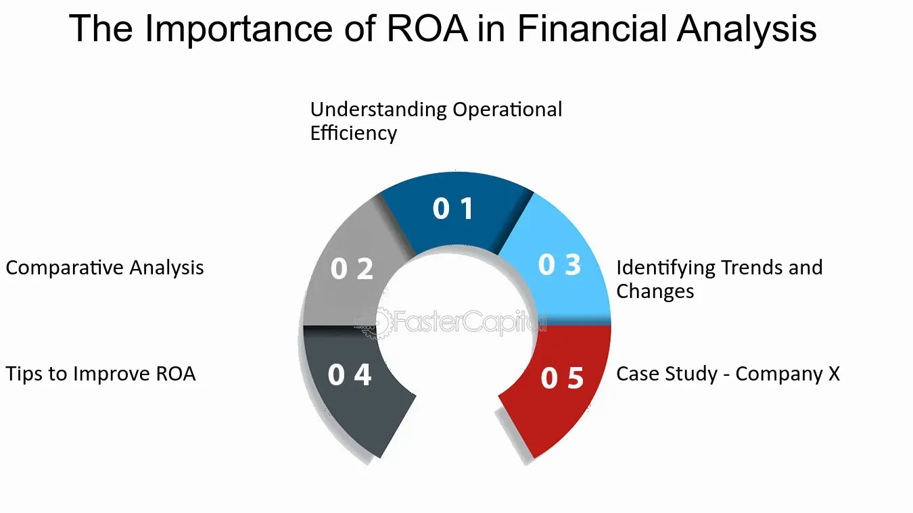

## Table of Contents

## What is Return on Assets (ROA)?

Return on Assets (ROA) is a financial ratio that shows how well a company is using its assets to make money. It tells you how much profit a company makes for each dollar of assets it owns. To calculate ROA, you take the company's net income and divide it by its total assets. The result is shown as a percentage. A higher ROA means the company is using its assets more efficiently to generate profit.

ROA is important because it helps investors and managers see how well a company is doing compared to others in the same industry. If a company has a high ROA, it means it's good at turning its investments into profits. On the other hand, a low ROA might mean the company needs to find better ways to use its assets. By looking at ROA over time, you can see if a company is getting better or worse at making money from its assets.

## How do you calculate ROA?

To calculate Return on Assets (ROA), you need to know two things: the company's net income and its total assets. Net income is the money a company makes after paying all its expenses. Total assets include everything the company owns, like buildings, equipment, and money in the bank. To find ROA, you divide the net income by the total assets. Then, you multiply the result by 100 to get a percentage. For example, if a company has a net income of $50,000 and total assets of $500,000, the ROA would be ($50,000 / $500,000) * 100 = 10%.

ROA is a useful number because it shows how well a company is using its stuff to make money. A higher ROA means the company is good at turning its assets into profit. If the ROA is low, it might mean the company needs to find better ways to use what it has. By looking at ROA over time, you can see if a company is getting better or worse at making money from its assets. This helps investors and managers make smart decisions about the company.

## Why is ROA important for evaluating financial performance?

Return on Assets (ROA) is important because it shows how well a company is using its stuff to make money. It tells you how much profit a company makes for each dollar of assets it has. This helps investors and managers see if the company is doing a good job with what it owns. If a company has a high ROA, it means it's good at turning its investments into profits. On the other hand, a low ROA might mean the company needs to find better ways to use its assets.

By looking at ROA over time, you can see if a company is getting better or worse at making money from its assets. This is helpful for comparing a company to others in the same industry. If one company has a higher ROA than another, it might be a better investment. ROA is a simple way to understand how efficient a company is, which is important for making smart decisions about where to put money.

## What does a high ROA indicate about a company's performance?

A high ROA means that a company is good at using its stuff to make money. It shows that for every dollar the company has in assets, it is making a lot of profit. This is important because it tells investors and managers that the company is efficient. It's like saying the company is smart with what it owns and turns those things into more money.

When a company has a high ROA, it often means it's doing better than other companies in the same business. People who want to invest money look for companies with high ROAs because it suggests they will get more profit back. A high ROA can also mean the company is good at managing its costs and making the most out of what it has. This makes it a strong sign that the company is doing well.

## What does a low ROA suggest about a company's financial health?

A low ROA means a company is not using its stuff to make money very well. It shows that for every dollar the company has in assets, it is not making much profit. This can be a warning sign that the company might not be managing its money and resources in the best way.

If a company has a low ROA, it might mean they need to find better ways to use what they have or cut down on costs. Investors might see a low ROA and think twice about putting money into the company because it suggests the company isn't very good at turning its assets into profit. A low ROA can be a sign that the company's financial health isn't strong, and it might need to make some changes to improve.

## How can ROA be used to compare companies within the same industry?

ROA can be used to compare companies within the same industry by looking at how well each company turns its assets into profit. If one company has a higher ROA than another, it means that company is doing a better job of using what it owns to make money. This helps investors and managers see which companies are more efficient and might be better investments.

For example, if Company A has an ROA of 10% and Company B has an ROA of 5%, it shows that Company A is making more profit for each dollar of assets it has. This comparison can help people decide where to put their money because a higher ROA often means a company is doing well compared to others in the same business. By looking at ROA, people can see which companies are the best at using their resources to make money.

## What are the limitations of using ROA as a financial metric?

ROA is a useful number, but it has some problems. One big problem is that it doesn't show how a company uses borrowed money. If a company borrows a lot of money to buy assets, it might look like it's making more profit with its assets, but really, it's just using other people's money. This can make the ROA look higher than it really is. Also, different industries have different kinds of assets and ways of making money, so comparing ROA across different industries can be tricky. A high ROA in one industry might be normal, while the same number in another industry could be low.

Another limitation is that ROA only looks at the past. It tells you how well a company used its assets to make money last year, but it doesn't say anything about what might happen next year. Companies can change a lot, and just because they had a good ROA last year doesn't mean they will next year. Also, ROA doesn't tell you about other important things like how much the company is growing or if it's making smart choices for the future. So, while ROA is helpful, it's important to look at other numbers too to get a full picture of a company's health.

## How does ROA relate to other financial ratios like ROE and ROI?

ROA, ROE, and ROI are all important financial ratios that help people understand how well a company is doing, but they look at different things. ROA tells you how much profit a company makes for each dollar of assets it has. It's like checking if the company is good at using what it owns to make money. ROE, or Return on Equity, looks at how much profit a company makes for each dollar that shareholders have invested. It's about seeing how well the company is using the money that people have put into it. ROI, or Return on Investment, is a bit broader. It looks at the profit made from any kind of investment, not just assets or equity. It helps people see if their money is being used well, no matter where it's put.

These ratios are connected because they all deal with how a company makes money, but they focus on different parts of the business. A company with a high ROA might also have a high ROE if it's not using a lot of borrowed money. But if a company borrows a lot to buy assets, its ROA might look good, but its ROE might not be as impressive because of the debt. ROI can be different from both ROA and ROE because it can look at returns from specific projects or investments, not just the whole company. So, looking at all three ratios together gives a better picture of how well a company is doing and where it might need to improve.

## Can ROA be manipulated by management, and if so, how?

Yes, ROA can be manipulated by management. One way they might do this is by changing how they report their assets. For example, if they sell off some assets, the total assets number goes down. This can make the ROA look higher because the net income is divided by a smaller number. Another way is by playing with the timing of when they record income or expenses. If they delay recording some expenses, it can make the net income look higher for a while, which also makes the ROA look better.

Another way management might manipulate ROA is by using accounting tricks. They could use different methods to value their assets, like choosing a method that makes the assets seem worth less than they really are. This again makes the total assets number smaller, boosting the ROA. They might also try to boost short-term profits by cutting back on things like research and development or maintenance, which can make the net income look better in the short run but might hurt the company in the long run.

## How can changes in ROA over time be used to assess a company's operational efficiency?

Changes in ROA over time can tell you a lot about how well a company is doing at using its stuff to make money. If a company's ROA is going up over time, it means they are getting better at turning their assets into profit. This could be because they are finding new ways to make money with what they have, or maybe they are cutting costs and making their operations more efficient. When you see a company's ROA going up, it's a good sign that the people running the company are doing a good job.

On the other hand, if a company's ROA is going down, it might mean they are not using their assets as well as they used to. This could happen if they are spending more money than they are making, or if they are not keeping up with changes in their industry. A falling ROA can be a warning sign that the company needs to make some changes to get back on track. By looking at how ROA changes over time, you can get a good idea of whether a company is getting better or worse at making money from what it owns.

## What are some industry-specific benchmarks for ROA?

Different industries have different normal ROA numbers because they use their stuff in different ways to make money. For example, in the tech industry, companies often have high ROAs because they don't need a lot of big, expensive things to make money. They might use computers and software, which don't cost as much as factories or stores. So, a good ROA in tech might be around 10% to 20%. On the other hand, in the retail industry, companies need a lot of stores and inventory, which can make their ROA lower. A good ROA for retail might be around 5% to 8%.

In the manufacturing industry, companies need a lot of machines and factories to make their products. This can make their ROA lower because these things cost a lot of money. A good ROA in manufacturing might be around 5% to 10%. In the banking industry, ROA is important because banks use their money to make more money. A good ROA for banks might be around 1% to 1.5%. Knowing these benchmarks helps people compare companies in the same industry and see which ones are doing a good job with what they own.

## How can advanced statistical models enhance the analysis of ROA for forecasting future performance?

Advanced statistical models can help make better guesses about a company's future performance by looking at ROA in a deeper way. These models can take a bunch of numbers from the past and find patterns that might not be easy to see just by looking at the numbers. For example, they can use things like regression analysis to see how ROA changes with other things like sales, costs, or even what's happening in the economy. By understanding these patterns, the models can help predict what might happen to a company's ROA in the future. This can be really helpful for investors and managers who want to know if a company is going to keep doing well or if it might run into trouble.

Also, these models can look at how ROA changes with other important numbers like Return on Equity (ROE) or Return on Investment (ROI). By putting all these numbers together, the models can give a fuller picture of how well a company is doing and where it might be headed. For example, if a company's ROA is going up but its ROE is going down, the model might be able to explain why and what it could mean for the future. This kind of deep analysis can help people make smarter choices about where to put their money or how to run their business better.

## What is Return on Assets (ROA)?

Return on Assets (ROA) is a crucial financial metric that allows investors and analysts to gauge how effectively a company is generating earnings relative to its assets. ROA is expressed as a percentage, providing a clear indication of how well a company is managing its asset base to produce profit. The formula to calculate ROA is:

$$
\text{ROA} = \left( \frac{\text{Net Income}}{\text{Total Assets}} \right) \times 100
$$

Here, net income is the profit of the company after all operating expenses, taxes, and costs have been deducted. Total assets include all tangible and intangible resources owned by the company, such as property, equipment, inventory, and intellectual property.

By analyzing ROA, investors can compare a company's asset efficiency within its industry. A higher ROA value signals more efficient asset utilization, implying that the company produces more profit per dollar of assets owned. This efficiency is necessary for sustaining competitive advantage and ensuring consistent profitability.

To further understand ROA's application, consider a simple Python example:

```python
def calculate_roa(net_income, total_assets):
    if total_assets == 0:
        return None
    return (net_income / total_assets) * 100

# Example usage:
net_income = 500000  # Company's net income in dollars
total_assets = 2000000  # Total assets in dollars

roa = calculate_roa(net_income, total_assets)
print(f"The company's Return on Assets (ROA) is {roa:.2f}%")
```

In the example above, the ROA is calculated to be 25%, suggesting that the company generates 25 cents of profit for every dollar of assets it owns. Understanding such metrics is instrumental for investors looking to evaluate corporate efficiency and identify potentially rewarding investments.

## What is the ROA Formula and How Can It Be Understood?

Return on Assets (ROA) is a financial metric that indicates how efficiently a company utilizes its assets to generate profits. The calculation of ROA is straightforward and involves dividing the net income by the total assets. This ratio is expressed as a percentage and serves as a useful indicator of a company's operational efficiency.

The formula for ROA is:

$$
\text{ROA} = \left(\frac{\text{Net Income}}{\text{Total Assets}}\right) \times 100
$$

### Components of the Formula:

1. **Net Income:**
   - Net income is the profit a company retains after subtracting all operating costs, taxes, interest, and other expenses. It is often referred to as the "bottom line" and is found on the income statement.

2. **Total Assets:**
   - Total assets represent the sum of all current and non-current assets owned by the company. These assets include physical items like property and equipment, as well as intangible assets such as patents and trademarks. Total assets can be located on a company's balance sheet.

### Interpretation:

A higher ROA signifies a greater ability of the company to convert its asset base into net income. For instance, if Company A has a ROA of 10% and Company B has a ROA of 5%, Company A is more efficient in using its assets to generate earnings.

### Example Calculation Using Python:

To illustrate the calculation of ROA using Python, one can utilize basic operations to compute the ratio:

```python
# Sample data
net_income = 500000  # Example net income in dollars
total_assets = 2500000  # Example total assets in dollars

# ROA Calculation
roa = (net_income / total_assets) * 100
print(f"The Return on Assets (ROA) is {roa:.2f}%")
```

This Python code snippet calculates the ROA from hypothetical financial figures. The displayed result represents the efficiency percentage, indicating how well the company's assets are being utilized to generate profit. By automating such calculations, analysts can consistently measure and compare asset efficiency across different periods or companies.

## How does ROA compare to other financial ratios?

Return on Assets (ROA) is a crucial financial metric, but it gains greater context when compared to other financial ratios, such as Return on Equity (ROE) and Return on Investment (ROI). Each of these ratios provides unique perspectives on a company's financial health and operational efficiency, contributing to a comprehensive evaluation.

**Return on Equity (ROE)** measures a company's profitability relative to shareholder's equity. It is calculated by dividing Net Income by Average Shareholders' Equity:

$$
\text{ROE} = \frac{\text{Net Income}}{\text{Average Shareholders' Equity}}
$$

ROE indicates how effectively management is using the shareholders' funds to generate earnings. While ROA focuses on asset efficiency, ROE zeros in on how well a company utilizes equity investments, making it particularly relevant for assessing shareholder value creation. However, ROE can be inflated by higher financial leverage, sometimes obscuring the true performance from operational efficiency.

**Return on Investment (ROI)** assesses the gain or loss generated on an investment relative to its cost. The formula is:

$$
\text{ROI} = \frac{\text{Net Profit}}{\text{Cost of Investment}} \times 100
$$

ROI is widely used for evaluating the efficiency of an investment or comparing the efficiency of several different investments. This ratio goes beyond company-centric metrics, extending to various investment contexts, such as capital projects or marketing campaigns. Unlike ROA and ROE, ROI can be more versatile, although it sometimes overlooks the compounding effects of time and additional external factors affecting returns.

When comparing these ratios, several strengths and limitations emerge:

1. **Perspective on Efficiency:** ROA provides a broad view of how all resources (assets) are used for profit generation, crucial for industries with significant asset bases. Conversely, ROE centers on equity efficiency, which might be more relevant for assessing shareholder returns in capital-light companies.

2. **Leverage Impact:** ROE is susceptible to financial leverage, enhancing returns with increased debt usage. ROA, unaffected by capital structure, can sometimes offer a purer reflection of operational efficiency.

3. **Investment Specifics:** ROI's adaptability to different investment types provides a flexible tool for evaluating specific projects or business segments. However, it requires cautious interpretation to ensure that the unique attributes of each investment are adequately considered.

To conclude, a comprehensive financial analysis often necessitates looking at these ratios in conjunction. Each ratio—ROA, ROE, and ROI—serves its unique purpose in revealing various aspects of financial health, enabling investors and analysts to make more informed, nuanced decisions regarding asset efficiency, shareholder profitability, and investment performance. Using these ratios collectively allows for a holistic approach, crucial for evaluating a company's operational success and strategic potential.

## References & Further Reading

Almarzoqi, R., Naceur, S. B., & Kotak, A. (2015). This work investigates the relationship between financial ratios, inflation expectations, and macroeconomic conditions and their implications for the yield curve. Understanding these relationships can enhance the ability to forecast financial markets and economic conditions, aiding investors in making informed decisions.

*Financial Statement Analysis and Security Valuation* by Stephen Penman provides an in-depth examination of financial statement analysis techniques. This resource is crucial for understanding how financial ratios, including Return on Assets (ROA), are employed to value companies and assess their financial performance. The book emphasizes the role of financial statements in forecasting and decision-making, making it an invaluable tool for both analysts and investors.

Damodaran, A. (2007). This publication focuses on the measurement and implications of key financial ratios such as Return on Capital (ROC), Return on Invested Capital (ROIC), and Return on Equity (ROE). These metrics are closely related to ROA and offer diverse perspectives on a company's efficiency and profitability. Damodaran's insights help underscore the strengths and limitations of each ratio, providing a comprehensive framework for financial evaluation.

*Principles of Corporate Finance* by Richard A. Brealey, Stewart C. Myers, and Franklin Allen discusses foundational concepts in corporate finance. The authors explain the importance of financial ratios in corporate financial strategy and decision-making. The book covers various methodologies for assessing risk, return, and the application of financial ratios like ROA in evaluating a firm's operational efficiency.

DeFusco, R. A., McLeavey, D. W., Pinto, J. E., & Runkle, D. E. (2007). The second edition of *Quantitative Investment Analysis* serves as an essential guide for understanding quantitative techniques in investment analysis. It presents a rigorous framework for analyzing financial metrics, including ROA, within the broader context of quantitative models used in investment strategies. This resource is particularly valuable for investors looking to integrate financial ratios into algorithmic trading models.

These references collectively offer a robust foundation for understanding ROA and other financial ratios, their calculation, implications, and applications in both corporate finance and investment strategies. They provide significant insights into the complexities of financial performance evaluation and the critical role these metrics play in informed decision-making.

