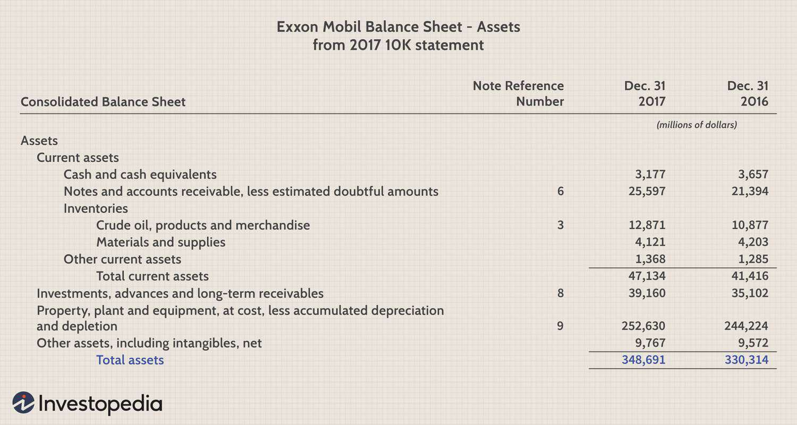

In today's fast-paced financial markets, evaluating a company's financial performance is crucial for investors and analysts. Return on Assets (ROA) is a fundamental metric that reflects a company's efficiency in using its assets to generate profits. By understanding ROA, investors can gain insights into a company's operational effectiveness, guiding investment decisions and highlighting growth opportunities. ROA offers a straightforward measure of how well a company converts its asset base into earnings, providing a snapshot of profitability per asset dollar. This metric's importance extends beyond traditional financial analysis, as its integration into algorithmic trading strategies presents a valuable tool for identifying companies with efficient asset utilization. As a result, ROA plays a vital role in shaping informed and strategic investment approaches within the dynamic landscape of financial markets.

## Table of Contents



## What is Return on Assets (ROA)?

Return on Assets (ROA) is a crucial financial metric that allows investors and analysts to gauge how effectively a company is generating earnings relative to its assets. ROA is expressed as a percentage, providing a clear indication of how well a company is managing its asset base to produce profit. The formula to calculate ROA is:

$$
\text{ROA} = \left( \frac{\text{Net Income}}{\text{Total Assets}} \right) \times 100
$$

Here, net income is the profit of the company after all operating expenses, taxes, and costs have been deducted. Total assets include all tangible and intangible resources owned by the company, such as property, equipment, inventory, and intellectual property.

By analyzing ROA, investors can compare a company's asset efficiency within its industry. A higher ROA value signals more efficient asset utilization, implying that the company produces more profit per dollar of assets owned. This efficiency is necessary for sustaining competitive advantage and ensuring consistent profitability.

To further understand ROA's application, consider a simple Python example:

```python
def calculate_roa(net_income, total_assets):
    if total_assets == 0:
        return None
    return (net_income / total_assets) * 100

# Example usage:
net_income = 500000  # Company's net income in dollars
total_assets = 2000000  # Total assets in dollars

roa = calculate_roa(net_income, total_assets)
print(f"The company's Return on Assets (ROA) is {roa:.2f}%")
```

In the example above, the ROA is calculated to be 25%, suggesting that the company generates 25 cents of profit for every dollar of assets it owns. Understanding such metrics is instrumental for investors looking to evaluate corporate efficiency and identify potentially rewarding investments.

## Understanding the ROA Formula

Return on Assets (ROA) is a financial metric that indicates how efficiently a company utilizes its assets to generate profits. The calculation of ROA is straightforward and involves dividing the net income by the total assets. This ratio is expressed as a percentage and serves as a useful indicator of a company's operational efficiency.

The formula for ROA is:

$$
\text{ROA} = \left(\frac{\text{Net Income}}{\text{Total Assets}}\right) \times 100
$$

### Components of the Formula:

1. **Net Income:**
   - Net income is the profit a company retains after subtracting all operating costs, taxes, interest, and other expenses. It is often referred to as the "bottom line" and is found on the income statement.

2. **Total Assets:**
   - Total assets represent the sum of all current and non-current assets owned by the company. These assets include physical items like property and equipment, as well as intangible assets such as patents and trademarks. Total assets can be located on a company's balance sheet.

### Interpretation:

A higher ROA signifies a greater ability of the company to convert its asset base into net income. For instance, if Company A has a ROA of 10% and Company B has a ROA of 5%, Company A is more efficient in using its assets to generate earnings.

### Example Calculation Using Python:

To illustrate the calculation of ROA using Python, one can utilize basic operations to compute the ratio:

```python
# Sample data
net_income = 500000  # Example net income in dollars
total_assets = 2500000  # Example total assets in dollars

# ROA Calculation
roa = (net_income / total_assets) * 100
print(f"The Return on Assets (ROA) is {roa:.2f}%")
```

This Python code snippet calculates the ROA from hypothetical financial figures. The displayed result represents the efficiency percentage, indicating how well the company's assets are being utilized to generate profit. By automating such calculations, analysts can consistently measure and compare asset efficiency across different periods or companies.

## Special Considerations in ROA Calculation

Return on Assets (ROA) is a critically important metric for evaluating a company's efficiency in using its assets to generate profit. However, it must be assessed within the context of the industry in which a company operates. Asset-heavy industries, such as manufacturing, utilities, and real estate, typically exhibit lower ROAs. This is largely due to the substantial capital investments required in physical infrastructure and machinery, which inflate the total asset base, thereby reducing the ROA. In contrast, service-based sectors, such as technology and finance, often present higher ROAs because they rely more on intangible assets and human capital, rather than significant physical investments, to generate revenue.

Industrial benchmarks, therefore, offer crucial insights into the context-specific relevance of ROA. Comparing companies across different sectors using ROA can be misleading. Instead, analysts should make comparisons within the same industry to obtain meaningful assessments of asset efficiency. For instance, a ROA of 5% might be outstanding in the manufacturing field but considered average in the tech industry. Such industry-specific ROA norms are invaluable for setting realistic expectations and interpreting performance accurately.

Historical performance should also be considered when evaluating ROA. Trends indicating whether a company is improving its asset utilization over time can provide significant insights. A rising ROA trend suggests enhanced operational efficiency, whereas a declining ROA might flag potential issues in asset management or profitability challenges. Moreover, external factors, such as economic cycles, technological advancements, and industry regulations, can impact historical ROA trends.

For practical application, one could use historical financial data to calculate the ROA of a company over several years and visualize the trend. Below is a Python example using a Pandas DataFrame containing fictional historical financial data:

```python
import pandas as pd
import matplotlib.pyplot as plt

# Example data: Net Income and Total Assets over a five-year period
data = {'Year': [2018, 2019, 2020, 2021, 2022],
        'Net_Income': [120000, 135000, 150000, 165000, 160000],
        'Total_Assets': [1000000, 1100000, 1050000, 1150000, 1170000]}
df = pd.DataFrame(data)

# Calculate ROA
df['ROA'] = (df['Net_Income'] / df['Total_Assets']) * 100

# Plot ROA over time
plt.plot(df['Year'], df['ROA'], marker='o')
plt.title('ROA Trend Over Time')
plt.xlabel('Year')
plt.ylabel('ROA (%)')
plt.grid(True)
plt.show()
```

This example demonstrates how historical ROA can be calculated and analyzed over time for a single company. Such analysis, when performed across multiple companies in the same industry, can provide a comprehensive perspective on asset utilization efficiency. Thus, embedding historical and industry-specific considerations in ROA evaluation ensures robust and informed investment decisions.

## ROA in Algorithmic Trading

Algorithmic trading utilizes computer algorithms to execute trades automatically according to predefined criteria, and the integration of Return on Assets (ROA) into these algorithms can serve as a robust tool for identifying companies with efficient asset utilization. By focusing on ROA, traders can highlight firms exhibiting strong growth potential, thereby enhancing trading strategies.

To implement an ROA-based screening strategy, one can employ Python and the Pandas library to manipulate and analyze financial data. The goal is to filter companies based on their ROA metric, seeking those with higher efficiency in asset utilization. The process involves acquiring financial statements, calculating ROA, and then selecting companies that meet specific ROA thresholds. Here's a straightforward example using Python and Pandas:

```python
import pandas as pd

# Sample data of companies, their Net Income, and Total Assets
data = {
    'Company': ['Company A', 'Company B', 'Company C'],
    'Net Income': [50000, 120000, 90000],
    'Total Assets': [200000, 400000, 300000]
}

# Create a DataFrame
df = pd.DataFrame(data)

# Calculate ROA
df['ROA'] = df['Net Income'] / df['Total Assets'] * 100

# Filter companies with ROA greater than a certain threshold, e.g., 15%
high_roa_companies = df[df['ROA'] > 15]

print(high_roa_companies)
```

This code snippet processes a sample dataset including company names, their net income, and total assets. It calculates the ROA for each company and filters those with a ROA exceeding 15%. This filtered list represents firms with more efficient asset use, potentially marking them as suitable candidates for trading strategies focused on growth.

Through [algorithmic trading](/wiki/algorithmic-trading) strategies leveraging ROA, investors can systematically target companies with prudent management practices that maximize asset productivity. Such strategies may lead to more informed decisions, improving the overall performance of investment portfolios. By integrating additional financial metrics and market indicators, the strategy can be further refined to suit specific investor objectives and market conditions.

## Comparing ROA to Other Financial Ratios

Return on Assets (ROA) is a crucial financial metric, but it gains greater context when compared to other financial ratios, such as Return on Equity (ROE) and Return on Investment (ROI). Each of these ratios provides unique perspectives on a company's financial health and operational efficiency, contributing to a comprehensive evaluation.

**Return on Equity (ROE)** measures a company's profitability relative to shareholder's equity. It is calculated by dividing Net Income by Average Shareholders' Equity:

$$
\text{ROE} = \frac{\text{Net Income}}{\text{Average Shareholders' Equity}}
$$

ROE indicates how effectively management is using the shareholders' funds to generate earnings. While ROA focuses on asset efficiency, ROE zeros in on how well a company utilizes equity investments, making it particularly relevant for assessing shareholder value creation. However, ROE can be inflated by higher financial leverage, sometimes obscuring the true performance from operational efficiency.

**Return on Investment (ROI)** assesses the gain or loss generated on an investment relative to its cost. The formula is:

$$
\text{ROI} = \frac{\text{Net Profit}}{\text{Cost of Investment}} \times 100
$$

ROI is widely used for evaluating the efficiency of an investment or comparing the efficiency of several different investments. This ratio goes beyond company-centric metrics, extending to various investment contexts, such as capital projects or marketing campaigns. Unlike ROA and ROE, ROI can be more versatile, although it sometimes overlooks the compounding effects of time and additional external factors affecting returns.

When comparing these ratios, several strengths and limitations emerge:

1. **Perspective on Efficiency:** ROA provides a broad view of how all resources (assets) are used for profit generation, crucial for industries with significant asset bases. Conversely, ROE centers on equity efficiency, which might be more relevant for assessing shareholder returns in capital-light companies.

2. **Leverage Impact:** ROE is susceptible to financial leverage, enhancing returns with increased debt usage. ROA, unaffected by capital structure, can sometimes offer a purer reflection of operational efficiency.

3. **Investment Specifics:** ROI's adaptability to different investment types provides a flexible tool for evaluating specific projects or business segments. However, it requires cautious interpretation to ensure that the unique attributes of each investment are adequately considered.

To conclude, a comprehensive financial analysis often necessitates looking at these ratios in conjunction. Each ratio—ROA, ROE, and ROI—serves its unique purpose in revealing various aspects of financial health, enabling investors and analysts to make more informed, nuanced decisions regarding asset efficiency, shareholder profitability, and investment performance. Using these ratios collectively allows for a holistic approach, crucial for evaluating a company's operational success and strategic potential.

## Limitations of ROA

Return on Assets (ROA) is an effective financial metric utilized to evaluate a company’s profitability related to its total assets. Nevertheless, ROA has notable limitations. Firstly, it often fails to account for future growth potential. ROA is a retrospective indicator, primarily reflecting past performance rather than intrinsic future value or growth prospects. This limitation makes ROA less useful for assessing companies in rapidly changing or high-growth industries where future possibilities significantly outweigh present asset utilization.

Furthermore, ROA tends to undervalue intangible assets. Intangible assets, such as intellectual property, brand recognition, and goodwill, often do not appear directly on the balance sheet in a way that accurately reflects their true value. As such, companies heavily reliant on intangible assets may display lower ROA despite possessing significant future growth potential and strong market positions. This shortcoming is especially evident in technology and service-based companies, where intangible assets form the core of business operations.

To mitigate these limitations, investors and analysts are advised to complement ROA with other financial metrics. For instance, incorporating Return on Equity (ROE) can provide insights into how effectively a company utilizes shareholders’ equity to generate profits, thus offering a broader perspective on financial health. Additionally, metrics like the Price-to-Earnings (P/E) ratio or the Price-to-Book (P/B) ratio can illuminate aspects of market valuations and growth expectations.

By understanding these limitations, investors can adopt a more comprehensive approach to financial analysis. Evaluating a combination of metrics facilitates a well-rounded assessment of a company’s financial standing and growth prospects. This approach helps ensure that investment decisions are informed by a nuanced understanding of both current asset efficiency and prospective growth opportunities.

## Conclusion

Return on Assets (ROA) is a vital metric for assessing a company's ability to efficiently convert its assets into net income. It offers a straightforward insight into the effectiveness of management practices and asset utilization. By integrating ROA into investment and algorithmic trading strategies, investors can identify firms that exhibit strong management capabilities and growth prospects, enabling them to make more informed and strategic decisions.

However, while ROA provides valuable insights, it should not be used in isolation. Investors ought to complement ROA with additional financial metrics to achieve a comprehensive evaluation of a company's financial health. Metrics such as Return on Equity (ROE), Return on Investment (ROI), and various [liquidity](/wiki/liquidity-risk-premium) and solvency ratios can offer additional dimensions to the analysis, revealing different aspects of performance and risk. This multifaceted approach ensures a more rounded appraisal, reducing reliance on a singular measure and increasing the accuracy of financial assessments.

Thus, adopting a multi-dimensional approach that incorporates ROA, alongside other indicators, not only underpins the robustness of financial analysis but also enhances the ability to make informed investment decisions. This balanced evaluation is crucial for navigating the complexities of modern financial markets and aligning with long-term investment goals. By employing this strategy, investors can better recognize opportunities and mitigate potential risks, leading to more effective portfolio management and achievement of financial objectives.

## References & Further Reading

Almarzoqi, R., Naceur, S. B., & Kotak, A. (2015). This work investigates the relationship between financial ratios, inflation expectations, and macroeconomic conditions and their implications for the yield curve. Understanding these relationships can enhance the ability to forecast financial markets and economic conditions, aiding investors in making informed decisions.

*Financial Statement Analysis and Security Valuation* by Stephen Penman provides an in-depth examination of financial statement analysis techniques. This resource is crucial for understanding how financial ratios, including Return on Assets (ROA), are employed to value companies and assess their financial performance. The book emphasizes the role of financial statements in forecasting and decision-making, making it an invaluable tool for both analysts and investors.

Damodaran, A. (2007). This publication focuses on the measurement and implications of key financial ratios such as Return on Capital (ROC), Return on Invested Capital (ROIC), and Return on Equity (ROE). These metrics are closely related to ROA and offer diverse perspectives on a company's efficiency and profitability. Damodaran's insights help underscore the strengths and limitations of each ratio, providing a comprehensive framework for financial evaluation.

*Principles of Corporate Finance* by Richard A. Brealey, Stewart C. Myers, and Franklin Allen discusses foundational concepts in corporate finance. The authors explain the importance of financial ratios in corporate financial strategy and decision-making. The book covers various methodologies for assessing risk, return, and the application of financial ratios like ROA in evaluating a firm's operational efficiency.

DeFusco, R. A., McLeavey, D. W., Pinto, J. E., & Runkle, D. E. (2007). The second edition of *Quantitative Investment Analysis* serves as an essential guide for understanding quantitative techniques in investment analysis. It presents a rigorous framework for analyzing financial metrics, including ROA, within the broader context of quantitative models used in investment strategies. This resource is particularly valuable for investors looking to integrate financial ratios into algorithmic trading models.

These references collectively offer a robust foundation for understanding ROA and other financial ratios, their calculation, implications, and applications in both corporate finance and investment strategies. They provide significant insights into the complexities of financial performance evaluation and the critical role these metrics play in informed decision-making.

