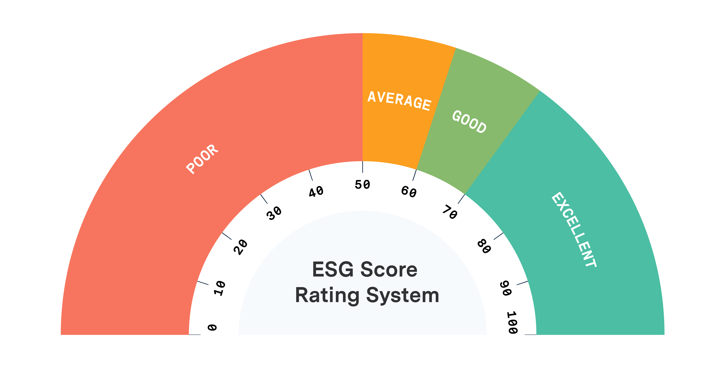

## Table of Contents

## What does ESG stand for and why is it important?

ESG stands for Environmental, Social, and Governance. These are three important areas that people look at when they want to understand how a company is doing more than just making money. Environmental means how a company takes care of the planet, like reducing pollution or using less energy. Social means how a company treats people, like its workers, customers, and the community. Governance means how a company is run, like making sure it follows the law and is honest with everyone.

ESG is important because it helps people make better choices about which companies to support or invest in. If a company does well in ESG, it usually means it is trying to be good for the world, not just for its profits. This can attract customers who care about these issues and investors who want their money to help make the world a better place. Also, companies that do well in ESG might be less likely to have big problems in the future, which makes them safer to invest in.

## How are ESG scores calculated for companies?

ESG scores are calculated by looking at a lot of different things about a company. Special companies and groups that focus on ESG make these scores. They use information from the company's reports, news stories, and sometimes even surveys. They look at things like how much pollution a company makes, how it treats its workers, and if it follows the law. Each part of ESG—environmental, social, and governance—gets its own score. Then, these scores are put together to make one big ESG score for the company.

These scores help people see how well a company is doing in each part of [ESG](/wiki/esg-investing). The scores can be different because different groups might think some things are more important than others. For example, one group might care a lot about how a company affects the environment, while another might focus more on how the company treats its workers. Because of this, a company might get different ESG scores from different groups. But overall, a high ESG score usually means a company is doing a good job in all three areas.

## What are the key components of an ESG score?

The key components of an ESG score are environmental, social, and governance factors. The environmental part looks at how a company affects the planet. This includes things like how much pollution it makes, how much energy it uses, and if it is trying to help the environment by using green energy or reducing waste. The social part checks how a company treats people. This includes how it treats its workers, like making sure they are safe and paid fairly, and how it helps the community, like giving money to charities or helping local schools. The governance part looks at how the company is run. This means checking if the company follows the law, if it is honest with everyone, and if its leaders are doing a good job.

Each of these parts gets its own score, and then they are all added together to make the final ESG score. Different groups that calculate ESG scores might focus on different things. For example, one group might think that reducing pollution is very important, so they might give a higher score for that. Another group might care more about how a company treats its workers, so they might give a higher score for good worker treatment. This means that a company can get different ESG scores from different groups, but a high score usually means the company is doing well in all three areas.

## Can you explain the difference between a high and low ESG score?

A high ESG score means a company is doing well in taking care of the environment, treating people well, and running the company in an honest and fair way. For example, a company with a high ESG score might be using green energy to reduce pollution, paying its workers fairly, and making sure its leaders follow the law. People who care about these things might choose to buy from or invest in companies with high ESG scores because they want to support companies that are trying to make the world a better place.

On the other hand, a low ESG score means a company is not doing as well in these areas. A company with a low ESG score might be polluting a lot, not treating its workers well, or having leaders who break the law. People might avoid buying from or investing in companies with low ESG scores because they don't want to support companies that are harming the environment or people. A low ESG score can also make it harder for a company to attract customers and investors who care about these issues.

## What are the benefits of investing in companies with high ESG scores?

Investing in companies with high ESG scores can be good for your money and for the world. Companies that do well in environmental, social, and governance areas often have fewer big problems. For example, they might not get in trouble for breaking laws or harming the environment. This makes them safer to invest in because they are less likely to lose money because of these issues. Also, more and more people want to buy from and work for companies that care about the planet and people. This can help these companies grow and make more money, which is good for investors.

Another benefit is that investing in high ESG score companies can make you feel good about where your money is going. When you invest in a company that is trying to help the environment, treat people well, and run honestly, you know your money is helping make the world a better place. This can be important for people who want their investments to match their values. Plus, as more people care about these issues, companies with high ESG scores might become more popular and valuable, which could mean more money for you in the long run.

## How do high ESG scores impact a company's financial performance?

High ESG scores can help a company's financial performance in several ways. Companies with good ESG scores often have fewer big problems. For example, they might not get in trouble for breaking laws or harming the environment. This makes them safer to invest in because they are less likely to lose money because of these issues. Also, more and more people want to buy from and work for companies that care about the planet and people. This can help these companies grow and make more money.

Another way high ESG scores can impact financial performance is by attracting more investors. People who care about the environment, social issues, and good governance might choose to invest their money in companies with high ESG scores. This can increase the demand for the company's stocks, which might make the stock price go up. Over time, as more people care about these issues, companies with high ESG scores might become more popular and valuable, which could mean more money for the company and its investors.

## What are some common methodologies used to evaluate ESG scores?

There are different ways to figure out a company's ESG score, but most methods look at the same three things: environmental, social, and governance. One common way is to use a scoring system where each part gets points based on how well the company does. For example, if a company uses a lot of green energy, it might get a high score for the environmental part. If it treats its workers well, it might get a high score for the social part. And if its leaders follow the law and are honest, it might get a high score for governance. These scores are then added together to make the final ESG score.

Another method is to use surveys and questionnaires. Companies might be asked to fill out forms about their environmental practices, how they treat their employees, and how they run their business. These answers are then checked against other information, like news stories or reports from other groups, to make sure they are true. After that, the information is used to give the company a score for each part of ESG. This method helps make sure the scores are fair and accurate by using information from different places.

Some groups also use ratings from experts who know a lot about ESG. These experts look at all the information they can find about a company and give it a score based on what they see. They might look at reports, news stories, and even talk to people who work at the company. This method can be good because it uses the knowledge of people who understand ESG well, but it can also be different from other methods because different experts might think different things are important.

## How do regulatory environments affect ESG scoring?

Regulatory environments can change how companies are scored for ESG. When there are strict rules about the environment, like laws that say companies must reduce pollution, companies that follow these rules will get higher scores on the environmental part of ESG. If a country has strong laws about treating workers fairly, companies that follow these laws will get better social scores. Also, if there are rules about how companies should be run, like making sure they are honest and follow the law, companies that do well in these areas will get higher governance scores. So, the rules in a place can make a big difference in how well a company does on its ESG score.

Sometimes, different countries have different rules, which can make ESG scores different from one place to another. For example, a company might get a high ESG score in a country with strong environmental laws but a lower score in a country where those laws are not as strict. This can make it hard to compare ESG scores across different countries. Groups that calculate ESG scores have to think about these differences and try to be fair when they give scores. They might look at how well a company does compared to other companies in the same country, or they might try to use the same standards everywhere, even if the rules are different.

## What are the challenges and limitations of relying on ESG scores?

Using ESG scores can be tricky because they are not always the same. Different groups that calculate ESG scores might focus on different things. For example, one group might think that reducing pollution is very important, so they give a high score for that. But another group might care more about how a company treats its workers, so they give a higher score for good worker treatment. This means that a company can get different ESG scores from different groups, which can make it hard to know which score to trust. Also, some companies might try to make their ESG scores look better than they really are by only sharing the good things they do and hiding the bad things. This can make the scores less true and fair.

Another challenge is that ESG scores can be affected by the rules in different places. A company might get a high score in a country with strict environmental laws but a lower score in a country where those laws are not as strong. This makes it hard to compare ESG scores across different countries. Also, ESG scores can be hard to understand because they cover a lot of different things. They look at how a company affects the environment, how it treats people, and how it is run. Each of these parts is important, but it can be hard to know which part is most important for a specific company or investor. This can make it tough to use ESG scores to make good choices about where to invest or buy from.

## How can companies improve their ESG scores?

Companies can improve their ESG scores by focusing on the three main areas: environmental, social, and governance. For the environmental part, they can use less energy, reduce pollution, and try to help the planet by using green energy or recycling more. They can also set goals to lower their impact on the environment and share these goals with everyone. For the social part, companies can treat their workers better by paying them fairly, making sure they are safe, and helping the community. They can also make sure they are not doing anything that hurts people and that they are trying to make the world a better place. 

For the governance part, companies can make sure they are run in an honest and fair way. This means following the law, being open about what they do, and making sure their leaders are doing a good job. Companies can also get checked by outside groups to make sure they are doing everything right. By working on all these things, companies can get better ESG scores and show that they care about more than just making money. This can help them attract customers and investors who want to support companies that are trying to make the world a better place.

## What role do third-party ESG rating agencies play in evaluating companies?

Third-party ESG rating agencies are groups that look at how well companies are doing in taking care of the environment, treating people, and running their business in an honest way. They collect a lot of information about companies from their reports, news stories, and sometimes even surveys. Then, they use this information to give each company a score for the environmental, social, and governance parts. These scores help people see which companies are doing a good job in these areas. Because these agencies are not part of the companies they are rating, they can give a fair and honest view of how well the companies are doing.

These agencies are important because they help investors, customers, and other people make better choices about which companies to support. If a company gets a high ESG score from a third-party agency, it means the company is trying to be good for the world, not just for its profits. This can attract people who care about these issues and want their money to help make the world a better place. But, different agencies might give different scores because they might think different things are important. So, it's good to look at scores from more than one agency to get a full picture of how well a company is doing.

## How do global standards and variations affect the interpretation of high ESG scores?

Global standards and variations can make it hard to understand what a high ESG score means. Different countries have different rules about the environment, how companies should treat people, and how they should be run. So, a company might get a high ESG score in one country because it follows strict rules there, but it might get a lower score in another country where the rules are not as strict. This can make it hard to compare ESG scores from different places. People who look at ESG scores need to think about these differences and try to be fair when they decide if a score is high or low.

Even though there are global groups trying to set the same standards for ESG scores everywhere, it can still be tricky. Some groups focus more on the environment, while others might care more about how companies treat people. This means that a company can get different ESG scores from different groups, even if they are trying to use the same standards. So, when people see a high ESG score, they need to think about who gave the score and what they think is important. This helps them understand if the score really means the company is doing a good job in all the important areas.

## References & Further Reading

[1]: Gladwin, T. N., Kennelly, J. J., & Krause, T. (1995). ["Shifting Paradigms for Sustainable Development: Implications for Management Theory and Research."](https://www.jstor.org/stable/258959) Academy of Management Review, 20(4), 874-907.

[2]: Eccles, R. G., Ioannou, I., & Serafeim, G. (2014). ["The Impact of Corporate Sustainability on Organizational Processes and Performance."](https://www.jstor.org/stable/24550546) Management Science, 60(11), 2835-2857.

[3]: Friede, G., Busch, T., & Bassen, A. (2015). ["ESG and financial performance: aggregated evidence from more than 2000 empirical studies."](https://www.tandfonline.com/doi/full/10.1080/20430795.2015.1118917) Journal of Sustainable Finance & Investment, 5(4), 210-233.

[4]: Khan, M., Serafeim, G., & Yoon, A. (2016). ["Corporate Sustainability: First Evidence on Materiality."](https://corporate-sustainability.org/wp-content/uploads/Corporate-Sustainability.pdf) The Accounting Review, 91(6), 1697-1724.

[5]: Nielsen. (2021). ["Was 2020 a Tipping Point for Trust?"](https://www.nielsen.com/insights/2021/beyond-martech-building-trust-with-consumers-and-engaging-where-sentiment-is-high/)

[6]: Pedersen, L. H., Fitzgibbons, S., & Pomorski, L. (2021). ["Responsible Investing: The ESG-Efficient Frontier."](https://www.sciencedirect.com/science/article/pii/S0304405X20302853) Journal of Financial Economics, 142(2), 572-597.

[7]: Lopez de Prado, M. (2018). ["Advances in Financial Machine Learning."](https://www.amazon.com/Advances-Financial-Machine-Learning-Marcos/dp/1119482089) Wiley.

[8]: Chan, E. P. (2008). ["Quantitative Trading: How to Build Your Own Algorithmic Trading Business."](https://github.com/ftvision/quant_trading_echan_book) Wiley.