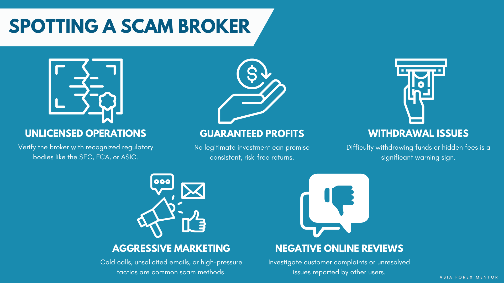

## Table of Contents

## What is a Forex broker and why is it important to evaluate their legitimacy?

A Forex broker is a person or a company that helps people buy and sell currencies on the foreign exchange market. They provide a platform where traders can access the market, and they also offer tools and resources to help traders make decisions. The broker makes money by charging a small fee or a commission on each trade.

It's very important to check if a Forex broker is legitimate before using their services. This is because there are many fake brokers out there who might steal your money or give you bad advice. By making sure a broker is regulated by a trusted authority, you can feel safer that they will follow the rules and keep your money safe. This helps you trade with more confidence and avoid big problems.

## How can beginners identify if a Forex broker is regulated?

Beginners can identify if a Forex broker is regulated by checking the broker's website for information about their regulatory status. Most legitimate brokers will clearly state which regulatory bodies they are registered with, such as the Financial Conduct Authority (FCA) in the UK, the Commodity Futures Trading Commission (CFTC) in the US, or the Australian Securities and Investments Commission (ASIC) in Australia. Look for a section called "About Us" or "Regulation" where this information is usually listed.

Another way to verify a broker's regulation is by visiting the websites of the regulatory bodies themselves. Each regulatory authority has a list of the brokers they oversee. You can search for the broker's name on these websites to confirm their regulatory status. This step is important because it helps you make sure the broker is telling the truth about being regulated and adds an extra layer of security to your trading.

Remember, if a broker is not regulated by any recognized authority, it's a big warning sign. Always do your homework and make sure the broker you choose is properly regulated to protect your money and your trading activities.

## What are the key regulatory bodies for Forex brokers globally?

There are several important regulatory bodies for Forex brokers around the world. In the United States, the Commodity Futures Trading Commission (CFTC) and the National Futures Association (NFA) are the main ones. They make sure that brokers follow the rules and protect traders. In the United Kingdom, the Financial Conduct Authority (FCA) does the same thing. They keep an eye on brokers to make sure they are honest and fair. 

In Australia, the Australian Securities and Investments Commission (ASIC) is the key regulator. They work to keep the market safe for traders. In Europe, the Cyprus Securities and Exchange Commission (CySEC) is important too. Many Forex brokers are based in Cyprus because of its favorable regulations. These bodies all help to make sure that Forex brokers are doing things the right way and that traders are protected.

## What should one look for in a Forex broker's licensing and registration?

When choosing a Forex broker, it's important to check their licensing and registration. Look for information on their website about which regulatory bodies they are registered with. Good brokers will clearly show this. They might be registered with groups like the Financial Conduct Authority (FCA) in the UK, the Commodity Futures Trading Commission (CFTC) in the US, or the Australian Securities and Investments Commission (ASIC) in Australia. Make sure the broker mentions these names because it shows they follow strict rules to protect traders.

You can also visit the websites of these regulatory bodies to double-check if the broker is really registered with them. Each body has a list of brokers they oversee, so you can search for the broker's name there. This extra step helps you make sure the broker is telling the truth and adds another layer of safety. If a broker isn't registered with any recognized authority, that's a big warning sign. Always do your homework to keep your money and trading safe.

## How does the financial stability of a Forex broker affect its legitimacy?

The financial stability of a Forex broker is important for its legitimacy because it shows that the broker can handle your money safely. If a broker is financially stable, it means they have enough money to pay back traders when they want to take their money out. This makes traders feel more secure and trust the broker more. On the other hand, if a broker is not financially stable, they might not be able to give you your money when you need it, which can cause big problems.

You can check a broker's financial stability by looking at their financial reports, if they share them. Also, some regulatory bodies like the Financial Conduct Authority (FCA) or the Commodity Futures Trading Commission (CFTC) make sure that brokers keep enough money to stay stable. If a broker is registered with these bodies, it's a good sign that they are financially stable and legitimate. So, always check the broker's financial health before you start trading with them to make sure your money is safe.

## What are common red flags that indicate a Forex broker might be a scam?

There are several red flags that can show a Forex broker might be a scam. One big warning sign is if the broker promises really high returns with little or no risk. This is not how trading works, and it's a trick to get you to invest your money. Another red flag is if the broker doesn't have a clear license or registration with a trusted regulatory body like the FCA or CFTC. If they can't show you proof of being regulated, it's a sign they might not be legitimate.

Another thing to watch out for is if the broker asks for a lot of money upfront or has high fees that seem unfair. Legitimate brokers usually have clear and reasonable fees. Also, be careful if the broker's website looks unprofessional or if it's hard to find information about the company. If you can't easily contact them or if they don't respond to your questions, these are also signs that something might be wrong. Always do your research and be careful to avoid scams.

## How can traders verify the trading platform and tools provided by a Forex broker?

Traders can verify the trading platform and tools provided by a Forex broker by first checking if the platform is well-known and trusted in the trading community. Popular platforms like MetaTrader 4 (MT4) and MetaTrader 5 (MT5) are used by many brokers and have a good reputation. You can read reviews and ask other traders about their experiences with the platform. Also, you can try out the platform using a demo account, which most brokers offer for free. This lets you see if the platform works well and if the tools, like charts and indicators, are useful and easy to use.

Another way to verify the trading platform is by checking if the broker provides good customer support. If you have any problems with the platform or tools, you want to know that the broker will help you fix them quickly. You can test this by contacting their support team with questions or issues before you start trading with real money. If they respond quickly and helpfully, it's a good sign that they care about their traders. Always make sure to do your research and try things out yourself to feel confident in the trading platform and tools you'll be using.

## What role does customer service and support play in assessing a broker's legitimacy?

Customer service and support are very important when checking if a Forex broker is legitimate. Good customer service shows that the broker cares about their traders and wants to help them. If a broker has a team that answers your questions quickly and helps you solve problems, it's a sign that they are trustworthy. You can test this by contacting their support team before you start trading. If they respond fast and give helpful answers, it's a good sign that they are a legitimate broker.

On the other hand, if a broker's customer service is bad, it can be a warning sign. If they don't answer your questions or take a long time to get back to you, it might mean they don't care about their traders. This can make you feel unsure about using their services. So, always check the broker's customer service to see if they are legitimate and if they will support you when you need help with your trading.

## How important is the transparency of fees and commissions when evaluating Forex brokers?

Transparency about fees and commissions is very important when choosing a Forex broker. If a broker clearly shows all the fees they charge, you know exactly how much it will cost to trade with them. This helps you plan your trading and avoid surprises. If a broker hides their fees or doesn't explain them well, it can be a sign that they might not be trustworthy. You want to know all the costs upfront so you can make smart decisions about your money.

When a broker is open about their fees, it builds trust. You feel more confident that they won't suddenly charge you more money without telling you. On the other hand, if a broker is not clear about their fees, it can lead to problems later. You might end up paying more than you expected, which can hurt your trading profits. So, always check how transparent a broker is about their fees and commissions before you start trading with them.

## What advanced methods can experts use to perform due diligence on Forex brokers?

Experts can use several advanced methods to perform due diligence on Forex brokers. One way is to check the broker's financial statements and audit reports. These documents show how much money the broker has and if they are managing it well. Experts can also look at the broker's history to see if they have been involved in any legal problems or if they have a good track record. Another important step is to talk to other experienced traders and read reviews on trusted websites. This helps experts understand what other people think about the broker and if there are any common problems or concerns.

Another advanced method is to use specialized software tools that analyze the broker's trading platform for any signs of manipulation or unfair practices. These tools can help experts spot if the broker is doing anything that might hurt traders, like changing prices or making it hard to take money out. Experts might also look at the broker's technology and security systems to make sure they are strong and protect traders' information. By using these advanced methods, experts can get a full picture of the broker's legitimacy and make better choices about where to trade.

## How can the analysis of a broker's trading conditions and execution speeds help in legitimacy assessment?

Analyzing a broker's trading conditions and execution speeds is a good way to check if they are legitimate. Good brokers have clear rules about how they handle trades, like the spreads they charge and the amount of money you need to start trading. If a broker is open about these things, it shows they are honest and want to help traders. But if the broker doesn't explain their trading conditions well or if they change them a lot without telling you, it can be a warning sign. This might mean they are not trustworthy and could be trying to trick you.

Execution speed is also important. A legitimate broker will make sure your trades happen quickly, so you can buy or sell at the price you want. If a broker's platform is slow or if they often change the prices after you click to trade, it can hurt your trading and make you lose money. By checking how fast and reliable a broker's execution is, you can see if they care about their traders and if they are running a fair business. This helps you feel more confident that the broker is legitimate and will treat you right.

## What are the best practices for continuously monitoring the legitimacy of a Forex broker over time?

Keeping an eye on a Forex broker's legitimacy over time is important to make sure they stay trustworthy. One good way to do this is by regularly checking their website for any updates on their regulatory status. Legitimate brokers will always be clear about which bodies they are registered with, like the FCA or CFTC. You can also visit the websites of these regulatory bodies to see if the broker is still on their list. Another thing to do is to read reviews and talk to other traders often. If a lot of people start having problems with the broker, it could be a sign that something is wrong. Also, keep an eye on the broker's financial health by looking at their financial reports if they share them. This helps you see if they are still stable and able to pay back traders.

Another practice is to test the broker's customer service from time to time. If their support team is still quick and helpful, it shows they care about their traders. You can also use the broker's demo account to check if their trading platform and tools are still working well. If you notice the platform getting slower or if the broker starts changing their fees without telling you, these can be warning signs. By doing these checks regularly, you can stay on top of any changes and make sure the broker stays legitimate. This way, you can keep trading safely and avoid big problems.

## References & Further Reading

[1]: Bergstra, J., Bardenet, R., Bengio, Y., & Kégl, B. (2011). ["Algorithms for Hyper-Parameter Optimization."](https://dl.acm.org/doi/10.5555/2986459.2986743) Advances in Neural Information Processing Systems 24.

[2]: ["Advances in Financial Machine Learning"](https://www.amazon.com/Advances-Financial-Machine-Learning-Marcos/dp/1119482089) by Marcos Lopez de Prado

[3]: ["Evidence-Based Technical Analysis: Applying the Scientific Method and Statistical Inference to Trading Signals"](https://www.amazon.com/Evidence-Based-Technical-Analysis-Scientific-Statistical/dp/0470008741) by David Aronson

[4]: ["Machine Learning for Algorithmic Trading"](https://github.com/PacktPublishing/Machine-Learning-for-Algorithmic-Trading-Second-Edition) by Stefan Jansen

[5]: ["Quantitative Trading: How to Build Your Own Algorithmic Trading Business"](https://books.google.com/books/about/Quantitative_Trading.html?id=j70yEAAAQBAJ) by Ernest P. Chan