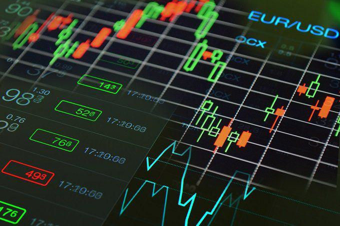

The foreign exchange (forex) market holds a global appeal for traders due to its liquidity and potential for profit. However, it also presents significant risks, primarily from scams orchestrated by unscrupulous brokers. Understanding these risks is vital for anyone looking to trade forex successfully. This article is designed to provide critical insights into recognizing scams within forex brokerages along with discussing the importance of algorithmic trading in enhancing trading safety.

Forex trading operates in a largely decentralized environment, especially in jurisdictions with minimal regulatory oversight. This decentralization makes the forex market susceptible to fraudulent activities. Identifying reliable brokers becomes a crucial first step for traders aiming to safeguard their investments. Engaging in thorough due diligence is paramount before committing to any trading platform. This involves verifying the broker's regulatory status, assessing client reviews, and understanding the broker's business practices.



Algorithmic trading, with its reliance on advanced algorithms for executing trades, offers another layer of protection by ensuring precision and speed in trading activities. Yet, a trader must ensure that these algorithms align with their financial objectives and risk tolerance. Algorithmic strategies can reduce trading costs, minimize human error, and enhance overall efficiency, thereby contributing to a safer trading environment.

Successful forex trading requires not only a keen awareness of potential scams but also a strategic approach to choosing trustworthy brokers and employing effective trading technologies. This focus on safety and proactive research strategies is essential for managing risks and achieving success in the volatile forex market. By recognizing warning signs and implementing robust trading strategies, traders can significantly enhance their chances of profiting in this competitive arena.

## Table of Contents

## Identifying Forex Broker Scams

Forex trading's global appeal often belies the regulatory disparities present across different regions, making it vulnerable to fraudulent practices. Many regions lack stringent regulatory frameworks, creating an environment where scams can thrive. A significant warning sign of potential fraud is the promise of guaranteed returns with minimal risk. Such guarantees are typically used to attract and deceive unsuspecting traders. Trading in forex inherently involves risk due to market [volatility](/wiki/volatility-trading-strategies), and no legitimate broker would offer assured profits.

The presence of unregulated brokers or those operating in jurisdictions with lax oversight is another cause for concern. These brokers may not adhere to standardized ethical and operational guidelines, making them unreliable. Hence, it is crucial to approach them with a high degree of caution.

To safeguard against scams, conducting a detailed background check on the broker is indispensable. Start by verifying their registration with recognized financial regulatory authorities. Institutions such as the Financial Conduct Authority (FCA) in the UK, the Commodity Futures Trading Commission (CFTC) in the US, and the Australian Securities and Investments Commission (ASIC) are examples of reputed regulators that maintain stringent standards for their licensees.

Furthermore, scrutinizing customer reviews is valuable. Genuine feedback from other traders can provide insights into the broker’s operations and client interactions. Additionally, checking for any regulatory warnings or sanctions against the broker can reveal past infractions or tendencies towards unethical practices. These due diligence steps are essential in identifying potential scams and ensuring that your trading activities are conducted with reputable brokers.

## The Role of Communication in Trading Safety

Effective communication with a [forex](/wiki/forex-system) broker is vital for maintaining a safe trading environment. The relationship between a trader and broker hinges on the clarity, timeliness, and accuracy of communication. If a broker habitually provides vague or delayed responses, this could signal potential issues with their service, indicating a risk to the trader. It's crucial for traders to ensure that brokers offer robust customer support and immediate access to assistance when needed. This is not just a matter of convenience; it's a fundamental aspect of protecting one's investments.

Miscommunication or opacity in broker-client interactions can lead to significant financial losses. A trader's ability to execute informed trades relies heavily on the transparency and reliability of the information received from their broker. Discrepancies or unclear terms could result in poor trading decisions, directly impacting the trader's financial outcomes.

Trustworthy brokers are characterized by their adherence to open communication practices. They maintain transparent channels and provide comprehensive responses to client inquiries. This level of communication reassures traders of the broker's reliability and aligns with the trader's need for a safe trading environment. When evaluating a broker, the quality and responsiveness of their communication should be a key consideration, alongside other factors like regulatory compliance and financial stability.

## Algorithmic Trading and Its Impact on Trading Safety

Algorithmic trading has transformed the forex market by leveraging advanced mathematical models and algorithms to execute trades at high speeds and with precision. This automated approach minimizes the emotional bias that often affects human traders, enabling orders to be executed based on predefined criteria and market data.

While [algorithmic trading](/wiki/algorithmic-trading) offers numerous advantages, such as reduced trading costs and increased efficiency, it is crucial for traders to ensure that the algorithms used align with their financial goals and risk tolerance. The selection of appropriate algorithms can make a substantial difference in achieving trading objectives. For instance, a trader with a low-risk preference might opt for algorithms designed to identify stable market trends and avoid volatile conditions.

Understanding the underlying logic of these algorithms is imperative. Algorithms can range from simple strategies based on moving averages to complex systems incorporating [machine learning](/wiki/machine-learning) for pattern recognition. By grasping the logic and methods behind algorithmic strategies, traders can make informed decisions and tailor their trading systems to market conditions. For example, a basic moving average crossover strategy might be represented in Python as:

```python
def moving_average(data, window_size):
    return data.rolling(window=window_size).mean()

def moving_average_crossover(data, short_window, long_window):
    short_ma = moving_average(data, short_window)
    long_ma = moving_average(data, long_window)

    signals = (short_ma > long_ma).astype(int).diff()
    buy_signals = signals[signals == 1]
    sell_signals = signals[signals == -1]

    return buy_signals, sell_signals

# Example usage
# Assuming 'prices' is a pandas Series of price data
buy_signals, sell_signals = moving_average_crossover(prices, short_window=20, long_window=50)
```

One notable benefit of well-designed algorithms is their ability to minimize human error, executing trades without the distractions or biases that might impact manual trading. Nonetheless, traders should remain vigilant and continuously monitor algorithmic strategies, adjusting them in response to real-time market changes. Market conditions can shift rapidly, and an algorithm that performed well under certain conditions may require recalibration as these conditions evolve.

Moreover, traders should be wary of "black-box" systems that operate without transparency. Understanding how an algorithm processes information and makes decisions is vital to trust its operations and modify it when necessary. While algorithms are powerful tools, they are not infallible, and market anomalies or unforeseen events can lead to suboptimal performance or losses.

In summary, the integration of algorithmic trading into forex markets has brought significant advantages, including efficiency and the reduction of human errors. However, it demands a thorough understanding of the employed algorithms, alignment with personal financial goals, and diligent monitoring and adjustment to ensure sustained success in the dynamic forex environment.

## Conducting Broker Research for Enhanced Security

Conducting thorough research on forex brokers is essential for ensuring a safe trading experience. This process starts with verifying the broker's credentials through the websites of relevant regulatory authorities. Reliable brokers typically hold licenses from well-regarded bodies such as the Financial Conduct Authority (FCA) in the UK, the U.S. Commodity Futures Trading Commission (CFTC), or the Australian Securities and Investments Commission (ASIC). These organizations provide comprehensive databases where traders can check the regulatory status of a broker.

Evaluating a broker’s reputation involves reviewing both online testimonials and feedback from other traders. Trustworthy brokers generally have positive reviews, although it is important to be cautious of overly positive testimonials that may be fabricated. Utilizing independent review platforms and forums can offer additional insights into the broker's reliability and customer service track record.

Understanding all terms and conditions before entering into a contract with a broker is critical to avoiding hidden fees or restrictions that can adversely affect your trading. Contracts may include clauses on withdrawal limits, margin requirements, and other fees, which can vary significantly between brokers. Careful scrutiny of these details helps prevent unexpected costs and ensures alignment with your trading strategy.

Finally, starting with a small initial deposit and conducting test trades can serve as practical methods for assessing a broker's reliability. This allows traders to evaluate the efficiency of the broker’s platform, the handling of orders, and the responsiveness of customer service in real trading conditions without significant financial risk. By adhering to these steps, traders can enhance the security and success of their forex trading endeavors.

## Recognizing and Avoiding 'Churning' Practices

'Churning', a term often encountered in the forex trading landscape, refers to the practice where brokers engage in excessive trading primarily to generate commissions, with little or no consideration for the client's financial benefit. This unethical practice can significantly erode a trader's profitability by increasing costs without offering substantial advantages in return.

**Unauthorized or Unexplained Trades**

One of the most apparent indicators of churning is the presence of unauthorized or unexplained trades within your trading account. These transactions may not align with your financial goals and strategy. It is crucial for traders to establish a clear understanding of their investment objectives and maintain consistent monitoring of their accounts. If trades regularly appear that deviate from your set plan without adequate explanation or consent, it may be a red flag pointing to potential churning activities.

**Regular Monitoring and Pattern Recognition**

Traders should diligently monitor their account activities, ensuring they scrutinize any irregular patterns that may suggest excessive trading. This practice involves reviewing all transaction records and comparing them against your trading strategy. High-frequency trades that do not seem to follow a logical pattern or fluctuate significantly from expected behavior warrant further investigation.

**Reporting and Regulatory Actions**

If you encounter evidence suggestive of churning, it is imperative to report such activities to the relevant regulatory bodies. Bodies such as the Commodity Futures Trading Commission (CFTC) in the United States impose strict regulations to protect traders from such fraudulent practices. Prompt reporting enables regulatory authorities to take necessary action against unethical brokers, potentially safeguarding other traders from similar risks.

**Consulting Financial Advisers**

Consulting with a financial advisor can be beneficial if you suspect that your broker might be engaging in churning. An advisor can provide an independent analysis of your account transactions and offer expert guidance on how to address any issues detected. They can also help you fortify your trading strategy against future unethical practices by brokers, ensuring alignment with your long-term financial objectives.

In conclusion, awareness and vigilance are key in recognizing and avoiding churning. By maintaining an active oversight of your trades, verifying the legitimacy of each transaction, and leveraging expert consultation, traders can protect their investments from being compromised by unscrupulous practices.

## Conclusion

Trading in the forex market offers lucrative opportunities but comes with inherent risks, particularly from scams and unreliable brokers. A comprehensive approach to guarding against such risks involves diligent research, acute observation, and the application of protective trading technologies such as algorithmic trading. These strategies collectively empower traders to mitigate potential threats effectively. 

Remaining informed about the newest developments and regulatory modifications in the forex sector is crucial for ensuring trading safety. Regulatory changes can significantly affect trading conditions, influencing everything from broker operations to trading strategies. By keeping abreast of these changes, traders can make better-informed decisions and protect their investments from unforeseeable risks.

Adopting a strategic and cautious approach is essential when engaging with the forex market. This includes conducting thorough due diligence on brokers, understanding market dynamics, and employing advanced trading technologies where appropriate. Safety and reliability must be prioritized in choosing brokers and trading methods to ensure a positive trading experience.

By maintaining vigilance and remaining proactive, traders can navigate the complexities of the forex market with greater assurance. In turn, this enhances not only their safety but also their capacity to capitalize on the market's opportunities.

## References & Further Reading

[1]: Bergstra, J., Bardenet, R., Bengio, Y., & Kégl, B. (2011). ["Algorithms for Hyper-Parameter Optimization."](https://dl.acm.org/doi/10.5555/2986459.2986743) Advances in Neural Information Processing Systems 24.

[2]: ["Advances in Financial Machine Learning"](https://www.amazon.com/Advances-Financial-Machine-Learning-Marcos/dp/1119482089) by Marcos Lopez de Prado

[3]: ["Evidence-Based Technical Analysis: Applying the Scientific Method and Statistical Inference to Trading Signals"](https://www.amazon.com/Evidence-Based-Technical-Analysis-Scientific-Statistical/dp/0470008741) by David Aronson

[4]: ["Machine Learning for Algorithmic Trading"](https://github.com/PacktPublishing/Machine-Learning-for-Algorithmic-Trading-Second-Edition) by Stefan Jansen

[5]: ["Quantitative Trading: How to Build Your Own Algorithmic Trading Business"](https://books.google.com/books/about/Quantitative_Trading.html?id=j70yEAAAQBAJ) by Ernest P. Chan