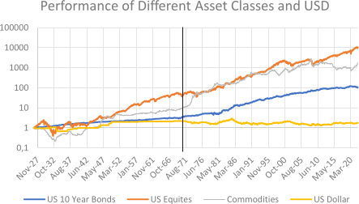

## Table of Contents

## What are equities, bonds, and commodities?

Equities, also known as stocks, represent ownership in a company. When you buy equities, you become a shareholder, which means you own a small part of that company. The value of equities can go up or down based on how well the company is doing and what investors think about its future. If the company does well, the price of its stock might increase, and you could make money. But if the company struggles, the stock price might drop, and you could lose money. Equities can provide dividends, which are payments made to shareholders from the company's profits.

Bonds are like loans that you give to a government or a company. When you buy a bond, you are lending money to the issuer, and in return, they promise to pay you back the amount you lent, plus interest, over a certain period. Bonds are generally considered safer than equities because they have a fixed interest rate and a set maturity date when you get your money back. However, if the issuer runs into financial trouble, they might not be able to pay you back, which means you could lose your investment.

Commodities are basic goods that can be bought and sold, like gold, oil, or agricultural products like wheat and corn. These items are often used in the production of other goods or consumed directly. The prices of commodities can be very volatile, meaning they can change a lot based on supply and demand. For example, if there's a drought, the price of wheat might go up because there's less of it available. Investing in commodities can be a way to diversify your portfolio, but it can also be risky because of the price fluctuations.

## How does the strength of the US dollar affect investment returns?

The strength of the US dollar can have a big impact on investment returns, especially when you're investing in things outside of the US. If the US dollar gets stronger, it means that it can buy more of other countries' money. So, if you have investments in other countries, like stocks or bonds, and you want to bring that money back to the US, you'll get more dollars for it when the dollar is strong. This can make your investment returns look better because you're getting more US dollars for the same amount of foreign money.

On the other hand, if the US dollar gets weaker, it means it can buy less of other countries' money. So, if you're bringing money back from investments in other countries, you'll get fewer US dollars for it. This can make your investment returns look worse because you're getting less US dollars for the same amount of foreign money. Also, if you're investing in commodities like oil or gold, which are often priced in US dollars, a weaker dollar can make these commodities more expensive for people using other currencies, which might affect their prices and your returns.

## What are the basic metrics used to evaluate the performance of equities, bonds, and commodities?

For equities, some of the basic metrics used to evaluate their performance are the price-to-earnings (P/E) ratio, which shows how much you're paying for a company's earnings, and the dividend yield, which tells you how much money you're getting back from the company in dividends compared to the price of the stock. Another important metric is the stock's total return, which includes both the change in the stock's price and any dividends you receive. These metrics help investors understand if a stock is a good buy or if it's overpriced.

For bonds, key performance metrics include the yield to maturity (YTM), which shows the total interest you'll earn if you hold the bond until it matures, and the coupon rate, which is the interest rate the bond pays each year. The bond's price can also go up or down based on changes in interest rates, so investors look at the bond's duration to understand how sensitive it is to these changes. These metrics help investors decide if a bond is a good investment and how it fits into their overall portfolio.

For commodities, the main metric used to evaluate performance is the spot price, which is the current market price you'd pay to buy the commodity right now. Investors also look at futures prices, which are the prices set for buying or selling the commodity at a future date. The difference between the spot price and the futures price, known as the basis, can tell investors a lot about the supply and demand for the commodity. These metrics help investors understand the current value of a commodity and predict how its price might change in the future.

## How can historical data be used to assess long-term performance of these assets?

Historical data is really useful for figuring out how well equities, bonds, and commodities have done over a long time. For equities, you can look at the past prices and returns to see how a company's stock has grown or shrunk. You can also see if the company paid good dividends and how often. By looking at long-term charts and data, you can spot patterns and trends that help you guess how the stock might do in the future. For example, if a stock has gone up a lot over the last 10 years, it might be a good sign, but you also need to think about what's happening in the world and the economy right now.

For bonds, historical data can show you how much interest you could have earned in the past and how the bond's price has changed. You can look at old interest rates and see how they affected bond prices. This helps you understand if a bond is a safe bet or if it's risky. By studying past bond yields and prices, you can make smarter choices about which bonds to buy and how long to keep them. It's also good to know how bonds have done during different economic times, like recessions or booms, because that can tell you how they might act in the future.

When it comes to commodities, historical data can tell you about past prices and how they've moved over time. You can see if a commodity like oil or gold has had big price swings or if it's been pretty steady. This information can help you predict if the price might go up or down in the future. By looking at long-term trends, you can also see how things like weather, politics, or new technology have affected commodity prices in the past. This can give you a better idea of what might happen next and help you decide if it's a good time to invest in a certain commodity.

## What role does inflation play in evaluating the real returns of investments?

Inflation is really important when you're trying to figure out how much money you're actually making from your investments. If you just look at the numbers without thinking about inflation, you might think you're doing better than you really are. Inflation means that the prices of things go up over time, so the money you get back from your investments might not buy as much as it used to. For example, if your investment grows by 5% in a year, but inflation is also 5%, then you're not really making any extra money because everything else costs more too. So, to see your real returns, you need to subtract the inflation rate from your investment's growth rate.

When you're looking at different kinds of investments like stocks, bonds, or commodities, inflation affects them all, but in different ways. Stocks can sometimes keep up with inflation because companies can raise their prices to make more money. Bonds, on the other hand, have fixed interest rates, so if inflation goes up, the money you get from bonds might not be worth as much. Commodities like gold or oil can sometimes go up in price when there's inflation, which can help protect your money's value. By understanding how inflation works with each type of investment, you can pick the ones that will help your money grow even when prices are going up.

## How do currency fluctuations impact the performance of international equities and bonds?

Currency fluctuations can really change how well your international equities and bonds do. If you invest in stocks or bonds from another country and your home currency gets stronger, it means you'll get fewer of your home currency when you bring the money back. For example, if you have stocks in Europe and the US dollar gets stronger, you'll get fewer dollars for your euros when you sell the stocks. This can make your investment returns look smaller, even if the stock price in euros stayed the same or went up. So, a strong home currency can hurt the returns on your international investments.

On the other hand, if your home currency gets weaker, it can help your international investments. If the US dollar gets weaker and you have stocks or bonds in Europe, you'll get more dollars for your euros when you bring the money back. This can make your investment returns look bigger, even if the stock or bond price in euros didn't change. But remember, currency changes can go both ways, so they can help or hurt your investments depending on which way the currency moves. It's important to keep an eye on currency rates when you're investing in other countries.

## What are the key economic indicators to watch when analyzing the US dollar's strength?

When you want to know how strong the US dollar is, you should keep an eye on a few important economic indicators. One big one is the interest rates set by the Federal Reserve. If they go up, it can make the US dollar stronger because people from other countries might want to invest in the US to get those higher interest rates. Another thing to watch is the inflation rate. If prices in the US are going up a lot, it can make the dollar weaker because people might not want to hold onto dollars if they're losing value. The trade balance is also important - if the US is selling more stuff to other countries than it's buying, it can make the dollar stronger.

Another key indicator is the Gross Domestic Product (GDP), which shows how well the US economy is doing. If the GDP is growing a lot, it can make the dollar stronger because it shows that the economy is doing well. Unemployment rates are also something to watch. If a lot of people have jobs, it can make the dollar stronger because it shows the economy is healthy. Lastly, the strength of the US dollar can also be affected by what's happening in the rest of the world. If other countries' economies are doing badly, people might want to put their money in the US, which can make the dollar stronger.

## How can investors use hedging strategies to mitigate currency risk?

Investors can use hedging strategies to protect their money from currency risk, which means they try to stop losing money if the value of one currency changes compared to another. One common way to do this is by using currency forwards or futures. These are agreements to buy or sell a certain amount of currency at a set price on a future date. So, if an investor knows they will need to change their money back to their home currency later, they can use a forward contract to lock in the exchange rate now. This way, even if the exchange rate gets worse, they won't lose as much money.

Another way to hedge is by using options. Options give investors the right, but not the obligation, to buy or sell currency at a certain price before a certain date. This can be helpful because it lets investors protect themselves from bad exchange rates without missing out if the rates get better. For example, if an investor thinks the exchange rate might go down, they can buy a put option to sell the currency at a better rate. If the rate does go down, they can use the option to limit their losses. But if the rate stays the same or goes up, they can just let the option expire and not use it.

## What advanced statistical methods can be applied to predict future performance based on historical data?

One advanced statistical method that investors can use to predict future performance based on historical data is time series analysis. This method looks at how things like stock prices or commodity values have changed over time. By studying these patterns, investors can make guesses about what might happen next. For example, they might use something called ARIMA (AutoRegressive Integrated Moving Average) models, which can find trends and seasonal changes in the data. These models can help investors understand if a stock or commodity is likely to go up or down in the future, based on what it did in the past.

Another useful method is regression analysis, which helps investors see how different things are related to each other. For instance, they might look at how interest rates affect bond prices or how economic indicators like GDP growth influence stock market returns. By using regression, investors can build models that predict future performance based on these relationships. They can also use [machine learning](/wiki/machine-learning) techniques, like neural networks, to find even more complex patterns in the data. These methods can be really powerful because they can learn from lots of data and make better predictions over time, helping investors make smarter choices about where to put their money.

## How does the correlation between asset classes change with the strength of the US dollar?

The strength of the US dollar can change how different types of investments, like stocks, bonds, and commodities, move together. When the US dollar gets stronger, it often means that international stocks and commodities priced in dollars might not do as well. This is because a strong dollar makes these investments more expensive for people using other currencies, so they might not want to buy as much. On the other hand, a strong dollar can help US stocks because it makes American companies' products cheaper for people in other countries to buy, which can boost their profits and stock prices. So, when the dollar is strong, you might see a bigger difference between how US stocks and international investments do.

If the US dollar gets weaker, the opposite can happen. A weaker dollar can make international stocks and commodities more attractive to investors because they get more bang for their buck. This can lead to these investments doing better, while US stocks might not do as well because American companies' products become more expensive for people in other countries. So, the correlation between different asset classes can shift depending on whether the US dollar is getting stronger or weaker. Keeping an eye on the dollar's strength can help investors understand how their investments might move together and make better decisions about where to put their money.

## What are the implications of monetary policy changes on the long-term performance of equities, bonds, and commodities?

Changes in monetary policy, like when the Federal Reserve decides to raise or lower interest rates, can have a big impact on the long-term performance of equities, bonds, and commodities. When interest rates go up, it can make borrowing more expensive for companies, which might slow down their growth and hurt their stock prices. This can lead to lower returns for people who invest in equities. On the other hand, higher interest rates can make bonds more attractive because they offer better returns, so bond prices might go up. For commodities, higher interest rates can sometimes make them less appealing to investors because holding onto them becomes more costly, which can lead to lower commodity prices.

When the Federal Reserve lowers interest rates, it can have the opposite effect. Lower rates make borrowing cheaper, which can help companies grow and boost their stock prices, leading to better returns for equity investors. Bonds might become less attractive because their fixed interest payments don't look as good compared to other investments, so their prices might go down. Commodities can benefit from lower interest rates because it's cheaper to hold onto them, and a weaker dollar that often comes with lower rates can make them more attractive to foreign investors, pushing their prices up. So, understanding how monetary policy changes can affect these different types of investments is important for planning your long-term investment strategy.

## How can portfolio diversification be optimized considering the strength of the US dollar and the performance of these asset classes?

To optimize portfolio diversification, investors need to think about how the strength of the US dollar can affect different kinds of investments like stocks, bonds, and commodities. If the US dollar is strong, it might be a good idea to put more money into US stocks because they can benefit from cheaper exports. On the other hand, international stocks and commodities might not do as well because they become more expensive for people using other currencies. So, balancing your investments between US and international assets can help you manage the risks that come with a strong dollar. It's also smart to look at how well different sectors of the economy do when the dollar is strong. For example, tech companies that earn a lot of money from other countries might struggle, while companies that sell things abroad could do better.

When the US dollar is weak, the opposite can help. International stocks and commodities can become more attractive because they're cheaper for people using other currencies. So, putting more money into these investments could help your portfolio grow. Bonds can also be a good choice because their prices might go up if interest rates go down, which often happens when the dollar is weak. By spreading your money across different types of investments and different countries, you can protect your portfolio from big changes in the dollar's value. It's all about finding the right mix that fits your goals and how much risk you're willing to take.

## What are the methods and processes involved in Data Collection and Methodology?

The data collection for this study on the influence of USD strength on different asset classes was extensive, encompassing various financial instruments from multiple sources to ensure a comprehensive analysis. The primary data sources included:

1. **US Bonds**: Data was collected from the Federal Reserve Economic Data (FRED) database, specifically focusing on US Treasuries. The database offers comprehensive historical data on government securities, which was crucial for understanding the bond market's reaction to USD strength.

2. **Equities**: Equity data was sourced from the Center for Research in Security Prices (CRSP), providing detailed stock performance metrics for US equities. This data helped assess how stock market indices respond to changes in the dollar's value.

3. **Commodities**: The commodities data was obtained from the Commodity Research Bureau (CRB), providing prices for a variety of commodities. This data allowed for the examination of how USD fluctuations impact commodity prices.

4. **USD Exchange Rates**: Exchange rate data was gathered from the International Monetary Fund (IMF) and historical records from the Federal Reserve. This information is vital to track the USD's real and nominal value over time.

### Data Sampling Method and Period Covered

The study covers an extensive period from 1926 to 2022. This timeline allows for the observation of long-term trends and major economic events that could affect asset performance. The data sampling involved monthly averages, ensuring consistency and reducing the noise associated with daily or weekly data fluctuations.

### Methodology for Evaluating the Impact of USD Strength

To evaluate the impact of USD strength, moving averages were employed. A moving average simplifies price data by creating a constantly updated average price, aiding in trend detection over time. The moving average formula used is:

$$
MA_t = \frac{1}{n} \sum_{i=0}^{n-1} X_{t-i}
$$

where $MA_t$ is the moving average at time $t$, $n$ is the period of the moving average, and $X$ represents the data points.

The impact of USD was gauged by correlating the currency's moving average trends with those of the selected asset classes.

### Spread Portfolio Strategy

The spread portfolio strategy implemented in this study involves constructing portfolios that are long on one asset and short on another. For example, a spread portfolio might include a long position in equities and a short position in commodities. This strategy aims to exploit discrepancies in the performance of these assets as influenced by USD movements. An algorithm was developed to backtest these spread portfolios, integrating USD movement signals into the decision-making process.

### Analysis Framework and Validation

The analysis framework relied on comparing historical data against theoretical models and empirical research. The study's findings were aligned with existing academic literature, validating the methodologies used. Sources such as academic journals on finance and economics were referenced to ensure the robustness of the research methods. This validation was crucial to support the conclusions drawn from the study.

This comprehensive approach enabled a nuanced understanding of how the USD's strength impacts various asset classes, providing valuable insights for [algorithmic trading](/wiki/algorithmic-trading) strategies.

## How can we evaluate spread portfolios?

Spread portfolio strategies involve the systematic creation of portfolio positions that capitalize on the price differentials between different asset classes. The evaluation of these strategies is especially pertinent when considering signals derived from the fluctuations in the strength of the US dollar (USD). Such strategies include long equities/short commodities and short treasuries/long commodities portfolios, which are constructed based on anticipated relative performance shifts induced by USD trends.

### Performance Analysis

The analysis of spread portfolios involves assessing their performance metrics relative to varying USD signals. This is typically done by establishing a position that is long in one asset class expected to outperform and short in another anticipated to underperform when the USD exhibits specific trends. For instance, a strengthening USD may signal a long position in equities while simultaneously shorting commodities. This decision stems from historical tendencies where strong USD environments have been favorable to equities due to better import dynamics and detrimental to commodities which may see reduced foreign demand due to higher prices in local currencies.

For mathematical evaluation, we can use the concept of returns ($R$) for such portfolios, calculated as:

$$

R_{\text{spread}} = w_1 \cdot R_{\text{equities}} + w_2 \cdot R_{\text{commodities}} 
$$

Where $w_1$ and $w_2$ are the weights of equities and commodities in the portfolio, respectively. The assumption $w_1 + w_2 = 0$ ensures a market-neutral strategy.

Historical analysis over the period from 1926 to 2022 indicates notable patterns in the performance of these spread portfolios. In scenarios where the USD exhibited sustained strengthening (for example, in the 1980s and late 1990s), long equities/short commodities strategies tended to produce positive returns, reflecting the deflationary impact on commodity prices and the relative attractiveness of equity markets insulated from currency-induced cost pressures.

### Impact of USD Trends on Spread Portfolios

USD trends exert varying impacts on the performance of spread portfolios, delineated through historical data. An appreciating USD, for example, often correlates with declining commodity prices due to reduced global purchasing power, benefiting short commodity positions. Conversely, USD depreciation often benefits commodities, potentially more than other asset classes like equities or treasuries.

To observe these dynamics in action, we apply computational methods for [backtesting](/wiki/backtesting) historical data. Using Python, for example, historical USD index levels can be correlated with asset performance to gauge spread performance:

```python
import pandas as pd
import numpy as np

# Assume df is a DataFrame containing historical data with columns 'USD_Index', 'Equities_Return', 'Commodities_Return'

def calculate_spread_performance(df):
    df['Spread_Return'] = df['Equities_Return'] - df['Commodities_Return']
    df['USD_Signal'] = np.where(df['USD_Index'].pct_change() > 0, 1, -1)
    df['Portfolio_Return'] = df['Spread_Return'] * df['USD_Signal']
    return df['Portfolio_Return'].cumsum()

# Example usage
performance = calculate_spread_performance(df)
```

Historical datasets suggest that these USD-driven spread portfolios are context-sensitive, with their performance varying significantly based on macroeconomic conditions and USD [volatility](/wiki/volatility-trading-strategies). Nonetheless, the consistent pattern is the contrasting effects of USD strength on equities versus commodities, proving vital for portfolio construction based on USD signals.

The above analysis underscores the importance of USD trends in influencing spread portfolio decisions and highlights the strategic value of balancing long and short positions across asset classes in response to anticipated currency movements.

## What are the results and insights?

The analysis of the moving averages and spread portfolios has provided significant insights into the dynamics between USD strength and the performance of various asset classes. This section synthesizes the findings from these analyses, revealing the correlations, trends, and patterns identified.

### Summary of Results

The moving averages approach highlighted the sensitivity of asset classes, specifically US equities, Treasuries, and commodities, to fluctuations in USD strength. A stronger USD generally exhibited a negative correlation with commodity prices, reflecting the traditional inverse relationship due to the dollar-denominated pricing of these assets. In contrast, the impact on US equities and Treasuries varied, indicating a more complex interplay influenced by other economic factors such as interest rates and investor risk appetite.

### Correlation Insights

The correlation analysis demonstrated that periods of USD appreciation often coincided with weaker performance in commodities. However, equities and Treasuries showed mixed responses. Notably, the correlation coefficient between USD strength and commodities was consistently negative, reinforcing the hypothesis of an adverse impact on commodity prices. For US equities, the correlation was more neutral, suggesting that the factors driving USD strength, such as monetary policy adjustments, might simultaneously influence equity markets through different mechanisms.

$$
\text{Correlation}(USD, Commodities) \approx -0.5
$$

$$
\text{Correlation}(USD, Equities) \approx 0.1
$$

### Trends and Patterns

The analysis identified a trend-following behavior in the commodities market during periods of sustained USD strength. This was manifested through persistent declines in commodity prices as the USD appreciated over extended periods. Conversely, a reversal pattern was observed in equities, where initial decline phases often flipped to recovery as market participants adjusted expectations around corporate earnings and global economic conditions.

The spread portfolio strategies provided further insights. The long equities/short commodities portfolio underperformed during strong USD phases due to the pronounced negative impact on commodities. Meanwhile, the short Treasuries/long commodities portfolio occasionally benefited from USD-induced [interest rate](/wiki/interest-rate-trading-strategies) volatility, which influenced Treasury yields.

### Economic Explanations and Speculative Interpretations

The observed patterns can be attributed to several economic explanations. The negative correlation between USD and commodities aligns with the purchasing power theory, where a stronger USD reduces the cost competitiveness of US exports, including commodities. In the case of equities, the mixed correlation reflects the balancing act between stronger USD impacts, such as reduced foreign earnings for multinational companies, and positive domestic economic indicators like lower inflation expectations.

Speculative interpretations suggest that investor sentiment and expectations regarding Federal Reserve policies play a crucial role in influencing these correlations. During periods of anticipated policy tightening, the USD tends to strengthen, affecting asset classes differently based on market perceptions of risk and growth prospects.

In summary, the results highlight the nuanced impact of USD strength across various asset classes. These insights are critical for informing algorithmic trading strategies, enabling traders to anticipate potential market moves based on historical patterns and economic indicators.

## References & Further Reading

[1]: Stojanovic, M., & Racca, P. (2020). ["The Impact of U.S. Dollar Exchange Rate Volatility on Global Asset Classes."](https://www.sciencedirect.com/science/article/pii/S0148296323005155) SSRN Electronic Journal.

[2]: Bridgman, B. (2015). ["The End of the Bretton Woods System (1972-81)"](https://www.imf.org/external/about/histend.htm). Federal Reserve History.

[3]: ["Exchange Rates and International Finance"](https://link.springer.com/chapter/10.1007/978-3-031-14232-1_10) by Laurence S. Copeland

[4]: ["The Handbook of Commodity Investing"](https://onlinelibrary.wiley.com/doi/book/10.1002/9781118267004) by Frank J. Fabozzi, Roland Fuss, and Dieter G. Kaiser

[5]: ["Dynamic Hedging: Managing Vanilla and Exotic Options"](https://www.amazon.com/Dynamic-Hedging-Managing-Vanilla-Options/dp/0471152803) by Nassim Nicholas Taleb

[6]: Fama, E. F., & French, K. R. (1989). ["Business Conditions and Expected Returns on Stocks and Bonds."](https://www.sciencedirect.com/science/article/pii/0304405X89900950) Journal of Financial Economics, 25(1), 23-49.

[7]: ["Risk Management and Financial Institutions"](https://books.google.com/books/about/Risk_Management_and_Financial_Institutio.html?id=1J1QDwAAQBAJ) by John C. Hull