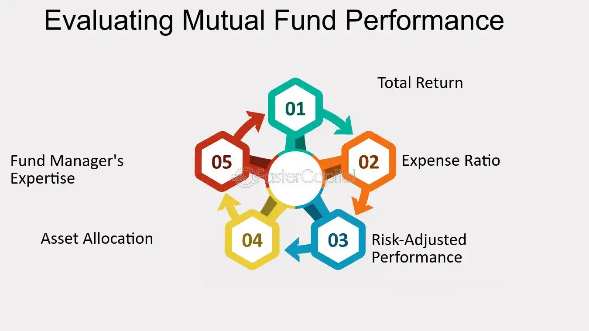

## Table of Contents

## What is a mutual fund?

A mutual fund is a type of investment where many people put their money together to buy a variety of stocks, bonds, or other assets. It's like a big basket where everyone's money is mixed and managed by a professional. This makes it easier for people to invest in a diverse range of things without having to pick each one themselves.

When you invest in a mutual fund, you buy shares of the fund. The value of your shares goes up or down based on how well the investments in the fund are doing. This can be a good way to grow your money over time, but it also comes with risks because the value can go down as well as up. Mutual funds are popular because they offer a simple way to invest in a broad range of assets, which can help spread out the risk.

## Why is it important to evaluate mutual fund performance?

Evaluating mutual fund performance is important because it helps you see if your investment is doing well or not. When you put your money into a mutual fund, you want to know if it's growing or if it's losing value. By looking at how the fund has performed over time, you can decide if you should keep your money in it or move it to a different fund that might do better.

It's also helpful to compare a mutual fund's performance with other funds or with a benchmark like the stock market. This can show you if the fund is doing better or worse than others. Knowing this can guide you in making smarter choices about where to invest your money. Regularly checking a fund's performance helps you stay on top of your investments and make changes if needed to reach your financial goals.

## What are the basic metrics used to evaluate mutual fund performance?

When you want to see how a mutual fund is doing, you look at some basic numbers called metrics. One important metric is the fund's total return, which shows how much the fund has grown or shrunk over a certain time. This can be over a year, or even longer periods like five or ten years. Another key metric is the fund's expense ratio, which tells you how much of your money goes to pay for running the fund. Lower expense ratios are generally better because they mean more of your money stays invested.

Another useful metric is the fund's alpha, which measures how well the fund has done compared to what you would expect from the market. A positive alpha means the fund did better than expected, while a negative alpha means it did worse. The beta of a fund shows how much it moves with the market. A high beta means the fund goes up and down a lot with the market, while a low beta means it's more stable. Lastly, the Sharpe ratio helps you understand how much return you're getting for the risk you're taking. A higher Sharpe ratio means you're getting more return for the risk involved.

These metrics give you a good picture of how a mutual fund is performing. By looking at them, you can decide if the fund is a good choice for your money. It's like checking the health of your investment to make sure it's helping you reach your financial goals.

## How does the Sharpe Ratio help in evaluating mutual funds?

The Sharpe Ratio is a helpful tool for checking how well a mutual fund is doing. It looks at how much return you're getting from the fund compared to the risk you're taking. The ratio is calculated by taking the fund's return, subtracting the risk-free rate (like what you'd get from a safe investment like a government bond), and then dividing that by the fund's standard deviation, which is a measure of how much the fund's returns bounce around. A higher Sharpe Ratio means you're getting more return for the risk you're taking, which is good.

When you're choosing between different mutual funds, the Sharpe Ratio can help you see which one is doing a better job at managing risk and reward. If one fund has a higher Sharpe Ratio than another, it means that fund is giving you more bang for your buck in terms of risk-adjusted returns. This makes it easier to pick a fund that not only grows your money but does so in a way that's mindful of the ups and downs you might face along the way.

## What is the significance of the Alpha in mutual fund analysis?

Alpha is a number that tells you how well a mutual fund is doing compared to what you would expect it to do. If a fund has a positive alpha, it means the fund is doing better than expected. If it has a negative alpha, it means the fund is doing worse than expected. This is important because it shows if the people managing the fund are making smart choices with your money.

When you're looking at different mutual funds, alpha can help you decide which one to choose. If one fund has a higher alpha than another, it might be a better choice because it's doing a better job at beating the market. This can help you pick a fund that could give you better returns over time.

## How can the Beta of a mutual fund influence investment decisions?

The Beta of a mutual fund tells you how much the fund moves up and down with the market. If a fund has a high Beta, it means it goes up a lot when the market goes up, but it also goes down a lot when the market goes down. A low Beta means the fund doesn't move as much as the market, so it's more stable. Knowing the Beta can help you decide if you want a fund that's more exciting with bigger ups and downs, or one that's more steady and calm.

When you're choosing a mutual fund, thinking about the Beta can help you match it to your comfort with risk. If you don't like big swings in your money, you might pick a fund with a low Beta. But if you're okay with more risk and want the chance for bigger gains, a fund with a high Beta might be right for you. By looking at the Beta, you can make a choice that fits how you feel about risk and what you want from your investment.

## What role does the Standard Deviation play in assessing mutual fund risk?

Standard Deviation is a way to measure how much a mutual fund's returns go up and down over time. It tells you how much risk you're taking with your investment. If a fund has a high standard deviation, it means the returns can change a lot, going up and down by big amounts. This means the fund is riskier. On the other hand, if a fund has a low standard deviation, the returns don't change as much, so the fund is less risky.

When you're deciding which mutual fund to invest in, looking at the standard deviation can help you understand the risk involved. If you don't like surprises and want your money to grow steadily, you might choose a fund with a lower standard deviation. But if you're okay with bigger ups and downs and want the chance for bigger gains, you might go for a fund with a higher standard deviation. By knowing the standard deviation, you can pick a fund that matches how much risk you're comfortable with.

## How do you interpret the R-squared value in mutual fund performance?

The R-squared value in mutual fund performance tells you how much of the fund's movements can be explained by the movements of a benchmark, like the stock market. It's a number between 0 and 100. If a fund has a high R-squared value, it means the fund's performance is closely tied to the benchmark. For example, if the R-squared is 90, it means 90% of the fund's ups and downs can be explained by the benchmark's ups and downs. A low R-squared value, like 20, means the fund's performance is not closely tied to the benchmark, and other factors are more important in explaining its movements.

When you're looking at a mutual fund, the R-squared value can help you understand how much the fund's performance depends on the overall market. If you see a high R-squared, it means the fund will likely go up and down with the market. This can be good if you want to invest in something that follows the market closely. But if you want a fund that might do well even when the market is not doing great, you might look for a fund with a lower R-squared. This way, you can pick a fund that fits your investment goals and how much you want your investment to be tied to the market's performance.

## What are some advanced metrics beyond the basics for evaluating mutual funds?

When you want to dive deeper into how a mutual fund is doing, you can look at some advanced metrics like the Treynor Ratio and the Information Ratio. The Treynor Ratio is similar to the Sharpe Ratio but it uses the fund's beta instead of standard deviation to measure risk. It helps you see how well a fund is doing for the risk it's taking, but it focuses on market risk. A higher Treynor Ratio means the fund is giving you more return for the market risk you're taking. The Information Ratio looks at how much a fund's returns are beating its benchmark, divided by how much those returns bounce around compared to the benchmark. A higher Information Ratio means the fund is doing a good job of beating the benchmark consistently.

Another useful metric is the Sortino Ratio, which is like the Sharpe Ratio but only looks at the bad risk, or downside risk. It measures how well a fund is doing by looking at the return you're getting for the risk of losing money. A higher Sortino Ratio means the fund is doing well at giving you returns without taking on too much risk of losing money. Lastly, the Tracking Error shows how much a fund's returns differ from its benchmark. A lower tracking error means the fund is sticking closely to the benchmark, which can be good if you want a fund that moves with the market. But if you're looking for a fund that might do better than the market, you might want a higher tracking error. These advanced metrics give you a more detailed look at how a mutual fund is performing and help you make smarter choices about where to put your money.

## How does peer group comparison aid in evaluating mutual fund performance?

Peer group comparison helps you see how a mutual fund is doing compared to other similar funds. When you look at a fund's performance, it's not enough to just see if it's going up or down. You also want to know if it's doing better or worse than other funds that are trying to do the same thing. By comparing a fund to its peers, you can tell if it's a top performer or if it's lagging behind. This can guide you in deciding if you should keep your money in that fund or move it to a different one that's doing better.

For example, if you have a fund that focuses on technology stocks, you would compare it to other funds that also invest in tech stocks. If your fund is growing faster than most of the other tech funds, that's a good sign. But if it's growing slower, you might want to think about switching to a fund that's doing better. Peer group comparison gives you a clearer picture of how well your fund is doing in its specific area, helping you make smarter choices about your investments.

## What are the limitations of using historical performance data to predict future mutual fund returns?

Using past performance to guess how a mutual fund will do in the future can be tricky. Just because a fund did well last year doesn't mean it will do well next year. The market changes all the time because of things like new laws, big world events, or changes in what people want to buy. These things can make a fund that was doing great suddenly struggle. So, if you only look at what happened before, you might miss out on these important changes that could affect the fund's future.

Another problem is that past performance might not show all the risks a fund could face. A fund might have done well because it took big risks that paid off, but those same risks could lead to big losses later on. Also, the people running the fund might change, or the fund's strategy might shift, which can change how it performs. So, while looking at how a fund did in the past can give you some ideas, it's not a sure way to know what will happen next. It's always a good idea to look at other things too, like the fund's fees, how it's managed, and what's happening in the world, before making your choice.

## How can an investor use a combination of qualitative and quantitative factors to make informed decisions about mutual fund investments?

When choosing a mutual fund, an investor can look at both numbers and other important details to make a smart choice. The numbers, or quantitative factors, include things like the fund's returns, how much risk it takes, and the fees it charges. By looking at these, an investor can see if the fund has been doing well, how much it might go up or down, and how much of their money will go to paying for the fund's management. Metrics like the Sharpe Ratio, Alpha, and Beta can help understand how the fund's performance stacks up against the market and other funds. But numbers alone aren't enough. An investor should also consider qualitative factors, like who is managing the fund and what their strategy is. Knowing if the managers have a good track record and if their approach matches the investor's goals can be just as important as the numbers.

Combining these two types of information gives a fuller picture of the mutual fund. For example, a fund might have great numbers, but if the managers are new or the strategy is risky, it might not be the best choice for someone who wants a safe investment. On the other hand, a fund with steady but not spectacular returns might be a good pick if the managers are experienced and the strategy is solid. By looking at both the hard data and the softer details, an investor can make a more informed decision that fits their own needs and comfort with risk. This way, they can pick a fund that not only looks good on paper but also feels right for their investment goals.

## How do you evaluate mutual fund performance?

Evaluating mutual fund performance involves assessing various aspects that signal how well a fund meets an investor's specific financial objectives. The evaluation process begins by classifying the investment style of the mutual fund. Investment styles can range from conservative income strategies focusing on bonds to aggressive growth strategies emphasizing equities. Aligning a fund's investment approach with your personal financial goals and risk tolerance is critical for ensuring satisfactory performance outcomes.

Historical performance metrics, such as annual returns, provide a comparative basis for assessing mutual funds. Investors often analyze these returns over multiple periods — such as 1-year, 3-year, and 5-year performances — to gauge consistency and long-term viability. However, it's important to not rely solely on past performance as an indicator of future success.

Risk-adjusted performance measures play a crucial role in understanding a mutual fund's efficiency in delivering returns relative to the risk it incurs. Two key metrics in this regard are alpha and beta:

1. **Alpha** ($\alpha$) represents the excess return of an investment relative to the return of a benchmark index. A positive alpha indicates that the fund has performed better than the index, while a negative alpha suggests underperformance. Alpha can be calculated using the formula:
$$
   \alpha = R_i - (R_f + \beta \times (R_m - R_f))

$$

   where $R_i$ is the fund's return, $R_f$ is the risk-free rate, $\beta$ is the beta of the fund, and $R_m$ is the market return.

2. **Beta** ($\beta$) measures the volatility of a mutual fund relative to the market. A beta of one indicates that the fund's price will move with the market. A beta greater than one indicates greater volatility than the market, suggesting higher risk and potentially higher returns. Conversely, a beta less than one indicates less volatility. Calculating beta typically involves regression analysis based on historical price data:
$$
   \beta = \frac{\text{Cov}(R_i, R_m)}{\text{Var}(R_m)}

$$

   where $\text{Cov}(R_i, R_m)$ is the covariance between the fund's returns and the market returns, and $\text{Var}(R_m)$ is the variance of market returns.

Analyzing these metrics helps investors to assess whether a mutual fund efficiently translates its risk into returns. Choosing the right funds involves balancing the risk-adjusted returns against the investor's objectives and risk appetite, ensuring a tailored approach to portfolio management.

## What are the fees, costs, and returns?

Expense ratios and management fees are crucial aspects when evaluating mutual fund performance, as they have a direct impact on the net returns realized by investors. The expense ratio is a measure that encompasses a mutual fund’s annual operating expenses expressed as a percentage of the average value of an investor's assets. A higher expense ratio means more of an investor's money goes towards covering these costs, rather than generating returns. Management fees, as a component of the expense ratio, account for the cost of professional investment management. Over time, even small differences in these fees can significantly impact an investor's gains due to the compounding effect.

In contrast, [algorithmic trading](/wiki/algorithmic-trading) introduces a different set of financial considerations. While it reduces reliance on human intervention, which can enhance efficiency and reduce errors, it incurs costs related to technology, such as the development and maintenance of trading algorithms, as well as data acquisition. High-quality data, which is essential for effective algorithmic trading, often comes at a premium. These costs can be substantial but are justified by the potential to execute trades with [high frequency](/wiki/high-frequency-trading) and precision, thus optimizing the investment strategy and maximizing returns on short-term market opportunities.

When evaluating any investment approach, it is crucial to weigh these costs against expected returns to make informed decisions. This involves analyzing whether the reduced human error and high-speed execution of algo trading outweigh the technological costs, and comparing this with the traditional model of diversified and professionally managed mutual funds subject to expense ratios and management fees.

Python can be utilized to model investment scenarios and compare the impact of different fee structures on returns. For mutual funds, considering an initial investment $P$, an average annual return rate $r$, and an expense ratio $e$, the net value after $n$ years can be approximated as:

$$
V = P \times (1 + r - e)^n
$$

For algorithmic trading, calculating potential net returns involves evaluating both the expected return rate and additional technological costs, using similar formulas encapsulating the unique cost profile relevant to these strategies.

Ultimately, a comprehensive understanding of these investment costs and their implications on potential returns is critical for investors aiming to maximize their portfolios’ performance. Balancing different investment vehicles and strategies based on individual goals and risk tolerance is essential to achieving favorable financial outcomes.

## References & Further Reading

[1]: Bergstra, J., Bardenet, R., Bengio, Y., & Kégl, B. (2011). ["Algorithms for Hyper-Parameter Optimization."](https://dl.acm.org/doi/10.5555/2986459.2986743) Advances in Neural Information Processing Systems 24.

[2]: ["Advances in Financial Machine Learning"](https://www.amazon.com/Advances-Financial-Machine-Learning-Marcos/dp/1119482089) by Marcos Lopez de Prado

[3]: ["Evidence-Based Technical Analysis: Applying the Scientific Method and Statistical Inference to Trading Signals"](https://www.amazon.com/Evidence-Based-Technical-Analysis-Scientific-Statistical/dp/0470008741) by David Aronson

[4]: ["Machine Learning for Algorithmic Trading"](https://github.com/stefan-jansen/machine-learning-for-trading) by Stefan Jansen

[5]: ["Quantitative Trading: How to Build Your Own Algorithmic Trading Business"](https://github.com/LucindaYa/quant-resources/blob/master/Quantitative%20Trading%20How%20to%20Build%20Your%20Own%20Algorithmic%20Trading%20Business.pdf) by Ernest P. Chan