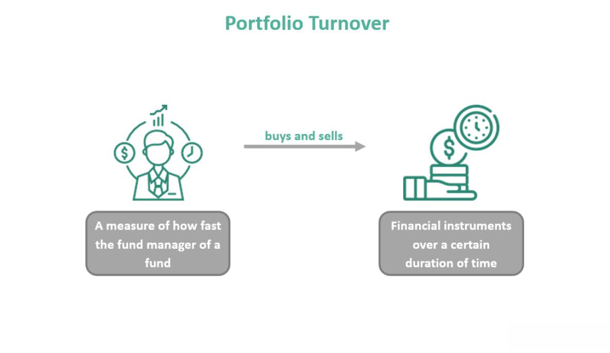

Investing encompasses a diverse spectrum of opportunities and challenges, each presenting unique implications for investors. Central to navigating this landscape are the concepts of investment strategies, portfolio turnover, mutual fund evaluation, and algorithmic trading. These elements are pivotal in shaping the decisions investors make, as well as the dynamics of financial markets.

Investment strategies serve as a blueprint for structuring portfolios, addressing questions of asset allocation, risk tolerance, and expected returns. Within this context, the distinction between active and passive management becomes crucial, where active strategies involve frequent trading to exploit market inefficiencies, and passive strategies aim to mimic market indices. Both approaches are influenced by prevailing market conditions, which can dictate the feasibility and expected outcomes of different strategies.

Portfolio turnover, a measurement of how frequently assets within a portfolio are bought and sold, plays a significant role in the overall cost and tax implications of investing. A high turnover rate might suggest an aggressive trading strategy, potentially leading to higher transaction costs and tax liabilities, while a low turnover could imply a more stable, long-term approach. The turnover rate, therefore, has a profound impact on the net performance of an investment portfolio.

Evaluating mutual funds, too, necessitates understanding the implications of portfolio turnover. Investors often scrutinize funds based on turnover rates, as they affect both performance and cost structures. High turnover funds might incur higher expenses, thereby impacting overall returns, while lower turnover funds could be more cost-efficient. As such, turnover rates are often indicative of the effectiveness of fund management.

Algorithmic trading introduces a technological dimension to investing, bringing speed and efficiency to executing trades. Algorithms can significantly influence portfolio turnover by facilitating rapid transactions, often aiming to capitalize on minute market movements. This approach enhances the ability to manage transaction costs and addresses scalability issues, making it a vital tool for institutional and individual investors alike.

In summary, understanding how investment strategies, portfolio turnover, mutual fund evaluation, and algorithmic trading intersect is vital for optimizing investment outcomes and enhancing management efficiency. This article aims to dissect these interconnected elements, offering insights that can improve decision-making and success in the financial markets.

## Table of Contents

## Investment Strategies in Focus

Investment strategies dictate the structuring of portfolios and are crucial in shaping the investment landscape. Investors often choose between active and passive management, each having distinct characteristics and implications.

**Active vs. Passive Management**

Active management involves frequent trading and aims to outperform specific market benchmarks. Active managers conduct in-depth research, analyze market trends, and make tactical investment decisions to capitalize on short-term price movements. This strategy is labor-intensive and incurs higher fees and transaction costs due to the frequent buying and selling of securities. However, if successful, active management can potentially provide higher returns, especially in volatile markets or sectors where inefficiencies exist.

In contrast, passive management aims to replicate the performance of a market index, such as the S&P 500 or the NASDAQ. This approach relies on long-term market growth and involves minimal trading, which results in lower management fees and reduced transaction costs. Passive strategies assume that markets are mostly efficient, meaning security prices reflect all available information. Therefore, passive management may suit investors who prefer steady, long-term growth with lower risk and reduced costs.

**Impact of Market Conditions on Strategy Choices**

Market conditions significantly impact the choice between active and passive management. In a bull market, where prices are rising, passive investing tends to yield favorable results due to widespread market gains. Conversely, active management may be advantageous in a bear market or during periods of high [volatility](/wiki/volatility-trading-strategies), as skilled managers can selectively invest in undervalued securities or defensive sectors to mitigate losses.

For instance, during an economic downturn, active managers might focus on sectors historically resilient to economic pressures, like utilities or consumer staples. Conversely, during stable growth periods, passive investors enjoy broad-based gains typical of rising indices.

**Growth vs. Value Investing Approaches**

An additional consideration for structuring portfolios involves choosing between growth and value investing. Growth investing focuses on companies expected to grow at an above-average rate compared to their industry or the overall market. Investors anticipate that the rapid growth of these companies will lead to significant capital appreciation, making them attractive despite typically higher valuations. These companies often reinvest earnings to fuel growth, thus providing potentially high returns but also higher risk.

Value investing, on the other hand, involves selecting stocks that are undervalued by the market. Value investors look for companies with sound fundamentals that are trading below their intrinsic values, often measured by metrics like the price-to-earnings (P/E) ratio. The rationale is that the market will eventually recognize the company’s true value, leading to price appreciation. This approach tends to be less risky compared to growth investing and may provide steadier returns over time.

In summary, the choice of investment strategy—whether it is an active or passive management approach, or a preference for growth versus value stocks—must align with an investor's risk tolerance, financial goals, and market conditions. Each strategy offers unique benefits and challenges, influencing how portfolios are constructed and adjusted over time.

## Understanding Portfolio Turnover

Portfolio turnover is a key metric in the assessment of investment strategies and fund management. It represents the rate at which assets within a fund or portfolio are bought and sold over a specified period, typically measured annually. This turnover rate is expressed as a percentage and is a crucial [factor](/wiki/factor-investing) for investors to consider when evaluating the effectiveness and efficiency of various investment approaches.

### Definition and Calculation of Portfolio Turnover Rate

Portfolio turnover is calculated using the formula:

$$
\text{Portfolio Turnover Rate (\%)} = \left(\frac{\text{Total Purchases or Sales}}{\text{Average Monthly Assets}}\right) \times 100
$$

Here, "Total Purchases or Sales" refers to the lesser of the total purchase or sales value of assets within the period, while "Average Monthly Assets" represents the average net assets of the portfolio over the same duration.

### Implications of High vs. Low Turnover Rates for Investors

High portfolio turnover rates indicate frequent buying and selling within a portfolio. This can potentially lead to higher transaction costs due to brokerage fees and commissions, which can erode investment returns over time. Furthermore, frequent trading may trigger short-term capital gains, increasing tax liabilities for investors in taxable accounts.

Conversely, low turnover rates suggest a buy-and-hold strategy with less frequent trading. This generally results in lower transaction costs and may lead to a more tax-efficient investment strategy, as long-term capital gains are usually taxed at a lower rate than short-term gains. However, a low turnover approach may underperform in volatile markets if the portfolio is not responsive to significant market changes.

### The Impact of Turnover on Transaction Costs and Tax Liabilities

Transaction costs are direct consequences of portfolio turnover. High turnover naturally results in higher transaction fees, which can substantially impact net returns. For tax-conscious investors, especially in jurisdictions with significant taxation on investment gains, a high turnover can lead to increased tax liabilities, as gains from rapidly traded assets are often taxed more heavily.

Tax efficiency becomes a critical component in investment strategy, with lower turnover often being preferable for investors seeking long-term growth and lower tax burdens. This strategy aligns with capitalizing on lower tax rates for long-term gains and minimizes the impact of taxes on overall performance.

### Relationship Between Turnover and Investment Strategies Employed

Different investment strategies inherently imply varying turnover rates. Active management strategies, which aim to outperform market indices by frequently adjusting asset positions, tend to exhibit higher turnover. This can lead to greater transaction costs and tax implications but potentially offers higher returns if the manager successfully capitalizes on market inefficiencies.

In contrast, passive management strategies, like index funds, aim to replicate the performance of a specific index and typically involve lower turnover. These funds generally have lower transaction costs and tax impacts, which can contribute to higher net returns over time, though they may also offer minimal outperformance potential against the market indices they emulate.

Understanding these nuances of portfolio turnover helps investors align their investment strategies with their financial goals, optimizing for cost efficiency and tax planning.

## Mutual Fund Evaluation: The Role of Turnover

Portfolio turnover is a key factor in evaluating mutual fund performance and costs. The turnover rate, which measures how frequently assets within a fund are bought and sold by the fund managers, can significantly impact both the performance and the expenses associated with mutual funds.

### Influence on Mutual Fund Performance and Costs

A high portfolio turnover rate might indicate an active trading strategy. This can lead to increased transaction costs and possibly higher tax liabilities due to capital gains being realized more frequently. These additional costs can eat into the fund's returns, potentially diminishing performance over time. Conversely, a lower portfolio turnover rate often suggests a more passive investment strategy which might involve lower transaction costs and more favorable tax considerations. Hence, understanding the turnover characteristics of a mutual fund is integral to comprehending its potential risk-reward profile.

### High Turnover vs. Low Turnover Funds

Mutual funds with high turnover rates may pursue strategies designed to exploit short-term market movements, aiming for quick gains. While this can result in higher returns under favorable market conditions, it also exposes investors to greater transaction costs and potential tax repercussions from frequent trading. For instance, U.S. capital gains tax rules can significantly reduce the net returns from such funds.

On the other hand, funds with low portfolio turnover rates tend to focus on long-term investment strategies. These funds typically incur lower transaction costs and have the advantage of deferring capital gains taxes, which can enhance after-tax performance. This can be particularly beneficial for investors in higher tax brackets seeking more tax-efficient investment solutions.

### Assessing Fund Management Effectiveness

The turnover rate serves as an indicator of a fund's management effectiveness. High turnover may reflect a manager's attempt to adjust the fund's portfolio in response to changing market conditions. However, it could also suggest inefficiencies or a lack of a cohesive strategy. Evaluating whether the higher turnover rate leads to proportionate returns is critical.

For investors, analyzing turnover rates in conjunction with other performance metrics such as the fund's alpha, beta, and expense ratio can provide a comprehensive view of the fund's management efficiency. Essentially, a well-managed fund should demonstrate that its turnover strategies align with its stated investment objectives and result in value creation for investors.

By carefully considering turnover rates, investors can better understand the underlying strategies of mutual funds and make more informed decisions that align with their investment goals. Understanding whether a fund's costs are justified by its turnover strategy is essential for long-term portfolio management success.

## Algorithmic Trading: An Overview

Algorithmic trading, often known as algo trading, is a method of executing orders using automated and pre-programmed trading instructions, accounting for variables such as time, price, and [volume](/wiki/volume-trading-strategy). Primarily, it relies on complex algorithms and mathematical models to make quick, informed trading decisions, often within fractions of a second. This technology drives a substantial portion of the transactions in modern financial markets, altering how trading is conducted.

### Benefits of Algorithmic Trading

1. **Speed and Efficiency:** Algorithms can analyze vast amounts of data and execute orders at speeds unattainable by human traders. This allows market participants to capitalize on fleeting opportunities, enhancing the potential for profit.

2. **Reduction in Transaction Costs:** By optimizing trade execution, algorithms can minimize market impact and reduce explicit transaction costs. These cost savings can significantly boost investment performance, particularly for large-volume traders.

3. **Elimination of Human Error:** Automated systems ensure consistent execution based on pre-determined criteria, reducing the influence of human emotions such as fear and greed, which can lead to suboptimal trading decisions.

4. **Backtesting and Strategizing:** Algorithms can be tested using historical data to evaluate their potential performance, allowing traders to refine strategies before implementing them in live markets.

### Influence on Portfolio Turnover

Algorithmic trading also influences portfolio turnover, which refers to the frequency with which securities are bought and sold within a portfolio over a specific period. High-frequency trading ([HFT](/wiki/high-frequency-trading-strategies)), a subset of [algorithmic trading](/wiki/algorithmic-trading), inherently leads to high portfolio turnover as it involves rapid buying and selling to exploit minute price inefficiencies. Conversely, algorithms can be programmed for longer-term strategies that result in lower turnover by triggering trades based on macroeconomic indicators or price patterns.

### Managing Transaction Costs and Scalability

Algorithmic trading's efficiency extends to managing transaction costs and scalability. Algorithms can distribute large orders into smaller ones to minimize market impact and slippage, thereby reducing the average price paid for securities. This process, known as "execution algorithms", is crucial for institutional investors who need to manage substantial positions without disrupting market equilibrium.

From a scalability perspective, algorithms enable traders to handle more securities and complex strategies without proportionately increasing human resource requirements. This capability is vital for large funds aiming to deploy resources across diverse markets and asset classes efficiently. Furthermore, algorithms can quickly adapt to market conditions, dynamically adjusting strategies to optimize execution, which benefits both portfolios with frequent trading and those employing more of a buy-and-hold approach.

In conclusion, algorithmic trading represents a convergence of technology and finance, providing speed, precision, and cost-efficiency. Its role in shaping portfolio turnover and transaction cost management underscores its importance in contemporary investment practices. Understanding and leveraging these benefits can significantly enhance portfolio performance.

## Integrating Turnover Ratios and Algorithmic Strategies

Integrating turnover ratios with algorithmic strategies is crucial for assessing their effectiveness in portfolio management. Turnover ratio, which calculates the frequency with which assets in a fund or portfolio are traded, is a key metric in evaluating the dynamism of algorithmic strategies. High turnover ratios often imply active trading strategies, potentially leading to increased transaction costs. Conversely, low turnover ratios indicate a more passive approach, which might align better with cost minimization objectives.

Assessing the cost efficiency and consistency of algorithmic strategies with investment goals involves a careful analysis of turnover ratios. Cost efficiency is crucial since high turnover can significantly erode returns due to transaction costs and potential tax liabilities. Algorithms capable of achieving a desirable turnover ratio, that balances trading activity with minimized costs, are often considered effective. Consistency with investment goals is evaluated by examining whether the turnover ratio reflects the underlying investment strategy – be it growth, value, or income-focused investing.

Real-world examples illustrate the impact of turnover on algorithmic trading. High-frequency trading (HFT) strategies, for instance, are characterized by exceedingly high turnover ratios, as trades are executed in fractions of a second. These strategies can be profitable if executed in low-cost trading environments where the bid-ask spreads and transaction costs are minimal. On the contrary, strategies employing [machine learning](/wiki/machine-learning) models for long-term trend analysis might exhibit lower turnover ratios. These algorithms analyze vast datasets to identify sustainable growth opportunities and align more closely with passive investing strategies, focusing on minimizing costs while achieving stable returns.

## Conclusion

In understanding the financial markets, the interplay between investment strategies, portfolio turnover, mutual fund performance, and algorithmic trading is crucial. Each of these elements brings unique contributions, which can influence investment outcomes significantly. Investment strategies serve as the blueprint for how portfolios are structured and adjusted, determining the potential risk and return characteristics. Active strategies may warrant higher portfolio turnover due to frequent trading, while passive strategies often result in lower turnover as they aim to replicate market indices.

Portfolio turnover, indicative of the frequency with which assets within a fund are bought and sold, directly impacts transaction costs and taxation, ultimately affecting net returns. High turnover often implies greater transaction costs and potential tax implications, whereas low turnover may suggest a more cost-efficient strategy. Therefore, evaluating the turnover rate is essential in assessing mutual fund performance since it provides insight into the fund's management effectiveness and suitability for an investor's objectives.

Algorithmic trading, with its efficiency and speed, has emerged as a powerful tool in modern-day investing. It facilitates optimal execution by managing transaction costs and leveraging scalability, influencing the turnover rates based on programmed strategies. Algorithms can be fine-tuned to execute specific strategies, thus aligning with investor objectives, whether that be maintaining low turnover for cost efficiency or capitalizing on market movements with higher turnover.

Informed decision-making is paramount to investment success. Investors must weigh these elements carefully, considering how different strategies and turnover rates align with their financial goals and risk tolerance. By understanding the nuances of these interactions, investors can make more strategic decisions, enhancing their potential for achieving desired financial outcomes. As financial markets evolve, so too should the strategies and tools investors utilize, making continuous education and adaptation critical components of effective portfolio management.

## References & Further Reading

[1]: Barber, B. M., & Odean, T. (2000). ["Trading is Hazardous to Your Wealth: The Common Stock Investment Performance of Individual Investors."](https://faculty.haas.berkeley.edu/odean/Papers%20current%20versions/Individual_Investor_Performance_Final.pdf) The Journal of Finance, 55(2), 773-806.

[2]: Bogle, J. C. (2017). ["The Little Book of Common Sense Investing: The Only Way to Guarantee Your Fair Share of Stock Market Returns."](https://www.amazon.com/Little-Book-Common-Sense-Investing/dp/1119404509) Wiley.

[3]: Carhart, M. M. (1997). ["On Persistence in Mutual Fund Performance."](https://onlinelibrary.wiley.com/doi/full/10.1111/j.1540-6261.1997.tb03808.x) The Journal of Finance, 52(1), 57-82.

[4]: Pástor, Ľ., Stambaugh, R. F., & Taylor, L. A. (2017). ["Do Funds Make More When They Trade More?"](https://www.nber.org/system/files/working_papers/w26549/w26549.pdf) The Journal of Finance, 72(4), 1483-1528.

[5]: Treynor, J. L. (1965). ["How to Rate Management of Investment Funds."](https://onlinelibrary.wiley.com/doi/10.1002/9781119196679.ch10) Harvard Business Review.

[6]: Hasbrouck, J. (2003). ["Intraday Price Formation in U.S. Equity Markets."](https://onlinelibrary.wiley.com/doi/10.1046/j.1540-6261.2003.00609.x) The Journal of Finance, 58(6), 2375–2400.

[7]: Byrne, A., & Utkus, S. P. (2013). ["Behavioral finance: Understanding how the mind can help or hinder investment success."](https://www.trendfollowing.com/wp-content/uploads/2017/10/behavior2.pdf) Vanguard Asset Management.