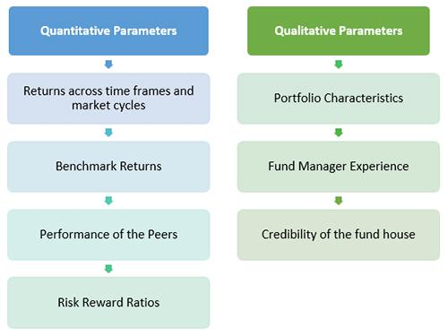

## Table of Contents

## What is portfolio turnover in mutual funds?

Portfolio turnover in mutual funds refers to how often the fund's investments are bought and sold within a year. It is shown as a percentage and tells you how active the fund manager is in changing the fund's holdings. A high turnover rate means the manager is trading a lot, while a low turnover rate means the manager is holding onto the investments for longer periods.

A high turnover rate can lead to higher costs for the fund because each trade can come with transaction fees and taxes. These costs can reduce the overall return for investors. On the other hand, a low turnover rate might mean lower costs, but it could also mean the fund is not taking advantage of new investment opportunities as quickly. When choosing a mutual fund, it's important to consider the turnover rate along with other factors to see if it fits your investment goals.

## Why is portfolio turnover important when evaluating mutual funds?

Portfolio turnover is important when evaluating mutual funds because it shows how often the fund manager is buying and selling investments. A high turnover rate means the manager is trading a lot, which can lead to higher costs for the fund. These costs come from transaction fees and taxes that happen every time the manager makes a trade. If the costs are high, they can eat into the returns that investors get from the fund. So, a high turnover rate might mean lower returns for you, even if the fund's investments are doing well.

On the other hand, a low turnover rate means the manager is holding onto the investments for longer periods. This can lead to lower costs because there are fewer trades happening. Lower costs can help increase the returns for investors. But, a low turnover rate might also mean the fund is not taking advantage of new investment opportunities as quickly as it could. When you're looking at mutual funds, it's good to think about the turnover rate along with other things like the fund's performance and fees to see if it's a good fit for your investment goals.

## How is portfolio turnover calculated?

Portfolio turnover is calculated by taking the smaller of the total value of new securities purchased or the total value of securities sold during a year, and then dividing that number by the average monthly net asset value of the fund. The result is then multiplied by 100 to get a percentage. This percentage tells you how much of the fund's holdings were changed over the year.

For example, if a fund bought securities worth $100 million and sold securities worth $80 million in a year, and the average monthly net asset value of the fund was $500 million, the portfolio turnover would be calculated using the smaller of the two amounts, which is $80 million. So, you would divide $80 million by $500 million, which gives you 0.16. Multiply that by 100, and you get a portfolio turnover rate of 16%. This means 16% of the fund's holdings were turned over during the year.

## What is considered a high or low portfolio turnover rate?

A high portfolio turnover rate is usually considered to be anything above 100%. This means the fund manager is buying and selling the entire value of the fund's holdings at least once a year. A high turnover rate can lead to higher costs because each trade can have fees and taxes. These costs can make the fund's returns lower for investors. Funds with high turnover rates are often more actively managed, meaning the manager is always looking for new investment opportunities.

A low portfolio turnover rate is generally considered to be below 30%. This means the fund manager is not trading very often and is holding onto the investments for longer periods. A low turnover rate can lead to lower costs because there are fewer trades happening. This can help increase the returns for investors. Funds with low turnover rates are often more passively managed, meaning they follow a certain index or strategy without making many changes. When you're looking at mutual funds, it's good to think about the turnover rate to see if it fits your investment goals.

## How does portfolio turnover impact the performance of a mutual fund?

Portfolio turnover can affect how well a mutual fund does. When a fund has a high turnover rate, it means the manager is buying and selling a lot of investments. This can lead to higher costs because every trade comes with fees and taxes. These costs can take away from the money the fund makes, so even if the investments are doing well, the returns for investors might be lower. High turnover can also mean the fund is trying to take advantage of short-term market changes, which might work out well or might not.

On the other hand, a low turnover rate means the manager is not trading very often and is holding onto investments for a longer time. This can lead to lower costs because there are fewer trades happening. With lower costs, the returns for investors can be higher. But, a low turnover rate might also mean the fund is missing out on new investment opportunities. So, when you're looking at a mutual fund, it's good to think about the turnover rate to see if it fits what you want from your investments.

## What are the tax implications of high portfolio turnover?

High portfolio turnover can lead to more taxes for investors. When a fund manager buys and sells a lot of investments, it can create capital gains. These are profits made from selling investments for more than what they cost. If these gains are short-term, meaning the investments were held for less than a year, they are taxed at a higher rate than long-term gains. So, if you own shares in a mutual fund with high turnover, you might have to pay more in taxes on these short-term gains.

On the other hand, funds with low turnover hold onto their investments longer, which can lead to fewer taxable events. When investments are sold after being held for more than a year, the gains are considered long-term and are taxed at a lower rate. This can mean less tax for you to pay. So, when [picking](/wiki/asset-class-picking) a mutual fund, thinking about the turnover rate can help you understand how it might affect your taxes.

## How does portfolio turnover affect transaction costs and expenses?

When a mutual fund has a high portfolio turnover, it means the fund manager is buying and selling a lot of investments. Each time they trade, there are costs involved, like transaction fees and commissions. These costs add up and can make the overall expenses of the fund higher. So, if a fund has a high turnover rate, it might end up with more expenses, which can lower the returns for investors.

On the other hand, a fund with a low portfolio turnover rate means the manager is not trading very often. When there are fewer trades, there are also fewer transaction costs. This can keep the fund's expenses lower. With lower expenses, the returns for investors can be higher because more of the fund's earnings stay with the investors instead of going to cover costs.

## Can portfolio turnover indicate the investment strategy of a mutual fund?

Portfolio turnover can tell you a lot about the investment strategy of a mutual fund. If a fund has a high turnover rate, it means the manager is buying and selling investments a lot. This usually means the fund is actively managed. The manager is trying to beat the market by finding new investments all the time. They might be looking for short-term gains or reacting quickly to changes in the market.

On the other hand, if a fund has a low turnover rate, it means the manager is not trading very often. This often means the fund is more passively managed. The manager might be following a certain index or strategy and not making many changes. They are more likely to hold onto investments for a longer time, trying to get long-term gains instead of quick profits. So, by looking at the turnover rate, you can get an idea of whether the fund is trying to be active and beat the market or if it's taking a more laid-back approach.

## What are the potential risks associated with high portfolio turnover?

High portfolio turnover can lead to more costs for the fund. Every time the manager buys or sells something, there are fees and taxes to pay. These costs can add up and take away from the money the fund makes. So, even if the investments are doing well, the returns for investors might be lower because of these extra costs. It's like trying to run a race with weights on your feet; it makes it harder to get to the finish line.

Another risk is that high turnover might not always lead to better results. The manager might be trying to take advantage of short-term changes in the market, but this can be risky. If the manager makes the wrong choices, the fund could lose money. Plus, trying to time the market and make quick profits is hard to do well, and it might not work out as planned. So, while high turnover can sometimes lead to good returns, it also comes with a bigger chance of making mistakes and losing money.

## How can investors use portfolio turnover to compare different mutual funds?

Investors can use portfolio turnover to compare different mutual funds by looking at how often each fund's manager trades the investments. If one fund has a high turnover rate, like over 100%, it means the manager is buying and selling a lot. This can lead to higher costs because every trade has fees and taxes. On the other hand, if another fund has a low turnover rate, like under 30%, it means the manager is not trading very often. This can keep costs lower and might lead to better returns for investors. So, by comparing the turnover rates, investors can see which funds might have higher or lower costs.

Another way to use portfolio turnover is to understand the investment strategy of the funds. A fund with a high turnover rate is often trying to beat the market by finding new investments all the time. This can be riskier because the manager might make wrong choices and lose money. But it can also lead to good returns if the manager gets it right. A fund with a low turnover rate is usually more laid-back, holding onto investments for a longer time and trying to get long-term gains. By looking at the turnover rates, investors can see if a fund fits their own investment goals and how much risk they are willing to take.

## What other factors should be considered alongside portfolio turnover when evaluating mutual funds?

When evaluating mutual funds, it's important to look at more than just the portfolio turnover rate. One key factor to consider is the fund's performance over time. This means looking at how well the fund has done in the past, not just last year but over several years. This can give you an idea of how the fund might do in the future. Another thing to think about is the fees and expenses of the fund. These can include management fees, administrative costs, and other charges that can take away from your returns. Lower fees can mean more money in your pocket, so it's good to compare these across different funds.

You should also think about the fund's investment objective and strategy. This tells you what the fund is trying to achieve and how it plans to do it. If the fund's goals match your own investment goals, it might be a good fit for you. Another important factor is the risk level of the fund. Some funds might be riskier because they invest in more volatile stocks or sectors. You need to think about how much risk you are willing to take and choose a fund that matches your comfort level. By considering all these factors along with the portfolio turnover rate, you can make a better decision about which mutual fund is right for you.

## How have trends in portfolio turnover rates evolved over time in the mutual fund industry?

Over the years, the mutual fund industry has seen changes in portfolio turnover rates. In the past, many funds had higher turnover rates because managers were often trying to beat the market by trading a lot. This was especially true in the 1990s and early 2000s when the market was very active, and managers thought they could make quick profits by buying and selling stocks often. But, this led to higher costs for the funds and sometimes lower returns for investors.

More recently, there has been a shift towards lower turnover rates in the mutual fund industry. This change started around the late 2000s and has continued to grow. Many investors and fund managers now prefer a more passive approach, where they hold onto investments for longer periods. This is because lower turnover can lead to lower costs and better long-term returns. Also, the rise of index funds and ETFs, which have lower turnover rates by design, has played a big role in this trend. So, while high turnover rates were once common, the industry is now moving towards a strategy that involves less trading and more long-term investing.

## What is Understanding Portfolio Turnover?

Portfolio turnover is a key metric in the assessment of investment strategies and fund management. It represents the rate at which assets within a fund or portfolio are bought and sold over a specified period, typically measured annually. This turnover rate is expressed as a percentage and is a crucial [factor](/wiki/factor-investing) for investors to consider when evaluating the effectiveness and efficiency of various investment approaches.

### Definition and Calculation of Portfolio Turnover Rate

Portfolio turnover is calculated using the formula:

$$
\text{Portfolio Turnover Rate (\%)} = \left(\frac{\text{Total Purchases or Sales}}{\text{Average Monthly Assets}}\right) \times 100
$$

Here, "Total Purchases or Sales" refers to the lesser of the total purchase or sales value of assets within the period, while "Average Monthly Assets" represents the average net assets of the portfolio over the same duration.

### Implications of High vs. Low Turnover Rates for Investors

High portfolio turnover rates indicate frequent buying and selling within a portfolio. This can potentially lead to higher transaction costs due to brokerage fees and commissions, which can erode investment returns over time. Furthermore, frequent trading may trigger short-term capital gains, increasing tax liabilities for investors in taxable accounts.

Conversely, low turnover rates suggest a buy-and-hold strategy with less frequent trading. This generally results in lower transaction costs and may lead to a more tax-efficient investment strategy, as long-term capital gains are usually taxed at a lower rate than short-term gains. However, a low turnover approach may underperform in volatile markets if the portfolio is not responsive to significant market changes.

### The Impact of Turnover on Transaction Costs and Tax Liabilities

Transaction costs are direct consequences of portfolio turnover. High turnover naturally results in higher transaction fees, which can substantially impact net returns. For tax-conscious investors, especially in jurisdictions with significant taxation on investment gains, a high turnover can lead to increased tax liabilities, as gains from rapidly traded assets are often taxed more heavily.

Tax efficiency becomes a critical component in investment strategy, with lower turnover often being preferable for investors seeking long-term growth and lower tax burdens. This strategy aligns with capitalizing on lower tax rates for long-term gains and minimizes the impact of taxes on overall performance.

### Relationship Between Turnover and Investment Strategies Employed

Different investment strategies inherently imply varying turnover rates. Active management strategies, which aim to outperform market indices by frequently adjusting asset positions, tend to exhibit higher turnover. This can lead to greater transaction costs and tax implications but potentially offers higher returns if the manager successfully capitalizes on market inefficiencies.

In contrast, passive management strategies, like index funds, aim to replicate the performance of a specific index and typically involve lower turnover. These funds generally have lower transaction costs and tax impacts, which can contribute to higher net returns over time, though they may also offer minimal outperformance potential against the market indices they emulate.

Understanding these nuances of portfolio turnover helps investors align their investment strategies with their financial goals, optimizing for cost efficiency and tax planning.

## References & Further Reading

[1]: Barber, B. M., & Odean, T. (2000). ["Trading is Hazardous to Your Wealth: The Common Stock Investment Performance of Individual Investors."](https://faculty.haas.berkeley.edu/odean/Papers%20current%20versions/Individual_Investor_Performance_Final.pdf) The Journal of Finance, 55(2), 773-806.

[2]: Bogle, J. C. (2017). ["The Little Book of Common Sense Investing: The Only Way to Guarantee Your Fair Share of Stock Market Returns."](https://www.amazon.com/Little-Book-Common-Sense-Investing/dp/1119404509) Wiley.

[3]: Carhart, M. M. (1997). ["On Persistence in Mutual Fund Performance."](https://onlinelibrary.wiley.com/doi/full/10.1111/j.1540-6261.1997.tb03808.x) The Journal of Finance, 52(1), 57-82.

[4]: Pástor, Ľ., Stambaugh, R. F., & Taylor, L. A. (2017). ["Do Funds Make More When They Trade More?"](https://www.nber.org/system/files/working_papers/w26549/w26549.pdf) The Journal of Finance, 72(4), 1483-1528.

[5]: Treynor, J. L. (1965). ["How to Rate Management of Investment Funds."](https://onlinelibrary.wiley.com/doi/10.1002/9781119196679.ch10) Harvard Business Review.

[6]: Hasbrouck, J. (2003). ["Intraday Price Formation in U.S. Equity Markets."](https://onlinelibrary.wiley.com/doi/10.1046/j.1540-6261.2003.00609.x) The Journal of Finance, 58(6), 2375–2400.

[7]: Byrne, A., & Utkus, S. P. (2013). ["Behavioral finance: Understanding how the mind can help or hinder investment success."](https://www.trendfollowing.com/wp-content/uploads/2017/10/behavior2.pdf) Vanguard Asset Management.