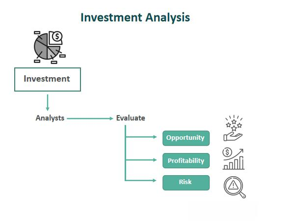

Gold has long been heralded as a steadfast investment, maintaining its allure through ages and economic cycles due to its capacity to provide stability amidst market volatility. As economies and financial systems fluctuate, gold emerges as a reliable anchor, preserving value and offering investors a hedge against inflation and currency devaluation. This enduring appeal underpins the integration of gold into multifaceted investment strategies, which modern investors increasingly complement with the use of algorithmic trading.

This article examines the role of gold in investment strategy, old and new. By tracing historical trends and assessing current market dynamics, we provide a comprehensive overview of how gold serves both traditional strategies and modern, tech-driven approaches like algorithmic trading. As a transformative force in the financial markets, algorithmic trading employs precision and speed to significantly alter how investors engage with gold markets. This technology leverages data-driven techniques to optimize trade execution, reduce human error, and exploit market inefficiencies—features particularly advantageous in the volatile sphere of gold trading.



The potential of algorithmic trading to enhance investment returns is notable. Investors are equipped to make more informed decisions by integrating algorithmic strategies with gold investments, thereby maximizing returns while managing risk. As investors navigate the complexities of the financial landscape, this strategic blend of gold and algorithmic trading offers a compelling pathway to bolster portfolio stability and achieve financial objectives.

Readers will gain insights into how this synergy can be harnessed to optimize returns. By marrying the traditional stability of gold with the innovative edge of algorithmic trading, investors can unlock new avenues for portfolio diversification and financial growth. Through understanding the evolving role of gold alongside technological advancements, individuals and institutions alike can refine their approach to investment in a rapidly changing world.

## Table of Contents

## Understanding Gold as an Investment

Gold is often viewed as a robust hedge against inflation and currency devaluation, which underscores its enduring appeal as a component of diversified portfolios. Its intrinsic value and historical acceptance as a medium of exchange contribute to its appeal as a safeguard against economic uncertainty. During periods of inflation, when the purchasing power of currency declines, gold tends to retain its value or even appreciate, thereby protecting investors' wealth. Similarly, gold acts as a countermeasure against currency devaluation, which can occur due to economic mismanagement or geopolitical instability.

Investors have multiple avenues to acquire gold, ranging from physical forms such as bullion and coins to financial securities like Exchange Traded Funds (ETFs) and derivatives. Physical gold provides the benefit of direct ownership, which is reassuring for those seeking tangible assets. However, it also necessitates secure storage and insurance, contributing to additional costs. On the other hand, financial instruments like ETFs enable investors to gain exposure to gold prices without the need for physical possession, offering a more liquid and convenient investment vehicle. Gold derivatives, including futures and options, allow for speculation on future price movements and can be used to hedge against adverse price fluctuations.

Economic indicators such as inflation rates, interest rates, and currency valuations have a significant impact on gold prices. For instance, high inflation rates typically elevate gold prices as investors seek refuge in assets that can preserve value. Similarly, currency valuations influence gold demand, especially in countries where the local currency is weakening against major currencies like the US dollar. As gold is typically denominated in USD, a weaker local currency increases the cost of gold for foreign investors, often driving demand and price.

Understanding these factors is crucial for investors seeking to align their gold investments with broader financial objectives. An analysis of economic indicators can offer insights into potential future trends in gold prices, enabling more informed investment decisions. Investors can use tools and models—such as regression analysis or [machine learning](/wiki/machine-learning)—to forecast price movements based on historical data and economic conditions. Python, with libraries like pandas and scikit-learn, can be used for such analyses. Here is a simple example of how to use Python for a basic regression analysis on gold price relative to inflation rates:

```python
import pandas as pd
from sklearn.linear_model import LinearRegression
import matplotlib.pyplot as plt

# Sample data: Replace with actual data
data = {'GoldPrice': [1300, 1350, 1400, 1450, 1500],
        'InflationRate': [2, 2.5, 3, 3.5, 4]}

df = pd.DataFrame(data)

# Prepare the data
X = df[['InflationRate']]
y = df['GoldPrice']

# Create and fit the model
model = LinearRegression()
model.fit(X, y)

# Predict and visualize
predictions = model.predict(X)
plt.scatter(df['InflationRate'], df['GoldPrice'])
plt.plot(df['InflationRate'], predictions, color='red')
plt.xlabel('Inflation Rate')
plt.ylabel('Gold Price')
plt.title('Gold Price vs Inflation Rate')
plt.show()
```

This simple regression model demonstrates how inflation rates might impact gold prices, illustrating a core aspect of strategic gold investment planning. By integrating economic data into investment strategies, investors can better navigate the uncertainties of the market and harness the protective attributes of gold.

## Gold's Historical Performance and 20-Year Investment Perspective

Analyzing gold's price movements from 2000 to 2020 reveals its vital role as a stable long-term investment. During this period, the price of gold saw substantial appreciation, particularly during economic downturns. For instance, the 2008 financial crisis led to heightened investor interest in gold, driving prices up as it is perceived as a safe-haven asset during turbulence [World Gold Council].

Despite significant economic events like the dot-com bubble burst, the 2008 financial crisis, and geopolitical tensions, gold has shown resilience in maintaining its value. Between 2000 and 2020, gold's price increased from approximately $279 per ounce to over $1,800 per ounce, marking a robust cumulative return. This performance starkly contrasts with more volatile assets like stocks, which experienced severe downturns, especially during financial crises.

Comparing gold with other asset classes such as stocks and bonds highlights its unique benefits and limitations. While stocks can offer higher growth potential, they are often accompanied by greater risk and [volatility](/wiki/volatility-trading-strategies). For example, during the 2008 crash, the S&P 500 fell by about 38%, whereas gold prices increased by 5.5% [Yahoo Finance]. Bonds, on the other hand, typically offer lower but stable returns and are subject to [interest rate](/wiki/interest-rate-trading-strategies) fluctuations. Gold's non-yielding nature means it does not provide dividends or interest, a limitation compared to income-generating assets. However, its historical performance affirms its strength in capital preservation and inflation hedging.

Gold’s ability to preserve wealth during market downturns makes it a crucial asset for risk-averse investors. Its inverse correlation with certain financial instruments further enhances its appeal for portfolio diversification. For example, in times of currency devaluation or rising inflation, gold's enduring value provides a shield against the erosion of purchasing power. This form of protection is particularly important given the economic uncertainties experienced over the past two decades, underscoring gold's strategic importance in achieving financial stability and resilience.

## Algorithmic Trading and its Impact on Investment Returns

Algorithmic trading has fundamentally transformed the landscape of investing, particularly in assets like gold where market volatility and rapid price fluctuations are common. By leveraging complex algorithms and advanced computational power, [algorithmic trading](/wiki/algorithmic-trading) systems execute trades based on pre-defined criteria, effectively reducing human error and exploiting market inefficiencies. This automation enables traders to process vast datasets in real-time, making decisions with speed and precision that human traders simply cannot match.

A key advantage of algorithmic trading in the gold market is its ability to offer cost efficiency. Traditional trading often involves significant human resources and time, whereas algorithmic systems can operate on a 24/7 basis with minimal human intervention, significantly reducing operational costs. Furthermore, algorithms can be designed to execute a vast number of trades at an astonishing speed, capturing fleeting market opportunities for profit which may not be feasible manually.

In the context of the gold market, popular algorithmic trading strategies include market-making and trend-following. Market-making involves providing [liquidity](/wiki/liquidity-risk-premium) by simultaneously offering to buy and sell an asset, profiting from the bid-ask spread. Trend-following strategies aim to capitalize on directional movements in asset prices, identifying and exploiting trends as they develop. These strategies often incorporate sophisticated data analysis techniques such as machine learning to predict future price movements with greater accuracy.

Despite these advantages, algorithmic trading is not without its risks. Overfitting, a common pitfall in machine learning, occurs when a model is too complex and captures noise in the data rather than the underlying pattern. This can lead to poor predictive performance when applied to new market conditions. Additionally, the very speed that grants algorithmic trading its edge can exacerbate market volatility, with large automated orders sometimes triggering cascading effects in already unstable markets.

To mitigate these risks, robust risk management protocols are essential. These can include setting strict limits on position sizes, maintaining a careful balance between different trading strategies, and continuously monitoring and adjusting algorithmic models in response to new data. By effectively managing these risks, investors can harness the full potential of algorithmic trading to enhance their returns in the gold market.

## Comparing Gold with Other Asset Classes

Gold, unlike stocks or real estate, does not generate income through dividends or rental yields. Instead, its primary strength lies in preserving value, particularly during times of economic instability. This characteristic has rendered gold an attractive investment for those seeking a hedge against inflation and currency fluctuations. Whereas income-generating assets like stocks and real estate are susceptible to market cycles, gold often retains its purchasing power in periods of economic downturns.

Stocks are known for offering significant growth potential, albeit with a corresponding increase in risk. The value of equities is largely dependent on corporate performance and broader market conditions. This can lead to substantial volatility. Real estate, on the other hand, provides a steady income stream through rents and tends to appreciate in value over time. However, real estate markets can be influenced by factors such as interest rates, supply and demand dynamics, and economic conditions, making them somewhat sensitive to market changes.

Emerging markets investments are characterized by high growth potential, often surpassing those available in developed markets. However, these opportunities come with increased risks, including political instability, regulatory challenges, and economic volatility. In this context, gold serves as a stabilizing asset within a diversified portfolio. By offsetting the heightened risks associated with emerging markets, gold can enhance an investor's overall risk-adjusted returns.

A strategic allocation that includes gold may help investors bolster portfolio resilience against market fluctuations. Portfolio diversification, achieved by balancing various asset classes, can mitigate risk and optimize returns. Modern portfolio theory supports the idea that including non-correlated assets, such as gold, in a portfolio can improve the Sharpe ratio, which measures risk-adjusted return. The formula for the Sharpe ratio is:

$$
S = \frac{R_p - R_f}{\sigma_p}
$$

where $S$ denotes the Sharpe ratio, $R_p$ is the expected portfolio return, $R_f$ is the risk-free rate, and $\sigma_p$ is the portfolio's standard deviation of returns.

Incorporating gold into a diversified investment portfolio can thus help stabilize returns without necessarily sacrificing overall growth potential. By carefully selecting the proportion of gold relative to other asset classes, investors can tailor their exposure to market fluctuations according to their individual risk tolerance and investment objectives.

## Risks and Benefits of Gold Investments

Gold has long been recognized as a traditional hedge against economic instability, yet it comes with its own set of risks and benefits that investors should carefully consider. As a non-income generating asset, gold does not provide interest or dividends. This can represent a disadvantage for those seeking regular return streams. Instead, its value lies in its ability to retain worth over time and act as a safe haven during periods of market volatility. Consequently, gold is primarily valued for its capacity to preserve wealth rather than generate ongoing income.

One significant [factor](/wiki/factor-investing) influencing the cost of investing in physical gold is the requirement for secure storage. Whether in the form of bars, bullion, or coins, physical gold must be kept in a protected environment, adding another layer of expense to the investment. This aspect is absent when investing through financial instruments like Exchange Traded Funds (ETFs) or gold derivatives, which provide more liquidity and ease of transaction.

Despite these challenges, gold remains a crucial component of many diversified portfolios. It acts as an economic hedge, particularly during times of inflation or currency devaluation. Its negative or low correlation with other asset classes like stocks and bonds makes it valuable for risk diversification. Historical data suggest that when equities fall, gold prices often rise, providing a buffer against market downturns.

Investors must weigh these advantages against the inherent risks, assessing their personal financial goals and risk tolerance. The decision to include gold in an investment strategy depends largely on individual circumstances, including the desired risk-return balance. While gold may not deliver the immediate income streams of other investments, its role in hedging against economic uncertainties and market unpredictability is invaluable for many investors aiming for long-term capital preservation.

## Conclusion

Gold continues to hold a pivotal role in strategic financial planning, serving as a reliable asset amidst fluctuating economic environments. This enduring value is bolstered by advancements in technology, notably algorithmic trading. Algorithmic trading enhances the traditional benefits of gold by optimizing returns through rapid and precise trade executions, thereby complementing market dynamics with its efficiency. Investors who align their portfolios with both historical insights and forward-looking projections can more effectively incorporate gold as a cornerstone of their investment strategy.

Understanding past trends in gold pricing and market behavior informs more strategic decisions, enabling investors to anticipate future movements and mitigate risks. Algorithmic trading supports these efforts by providing tools to navigate complex market structures, thus offering a competitive edge. By leveraging data-driven strategies, investors can better manage their gold assets in response to various economic conditions.

Moreover, remaining informed about ongoing economic and technological developments is essential for sustaining long-term investment success. Emerging technologies and shifts in global markets underscore the need for continual adaptation and learning. Investors should, therefore, prioritize keeping abreast of these changes, ensuring their strategies remain relevant and resilient.

In conclusion, the integration of gold into modern investment portfolios, accentuated by technological tools like algorithmic trading, provides a robust framework for achieving balanced and optimized returns. This strategic blend not only secures wealth preservation but also offers opportunities for capital growth in the ever-evolving financial landscape.

## References & Further Reading

World Gold Council reports are invaluable for understanding historical returns and providing future forecasts. These reports offer data-driven insights into gold's performance in various economic conditions, making them a critical resource for long-term investment strategies. For instance, historical price trends can guide predictions and inform risk assessments.

Investopedia offers extensive articles on gold investment strategies and associated risks, providing practical advice for both novice and seasoned investors. Topics covered include the advantages of gold as a hedge against inflation and currency instability, as well as technical insights on investing in physical gold, exchange-traded funds (ETFs), and derivatives.

Books and resources on algorithmic trading and financial modeling are particularly useful for investors looking to leverage technology in optimizing their gold investments. These materials cover essential algorithms and provide case studies illustrating the application of data analysis in crafting effective trading strategies. For example, algorithmic approaches like mean reversion or [trend following](/wiki/trend-following) can be implemented to enhance decision-making processes.

Continued research into gold's economic and market impacts is recommended for investors aiming to maintain an edge in shifting market landscapes. Staying updated with academic studies and market analyses ensures that one is well-informed about factors influencing gold prices, such as geopolitical events and macroeconomic trends. This ongoing learning process is essential for adapting investment strategies to align with evolving financial climates.

