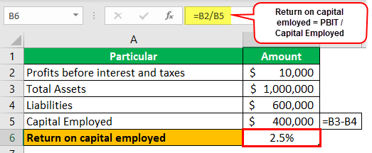

In financial analysis and trading, understanding key metrics such as Return on Capital Employed (ROCE) is vital. ROCE offers a deep insight into a company's efficiency in employing its capital to generate profits, making it an essential tool for investors and financial analysts. At its core, ROCE is a financial ratio that measures a company’s profitability in relation to its total capital employed. This metric is instrumental in determining how well a firm is generating returns from its capital, which is crucial for shareholders and investors looking for growth potential and sustainability.

ROCE gains particular prominence in algorithmic trading, where automated systems use quantitative models to make trading decisions. In such an environment, the ability of ROCE to guide strategies through profitability metrics is invaluable. By assessing a company's ROCE, automated trading systems can prioritize investments in businesses showing high efficiency in capital utilization, thus optimizing returns in volatile market conditions.



This article will explore the application of ROCE in financial analysis and algorithmic trading, aiming to enhance investment profitability. We'll examine its calculation, where ROCE is represented as:

$$
\text{ROCE} = \frac{\text{EBIT}}{\text{Capital Employed}}
$$

where EBIT stands for Earnings Before Interest and Taxes. We will also interpret ROCE across different industries and trading scenarios, thereby illustrating its strategic importance in diverse financial contexts. Through this discussion, investors and analysts can better grasp the significance of ROCE and its potential to inform sound investment decisions.

## Table of Contents

## Understanding Return on Capital Employed (ROCE)

Return on Capital Employed (ROCE) is an essential financial ratio that evaluates a company's profitability and capital efficiency. It is expressed as a percentage and gives insight into how effectively a company utilizes its capital to generate profits. The formula for calculating ROCE is:

$$
\text{ROCE} = \left( \frac{\text{Earnings Before Interest and Taxes (EBIT)}}{\text{Capital Employed}} \right) \times 100
$$

Here, Capital Employed is typically defined as the total assets of the company minus current liabilities, or alternatively, the sum of shareholders' equity and long-term debt. This calculation underscores the firm's ability to generate earnings from its capital base.

ROCE is invaluable to investors seeking to compare the operating performance of companies within the same industry. It provides a more holistic view than other metrics such as Return on Investment (ROI) and Return on Equity (ROE). While ROI focuses solely on the profitability relative to the initial investment, and ROE looks at profitability from the shareholders' perspective, ROCE considers both debt and equity. This broader view makes ROCE particularly useful in industries where leveraging financial instruments is a common strategic practice.

By understanding how ROCE incorporates both equity and debt, investors and analysts can attain a comprehensive understanding of how capital is being deployed, which is critical for discerning the operational efficiency and growth potential of companies.

## Analyzing ROCE: Key Considerations

When evaluating Return on Capital Employed (ROCE), it is essential to benchmark it against industry standards to assess a company’s relative performance. Industry standards provide a context for what constitutes a strong or weak ROCE, as different sectors have varying capital structures and profitability benchmarks. For instance, technology companies might exhibit higher ROCE values due to lower capital requirements compared to utilities or manufacturing, which are more capital-intensive.

A key consideration in ROCE analysis is its consistency over time. By observing ROCE trends over multiple years, analysts can gauge a company’s long-term capital efficiency. A stable or improving ROCE suggests effective reinvestment strategies and strong operational fundamentals. Conversely, a declining trend may indicate deteriorating management efficiency or increased capital costs without proportional profit growth.

Capital-intensive industries such as manufacturing often exhibit lower ROCE figures. This is due to substantial investments in physical assets like plant and equipment, which increase capital employed. Hence, when comparing ROCE across different industries, it is crucial to acknowledge these structural differences. For example, a manufacturing company with a ROCE of 10% might be performing better relative to its industry peers than a tech company with a ROCE of 15%.

In addition to industry comparisons, analyzing a company's internal ROCE trends is valuable in assessing changes in management efficacy. Sudden shifts in ROCE could signal changes in operational strategies, capital expenditures, or market conditions. For instance, a sharp increase in ROCE might indicate successful cost management or revenue enhancements, while a decrease could highlight inefficiencies or overinvestment.

In conclusion, analyzing ROCE requires a nuanced approach that considers industry-specific contexts, temporal consistency, and internal company dynamics. These factors collectively provide a comprehensive understanding of a company’s capital efficiency and potential for sustainable profitability.

## ROCE and Algorithmic Trading

Incorporating Return on Capital Employed (ROCE) into [algorithmic trading](/wiki/algorithmic-trading) systems offers a sophisticated approach to enhancing decision-making processes. At its core, algorithmic trading uses computational algorithms to automate the efficient execution of trades. This method leverages advanced data analytics, [machine learning](/wiki/machine-learning), and algorithm-driven strategies to maximize trading efficiency and profitability.

Integrating ROCE into these systems allows algorithms to prioritize companies that demonstrate superior capital efficiency. By focusing on firms with higher ROCE, trading algorithms can target investments in businesses likely to achieve better returns on their capital. This prioritization is particularly advantageous in volatile markets where capital efficiency plays a crucial role in a company's ability to sustain profitability. 

To incorporate ROCE into algorithmic trading, one can develop a Python script that automatically calculates ROCE using data from financial statements and incorporates these metrics into trading decisions. The calculation involves dividing Earnings Before Interest and Taxes (EBIT) by Capital Employed: 

$$
\text{ROCE} = \frac{\text{EBIT}}{\text{Capital Employed}}
$$

Here's a sample Python script snippet illustrating how one might automate this calculation:

```python
import pandas as pd

# Sample data frame containing financial data
data = pd.DataFrame({
    'Company': ['Company A', 'Company B'],
    'EBIT': [500000, 750000],
    'Capital_Employed': [2500000, 3500000]
})

# Calculate ROCE
data['ROCE'] = data['EBIT'] / data['Capital_Employed']

# Filter companies based on a ROCE threshold
roce_threshold = 0.15
filtered_companies = data[data['ROCE'] >= roce_threshold]

print(filtered_companies)
```

In this example, the algorithm calculates the ROCE for a set of companies and filters out those that do not meet a predefined ROCE threshold. Such automation aids in focusing investment choices on firms demonstrating robust capital efficiency, thus enabling more strategic and data-driven decisions.

Moreover, using ROCE in conjunction with other financial metrics can enhance algorithmic trading models, providing a holistic evaluation of a company's financial health. This integration aligns with the ultimate goal of algorithmic trading: achieving optimal trading outcomes through informed and automated decision-making.

## Using ROCE for Strategic Investment Decisions

Return on Capital Employed (ROCE) is instrumental for investors aiming to identify companies that deploy capital efficiently, particularly in growth-oriented sectors. By combining ROCE with metrics like Return on Equity (ROE) and Earnings Before Interest, Taxes, Depreciation, and Amortization (EBITDA), investors obtain a nuanced financial insight that aids in making robust investment decisions.

When making strategic investments, evaluating ROCE during different phases of economic cycles is crucial. During economic expansions, companies with high ROCE often demonstrate better capital efficiency and higher profitability. Conversely, during downturns, a stable ROCE signals effective capital management, minimizing potential losses. Capital-intensive industries may show cyclical variations in ROCE, hence understanding the broader economic context can aid in forecasting performance shifts.

Automating ROCE analysis can streamline portfolio management strategies and enhance decision-making efficiency. Python, a versatile programming language, can be effectively utilized to automate such processes. Below is a basic Python script example that calculates ROCE for multiple companies, providing a systematic approach to evaluate investment potential:

```python
import pandas as pd

# Sample data for companies
data = {
    'Company': ['A', 'B', 'C'],
    'EBIT': [50000, 75000, 60000],
    'Capital_Employed': [200000, 300000, 250000]
}

# Convert the data into a DataFrame
df = pd.DataFrame(data)

# Define a function to calculate ROCE
def calculate_roce(ebit, capital_employed):
    return (ebit / capital_employed) * 100

# Apply the ROCE calculation
df['ROCE'] = df.apply(lambda row: calculate_roce(row['EBIT'], row['Capital_Employed']), axis=1)

# Display the DataFrame with calculated ROCE
print(df)
```

This script reads company data, processes ROCE calculations, and outputs the ROCE values. Such automation enables investors to quickly assess which companies are utilizing capital most effectively, an essential task in portfolio diversification and risk assessment.

Employing ROCE as part of a multi-metric evaluation framework ensures a comprehensive financial perspective. By pairing ROCE with ROE and EBITDA, investors can gain insights into a company's operational efficiency (ROE) and cash flow potential (EBITDA). This holistic view aids investors in selecting companies that not only efficiently deploy capital but also align with long-term growth and profitability trends.

In conclusion, when strategically applied, ROCE serves as a pivotal metric for identifying companies that offer superior investment opportunities due to their adept capital management practices. Leveraging automation and a multi-faceted analytical approach enhances the precision and effectiveness of investment decisions in both stable and fluctuating market conditions.

## Challenges and Limitations of ROCE

Differences in capital intensity across industries pose a significant challenge to directly comparing Return on Capital Employed (ROCE) figures. Industries such as manufacturing, utilities, and mining are generally more capital-intensive compared to technology or service sectors. This disparity often results in lower ROCE figures in capital-intensive industries, not necessarily indicating poor performance but reflecting the substantial capital requirements inherent in these sectors. When using ROCE for comparative analysis, it is essential to compare firms within the same industry or understand the context of their capital structures to draw meaningful conclusions.

ROCE calculations can also be susceptible to financial manipulation or temporary market conditions. Companies might inflate their ROCE through accounting strategies such as deferring necessary capital expenditures, which artificially increases their capital employed denominator in the short term. Additionally, sudden market shifts or economic disruptions can temporarily impact earnings before interest and taxes (EBIT), leading to misleading ROCE figures. Therefore, while assessing a company's ROCE, investors should be vigilant for such anomalies, considering the sustainability and consistency of the reported figures over time.

External economic factors, such as changes in interest rates, currency fluctuations, or macroeconomic policies, can distort ROCE outcomes. These factors impact both the earnings capabilities and the cost of capital, particularly in multinational corporations operating across diverse economic environments. Consequently, investors should exercise caution when interpreting ROCE, recognizing that such external influences might not necessarily reflect a company's operational efficiency or long-term profitability.

To address the limitations inherent in relying solely on ROCE, it is advisable to employ additional financial metrics to gain a comprehensive understanding of a company's investment potential. Metrics like Return on Equity (ROE), Earnings Before Interest, Taxes, Depreciation, and Amortization (EBITDA) margins, and debt-to-equity ratios can provide valuable complementary insights. Utilizing a multi-faceted analytical approach allows investors to assess various dimensions of a company's financial health, mitigating the risk of misinterpretation based on a single metric. This balanced methodology enhances the robustness of investment assessments, ultimately leading to more informed decision-making.

## Conclusion: The Role of ROCE in Financial Analysis and Trading

Return on Capital Employed (ROCE) remains an indispensable metric in financial analysis and trading due to its robust ability to evaluate a company's capital efficiency and profitability. By focusing on how effectively a company utilizes its capital to generate earnings, ROCE provides valuable insights into financial health that are crucial for strategic investment decisions.

Integrating ROCE into algorithmic trading systems can significantly enhance decision-making processes. Algorithmic trading, characterized by the use of computational algorithms for automating trade activities, benefits from metrics like ROCE to prioritize investments in companies demonstrating superior capital efficiency. This capability allows for more informed and strategic trading in volatile markets, where quick and accurate data analysis is essential for maximizing gains and minimizing risks.

Taking a balanced approach that incorporates various financial metrics alongside ROCE enriches investment insights. While ROCE provides a comprehensive view by considering both debt and equity, its combination with other ratios such as Return on Equity (ROE) or Earnings Before Interest, Taxes, Depreciation, and Amortization (EBITDA) enhances the analytical framework. This holistic perspective supports a deeper understanding of a company's financial standing and strategic positioning, thereby facilitating more nuanced investment decisions.

Investors who leverage ROCE effectively can achieve superior returns through informed and data-driven strategies. By consistently evaluating and integrating ROCE with other financial metrics, investors can discern patterns and anticipate potential shifts in company performance. This analytical rigor not only improves investment outcomes but also supports the construction of resilient and adaptive trading strategies capable of thriving in diverse economic environments. 

Consequently, ROCE remains a cornerstone metric within financial analysis and algorithmic trading, providing the clarity and precision necessary for superior investment performance.

## References & Further Reading

[1]: ["Returns on Capital: How to Calculate ROIC and ROCE"](https://www.wallstreetprep.com/knowledge/roic-return-on-invested-capital/) - Investopedia

[2]: ["Financial Analysis and Modeling Using Excel and VBA"](https://www.amazon.com/Financial-Analysis-Modeling-Using-Excel/dp/047027560X) by Chandan Sengupta

[3]: ["Algorithmic Trading and DMA: An Introduction to Direct Access Trading Strategies"](https://www.amazon.com/Algorithmic-Trading-DMA-introduction-strategies/dp/0956399207) by Barry Johnson

[4]: ["Financial Ratios: Importance & Interpretation"](https://navigatingfinance.com/understanding-the-importance-of-financial-ratios/) - Corporate Finance Institute

[5]: ["Principles of Corporate Finance"](https://www.fincart.com/blog/corporate-finance-importance-types-principles/) by Richard Brealey, Stewart Myers, and Franklin Allen