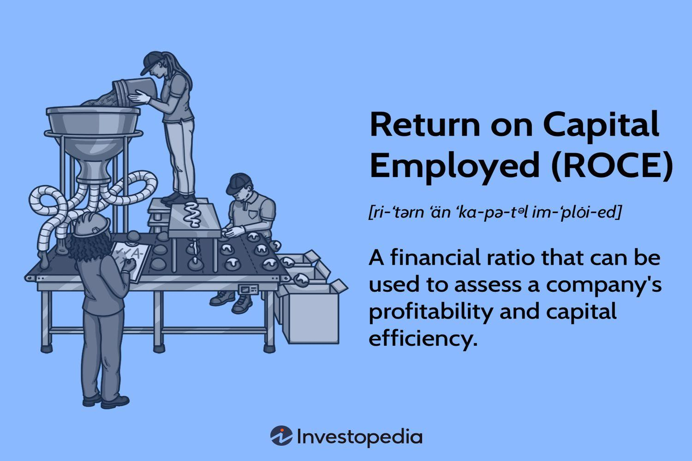

## Table of Contents

## What is Return on Capital Employed (ROCE)?

Return on Capital Employed, or ROCE, is a financial ratio that shows how well a company is using its money to make profits. It tells investors how much profit a company makes for every dollar of capital it uses. To calculate ROCE, you take the company's earnings before interest and taxes (EBIT) and divide it by the capital employed, which is the total amount of money the company has used to run its business. This includes things like buildings, machines, and money borrowed from banks.

ROCE is important because it helps investors see if a company is good at turning the money it uses into more money. A high ROCE means the company is using its capital efficiently, which is good for investors. A low ROCE might mean the company is not using its money well, and investors might want to be careful. By comparing the ROCE of different companies, investors can decide which ones are better at making profits from their investments.

## How is ROCE calculated?

ROCE is calculated by dividing a company's earnings before interest and taxes (EBIT) by its capital employed. EBIT is the money a company makes from its normal business operations before it pays interest on loans or taxes. Capital employed is the total amount of money a company uses to run its business, including things like buildings, machines, and money borrowed from banks.

To find the EBIT, you look at the company's income statement and find the profit before interest and taxes are taken out. For capital employed, you add up the company's total assets minus its current liabilities, or you can use the sum of its equity and long-term debt. Once you have these two numbers, you divide the EBIT by the capital employed and then multiply by 100 to get the ROCE as a percentage. This percentage shows how well the company is using its money to make profits.

## Why is ROCE important for evaluating a company's profitability?

ROCE is important for evaluating a company's profitability because it shows how well a company is using its money to make more money. It tells investors if a company is good at turning the money it has into profits. When a company has a high ROCE, it means it is using its money efficiently, which is a good sign for investors. They can see that the company is doing a good job with the money it has, and this can make them feel more confident about investing in the company.

On the other hand, if a company has a low ROCE, it might mean that the company is not using its money well. This can be a warning sign for investors because it shows that the company might not be good at making profits from the money it has. By comparing the ROCE of different companies, investors can figure out which ones are better at making money from their investments. This helps them make smarter choices about where to put their money.

## What does a high ROCE indicate about a company's performance?

A high ROCE means a company is good at using its money to make profits. It shows that the company is taking the money it has and turning it into more money very well. When a company has a high ROCE, it means it's doing a great job with the money it uses for things like buildings, machines, and loans. This is important because it tells investors that the company is using its money in a smart way.

Investors like to see a high ROCE because it means the company is doing well and making good use of its money. A high ROCE can make investors feel more confident about putting their money into the company. They see that the company is efficient and good at making profits, which is a good sign for their investment.

## How does ROCE differ from other profitability metrics like Return on Equity (ROE) or Return on Assets (ROA)?

ROCE, ROE, and ROA are all ways to measure how well a company is doing, but they look at different things. ROCE, or Return on Capital Employed, looks at how well a company uses all its money, including money from loans and its own money, to make profits. It's like checking if a company is good at using all the money it has to make more money. ROE, or Return on Equity, only looks at how well a company uses the money that comes from its owners or shareholders. It's like seeing how good the company is at making money just from the money the owners put in. ROA, or Return on Assets, looks at how well a company uses its things, like buildings and machines, to make money. It's like checking if the company is good at making money from the stuff it owns.

Each of these measures tells us something different about a company's performance. ROCE gives a broad view because it includes all the money the company uses, not just the money from owners or the value of its things. This makes ROCE useful for comparing companies that might use different amounts of borrowed money. ROE is great for shareholders because it shows how well their money is being used to make profits. ROA is helpful for understanding how well a company is using its things to make money, which can be important for companies that have a lot of expensive equipment or buildings. By looking at all three, investors can get a fuller picture of how well a company is doing.

## Can ROCE be used to compare companies in different industries?

ROCE can be used to compare companies in different industries, but it's important to be careful. Different industries have different ways of making money and using their capital. For example, a tech company might use less money to make a lot of profit, while a manufacturing company might need to spend a lot more on machines and buildings to make the same amount of profit. So, when you compare ROCE across industries, you need to understand these differences and think about them when you look at the numbers.

Even with these differences, ROCE can still be a helpful tool for comparing companies. If you know the industry well, you can see if a company's ROCE is higher or lower than what's normal for that industry. This can tell you if the company is doing a good job with its money compared to others in the same field. But it's always best to use ROCE along with other measures to get a full picture of how a company is doing.

## What are the limitations of using ROCE as a profitability measure?

Using ROCE as a way to measure how well a company is doing has some problems. One big issue is that ROCE doesn't tell the whole story about a company's money. It looks at how well a company uses its money to make profits, but it doesn't say anything about how much money the company is borrowing. If a company is using a lot of borrowed money, it might look like it's doing well because the ROCE is high, but it could actually be risky because it has to pay back a lot of loans.

Another problem with ROCE is that it can be hard to compare companies in different industries. Each industry has its own way of making money and using money. For example, a tech company might need less money to make a lot of profit compared to a company that makes cars, which needs a lot of money for machines and factories. So, when you look at ROCE, you need to know the industry well to understand if a company is doing well or not. It's best to use ROCE along with other measures to get a full picture of how a company is doing.

## How can a company improve its ROCE?

A company can improve its ROCE by making more money with the same amount of capital or by using less capital to make the same amount of money. One way to make more money is by finding new ways to sell more products or services. This could mean coming up with new products that people want to buy, or finding new markets to sell in. Another way is by making the company more efficient, like cutting down on costs or making the work process faster and better. If a company can do these things, it will have a higher profit, which means a higher ROCE.

Another way to improve ROCE is by using less capital. This could mean selling off things the company doesn't need anymore, like old buildings or machines that aren't used much. It could also mean finding cheaper ways to borrow money or using the company's own money more wisely. By using less capital, the company can still make the same amount of profit but with a smaller amount of money, which will make the ROCE go up. Both ways, making more money or using less capital, can help a company have a better ROCE and show investors that it's good at using its money to make profits.

## What role does capital employed play in the ROCE formula?

Capital employed is a key part of the ROCE formula because it shows how much money a company is using to run its business. In the formula, capital employed is what you divide the company's earnings before interest and taxes (EBIT) by. This gives you the ROCE, which tells you how well the company is using its money to make profits. Capital employed includes all the money the company has put into things like buildings, machines, and any money it has borrowed. So, it's a big picture of all the money the company is using.

If a company can make a lot of profit with a small amount of capital employed, its ROCE will be high. This means the company is good at using its money wisely. On the other hand, if a company uses a lot of capital but doesn't make much profit, its ROCE will be low. This can show that the company might not be using its money in the best way. By looking at the capital employed, you can see how well a company is doing with the money it has, which is important for investors who want to know if the company is a good place to put their money.

## How does depreciation and amortization affect ROCE?

Depreciation and amortization are ways companies account for the wear and tear or the use of their assets over time. When a company buys something big like a machine or a building, it doesn't count the whole cost right away. Instead, it spreads the cost over many years. This is called depreciation for physical things and amortization for non-physical things like patents. These costs are taken out of the company's profits before taxes, but they are added back to get the earnings before interest and taxes (EBIT) for the ROCE calculation. So, depreciation and amortization can make the EBIT number higher, which might make the ROCE look better than if you just looked at the profit after these costs.

However, depreciation and amortization also affect the capital employed part of the ROCE formula. The value of the company's assets goes down over time because of these costs, which means the capital employed can be lower. A lower capital employed, with the same EBIT, will make the ROCE higher. But, it's important to remember that these costs are real and represent the money the company will need to spend to replace these assets in the future. So, while depreciation and amortization can make ROCE look better in the short term, they also show that the company needs to keep investing in its assets to keep making money.

## What are some advanced techniques for analyzing ROCE trends over time?

To analyze ROCE trends over time, one useful technique is to look at the ROCE over several years to see if it's going up or down. By doing this, you can tell if the company is getting better or worse at using its money to make profits. For example, if the ROCE is going up each year, it means the company is getting better at turning its money into more money. But if the ROCE is going down, it could mean the company is not doing as well and might need to find new ways to make more profit or use less money.

Another technique is to compare the company's ROCE with the industry average over time. This helps you see if the company is doing better or worse than other companies in its field. If the company's ROCE is always higher than the industry average, it means the company is doing a good job compared to others. But if it's lower, it might mean the company needs to look at what other companies are doing and try to do better. By looking at these trends, you can get a good idea of how well the company is doing and make smarter decisions about investing in it.

## How can ROCE be integrated into a broader financial analysis framework?

ROCE can be a key part of a bigger financial analysis by giving a good picture of how well a company is using its money to make profits. When you look at a company's finances, you can use ROCE along with other measures like Return on Equity (ROE) and Return on Assets (ROA) to get a full view. ROCE looks at all the money the company is using, not just the money from owners or the value of its things. This makes it helpful for seeing if the company is doing a good job with all its money. By putting ROCE into a broader analysis, you can see if the company is good at turning its money into profits and compare it with other companies to see how it's doing.

Another way to use ROCE in a bigger financial analysis is by looking at it over time and comparing it with the industry average. This helps you see if the company is getting better or worse at using its money and how it stacks up against other companies in its field. If the company's ROCE is going up and is higher than the industry average, it's a good sign that the company is doing well. But if it's going down or is lower than the industry average, it might mean the company needs to find new ways to make more profit or use less money. By using ROCE this way, you can get a clearer picture of the company's financial health and make smarter choices about investing in it.

## What is Return on Capital Employed (ROCE) and how can it be understood?

Return on Capital Employed (ROCE) is an essential financial ratio that evaluates a company's profitability and capital efficiency. It is expressed as a percentage and gives insight into how effectively a company utilizes its capital to generate profits. The formula for calculating ROCE is:

$$
\text{ROCE} = \left( \frac{\text{Earnings Before Interest and Taxes (EBIT)}}{\text{Capital Employed}} \right) \times 100
$$

Here, Capital Employed is typically defined as the total assets of the company minus current liabilities, or alternatively, the sum of shareholders' equity and long-term debt. This calculation underscores the firm's ability to generate earnings from its capital base.

ROCE is invaluable to investors seeking to compare the operating performance of companies within the same industry. It provides a more holistic view than other metrics such as Return on Investment (ROI) and Return on Equity (ROE). While ROI focuses solely on the profitability relative to the initial investment, and ROE looks at profitability from the shareholders' perspective, ROCE considers both debt and equity. This broader view makes ROCE particularly useful in industries where leveraging financial instruments is a common strategic practice.

By understanding how ROCE incorporates both equity and debt, investors and analysts can attain a comprehensive understanding of how capital is being deployed, which is critical for discerning the operational efficiency and growth potential of companies.

## What is the relationship between ROCE and Algorithmic Trading?

Incorporating Return on Capital Employed (ROCE) into [algorithmic trading](/wiki/algorithmic-trading) systems offers a sophisticated approach to enhancing decision-making processes. At its core, algorithmic trading uses computational algorithms to automate the efficient execution of trades. This method leverages advanced data analytics, [machine learning](/wiki/machine-learning), and algorithm-driven strategies to maximize trading efficiency and profitability.

Integrating ROCE into these systems allows algorithms to prioritize companies that demonstrate superior capital efficiency. By focusing on firms with higher ROCE, trading algorithms can target investments in businesses likely to achieve better returns on their capital. This prioritization is particularly advantageous in volatile markets where capital efficiency plays a crucial role in a company's ability to sustain profitability. 

To incorporate ROCE into algorithmic trading, one can develop a Python script that automatically calculates ROCE using data from financial statements and incorporates these metrics into trading decisions. The calculation involves dividing Earnings Before Interest and Taxes (EBIT) by Capital Employed: 

$$
\text{ROCE} = \frac{\text{EBIT}}{\text{Capital Employed}}
$$

Here's a sample Python script snippet illustrating how one might automate this calculation:

```python
import pandas as pd

# Sample data frame containing financial data
data = pd.DataFrame({
    'Company': ['Company A', 'Company B'],
    'EBIT': [500000, 750000],
    'Capital_Employed': [2500000, 3500000]
})

# Calculate ROCE
data['ROCE'] = data['EBIT'] / data['Capital_Employed']

# Filter companies based on a ROCE threshold
roce_threshold = 0.15
filtered_companies = data[data['ROCE'] >= roce_threshold]

print(filtered_companies)
```

In this example, the algorithm calculates the ROCE for a set of companies and filters out those that do not meet a predefined ROCE threshold. Such automation aids in focusing investment choices on firms demonstrating robust capital efficiency, thus enabling more strategic and data-driven decisions.

Moreover, using ROCE in conjunction with other financial metrics can enhance algorithmic trading models, providing a holistic evaluation of a company's financial health. This integration aligns with the ultimate goal of algorithmic trading: achieving optimal trading outcomes through informed and automated decision-making.

## References & Further Reading

[1]: ["Returns on Capital: How to Calculate ROIC and ROCE"](https://www.wallstreetprep.com/knowledge/roic-return-on-invested-capital/) - Investopedia

[2]: ["Financial Analysis and Modeling Using Excel and VBA"](https://www.amazon.com/Financial-Analysis-Modeling-Using-Excel/dp/047027560X) by Chandan Sengupta

[3]: ["Algorithmic Trading and DMA: An Introduction to Direct Access Trading Strategies"](https://www.amazon.com/Algorithmic-Trading-DMA-introduction-strategies/dp/0956399207) by Barry Johnson

[4]: ["Financial Ratios: Importance & Interpretation"](https://navigatingfinance.com/understanding-the-importance-of-financial-ratios/) - Corporate Finance Institute

[5]: ["Principles of Corporate Finance"](https://www.fincart.com/blog/corporate-finance-importance-types-principles/) by Richard Brealey, Stewart Myers, and Franklin Allen