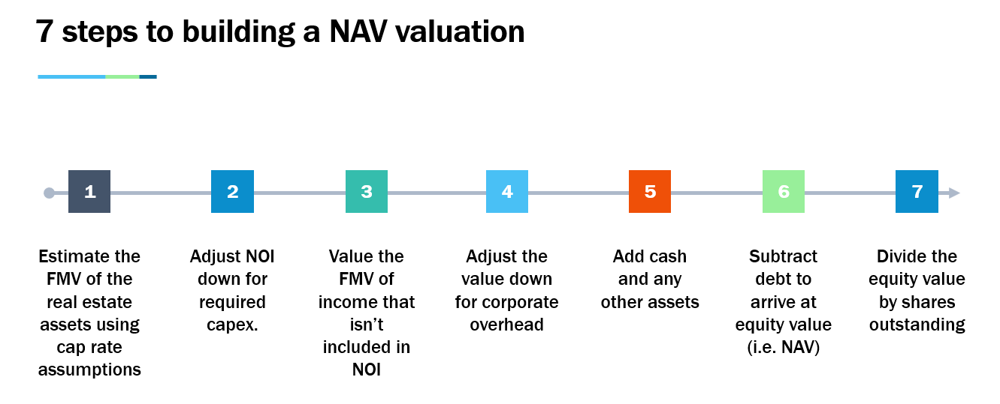

## Table of Contents

## What is a Real Estate Investment Trust (REIT)?

A Real Estate Investment Trust, or REIT, is a company that owns, operates, or finances income-generating real estate. It's like a mutual fund for real estate, allowing people to invest in large-scale properties without having to buy the buildings themselves. REITs can include different types of properties like apartments, malls, offices, or even hotels. By investing in a REIT, people can earn a share of the income produced through real estate without having to manage the properties.

REITs are required by law to pay out at least 90% of their taxable income as dividends to shareholders. This makes them attractive to investors looking for regular income. Because they distribute most of their income, REITs don't have to pay corporate income tax, which can be a big advantage. This structure makes REITs a popular choice for investors interested in real estate but who want to avoid the complexities of direct property ownership.

## What is Net Asset Value (NAV) and how is it calculated?

Net Asset Value, or NAV, is a term used to figure out how much a fund or a company's assets are worth. It's like finding out the total value of everything a fund owns, minus what it owes. Think of it as the price tag on the fund if you wanted to buy it outright. NAV is really important for investors because it helps them understand if a fund is a good deal or not.

To calculate NAV, you start by adding up the value of all the investments the fund holds. This could be stocks, bonds, real estate, or anything else the fund owns. Then, you subtract any debts or liabilities the fund has. After that, you divide this number by the total number of shares or units that the fund has issued. So, if a fund's assets are worth $100 million and it has $10 million in debts, and it has issued 10 million shares, the NAV per share would be ($100 million - $10 million) / 10 million shares = $9 per share.

## Why is NAV important for evaluating REITs?

NAV is important for evaluating REITs because it tells investors how much the real estate and other assets owned by the REIT are worth. When you know the NAV, you can compare it to the price you would pay for a share of the REIT. If the share price is lower than the NAV per share, it might be a good deal because you're buying the assets for less than they're worth. On the other hand, if the share price is higher than the NAV, it might be overpriced.

This comparison helps investors decide if a REIT is a good investment. It's like checking the price tag on a house to see if it's a bargain or too expensive. By looking at the NAV, investors can see if they're getting a fair price for the real estate and other assets they're buying into. This can help them make smarter choices about where to put their money.

## How does the market price of a REIT compare to its NAV?

The market price of a REIT is what investors are willing to pay for a share of the REIT at any given time. This price can go up and down based on how people feel about the real estate market, the economy, or even the specific properties the REIT owns. On the other hand, the Net Asset Value (NAV) is like a snapshot of what the REIT's assets are actually worth, minus any debts. So, the market price and the NAV can be different because the market price is influenced by many factors, including investor sentiment.

If the market price of a REIT is lower than its NAV, it might mean the REIT is a good deal. You're basically buying the real estate and other assets for less than they're worth. But if the market price is higher than the NAV, it might mean the REIT is overpriced. Investors use this comparison to decide if a REIT is a smart investment. By looking at both the market price and the NAV, they can see if they're getting a good price for the assets they're buying into.

## What factors can cause a REIT's market price to deviate from its NAV?

A REIT's market price can go up and down because of how people feel about the real estate market or the economy in general. If people think real estate is going to do well, they might be willing to pay more for a REIT's shares, even if the actual value of the properties hasn't changed much. This means the market price can be higher than the NAV. On the other hand, if people are worried about the economy or think real estate prices might fall, they might not want to pay as much for the REIT's shares, causing the market price to drop below the NAV.

Another reason the market price might not match the NAV is because of how well the REIT is run. If the REIT's managers are doing a great job and making smart choices about which properties to buy or sell, investors might be willing to pay more for the shares. But if the managers are making bad decisions or if there are problems with the properties, the market price might be lower than the NAV. So, the difference between the market price and the NAV can tell you a lot about what investors think about the REIT's future and how well it's being managed.

## How can investors use NAV to identify undervalued or overvalued REITs?

Investors can use NAV to spot undervalued or overvalued REITs by comparing the market price of a REIT's shares to its NAV per share. If the market price is lower than the NAV, it might mean the REIT is undervalued. This is like finding a house that's for sale for less than what it's really worth. Investors might see this as a good opportunity to buy the REIT's shares because they're getting the real estate and other assets at a discount.

On the other hand, if the market price is higher than the NAV, it could mean the REIT is overvalued. This is like paying more for a house than what it's actually worth. Investors might want to be careful about buying shares at this price because they're paying more than the assets are worth. By comparing the market price to the NAV, investors can make smarter choices about whether a REIT is a good deal or not.

## What are the limitations of using NAV to evaluate REITs?

Using NAV to evaluate REITs can be helpful, but it has its limits. One big issue is that figuring out the real value of the properties a REIT owns can be tricky. Real estate prices can change a lot, and it's hard to know exactly what a building is worth at any given time. Also, the NAV doesn't tell you everything about how well the REIT is being run or how much money it's making. So, just looking at the NAV might not give you the full picture of whether a REIT is a good investment.

Another limitation is that the market price of a REIT can be very different from its NAV because of how people feel about the real estate market or the economy. If investors are feeling good about real estate, they might pay more for a REIT's shares than what the NAV says it's worth. But if they're worried, they might pay less. So, the NAV might not always be the best way to tell if a REIT is a good buy or not. It's important for investors to look at other things too, like how much money the REIT is making and how well it's being managed, to get a better idea of its value.

## How do different types of REITs (e.g., equity, mortgage, hybrid) affect NAV calculations?

Different types of REITs can affect how their NAV is calculated because they own different kinds of assets. Equity REITs own and manage properties like apartments, shopping centers, and office buildings. To find the NAV of an equity REIT, you add up the value of all these properties and subtract any debts. Since real estate values can change, it's important to use the most recent and accurate property values to get a good NAV number. 

Mortgage REITs, on the other hand, don't own properties directly. They invest in real estate loans or mortgage-backed securities. To calculate their NAV, you add up the value of these loans and securities and then subtract any debts the REIT has. Because mortgage values can also change with interest rates and the health of the economy, it's important to use up-to-date values here too. 

Hybrid REITs are a mix of both equity and mortgage REITs. They own some properties and also invest in real estate loans. To find their NAV, you add up the value of the properties and the loans, then subtract any debts. Since hybrid REITs have a mix of assets, their NAV calculation needs to take into account the values of both types of assets accurately.

## What role do appraisals play in determining the NAV of a REIT?

Appraisals are really important for figuring out the Net Asset Value (NAV) of a REIT because they help find out how much the properties are worth. When a REIT owns buildings like apartments or shopping centers, they need to know the value of these properties to calculate the NAV. Appraisers are experts who look at the properties and use different methods to come up with a fair price. They consider things like the location, condition, and how much money the property makes. By using these appraisals, the REIT can get a good idea of the total value of its assets, which is a big part of the NAV calculation.

Sometimes, appraisals can be a bit tricky because property values can change over time. If the real estate market goes up, the value of the properties might be higher than the last appraisal. But if the market goes down, the properties might be worth less. So, it's important for REITs to keep their appraisals up to date to make sure the NAV is as accurate as possible. Even though appraisals are just estimates, they're a key part of understanding how much a REIT's assets are really worth.

## How can changes in interest rates impact the NAV of a REIT?

Changes in interest rates can have a big effect on the NAV of a REIT. When interest rates go up, it can make it more expensive for REITs to borrow money to buy or improve properties. This can lower the value of their properties because they have to pay more in interest. Also, higher interest rates can make other investments like bonds more attractive to investors, which might cause them to sell their REIT shares. This can push down the market price of the REIT and affect its NAV.

On the other hand, when interest rates go down, it can be good for REITs. Lower interest rates mean cheaper borrowing costs, which can help REITs buy more properties or make improvements without spending as much on interest. This can increase the value of their properties and boost the NAV. Plus, when interest rates are low, investors might see REITs as a better option than bonds because they can offer higher returns, which can drive up the market price of the REIT and positively impact its NAV.

## What advanced metrics can be used alongside NAV to better assess REIT value?

Besides NAV, investors can use other advanced metrics to get a better idea of a REIT's value. One important metric is Funds From Operations (FFO), which is like a special way to measure how much money a REIT is making. FFO adds back things like depreciation and amortization to the net income, which gives a clearer picture of the cash flow from the properties. Another useful metric is Adjusted Funds From Operations (AFFO), which takes FFO and subtracts maintenance costs and other regular expenses. This helps investors see how much money is really available for dividends or to reinvest in the business.

Another metric to consider is the capitalization rate, or cap rate, which compares the net operating income of a property to its current market value. A lower cap rate might mean the property is more valuable, while a higher cap rate could mean it's less valuable. Investors also look at the debt-to-equity ratio, which shows how much the REIT is borrowing compared to what it owns. A high ratio might mean the REIT is taking on too much risk, while a low ratio could mean it's being more cautious. By using these metrics along with NAV, investors can get a fuller picture of a REIT's value and make smarter investment choices.

## How do international accounting standards affect the calculation and reporting of NAV for global REITs?

International accounting standards can change how global REITs calculate and report their Net Asset Value (NAV). These standards, like the International Financial Reporting Standards (IFRS), are rules that companies around the world follow to make sure their financial reports are clear and fair. For REITs, these rules can affect how they value their properties and other assets. For example, IFRS might require REITs to use something called "fair value" to figure out how much their properties are worth. This means they have to guess what the properties would sell for in the current market, which can be different from what they paid for them. This can make the NAV go up or down depending on the real estate market.

Because different countries might use different accounting standards, it can be tricky to compare the NAV of REITs from different places. Some countries might use their own rules, while others stick to international standards. This can make it hard for investors to know if they're getting a fair price for a REIT's shares. To help with this, many global REITs will explain how they calculate their NAV and what accounting standards they follow in their financial reports. This way, investors can understand the numbers better and make smarter choices about where to put their money.

## What is Net Asset Value (NAV) and how is it calculated?

Net Asset Value (NAV) is a critical metric in evaluating Real Estate Investment Trusts (REITs), functioning as a measure to estimate the inherent value of a REIT by determining the difference between its total assets and liabilities. Mathematically, NAV is calculated using the formula:

$$
\text{NAV} = \frac{\text{Total Assets} - \text{Total Liabilities}}{\text{Outstanding Shares}}
$$

This calculation provides a per-share value that can aid investors in assessing whether a REIT is undervalued or overvalued.

### Components of NAV Calculation

1. **Total Assets:** This encompasses all the properties owned by the REIT, as well as other investments and cash reserves. The valuation of real estate properties is subject to periodic assessments to reflect their current market value.

2. **Liabilities:** These are REIT’s obligations, including debt and other financial liabilities. Accurate accounting of liabilities is crucial to ensure the reliability of the NAV.

3. **Outstanding Shares:** These are the shares currently held by all shareholders, including institutional and retail investors. Dividing the net asset value by the number of outstanding shares provides the NAV per share.

### Significance in REIT Valuation

Investors use NAV as a baseline to determine a REIT's market position. If a REIT's market price is below its NAV, it might be considered undervalued, indicating a potential investment opportunity. Conversely, a REIT with a market price exceeding its NAV could be overvalued. NAV offers a direct comparison against market prices, guiding investors in their buy or sell decisions.

### Limitations of NAV

While NAV offers valuable insights, it is not devoid of limitations. Market [volatility](/wiki/volatility-trading-strategies) and fluctuating property values can significantly impact the accuracy of NAV. Real estate valuations are inherently uncertain, subject to economic changes, [interest rate](/wiki/interest-rate-trading-strategies) variations, and shifts in local property markets. As such, NAV might not represent real-time market conditions, leading to potential discrepancies in assessed valuation.

### Concept of Adjusted NAV

To address the limitations of traditional NAV calculations, investors consider Adjusted NAV (ANAV), which incorporates adjustments for market realities such as anticipated capital expenditures, property value appreciations, or depreciations. Adjusted NAV provides a more nuanced view by considering future financial events or more precise market value estimations. It refines the basic NAV formula by integrating additional factors, offering a closer approximation to the REIT's actual market value.

In conclusion, comprehending NAV, alongside its constituents and limitations, enables investors to make informed judgments about REIT investments. Additionally, recognizing the role of Adjusted NAV can further enhance decision-making, offering a more refined valuation perspective.

## What is the role of REIT valuation in investment strategies?

Real Estate Investment Trusts (REITs) are a popular asset class, offering investors access to real estate markets without the need to directly manage properties. Accurate valuation of REITs is crucial for optimizing investment strategies. While Net Asset Value (NAV) is a commonly used metric, several other valuation methods enhance the depth and precision of REIT analysis.

### Alternative Valuation Methods

1. **Discounted Cash Flow (DCF) Models**: These models estimate the intrinsic value of a REIT by projecting its future cash flows and discounting them back to their present value. The formula for DCF is:
$$
   DCF = \sum_{t=1}^{n} \frac{CF_t}{(1 + r)^t}

$$

   where $CF_t$ is the cash flow in year $t$, $n$ is the total number of years, and $r$ is the discount rate. DCF models are valuable for capturing the time value of money and potential growth of cash flows.

2. **Comparative Market Analysis**: This method involves evaluating a REIT by comparing it to similar REITs or transactions in the market. Key metrics such as the price-to-earnings (P/E) ratio or price-to-book (P/B) ratio are often considered for these comparisons.

### Impact on Investment Decisions and Portfolio Diversification

Accurate REIT valuation influences investment decisions by identifying opportunities where market prices deviate from intrinsic values. For example, if a REIT is undervalued based on comparative market analysis, it might be a suitable addition to an investor's portfolio, potentially leading to capital gains as market inefficiencies correct over time. Similarly, discounted cash flow models provide insights into the long-term performance potential of a REIT, aiding investors in aligning their portfolios with their risk tolerance and investment horizons.

Valuation also plays a significant role in portfolio diversification. By assessing various REITs using different methods, investors can construct a diversified portfolio that balances risk and returns, potentially stabilizing overall portfolio performance against market volatility.

### Case Studies of Successful Investment Outcomes

Case studies on successful REIT investments often highlight the importance of accurate valuation. For instance, analysts who identified intrinsic value discrepancies could capitalize on market corrections, resulting in substantial returns. These cases underscore the practical benefits of robust valuation methodologies and the importance of thorough due diligence.

### Challenges in Achieving Precise Valuations

Despite the advantages of these valuation methods, investors face challenges due to market dynamics and economic factors. Market conditions can change rapidly, affecting property values and demand for REIT shares. Economic variables such as interest rates, inflation, and economic growth rates also impact REIT performance, complicating valuation efforts. Such factors necessitate a dynamic approach to valuation that incorporates current market conditions and projections.

### Continuous Evaluation of REIT Performance

The dynamic nature of the real estate market requires continuous evaluation of REIT performance. Ongoing analysis helps investors respond to changes, ensuring their investment strategies remain relevant. By regularly updating valuations and reviewing market trends, investors are better equipped to adjust their portfolios, seize emerging opportunities, and mitigate risks.

In conclusion, while NAV is a fundamental tool, the integration of diversified valuation methods like DCF models and comparative market analysis offers a comprehensive investment strategy. Continuous evaluation and adaptation to evolving market conditions are essential for maintaining competitive advantage in REIT investments.

## References & Further Reading

[1]: Nareit. ["Understanding REITs"](https://www.reit.com/what-reit/reit-basics) - The National Association of Real Estate Investment Trusts provides comprehensive resources about REITs, including valuation methods like NAV.

[2]: Ling, D. C., & Archer, W. R. (2013). ["Real Estate Principles: A Value Approach"](https://www.semanticscholar.org/paper/Real-Estate-Principles-%3A-A-Value-Approach-Ling-Archer/d02c8fb844e08891ba62dfeb02049a7498b750a9) - This book provides insights into real estate valuation principles relevant to understanding REITs and Net Asset Value.

[3]: Geltner, D., Miller, N. G., Clayton, J., & Eichholtz, P. (2013). ["Commercial Real Estate Analysis and Investments"](https://www.researchgate.net/publication/245702364_Commercial_Real_Estate_Analysis_and_Investments) - Offers detailed analytical frameworks for real estate investment, including methods for evaluating REITs.

[4]: Lopez de Prado, M. (2018). ["Advances in Financial Machine Learning"](https://www.amazon.com/Advances-Financial-Machine-Learning-Marcos/dp/1119482089) - This book discusses machine learning techniques that can be applied to algorithmic trading in financial markets.

[5]: Chan, E. P. (2008). ["Quantitative Trading: How to Build Your Own Algorithmic Trading Business"](https://github.com/ftvision/quant_trading_echan_book) - Provides insights into building algorithmic trading models, useful for integrating NAV and other metrics in REIT trading strategies.

[6]: Tse, C. B., & Webb, J. R. (2003). ["The Determinants of Net Asset Value Discounts and Premiums for Equity REITs"](https://pmc.ncbi.nlm.nih.gov/articles/PMC5412481/) - A research paper analyzing factors affecting NAV discounts and premiums in REIT markets.

[7]: Jansen, S. (2020). ["Machine Learning for Algorithmic Trading: Predictive models to extract signals from market and alternative data for systematic trading strategies with Python"](https://www.amazon.com/Machine-Learning-Algorithmic-Trading-alternative/dp/1839217715) - Explores the application of machine learning in developing algorithmic trading systems for financial markets, including REITs.