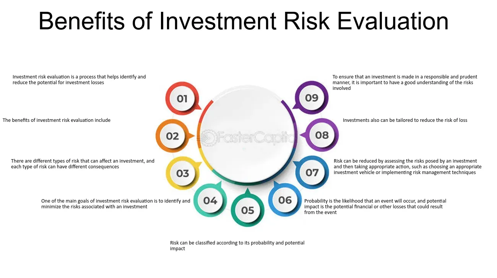

## Table of Contents

## What is a loan and how does it work?

A loan is when someone, usually a bank, gives you money that you have to pay back over time. You might need a loan to buy a car, a house, or to pay for school. When you get a loan, you agree to pay back the money plus a little extra, called interest. The interest is like a fee for borrowing the money.

When you apply for a loan, the bank looks at things like your credit score, how much money you make, and if you have paid back loans before. If they think you can pay back the loan, they will give you the money. You then make monthly payments until the loan is paid off. If you don't pay back the loan, it can hurt your credit score and make it harder to borrow money in the future.

## What are the different types of loans available for investment?

There are several types of loans people can use for investing. One common type is a personal loan, which you can use for almost anything, including investing in stocks or starting a small business. Personal loans usually have fixed interest rates and set repayment terms. Another type is a margin loan, which you can get from a brokerage firm to buy more stocks. With a margin loan, you use the stocks you already own as collateral, but it can be risky because if the stock value goes down, you might have to pay back the loan quickly.

Another type of loan for investment is a home equity loan. This is when you borrow money against the value of your home. You can use this money to invest in real estate or other ventures. Home equity loans often have lower interest rates than personal loans because they are secured by your home. Lastly, there are business loans, which you can use to invest in or expand a business. These loans can be secured or unsecured and have different terms based on the lender and the purpose of the loan.

## What are the potential benefits of using a loan for investment?

Using a loan for investment can help you make more money. If you invest in something that grows in value or gives you regular income, like stocks or a rental property, the returns could be more than the interest you pay on the loan. This means you could end up with more money than you started with. For example, if you borrow money to buy a rental property, the rent you collect could cover the loan payments and even give you extra money.

Another benefit is that it lets you start investing even if you don't have a lot of money saved up. Instead of waiting years to save enough, you can borrow the money now and start earning returns right away. This can be especially helpful if you believe the investment will go up in value soon. However, it's important to be careful and make sure the investment is likely to be successful, because if it doesn't work out, you'll still have to pay back the loan.

## What are the risks associated with borrowing money for investment?

Borrowing money for investment can be risky. If the investment doesn't go well, you could lose money. For example, if you borrow money to buy stocks and the stock price goes down, you might not be able to pay back the loan. This can hurt your credit score and make it harder to borrow money in the future. You might even have to sell other things you own to pay back the loan.

Another risk is the interest you have to pay on the loan. If the interest rate is high, it can eat into your profits. Sometimes, the interest you pay might be more than the money you make from the investment. This means you could end up losing money even if the investment itself does okay. It's important to think about how much the loan will cost you before deciding to borrow money for an investment.

Lastly, using a loan for investment can put you under a lot of stress. You have to make regular payments on the loan, no matter how the investment is doing. If you can't make the payments, you could face serious financial problems. It's a good idea to only borrow money for an investment if you're sure you can handle the payments and the risks involved.

## How does interest rate affect the cost of a loan?

The interest rate is a big part of how much a loan will cost you. It's like a fee you pay for borrowing money. If the interest rate is high, you'll pay more over time. For example, if you borrow $1,000 at a 10% interest rate, you'll pay $100 in interest each year. But if the interest rate is 5%, you'll only pay $50 in interest each year. So, a lower interest rate means you pay less to borrow the money.

Interest rates can also change how much you pay each month. If you have a loan with a variable interest rate, the rate can go up or down. If it goes up, your monthly payments will be higher. This can make it harder to budget because you won't know exactly how much you'll have to pay each month. On the other hand, if you have a fixed interest rate, your payments stay the same, which can make it easier to plan your finances.

## What is the difference between secured and unsecured loans for investment?

A secured loan for investment is when you borrow money and use something you own, like a house or a car, as a promise to pay back the loan. If you can't pay back the loan, the lender can take that thing you used as a promise. Because the lender has this safety net, they might give you a lower interest rate on a secured loan. People often use secured loans to invest in things like real estate or to start a business, because the loan can be big and the interest rate might be lower.

An unsecured loan for investment doesn't need you to promise anything you own. The lender gives you the money based on your promise to pay it back, and they might look at your credit score to decide if you're a good risk. Because the lender doesn't have anything to take if you don't pay back the loan, the interest rate on an unsecured loan is usually higher. People might use unsecured loans for smaller investments, like buying stocks or starting a small business, but they need to be careful because the higher interest rate can make the loan more expensive.

## How can one assess their ability to repay an investment loan?

To figure out if you can pay back an investment loan, you need to look at your money coming in and going out. First, add up all the money you make each month from your job, any side gigs, or investments. Then, list all your monthly expenses like rent, food, and bills. Don't forget to include the loan payment in these expenses. If the total money you make is more than your total expenses, including the loan payment, you might be able to pay back the loan without too much trouble.

Next, think about what could go wrong. What if you lose your job or if the investment doesn't make as much money as you hoped? Having some savings set aside, called an emergency fund, can help you keep making loan payments even if things go bad. Also, check your credit score. A good credit score can help you get a lower interest rate, which makes the loan cheaper. If your credit score is low, you might want to work on improving it before taking out a loan. By looking at these things, you can better understand if you can handle the loan payments and the risks that come with them.

## What are the tax implications of using loans for investment purposes?

When you use a loan for investment, it can affect your taxes in different ways. If you use the loan to buy things like stocks or rental properties, you might be able to deduct the interest you pay on the loan from your taxes. This means you can subtract the interest from your income, which can lower the amount of taxes you owe. For example, if you borrow money to buy a rental house, the interest on that loan can often be deducted from the rental income you report on your taxes.

But, not all loans for investment have the same tax benefits. It depends on what you're using the loan for and the rules in your country. If you use a personal loan to invest in stocks, you might not be able to deduct the interest. Also, if you make money from your investments, you'll have to pay taxes on that income. It's a good idea to talk to a tax professional to understand how a loan for investment will affect your taxes, because the rules can be complicated and change over time.

## How does the term length of a loan impact investment returns?

The length of a loan, or how long you have to pay it back, can affect how much money you make from your investments. If you choose a shorter loan term, you'll have to pay more money each month, but you'll pay less interest over time. This means you can start keeping more of the money you make from your investments sooner. For example, if you borrow money to buy a rental property and pay off the loan quickly, you'll keep more of the rent money after the loan is paid off.

On the other hand, if you pick a longer loan term, your monthly payments will be smaller, but you'll pay more interest over time. This can mean it takes longer for your investment to start making you more money than you're paying in interest. For instance, if you take a long time to pay off a loan used to buy stocks, the interest you pay might eat into the profits from those stocks for a long time. So, choosing the right loan term is important to make sure your investment pays off in the end.

## What strategies can be used to mitigate the risks of investment loans?

One way to lower the risks of taking a loan for investment is to do a lot of research before you borrow money. Look into the investment carefully to see if it's likely to make money. Check if the interest rate on the loan is low enough so that the money you make from the investment will be more than what you pay in interest. Also, think about how much money you can afford to lose if the investment doesn't work out. By understanding the investment and the loan well, you can make smarter choices and reduce the chance of losing money.

Another strategy is to have a backup plan. This means saving some money in an emergency fund that you can use to keep paying the loan if something goes wrong with your investment. It's also a good idea to have other ways to make money, like a steady job, so you can still make the loan payments even if the investment doesn't give you any income. By being prepared for bad things that could happen, you can feel more confident about taking out a loan for investment and handle any problems that come up.

## How do economic conditions influence the decision to use loans for investment?

Economic conditions can really affect whether it's a good idea to use a loan for investment. When the economy is doing well, people feel more confident about borrowing money because they think their investments will make more money. Interest rates might be low, which makes loans cheaper. Also, if the economy is growing, things like stocks or real estate might go up in value, making them good investments. But if the economy is not doing well, it can be riskier to take out a loan. Jobs might be harder to find, and if you lose your job, it could be tough to pay back the loan. Plus, if the economy is bad, the value of your investments might go down, which means you could lose money.

It's also important to think about how economic conditions might change in the future. If you think the economy will get better soon, it might be a good time to borrow money for an investment. But if you think things will get worse, it might be better to wait. Economic conditions can change fast, so it's a good idea to keep an eye on things like interest rates, job reports, and news about the economy. By understanding what's going on with the economy, you can make a smarter choice about whether to use a loan for investment.

## What advanced financial models can be used to evaluate the risk-benefit ratio of investment loans?

One advanced financial model that can help you figure out the risk and reward of taking a loan for investment is called the Discounted Cash Flow (DCF) model. This model looks at the money you expect to make from your investment in the future and brings it back to today's value. You do this by using a discount rate, which is kind of like an interest rate that shows how risky the investment is. If the present value of the future cash flows is more than the cost of the loan, including interest, then the investment might be worth it. But if the numbers don't add up, it might be too risky.

Another useful model is the Monte Carlo Simulation. This model runs a lot of different scenarios to see how your investment might do under different conditions. It takes into account things like changes in the economy, interest rates, and even random events that could affect your investment. By looking at all these different possibilities, you can get a better idea of how likely it is that your investment will make money and if the loan is worth the risk. Both of these models can help you make a smarter decision about using a loan for investment by giving you a clearer picture of the potential risks and rewards.

## What is the key to understanding investment loans?

Investment loans are financial instruments that allow individuals to acquire funds for the purpose of investing in various assets. The underlying idea is to achieve returns that not only cover the loan costs—comprising principal repayment and interest—but also deliver a surplus profit. Such loans are particularly appealing to investors seeking to leverage external capital to enhance their investment capacity and potential returns.

There are several common types of investment loans, each with distinct characteristics, interest rates, and eligibility requirements. These include:

1. **Personal Loans**: These are unsecured loans that do not require collateral. Personal loans typically come with higher interest rates, reflecting their unsecured nature. They provide flexibility as the funds can be utilized for various types of investments, ranging from stocks to real estate. The eligibility criteria often involve credit checks and income assessments.

2. **Home Equity Loans**: These loans allow homeowners to borrow against the equity of their property. Home equity loans generally offer lower interest rates compared to personal loans because they are secured against the borrower's home. The fixed nature of these loans provides predictable repayment schedules, making them suitable for investments in long-term assets.

3. **Margin Loans**: Available from brokerage firms, margin loans enable investors to borrow money to purchase additional securities. The loan is secured against the investor's existing portfolio. Margin loans usually have variable interest rates and require the maintenance of a certain level of equity within the investment account. They are particularly attractive to experienced investors familiar with stock market fluctuations.

Before taking out an investment loan, investors must conduct a thorough evaluation of key factors:

- **Interest Rates**: The interest rate associated with the loan is critical since it directly affects the cost of borrowing. A lower interest rate enhances the potential for positive returns on investment. Calculating the effective annual interest rate (EAR) can aid in comparing loan options:
$$
  \text{EAR} = \left(1 + \frac{i}{n}\right)^n - 1

$$

  Where $i$ is the nominal [interest rate](/wiki/interest-rate-trading-strategies), and $n$ is the number of compounding periods per year.

- **Loan Terms**: This includes the duration of the loan, repayment conditions, and any associated fees. Shorter-term loans might have higher periodic repayments but lower overall interest payments. It is crucial to align loan terms with the investment horizon to avoid mismatches.

- **Expected Return on Investment (ROI)**: Estimating the potential ROI helps in assessing whether the investment will surpass the borrowing costs. A simple formula to calculate ROI is:
$$
  \text{ROI} = \frac{\text{Net Profit}}{\text{Investment Cost}} \times 100

$$

By evaluating these aspects, investors can better determine the feasibility and profitability of using an investment loan. The strategic use of borrowed funds, when combined with disciplined financial planning, can potentially optimize investment outcomes and enhance financial growth.

## What are the risks and rewards of borrowing to invest?

Borrowing to invest is a strategy employed by investors to potentially enhance their portfolio returns by using leverage. This approach can magnify both the possible gains and the associated risks. The fundamental premise relies on the expectation that the investment returns will surpass the costs incurred from borrowing, thus ensuring profitability.

When considering this strategy, the key [factor](/wiki/factor-investing) is the relationship between the expected rate of return (RoR) on the investment and the interest rate (IR) on the borrowed funds. The fundamental equation at play can be expressed as:

$$
\text{Net Gain} = (\text{RoR} - \text{IR}) \times \text{Investment Principal}
$$

If the RoR exceeds the IR, the leverage can result in a positive net gain. Conversely, if the RoR falls short of the IR, the investor will incur losses. This highlights the importance of accurate return predictions and the management of borrowing costs.

However, the use of leverage introduces significant risks. Firstly, interest payments on loans are obligatory, regardless of whether the investment yields positive returns, adding a fixed cost component to the overall financial strategy. Moreover, market [volatility](/wiki/volatility-trading-strategies) can exacerbate potential losses, leading to financial strain. In cases of severe downturns, the investor might face a negative impact on their credit score or even the seizure of collateral, particularly if the investment was secured against tangible assets.

Investors must also consider their risk tolerance before engaging in this strategy. High-risk tolerance might lead some to leverage more aggressively, but it simultaneously heightens the possibility of financial distress in adverse market conditions. A prudent approach often involves scenario analysis and stress testing to evaluate the potential outcomes and limits of loss that one might endure.

In summary, while leveraging loans to invest can be profitable when executed with precision and market insight, it requires careful consideration of interest rates, expected returns, and personal financial resilience. An investor must thoroughly assess their perspectives on market trends and their individual risk appetite to navigate the risks and rewards this strategy entails.

## References & Further Reading

[1]: Lopez de Prado, M. (2018). ["Advances in Financial Machine Learning."](https://www.amazon.com/Advances-Financial-Machine-Learning-Marcos/dp/1119482089) Wiley.

[2]: Chan, E. P. (2008). ["Quantitative Trading: How to Build Your Own Algorithmic Trading Business."](https://github.com/ftvision/quant_trading_echan_book) Wiley.

[3]: Jansen, S. (2020). ["Machine Learning for Algorithmic Trading."](https://github.com/stefan-jansen/machine-learning-for-trading) Packt Publishing.

[4]: Aronson, D. (2007). ["Evidence-Based Technical Analysis: Applying the Scientific Method and Statistical Inference to Trading Signals."](https://www.wiley.com/en-us/Evidence+Based+Technical+Analysis%3A+Applying+the+Scientific+Method+and+Statistical+Inference+to+Trading+Signals-p-9780470008744) Wiley.

[5]: Bergstra, J., Bardenet, R., Bengio, Y., & Kégl, B. (2011). ["Algorithms for Hyper-Parameter Optimization."](https://dl.acm.org/doi/10.5555/2986459.2986743) Advances in Neural Information Processing Systems.