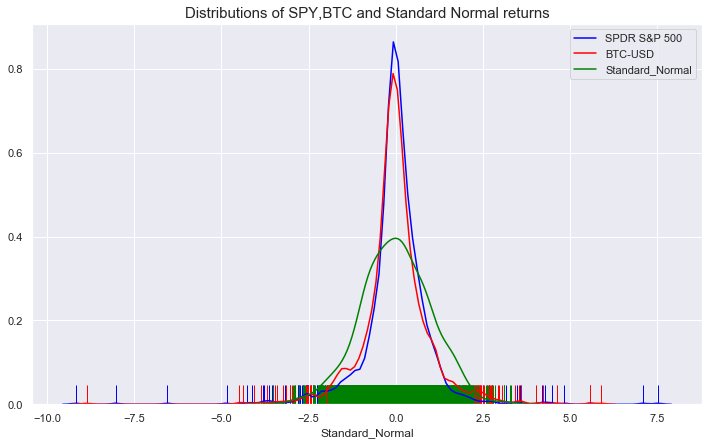

The rapid evolution of cryptocurrencies has captivated global attention, reshaping financial landscapes in unprecedented ways. Since the inception of Bitcoin in 2009, digital currencies have presented a transformative approach to conducting transactions by leveraging decentralized technology. Unlike traditional currencies governed by central banks, cryptocurrencies offer peer-to-peer transactions facilitated by blockchain technology, ensuring transparency and reducing the reliance on intermediaries.

Bitcoin, as the pioneer, set the stage for countless other digital assets, each with unique propositions. Ethereum introduced smart contracts, self-executing contracts with the terms directly written into lines of code, showcasing the potential of blockchain beyond simple financial transactions. This innovation paved the way for a multitude of new entrants each offering novel features and solutions to various market challenges.



Understanding the evaluation, analysis, and role of algorithmic trading within this dynamic ecosystem is crucial for effectively navigating the cryptocurrency market. Evaluation involves assessing the potential and viability of digital coins, often through a thorough review of project whitepapers and an understanding of the underlying technological innovations. Conducting comprehensive analysis is akin to fundamental analysis in traditional financial markets, where one examines the legitimacy and potential of a project based on its developmental roadmaps and team credentials.

Moreover, the advent of algorithmic trading has revolutionized how transactions are executed in the crypto markets. This method employs computer programs to facilitate trading based on predefined rules and parameters, allowing for quick and efficient responses to market changes. As digital currencies continue to evolve, exploring these aspects provides valuable insights and strategies for both enthusiasts and investors aiming to succeed in the volatile yet promising landscape of cryptocurrencies.

## Table of Contents

## Understanding Cryptocurrency Evaluation

Cryptocurrency evaluation is a crucial process that determines the potential success and sustainability of digital currencies. This evaluation involves a meticulous review of fundamental elements such as whitepapers, technological innovations, and the project's vision and team. A whitepaper serves as a blueprint and is often the first point of contact for potential investors. It should clearly articulate the problem the cryptocurrency aims to solve, the technology it will employ, and the roadmap for development and deployment. For example, Ethereum's whitepaper introduced the revolutionary concept of smart contracts, which are self-executing contracts with the terms written into code, differentiating it from Bitcoin's primary use as a digital currency.

Evaluation extends to assessing technological advancements and their real-world applications. Understanding the underlying blockchain technology, consensus mechanisms (e.g., Proof of Work, Proof of Stake), and scalability solutions are paramount. Projects like Ethereum not only propose innovative features but also adapt over time. Ethereum’s transition from Proof of Work to Proof of Stake (ETH 2.0) is a significant technological upgrade aimed at improving scalability, security, and energy efficiency.

The project's vision and team are equally important. A strong, well-articulated vision can indicate a clear understanding of market needs and future challenges. The credibility and expertise of the project's team can often be a determinant of success. Investors should research the backgrounds of team members and their previous ventures.

Understanding [cryptocurrency](/wiki/cryptocurrency) evaluation is essential to distinguish genuine projects from scams, which are prevalent in the crypto landscape. With numerous projects emerging, often making exaggerated claims, thorough evaluation helps mitigate risks and aids in making informed investment decisions. By employing a comprehensive evaluation approach, investors can better comprehend the intricacies of a cryptocurrency project, thus enhancing the prospects of identifying viable digital currencies.

## Conducting Cryptocurrency Analysis

Cryptocurrency analysis is akin to [fundamental analysis](/wiki/fundamental-analysis) in traditional stock markets, necessitating a rigorous assessment of a project's underlying factors to ascertain its legitimacy and potential for growth. This process involves several critical steps, which together provide a holistic view of a cryptocurrency's viability.

A thorough examination of the development team is essential. The team's experience, past achievements, and credibility are significant predictors of a project's potential success. A well-qualified and transparent team instills confidence and often correlates with a project's sustained development and innovation.

Equally important is an analysis of the project's technology stack. This includes the blockchain protocol it operates on, its consensus mechanism, and the scalability solutions employed. For instance, understanding whether a project uses proof-of-work or proof-of-stake can provide insight into its energy consumption and transaction speed. These technological components influence a cryptocurrency's efficiency and security, affecting its attractiveness to users and investors.

Tokenomics, the design of a project's economic model, is another crucial aspect. This involves scrutinizing the total supply, distribution model, and incentives for holders and validators. Projects with sound tokenomics tend to strike a balance between encouraging usage and maintaining scarcity, which can positively impact the token's value.

Market data and trend analysis offer insights into price movements and investor sentiment. By examining trading volumes, historical price charts, and the level of activity on social media platforms, analysts can gauge market sentiment and detect potential price movements. Tools such as moving averages, relative strength indices, or Bollinger Bands might be employed to identify trends and predict future price changes.

```python
import pandas as pd
import matplotlib.pyplot as plt
from pandas_datareader import data as web
import datetime

# Example: Plotting Ethereum's 50-day moving average
start = datetime.datetime(2023, 1, 1)
end = datetime.datetime(2023, 10, 31)
eth_data = web.DataReader('ETH-USD', 'yahoo', start, end)

# Calculate the 50-day moving average
eth_data['50_MA'] = eth_data['Close'].rolling(window=50).mean()

# Plot the closing prices and the 50-day moving average
plt.figure(figsize=(14,7))
plt.plot(eth_data['Close'], label='ETH Daily Close')
plt.plot(eth_data['50_MA'], label='50 Day Moving Average')
plt.title('Ethereum Price Analysis')
plt.xlabel('Date')
plt.ylabel('Price (USD)')
plt.legend()
plt.show()
```

Incorporating all these elements, cryptocurrency analysis provides a structured approach to evaluating digital assets. While the inherent [volatility](/wiki/volatility-trading-strategies) of the crypto market poses challenges, leveraging robust analysis techniques can enhance decision-making processes, assisting enthusiasts and investors in navigating this dynamic sector.

## The Role of Digital Currency in Global Finance

Cryptocurrencies, notably Bitcoin and Ethereum, have introduced transformative changes to global financial systems by offering unique alternatives to traditional monetary mechanisms. These digital currencies facilitate transactions with significantly lower costs compared to conventional banking and financial services. This cost efficiency stems from the elimination of intermediaries. The decentralized nature of blockchain technology, which underpins cryptocurrencies, ensures that transactions are executed without the need for banks or financial institutions as intermediaries.

Moreover, digital currencies promise unparalleled speed in transaction processing. Unlike traditional cross-border transfers that may take several days to settle, cryptocurrency transactions can be completed within minutes, irrespective of geographical distances. This high-speed transfer capability is particularly appealing to both retail users and institutional investors, who seek faster and more efficient ways to transfer value.

Transparency, another pivotal advantage of digital currencies, is guaranteed by the blockchain's immutability and public ledger system. Every transaction is recorded on the blockchain, accessible and verifiable by anyone, thus ensuring transparency and reducing the likelihood of fraudulent activities.

Despite these advantages, cryptocurrencies face significant regulatory challenges across the globe. Financial authorities and governments are grappling with the task of integrating such a disruptive technology into existing regulatory frameworks. This challenge is compounded by the anonymity associated with cryptocurrency transactions, which raises concerns over their potential use in illicit activities. Regulations vary considerably across different jurisdictions, affecting the adoption rates of digital currencies.

Furthermore, adoption hurdles remain a critical issue. While cryptocurrencies have garnered substantial attention, their acceptance as a mainstream payment method is not yet universal. Factors such as volatility, scalability issues, and a lack of understanding among the general populace contribute to resistance in adopting cryptocurrencies more broadly.

In conclusion, while digital currencies like Bitcoin and Ethereum hold the promise of revolutionizing global finance with their low costs, speed, and transparency, their widespread adoption is contingent upon overcoming significant regulatory challenges and addressing adoption barriers. Their future role in global finance will likely be shaped by evolving regulatory landscapes and technological advancements.

## Algorithmic Trading in Cryptocurrency Markets

Algorithmic trading in cryptocurrency markets involves leveraging sophisticated computer programs to execute trades based on predefined criteria. This method offers several advantages over traditional manual trading by efficiently handling large volumes of trades and rapidly responding to market changes. The speed and precision of [algorithmic trading](/wiki/algorithmic-trading) systems are particularly beneficial in the volatile crypto markets, where rapid price fluctuations can occur within seconds.

One fundamental aspect of algorithmic trading is its ability to process and analyze vast amounts of data. This is crucial in a market characterized by high volumes of trades and significant price volatility. The algorithms can be programmed to consider various factors, including historical prices, trading volumes, and market depth, allowing traders to make informed decisions quickly. Moreover, algorithms can operate continuously without the need for human intervention, ensuring that trading opportunities are not missed due to delays inherent in manual trading.

Machine learning and [artificial intelligence](/wiki/ai-artificial-intelligence) are increasingly integral to the advancement of algorithmic trading systems in the cryptocurrency sector. These technologies enable the development of more sophisticated models capable of predicting future market trends based on historical data and other indicators. For instance, [machine learning](/wiki/machine-learning) algorithms can identify patterns and correlations within data that might not be immediately apparent to human traders. This ability to learn and adapt can enhance trading strategies by optimizing them for current market conditions.

An example of employing machine learning in trading could involve the use of a [neural network](/wiki/neural-network) model to predict the next day's cryptocurrency prices. A simple example using Python could look like this:

```python
from keras.models import Sequential
from keras.layers import Dense, LSTM
import numpy as np

# Generate some dummy data
data = np.random.rand(1000, 1)  # 1000 days of data
X = np.array([data[i:i+5] for i in range(len(data)-5)])
Y = np.array([data[i+5] for i in range(len(data)-5)])

# Design the model
model = Sequential()
model.add(LSTM(50, activation='relu', input_shape=(5, 1)))
model.add(Dense(1))
model.compile(optimizer='adam', loss='mse')

# Fit the model
model.fit(X, Y, epochs=200, verbose=0)

# Making predictions
predictions = model.predict(X)
```

The above code demonstrates a Long Short-Term Memory (LSTM) network, a type of recurrent neural network (RNN) designed to process sequential data. By training this model on historical price data, traders can attempt to forecast future price movements and adjust their trading strategies accordingly.

Implementing machine learning and AI in algorithmic trading systems requires an understanding of both financial markets and technical skills related to data science and programming. Moreover, traders must remain mindful of the risks associated with high-frequency trading and the potential for losses due to algorithmic errors or unexpected market conditions.

In conclusion, algorithmic trading, augmented by machine learning and AI, represents a cutting-edge strategy in cryptocurrency markets. By offering speed, efficiency, and the ability to process complex data sets, it enables traders to maximize their decision-making capabilities and potentially improve their trading outcomes. However, as with any trading strategy, careful planning and continual monitoring are necessary to mitigate risks and adapt to the dynamic nature of cryptocurrency markets.

## Risks and Challenges in Cryptocurrency Trading

Cryptocurrency markets are noted for their high volatility, which presents substantial risks to traders and investors. Price fluctuations can be dramatic, with double-digit percentage changes possible within a single day. This volatility is primarily due to the nascent stage of the market, speculative trading behavior, and the relative lack of [liquidity](/wiki/liquidity-risk-premium) compared to traditional financial markets. As a result, traders must be prepared for sudden market movements and potential financial losses.

Security concerns add another layer of complexity to cryptocurrency trading. Despite advances in technology, cryptocurrencies are often targeted by cybercriminals. Hacks, phishing schemes, and malware attacks are common, as evidenced by notable breaches that have resulted in the loss of millions of dollars in digital assets. Therefore, it is crucial for traders to employ robust security measures, such as using hardware wallets, enabling two-[factor](/wiki/factor-investing) authentication, and conducting regular audits of their wallets.

Scams also pose a significant threat in the cryptocurrency space. Initial Coin Offerings (ICOs) and other fundraising schemes can be exploited by deceitful actors to defraud unsuspecting investors. Evaluating the legitimacy of a cryptocurrency project requires meticulous research and skepticism. This involves examining the development team's credibility, the project's whitepaper, and its proposed technological innovations.

Regulatory challenges are a critical aspect of cryptocurrency trading. The regulatory environment is fragmented and rapidly evolving, with varying interpretations and implementations across different jurisdictions. This creates uncertainty and can lead to sudden changes in market conditions following regulatory announcements. Traders must stay informed on regulatory developments and consider their potential impacts on market behavior.

Market trends also play a role in evaluating risks within the cryptocurrency domain. Traders who thoroughly understand market sentiment, technical indicators, and blockchain analytics can better anticipate and react to potential price movements. However, the ever-changing landscape of crypto markets requires continuous learning and adaptation.

In summary, cryptocurrency trading is fraught with risks ranging from volatility and security issues to regulatory uncertainties and scams. Mitigating these risks necessitates a comprehensive understanding of the market dynamics and proactive strategies to safeguard one's investments.

## Conclusion

The complexity of the cryptocurrency landscape presents both challenges and opportunities. For those adept at evaluating and analyzing digital assets, the rewards can be substantial. Evaluation involves scrutinizing aspects like project whitepapers, technological innovations, and market legitimacy, which are crucial to differentiating between promising ventures and potential scams. Likewise, cryptocurrency analysis akin to fundamental analysis in traditional finance provides insights into market dynamics, assisting in informed decision-making.

Algorithmic trading transforms the approach to trading cryptocurrencies, offering agility and precision. By leveraging computer programs, traders can process significant market data rapidly and execute trades based on preset criteria. This method not only optimizes trading efficiency but also allows for adaptive responses to market volatility. Incorporating machine learning and artificial intelligence further enhances predictive accuracy and execution strategies within the cryptocurrency market.

As digital currencies evolve, remaining informed and vigilant is paramount. The rapidly shifting regulatory landscape, combined with technological advancements, means that continuous learning and adaptation are essential. Individuals and entities undertaking cryptocurrency trading must stay abreast of market trends and innovations to navigate this complex domain successfully. Thus, a robust understanding of evaluation, analysis, and algorithmic trading is crucial for those looking to succeed in the cryptocurrency market.

## References & Further Reading

[1]: Nakamoto, S. (2008). ["Bitcoin: A Peer-to-Peer Electronic Cash System."](https://nakamotoinstitute.org/library/bitcoin/)

[2]: Buterin, V. (2013). ["Ethereum Whitepaper: A Next-Generation Smart Contract and Decentralized Application Platform."](http://cryptoverze.s3.us-east-2.amazonaws.com/wp-content/uploads/2018/11/10012235/Ethereum-ETH-whitepaper.pdf)

[3]: Narayanan, A., Bonneau, J., Felten, E., Miller, A., & Goldfeder, S. (2016). ["Bitcoin and Cryptocurrency Technologies: A Comprehensive Introduction."](https://press.princeton.edu/books/hardcover/9780691171692/bitcoin-and-cryptocurrency-technologies) Princeton University Press.

[4]: Tapscott, D., & Tapscott, A. (2016). ["Blockchain Revolution: How the Technology Behind Bitcoin Is Changing Money, Business, and the World."](https://dl.acm.org/doi/10.5555/3051781) Penguin.

[5]: De Filippi, P., & Wright, A. (2018). ["Blockchain and the Law: The Rule of Code."](https://www.jstor.org/stable/j.ctv2867sp) Harvard University Press.

[6]: Weber, B. (2016). ["Mastering Ethereum: Building Smart Contracts and DApps"](https://books.google.com/books/about/Mastering_Ethereum.html?id=nJJ5DwAAQBAJ) by Andreas M. Antonopoulos and Gavin Wood

[7]: Lopez de Prado, M. (2018). ["Advances in Financial Machine Learning."](https://www.amazon.com/Advances-Financial-Machine-Learning-Marcos/dp/1119482089) Wiley.

[8]: Chan, E. P. (2013). ["Algorithmic Trading: Winning Strategies and Their Rationale."](https://github.com/ftvision/quant_trading_echan_book) Wiley.

[9]: Hull, J. (2012). ["Options, Futures, and Other Derivatives."](https://www.semanticscholar.org/paper/Options%2C-Futures%2C-and-Other-Derivatives-Hull/89bdee500c8623864fc9eb7a471546aa713acc44) Pearson.

[10]: Malkiel, B. G. (2019). ["A Random Walk Down Wall Street: The Time-Tested Strategy for Successful Investing."](https://yourknowledgedigest.org/wp-content/uploads/2020/04/a-random-walk-down-wall-street.pdf) W.W. Norton & Company.