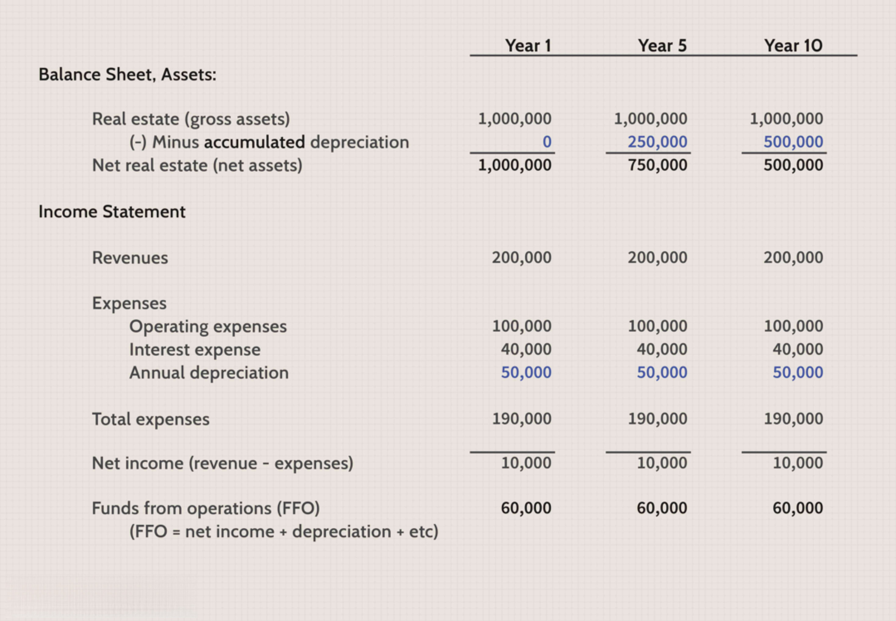

In the modern financial landscape, alternative investment options have become increasingly appealing to investors who seek to diversify their portfolios beyond traditional stocks and bonds. One such innovative approach involves electronic Real Estate Investment Trusts (eREITs), a digital adaptation of traditional real estate investment trusts. Fundrise, a prominent player in this domain, has introduced eREITs as a technology-driven method for investing in real estate, offering a novel approach that has gained the attention of both novice and seasoned investors.

Fundrise's eREITs are designed to provide easy access to real estate investments by leveraging advanced algorithms and technology. This integration of algorithmic trading, or algo trading, allows Fundrise to efficiently manage a diversified portfolio of real estate assets, optimizing returns while managing risks. Algo trading employs complex mathematical models and algorithms to make trading decisions at speeds and frequencies beyond human capabilities, thus enabling rapid analysis and execution in the ever-changing real estate market.

The appeal of eREITs lies in their ability to democratize real estate investments. Traditionally, real estate investments require significant capital and expertise, limiting participation to wealthier individuals or institutional investors. eREITs, however, allow everyday investors to participate in the real estate market with lower entry points and without the burdens of property management. Fundrise's platform simplifies the investment process, providing a transparent and user-friendly interface that connects investors with commercial and residential real estate projects.

This article explores the concept of eREITs, highlighting Fundrise's role in facilitating these investments. It examines the integration of algo trading in managing eREIT portfolios and assesses the benefits and risks associated with investing in Fundrise's eREITs. The insights provided aim to equip investors with the necessary knowledge to make informed decisions aligned with their financial objectives and risk appetites.

## Table of Contents

## What Are eREITs?

eREITs, or electronic Real Estate Investment Trusts, represent the digital evolution of traditional Real Estate Investment Trusts (REITs). These investment vehicles enable individuals to invest in diversified real estate portfolios through online platforms. Unlike traditional REITs, which are typically traded on major stock exchanges, eREITs operate via digital platforms, offering investors a direct and more accessible route into real estate markets.

Fundrise is a notable pioneer in the eREIT space. The platform provides users with an opportunity to invest in a range of commercial and residential real estate projects without the need for significant capital or extensive market knowledge. By utilizing technology, Fundrise has streamlined the investment process, removing common barriers such as extensive paperwork and large upfront costs that traditionally accompany real estate investment.

This innovation allows investors to browse and select real estate opportunities through an intuitive online interface, committing funds to projects that align with their financial goals. With Fundrise, the emphasis is on democratizing access to real estate investments, enabling both seasoned investors and newcomers to participate in the potential growth of real estate values.

The digital nature of eREITs facilitates greater transparency and ease of management for investors. Fundrise provides detailed information about each investment opportunity, including potential returns, risks, and project timelines, empowering investors to make informed decisions. The platform also allows for the automation of repetitive processes, such as dividend payouts, improving efficiency and investor experience.

By integrating eREITs with a robust online platform, Fundrise successfully attracts a diverse pool of investors, making real estate investment more inclusive and flexible in a rapidly changing financial environment.

## How Fundrise Leverages Algo Trading

Algo trading, or [algorithmic trading](/wiki/algorithmic-trading), is increasingly shaping the investment landscape. It involves leveraging computer algorithms to automatically execute trading decisions based on predefined criteria. This approach allows for high-frequency trading, rapid analysis of large data sets, and predictive modeling that can outpace human capabilities.

Fundrise uses algo trading to enhance the management and performance of its eREITs portfolio. By employing sophisticated algorithms, Fundrise can analyze market data continuously to identify optimal investment opportunities within the real estate sector. This technology facilitates a systematic approach to portfolio management by evaluating patterns, trends, and historical data to predict future price movements more accurately.

The implementation of algo trading in Fundrise's platform provides several advantages. Firstly, it reduces the emotional and human biases that often affect traditional trading. Algorithms follow a set framework without deviation, ensuring a consistent and disciplined investment strategy. Secondly, it allows Fundrise to efficiently process and react to market fluctuations. The algorithms can swiftly adjust portfolio allocations in response to market changes, thereby managing risk more effectively.

In practice, Fundrise's algos might employ strategies such as mean reversion, [momentum](/wiki/momentum) trading, or statistical [arbitrage](/wiki/arbitrage). These techniques can be used to exploit inefficiencies in the real estate market. For example, a mean reversion strategy might involve buying undervalued assets expected to return to their historical average price. 

Moreover, the scalability of algo trading means that Fundrise can manage a large [volume](/wiki/volume-trading-strategy) of eREIT transactions without a corresponding increase in operational overhead. This efficiency is crucial for maintaining competitive costs and optimizing returns for investors.

The integration of technology in Fundrise's eREITs management exemplifies the evolution of investing, where digital tools are increasingly used to achieve superior outcomes. Through algo trading, Fundrise not only enhances its operational efficiency but also provides a robust framework for navigating the complexities of modern real estate markets.

## Benefits of Investing in Fundrise's eREITs

Fundrise eREITs present several advantages for investors seeking diversification in their investment portfolios without the complexities of direct real estate ownership. A primary benefit is the relatively low minimum investment requirement, which lowers the barrier to entry for a broader range of investors. This allows individuals with varying capital capacities to partake in real estate investment opportunities traditionally reserved for more substantial financial commitments.

These eREITs follow the advantageous characteristics typical of conventional Real Estate Investment Trusts (REITs), including the potential for dividend income. Investors in Fundrise eREITs might receive periodic dividends derived from rental income and property sales within the managed portfolio, offering a potential source of income. Moreover, such investments can enhance portfolio diversification; by including real estate assets, investors may reduce overall portfolio risk as real estate returns typically have a low correlation with traditional equity and bond markets.

The structured nature of eREITs on the Fundrise platform also simplifies the investment process. Investors are relieved of the duty of managing individual properties, as professional management teams handle property selection, acquisition, and oversight. This accessibility and convenience can appeal to both novice investors, who may lack the time or experience to manage real estate directly, and experienced investors looking to expand their asset mix without additional management complicities.

Overall, Fundrise eREITs offer an efficient and streamlined method to invest in real estate, potentially generating income and diversification without the burdens of direct ownership and high initial capital requirements.

## Risks and Considerations

When investing in Fundrise's eREITs, it is important for investors to carefully evaluate the associated risks and considerations. A key risk [factor](/wiki/factor-investing) is the relative lack of [liquidity](/wiki/liquidity-risk-premium) compared to publicly traded REITs. Traditional REITs are often listed on stock exchanges, allowing investors to buy and sell shares with relative ease. In contrast, eREITs, such as those offered by Fundrise, are not publicly traded, resulting in limited liquidity. This can pose a challenge for investors who anticipate the need to quickly access their capital, as redemption options may be more restrictive and less frequent.

Market [volatility](/wiki/volatility-trading-strategies) is another critical consideration. Real estate values and the corresponding returns on investment can be significantly affected by macroeconomic factors, such as interest rates, inflation, and economic downturns. An economic recession, for example, could negatively impact rental income and property values, potentially reducing the returns on eREIT investments. Additionally, real estate markets can be influenced by local factors, such as supply and demand dynamics, regulatory changes, and demographic trends, which require continuous monitoring.

Fundrise's limited track record is also a pertinent factor. As a relatively new player in the real estate investment space, Fundrise has yet to establish a long-term performance history. Investors must consider this lack of historical data when assessing potential returns and risks. While Fundrise employs advanced technologies and strategies, past performance is not indicative of future results, and the company's investment approach has not been tested through multiple economic cycles.

Moreover, there could be additional risks specific to the underlying assets within the eREITs. These might include property-level operational risks, tenant vacancies, and maintenance costs, which can impact cash flows and the overall value of the investment. Although Fundrise employs professional management and algorithmic strategies to mitigate such risks, they cannot be entirely eliminated.

Given these considerations, prudent investors should thoroughly assess their investment objectives, risk tolerance, and liquidity requirements before committing to eREITs. Diversification within a broader investment portfolio, as well as staying informed about market and economic conditions, can help manage these risks effectively.

## Who Should Invest in Fundrise eREITs?

Investors seeking to diversify their portfolios with a higher risk tolerance and a comfort level with illiquidity might find Fundrise eREITs a suitable option. eREITs, by their nature, are less liquid compared to publicly traded REITs; thus, they are more appropriate for those who can invest without the need for immediate access to funds. For young investors who aim for long-term growth and diversification, eREITs allow exposure to the real estate market without the burdens of direct property ownership, offering a way to participate in the potential appreciation and income that real estate investments can provide.

Before committing to eREITs, it's crucial for investors to conduct a thorough assessment of their own investment goals, risk profile, and time horizon. The degree of risk associated with eREITs makes them more suitable for investors who understand the trade-off between potential returns and the inability to quickly liquidate their investments. For example, a financial planning tool or risk assessment questionnaire can be beneficial for evaluating whether an individual's financial objectives align with the characteristics of eREIT investments.

Those interested in adopting the digital and technology-driven approach offered by Fundrise will appreciate the relatively lower minimum investment requirement, opening opportunities for a broader range of investors. However, this accessibility should not deter careful consideration of one's personal financial situation. Employing strategies like dollar-cost averaging can also aid in managing investment risk over time, as consistent investment into eREITs, irrespective of market conditions, may reduce volatility exposure.

Assessing personal factors such as liquidity needs, investment horizon, and risk tolerance is essential. Young investors, particularly those in the early stages of their careers, might see eREITs as a portion of their diversified asset allocation due to the prolonged investment period ahead of them. Ultimately, a nuanced understanding of the potential benefits and risks, alongside a clear alignment with personal financial strategies, will better position investors to make informed decisions regarding their involvement with Fundrise eREITs.

## Conclusion

Fundrise eREITs emerge as a notable innovation, blending real estate investment with contemporary trading technology. This digital evolution enables investors to access real estate opportunities typically reserved for larger, more traditional market participants. Through Fundrise, investors can enjoy a streamlined path to diversifying their portfolios, which can be particularly advantageous in mitigating risk across different asset classes. 

However, potential investors must take deliberate steps to understand the risks entailed. Unlike publicly-traded REITs, eREITs offered by Fundrise may lack liquidity, presenting challenges for investors requiring rapid access to capital. This is a fundamental risk consideration, given the typical requirement for longer investment horizons in real estate to realize substantial returns. Furthermore, the inherent volatility of real estate markets, influenced by economic shifts and market dynamics, can impact the performance of these investments.

In evaluating eREITs, investors should assess their individual financial objectives and risk tolerance. An understanding of the mechanics, including the benefits and limitations, equips investors with the knowledge to align investments with their long-term goals. As with all investment decisions, due diligence and consideration of personal financial circumstances are paramount. By doing so, investors can position themselves to strategically leverage eREITs within their broader investment strategy, potentially reaping the rewards while minimizing associated risks.

## References & Further Reading

[1]: ["Investing in REITs: Real Estate Investment Trusts"](https://www.nerdwallet.com/article/investing/reit-investing) by Ralph L. Block

[2]: ["The Intelligent REIT Investor: How to Build Wealth with Real Estate Investment Trusts"](https://www.amazon.com/Intelligent-REIT-Investor-Wealth-Investment/dp/1119252717) by Stephanie Krewson-Kelly and R. Brad Thomas

[3]: Lo, Andrew W., & Hasanhodzic, Jasmina. (2010). ["The Heretics of Finance: Conversations with Leading Practitioners of Technical Analysis"](https://www.amazon.com/Heretics-Finance-Conversations-Practitioners-Technical/dp/1576603164)

[4]: ["Algorithmic Trading: Winning Strategies and Their Rationale"](https://www.amazon.com/Algorithmic-Trading-Winning-Strategies-Rationale-ebook/dp/B00CY5HC0U) by Ernie Chan

[5]: ["The Basics of Bitcoins and Blockchains: An Introduction to Cryptocurrencies and the Technology that Powers Them"](https://www.amazon.com/Basics-Bitcoins-Blockchains-Introduction-Cryptocurrencies/dp/1633538001) by Antony Lewis