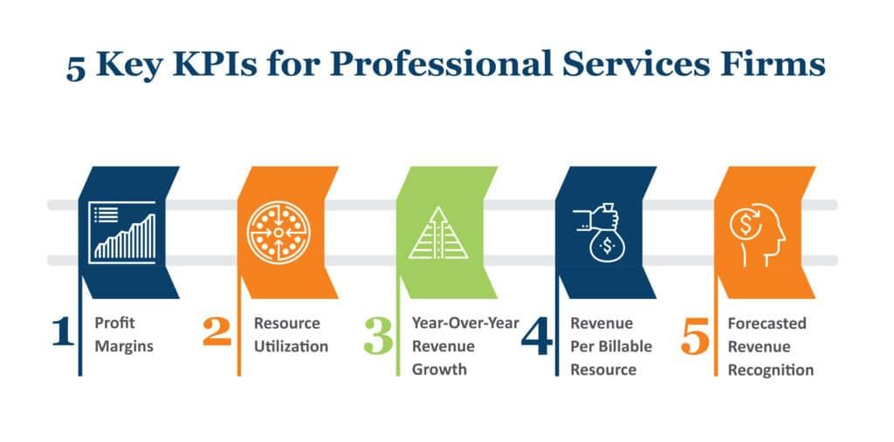

In an era characterized by rapid technological advancements, algorithmic trading has emerged as a pivotal element of the financial services sector. Algorithmic trading, which involves using computers programmed to follow a defined set of instructions for placing trades, often at speeds and frequencies that are beyond human capabilities, is revolutionizing market interaction. Understanding the performance metrics associated with financial services, particularly in the context of algorithmic trading, can significantly enhance decision-making processes and improve investment outcomes.

Performance metrics in financial services offer a quantifiable approach to evaluate the efficiency and profitability of trading strategies. These metrics serve not only as barometers of past performance but also as indicators for future potential and risk exposure. In particular, algorithmic trading necessitates a more sophisticated set of metrics due to its complexity and reliance on data-driven decisions executed at high speeds.



This article focuses on key company evaluation metrics with a particular emphasis on algorithmic trading. By examining these metrics, we aim to provide insights into effective financial performance assessment. Such evaluation is essential for investors, traders, and financial analysts who seek to optimize strategies and achieve superior investment returns in a competitive market environment. With the growing complexity of financial markets, grasping the nuances of these metrics is vital for anyone involved in financial services and trading.

## Table of Contents

## Understanding Financial Services Performance Metrics

Financial metrics are essential tools used to evaluate the health and performance of companies in the financial services sector. These metrics provide insights into a company's market value, earnings potential, growth prospects, and operational efficiency, making them crucial for investors, analysts, and stakeholders in making informed decisions.

Key ratios such as the Price-To-Book (P/B) ratio and the Price-To-Earnings (P/E) ratio are widely used in this context. The P/B ratio is calculated by dividing the market price per share by the book value per share:

$$
\text{P/B Ratio} = \frac{\text{Market Price per Share}}{\text{Book Value per Share}}
$$

This ratio helps determine how the market values the company compared to its net asset value, providing an indication of whether the stock is overvalued or undervalued. A P/B ratio less than 1 might indicate an undervalued stock, whereas a ratio higher than 1 might suggest overvaluation.

The Price-To-Earnings (P/E) ratio is another critical metric, calculated using the formula:

$$
\text{P/E Ratio} = \frac{\text{Market Price per Share}}{\text{Earnings per Share (EPS)}}
$$

This ratio assesses a company's current share price relative to its per-share earnings, serving as a gauge of the market's expectations regarding the company's future earnings potential. A high P/E ratio can suggest that investors anticipate high growth rates, while a lower P/E might imply the opposite.

These metrics are not only pivotal in evaluating a company's current status but also in predicting its growth potential. They assist investors in comparing companies within the same industry, helping to identify opportunities and assess risks. By offering a robust framework for analysis, these ratios ensure investment decisions are grounded in meticulous evaluations, enhancing the strategic planning and execution in financial services.

## Algorithmic Trading in Financial Services

Algorithmic trading, or algo trading, is a modern approach in finance where automated systems execute trades based on predetermined criteria. These systems leverage complex algorithms capable of analyzing market data at high speeds, allowing traders to identify and capitalize on fleeting opportunities with remarkable precision. This automation helps eliminate emotional biases that may otherwise influence decision-making.

In [algorithmic trading](/wiki/algorithmic-trading), predefined trading strategies hinge on quantitative models and sophisticated mathematical formulas. These strategies might range from simple trade execution based on specific price conditions to intricate systems evaluating a combination of variables such as market [volume](/wiki/volume-trading-strategy), timing, and historical patterns. For instance, a basic moving average crossover strategy might automatically buy a stock when its short-term moving average surpasses a long-term moving average, and sell when the opposite occurs.

Python, a popular programming language in the financial sector, provides numerous libraries such as NumPy, pandas, and scikit-learn, which facilitate the development and [backtesting](/wiki/backtesting) of trading algorithms. For example, a simple moving average crossover strategy can be implemented in Python as follows:

```python
import pandas as pd

# Assuming df is a DataFrame with 'Close' prices
def moving_average_crossover(df, short_window=40, long_window=100):
    signals = pd.DataFrame(index=df.index)
    signals['signal'] = 0.0

    signals['short_mavg'] = df['Close'].rolling(window=short_window, min_periods=1, center=False).mean()
    signals['long_mavg'] = df['Close'].rolling(window=long_window, min_periods=1, center=False).mean()

    signals['signal'][short_window:] = np.where(
        signals['short_mavg'][short_window:] > signals['long_mavg'][short_window:], 1.0, 0.0)

    signals['positions'] = signals['signal'].diff()

    return signals

signals = moving_average_crossover(stock_data)
```

As the landscape of algorithmic trading becomes more intricate and faster, the necessity for advanced metrics to evaluate trading algorithms' performance has grown significantly. These metrics not only assess the system's profitability and risk exposure but also its adaptability to changing market conditions. Commonly utilized evaluation metrics—such as the Sharpe Ratio for risk-adjusted returns, or Maximum Drawdown for understanding potential peaks in losses—are crucial for refining strategy execution and achieving consistent investment outcomes.

Algorithmic trading continues to shape the financial services sector by pushing the boundaries of how trading strategies are developed, tested, and implemented. This paradigm presents a need for ongoing evaluation and adaptation of algorithms, ensuring that they remain effective amidst evolving market dynamics and technological advancements.

## Key Metrics to Evaluate Trading Algorithms

Trading algorithms are evaluated for performance using a set of key metrics to ensure effective and profitable operations. These metrics provide critical insights into the algorithm’s success, efficiency, and risk management capabilities. Understanding and applying these metrics is vital for optimizing algorithmic strategies.

### Financial Viability

The financial viability of a trading algorithm is primarily determined by assessing its return on investment (ROI) over a specified period. ROI is calculated as:

$$
\text{ROI} = \frac{\text{Net Profit}}{\text{Total Investment}} \times 100\%
$$

This metric evaluates how efficiently an algorithm utilizes capital to generate profit. A consistently positive ROI indicates that the algorithm is capable of generating returns that are favorable compared to the investment costs.

### Sharpe Ratio

The Sharpe Ratio is a widely favored metric for measuring risk-adjusted performance. It quantifies the excess return earned per unit of risk taken, represented as:

$$
\text{Sharpe Ratio} = \frac{E[R_i] - R_f}{\sigma_i}
$$

Where $E[R_i]$ is the expected return of the investment, $R_f$ is the risk-free rate, and $\sigma_i$ is the standard deviation of the investment's return (risk). A higher Sharpe Ratio suggests that the algorithm is delivering better risk-adjusted returns, allowing traders to maximize gains while minimizing risk exposure.

### Winning Percentage

Winning Percentage is a straightforward metric that calculates the proportion of profitable trades against the total number of trades executed:

$$
\text{Winning Percentage} = \frac{\text{Number of Winning Trades}}{\text{Total Number of Trades}} \times 100\%
$$

This metric provides a direct measure of the accuracy and effectiveness of an algorithm. A high winning percentage indicates a higher frequency of successful trades, contributing to overall profitability.

### Maximum Drawdown

Maximum Drawdown is a critical measure of risk, assessing the largest drop in asset value from its peak to a low:

$$
\text{Maximum Drawdown} = \frac{\text{Peak Value} - \text{Trough Value}}{\text{Peak Value}} \times 100\%
$$

This metric alerts traders to potential risks and helps to manage the investment horizon effectively by indicating possible interruptions due to loss events. Maintaining a low maximum drawdown is crucial for building investor confidence and limiting potential losses.

### Volatility Metrics

Volatility metrics, such as standard deviation, are extensively applied to quantify the expected variability in returns. The standard deviation provides insights into the degree of variation from the mean return:

$$
\sigma = \sqrt{\frac{\sum (R_i - \bar{R})^2}{N}}
$$

Where $R_i$ is each return, $\bar{R}$ is the mean return, and $N$ is the number of returns. Understanding [volatility](/wiki/volatility-trading-strategies) is essential for constructing resilient trading strategies capable of withstanding market fluctuations. By rigorously evaluating these metrics, traders can tailor strategies to balance risk and return optimally.

By consistently analyzing these key metrics, traders can gauge the performance and robustness of their trading algorithms, ensuring more informed decision-making and strategic investment outcomes.

## Financial Viability and Sharpe Ratio

When evaluating financial viability, it is essential to identify consistency in positive outcomes over time, even though profits are not guaranteed. This evaluation focuses on examining whether an algorithmic trading strategy can sustain profitability across varying market conditions. Financial viability implies that an algorithm consistently generates returns that outweigh associated costs, such as transaction fees and slippage.

One prominent metric used in risk management is the Sharpe Ratio, which assesses risk-adjusted returns. It is defined as:

$$
\text{Sharpe Ratio} = \frac{R_p - R_f}{\sigma_p}
$$

where $R_p$ is the expected portfolio return, $R_f$ is the risk-free rate, and $\sigma_p$ is the standard deviation of portfolio returns. The primary aim of the Sharpe Ratio is to understand the additional return earned for each unit of risk undertaken by the portfolio. A higher Sharpe Ratio indicates more efficient risk-adjusted performance, suggesting that an investment has achieved higher returns without proportionately increasing risk.

Maximizing the Sharpe Ratio is often a goal for investors and portfolio managers, as it enables them to optimize the balance between risk and return. In algorithmic trading, utilizing strategies to enhance the Sharpe Ratio can involve diversifying trading models, adjusting position sizing, or employing hedging techniques. By focusing on risk-adjusted returns, traders aim to improve their decision-making processes, ensuring that strategies are robust under various market scenarios while pursuing optimal profitability.

## Winning Percentage and Maximum Drawdown

Winning Percentage is a fundamental metric in algorithmic trading, providing insights into the success ratio of executed trades. It is calculated by dividing the number of profitable trades by the total number of trades executed, then multiplying by 100 to express this ratio as a percentage:

$$
\text{Winning Percentage} = \left( \frac{\text{Number of Profitable Trades}}{\text{Total Number of Trades}} \right) \times 100
$$

A high Winning Percentage suggests that a significant fraction of trades are generating profits, indicating a potentially reliable trading strategy. However, it is important to note that while a high Winning Percentage can indicate success, it does not account for the magnitude of those profits or losses, necessitating the use of complementary metrics like Maximum Drawdown for a comprehensive evaluation.

Maximum Drawdown (MDD) is a vital risk metric that measures the largest drop in the equity value of a trading account from a peak to a subsequent trough, before a new peak is achieved. It is expressed as a percentage of the peak value. The Maximum Drawdown is formulated as:

$$
\text{Maximum Drawdown} = \frac{\text{Peak Equity} - \text{Trough Equity}}{\text{Peak Equity}} \times 100
$$

This metric is crucial because it reflects the potential risk of significant losses that might deter investors, potentially interrupting investment horizons. A lower Maximum Drawdown suggests that a trading algorithm is better at preserving capital during adverse market conditions, thus boosting investor confidence by limiting potential losses. Achieving a low MDD often involves sophisticated risk management techniques and allows portfolios to recover more quickly after a loss, which is paramount for long-term sustainability.

Investors and traders should balance the Winning Percentage with Maximum Drawdown to evaluate trading performance robustly. A strategy might have a high Winning Percentage but still expose investors to significant risks if it incurs large losses reflected in a high Maximum Drawdown. Therefore, effective management of Maximum Drawdown is crucial for maintaining investor trust and ensuring consistent trading outcomes.

## Volatility Metrics

Volatility metrics play a pivotal role in assessing and managing risk in financial trading. Standard deviation is a core metric used to quantify the extent of variability in an asset's returns around its mean, thus providing insight into potential risk exposure. High standard deviation values generally indicate greater uncertainty and higher potential for volatile price swings, signaling increased risk.

$$
\sigma = \sqrt{\frac{1}{N-1} \sum_{i=1}^{N} (R_i - \bar{R})^2 }
$$

This formula computes the standard deviation ($\sigma$), where $R_i$ represents individual returns, $\bar{R}$ is the average return, and $N$ is the number of observations.

A thorough grasp of volatility is crucial for developing trading strategies resilient to unpredictable market fluctuations. By comprehensively evaluating these metrics, investors can adjust their risk profiles accordingly, optimizing the balance between risk and potential return. For instance, portfolios with low volatility metrics might attract risk-averse investors, whereas those with higher metrics may appeal to those seeking higher rewards at the cost of increased risk.

To facilitate refined decision-making, algorithms can be programmed to adjust strategy parameters based on real-time volatility assessments. For example, a Python function might use standard deviation to influence algorithmic rules:

```python
import numpy as np

def adjust_strategy_based_on_volatility(prices):
    returns = np.diff(prices) / prices[:-1]
    volatility = np.std(returns)

    if volatility > predefined_threshold:
        return "Reduce position size"
    else:
        return "Maintain or increase position size"

prices = [100, 102, 101, 104, 103]  # Example price series
strategy_decision = adjust_strategy_based_on_volatility(prices)
print(strategy_decision)
```

In this example, volatility informs decisions regarding position sizing, emphasizing the tailored approach necessary for effective risk management. By rigorously evaluating volatility metrics, traders gain the ability to navigate complex markets with refined strategies that preserve capital while striving for optimal returns.

## Conclusion

Analyzing performance metrics in algorithmic trading provides critical insights for enhancing the efficiency and profitability of trading strategies. By leveraging sophisticated metrics like the Sharpe Ratio, Maximum Drawdown, and Volatility Metrics, traders can evaluate not only the profitability but also the underlying risk factors associated with their strategies. A comprehensive understanding of these metrics aids in optimizing risk management and crafting strategies that can adapt to changing market conditions.

The integration of diverse financial evaluation tools is imperative to manage risks effectively and maximize returns. Metrics such as the Sharpe Ratio, which quantifies risk-adjusted returns, and Maximum Drawdown, which assesses the potential for large equity losses, are essential for developing a resilient trading system. These tools enable traders to identify weaknesses in their strategies and make informed adjustments to improve performance outcomes.

As financial markets continue to evolve with increasing complexity and speed, the capability to interpret performance metrics accurately becomes indispensable for professionals engaged in financial services and trading. A thorough comprehension of these metrics equips traders with the analytical skills necessary to navigate and thrive in dynamic market environments. By embracing a data-driven approach, where decisions are based on empirical evidence from performance analytics, practitioners can enhance their strategic decisions and achieve sustainable investment success.

## References & Further Reading

[1]: Bergstra, J., Bardenet, R., Bengio, Y., & Kégl, B. (2011). ["Algorithms for Hyper-Parameter Optimization."](https://dl.acm.org/doi/10.5555/2986459.2986743) Advances in Neural Information Processing Systems 24.

[2]: ["Advances in Financial Machine Learning"](https://www.amazon.com/Advances-Financial-Machine-Learning-Marcos/dp/1119482089) by Marcos Lopez de Prado

[3]: ["Evidence-Based Technical Analysis: Applying the Scientific Method and Statistical Inference to Trading Signals"](https://www.amazon.com/Evidence-Based-Technical-Analysis-Scientific-Statistical/dp/0470008741) by David Aronson

[4]: ["Machine Learning for Algorithmic Trading"](https://github.com/stefan-jansen/machine-learning-for-trading) by Stefan Jansen

[5]: ["Quantitative Trading: How to Build Your Own Algorithmic Trading Business"](https://www.amazon.com/Quantitative-Trading-Build-Algorithmic-Business/dp/1119800064) by Ernest P. Chan