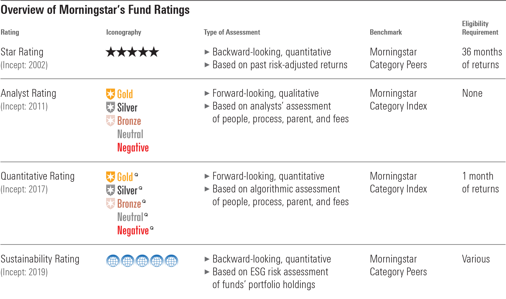

## Table of Contents

## What is Morningstar's rating system?

Morningstar's rating system is a way to help people understand how good a mutual fund or exchange-traded fund (ETF) might be. They give stars, from one to five, with five being the best. The rating looks at how the fund has done in the past compared to similar funds, and also how much risk it took to get those results. It's like a report card for funds, helping investors pick ones that have done well and might keep doing well.

The system uses a lot of math to figure out the ratings. It looks at things like how steady the fund's returns have been over time, and if the fund took big risks to get those returns. Morningstar believes that funds that have done well in the past, without taking too many risks, are more likely to do well in the future. But remember, past results don't guarantee future success, so the ratings are just one tool to help make choices.

## How does Morningstar assign star ratings to funds?

Morningstar gives stars to funds based on how they've done in the past compared to other funds that are similar. They look at the fund's returns over the last three, five, and ten years. If a fund has done better than most of its peers, it gets more stars. The stars go from one to five, with five being the best. So, a fund that's in the top 10% of its group gets five stars, and one in the bottom 10% gets one star.

They also think about how risky the fund was to get those returns. Morningstar doesn't want to give high ratings to funds that took big risks just to look good. They use something called the Morningstar Risk-Adjusted Return to see if the fund's performance was worth the risk. This way, they can tell if a fund did well because it was smart or because it was lucky. But remember, just because a fund did well in the past doesn't mean it will do well in the future. The star rating is just one way to help you pick a fund.

## What are the different categories of funds that Morningstar rates?

Morningstar rates many different types of funds. They look at mutual funds and exchange-traded funds (ETFs) that invest in stocks, bonds, and other things. They have categories for funds that focus on big companies, small companies, companies from certain countries or regions, and even funds that try to do better than the overall market. There are also categories for funds that invest in different kinds of bonds, like government bonds, corporate bonds, and bonds from other countries.

Morningstar also rates funds that mix stocks and bonds, called balanced funds, and funds that try to keep their value steady, called money market funds. They have categories for funds that invest in real estate, commodities, and even funds that use special strategies to try to make money no matter what the market is doing. Each category helps investors find funds that match what they want to invest in and how much risk they're okay with taking.

## How can investors use Morningstar ratings in their investment decisions?

Investors can use Morningstar ratings to help pick funds that might do well in the future. The star rating, from one to five, tells you how a fund has done compared to other similar funds. If a fund has a high rating, like four or five stars, it means it's done better than most other funds in its group. This can help investors feel more confident that the fund might keep doing well. But remember, the ratings are based on the past, and just because a fund did well before doesn't mean it will do well again.

It's also good to look at more than just the star rating. Morningstar gives lots of other information about funds, like how much risk they take and what they invest in. This can help investors understand if a fund fits with their goals and how much risk they're okay with. So, while the star rating is a helpful starting point, it's best to use it along with other information to make smart choices about where to put your money.

## What metrics does Morningstar use to evaluate fund performance?

Morningstar uses different numbers to figure out how well a fund is doing. They look at the fund's returns over the last three, five, and ten years. This helps them see if the fund has been doing better or worse than other similar funds. They also check how steady the fund's returns have been, which means they want to know if the fund goes up and down a lot or stays pretty even. This is important because a fund that goes up and down a lot might be riskier.

Another thing Morningstar looks at is how much risk the fund took to get its returns. They use something called the Morningstar Risk-Adjusted Return to see if the fund's performance was worth the risk. This way, they can tell if a fund did well because it was smart or because it was lucky. By putting all these numbers together, Morningstar can give a fair rating to the fund, helping investors pick funds that might do well in the future.

## How often are Morningstar ratings updated?

Morningstar updates their ratings every month. This means they look at how the funds have been doing over the last month and change the star ratings if needed. By doing this every month, Morningstar makes sure the ratings are as up-to-date as possible, helping investors make choices with the latest information.

The monthly updates are important because the performance of funds can change a lot over time. If a fund starts doing better or worse compared to other similar funds, its rating might go up or down. So, checking the ratings every month helps investors see if their funds are still doing well or if they need to think about changing their investments.

## What are the limitations of Morningstar's rating system?

Morningstar's rating system has some limits that people should know about. The biggest one is that the ratings are based on how funds did in the past. Just because a fund got a lot of stars before doesn't mean it will keep doing well. The future can be different, and what worked before might not work again. So, if someone picks a fund just because it has a high rating, they might be disappointed if the fund doesn't do as well as expected.

Another thing is that the ratings don't tell the whole story. They look at returns and risk, but there are other important things to think about, like how much the fund costs to own, how the people running the fund make their choices, and if the fund fits with what the investor wants to do with their money. If someone only looks at the stars and doesn't check these other things, they might miss out on a fund that could be a better fit for them.

## How does Morningstar's rating system compare to other rating systems?

Morningstar's rating system is different from other rating systems because it uses stars from one to five to show how well a fund has done in the past compared to other similar funds. It looks at the fund's returns over three, five, and ten years and also thinks about how much risk the fund took to get those returns. This makes it easy for people to see at a glance which funds have done better than others. Other rating systems, like those from Lipper or Zacks, might use different ways to rate funds. For example, Lipper gives funds a score based on how they did compared to a group of similar funds, but they use numbers instead of stars. Zacks uses a ranking system from one to five, but they focus more on how the fund might do in the future based on their own research.

One big difference is that Morningstar's ratings are updated every month, which means they are always showing the latest information. This can be really helpful for people who want to keep up with how their funds are doing. Other systems might not update as often, so their ratings might not be as current. Also, Morningstar's system is very clear and easy to understand because of the star ratings, while other systems might use more complicated numbers or scores that can be harder to figure out. But all these systems have the same goal: to help people pick funds that might do well for them.

## What studies have been conducted on the accuracy of Morningstar ratings?

Some studies have looked at how well Morningstar ratings can predict if a fund will do well in the future. One study by researchers at the University of Chicago found that funds with high Morningstar ratings, like four or five stars, did better than funds with lower ratings over the next year. But the difference was small, and the ratings didn't help much after that first year. This means that while the ratings can give a little bit of help in picking funds, they don't tell the whole story about what might happen in the future.

Another study by Morningstar itself looked at how their ratings worked over a longer time. They found that funds with higher ratings did tend to do better than funds with lower ratings over three, five, and ten years. But they also said that the ratings are just one tool and should be used with other information. Both studies show that Morningstar ratings can be useful, but they are not perfect and should not be the only thing people look at when choosing where to invest their money.

## How have Morningstar ratings performed in predicting long-term fund performance?

Morningstar ratings have been studied to see if they can predict how well funds will do over a long time. A study by Morningstar themselves found that funds with higher ratings, like four or five stars, did better than funds with lower ratings over three, five, and ten years. This means that if you picked a fund with a high rating, it might have a better chance of doing well over a long time compared to a fund with a low rating. But, the study also said that the ratings are just one tool and should be used with other information to make the best choices.

However, another study by researchers at the University of Chicago found that the advantage of high Morningstar ratings didn't last very long. They saw that funds with high ratings did a bit better than funds with low ratings in the first year after the rating was given. But after that first year, the ratings didn't help much in picking funds that would do well. This shows that while Morningstar ratings can give some help in choosing funds, they are not perfect and should not be the only thing people look at when deciding where to invest their money.

## What are the criticisms and controversies surrounding Morningstar's rating methodology?

Some people say that Morningstar's way of giving stars to funds has problems. One big criticism is that the ratings look at the past, not the future. Just because a fund did well before doesn't mean it will do well again. This can trick people into thinking a fund with lots of stars is a sure bet, when really it's not. Another problem is that the ratings don't think about how much the fund costs to own. A fund might have a high rating but also high fees, which can eat into the money you make from it.

There's also been some talk about how Morningstar decides which funds are similar to each other. If they put a fund in the wrong group, it might get a rating that doesn't really show how well it's doing. Some people also think that the ratings can change a lot from month to month, which can make it hard to know if a fund is really good or just having a good month. So, while the star ratings can be helpful, they're not perfect and should be used with other information to make the best choices.

## How can the accuracy of Morningstar ratings be statistically analyzed and improved?

To check how accurate Morningstar ratings are, people can look at numbers over time to see if funds with more stars do better than funds with fewer stars. They can use something called regression analysis to see if there's a link between the star rating and how the fund does in the future. They might also look at how often the ratings change and if those changes really mean the fund will do better or worse. If they find that the ratings don't help much in picking good funds, they could think about adding more information to the ratings, like the cost of owning the fund or how the people running the fund make their choices.

To make the ratings better, Morningstar could start thinking about more than just past returns and risk. They could add things like the fees the fund charges, because high fees can take away from the money you make. They might also look at how the fund fits with different kinds of investors, like people who want to invest for a long time versus people who need their money soon. By using more information, Morningstar could give ratings that help people pick funds that will do well in the future, not just funds that did well in the past.

## What is the Morningstar Rating System and how does it work?

Morningstar's rating system is a cornerstone of investment analysis, offering a quantitative evaluation of mutual funds and Exchange-Traded Funds (ETFs). The system is pivotal in helping investors make informed decisions by allocating star ratings based on a fund's past performance relative to its peers. This methodology, rooted in risk-adjusted returns, represents a comprehensive approach to assessing fund quality.

The simplicity and ease of use of Morningstar's star ratings have contributed significantly to its widespread adoption. Investors can quickly gauge the quality of a fund at a glance; a five-star rating denotes superior relative performance, indicating a fund has outperformed the majority of comparable options. This intuitive system enhances the accessibility of investment analysis, catering to both seasoned investors and novices alike.

The star ratings are calculated using risk-adjusted returns, a metric that evaluates the excess return of a fund relative to its risk. Specifically, Morningstar employs the following formula to determine these ratings:

$$
Rating = \frac{\text{Fund's excess return}}{\text{Fund's risk}}
$$

In assessing funds, Morningstar adjusts for the fund's level of risk by considering standard deviation and other risk measures, thereby offering a balanced view of performance. A higher rating indicates that a fund has achieved a better return for its risk level compared to similar investments.

Despite its benefits, the Morningstar rating system is not without criticism. One major point of contention is its reliance on historical data. Critics argue that while historical performance provides valuable insights, it does not necessarily predict future outcomes. Factors such as managerial changes, economic shifts, or global events can significantly alter a fund's trajectory. This limitation underscores the necessity of employing the rating system as part of a broader, diversified analytical framework. 

In summary, while Morningstar's rating system remains a valuable tool for evaluating investment funds, investors should remain cognizant of its limitations and complement it with additional analysis when making decisions.

## References & Further Reading

[1]: ["Morningstar's Rating Methodology"](https://www.morningstar.com/content/dam/marketing/shared/research/methodology/771945_Morningstar_Rating_for_Funds_Methodology.pdf) - Official Morningstar documentation on their rating system.

[2]: Aldridge, I. (2009). ["High-Frequency Trading: A Practical Guide to Algorithmic Strategies and Trading Systems"](https://www.ahmetbeyefendi.com/wp-content/uploads/2020/07/High-Frequency-Trading-Irene-Aldridge.pdf) - A comprehensive guide on HFT and algorithmic trading.

[3]: Kirilenko, A.A., Kyle, A.S., Samadi, M., & Tuzun, T. (2017). ["The Flash Crash: High‐Frequency Trading in an Electronic Market"](https://onlinelibrary.wiley.com/doi/abs/10.1111/jofi.12498) - Review of Financial Studies, 30(7), 2221-2228.

[4]: ["Python for Finance: Mastering Data-Driven Finance"](https://www.amazon.com/Python-Finance-Mastering-Data-Driven/dp/1492024333) by Yves Hilpisch - A resource on using Python for financial data analysis and trading.

[5]: ["Algorithmic and High-Frequency Trading"](https://www.amazon.com/Algorithmic-High-Frequency-Trading-Mathematics-Finance/dp/1107091144) by Álvaro Cartea, Sebastian Jaimungal, and José Penalva - A text analyzing the math and impacts of algorithmic trading.
