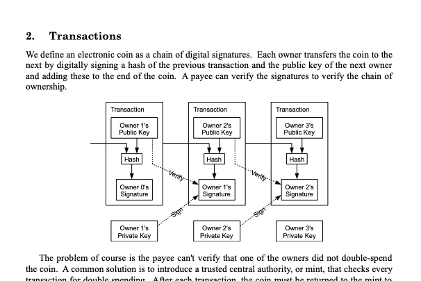

## Table of Contents

## What is the Nakamoto White Paper?

The Nakamoto White Paper is a document written by someone using the name Satoshi Nakamoto. It was published in 2008 and explains how to create a new type of money called Bitcoin. This money is different because it doesn't need banks or governments to work. Instead, it uses a special technology called blockchain to keep track of who owns the money.

The white paper is important because it started the idea of cryptocurrencies. Before this paper, people didn't think it was possible to have money that worked without a central authority. The ideas in the paper have led to many other types of cryptocurrencies and have changed how people think about money and technology.

## Who is Satoshi Nakamoto?

Satoshi Nakamoto is the name used by the person or group of people who created Bitcoin. We don't know for sure who Satoshi Nakamoto really is. Some people think it might be one person, while others believe it could be a team of people working together. Satoshi Nakamoto kept their identity a secret and used the internet to share ideas about Bitcoin.

Satoshi Nakamoto wrote the Nakamoto White Paper in 2008, which explained how Bitcoin could work. After starting Bitcoin, Satoshi Nakamoto helped make it better for a few years. Then, in 2010, Satoshi Nakamoto stopped talking to people and disappeared. Even though we don't know who Satoshi Nakamoto is, their ideas have changed the world of money and technology.

## What is the main purpose of the Bitcoin white paper?

The main purpose of the Bitcoin white paper is to explain how Bitcoin works and why it's important. The paper was written by Satoshi Nakamoto and shared in 2008. It talks about a new kind of money that doesn't need banks or governments to work. Instead, it uses something called blockchain, which is like a special list that keeps track of who owns the money.

The white paper was important because it started the idea of cryptocurrencies. Before this paper, people didn't think it was possible to have money that worked without a central authority. The ideas in the paper have led to many other types of cryptocurrencies and have changed how people think about money and technology. It's like a guidebook that showed the world a new way to think about and use money.

## How does Bitcoin solve the double-spending problem?

Bitcoin solves the double-spending problem by using a special technology called blockchain. The double-spending problem happens when someone tries to spend the same money twice. In traditional money systems, banks and governments stop this from happening. But Bitcoin doesn't have banks or governments, so it needs a different way to make sure money is spent only once.

The blockchain is like a big list that everyone can see. Every time someone sends Bitcoin, the information is added to this list. Once the information is on the list, it can't be changed. This means if someone tries to spend the same Bitcoin again, the system will know because it can check the list. This way, Bitcoin makes sure that money is only spent once, solving the double-spending problem.

## What is the significance of the blockchain technology described in the white paper?

The blockchain technology described in the Bitcoin white paper is very important because it is the main thing that makes Bitcoin work. Blockchain is like a special list that keeps track of all the Bitcoin transactions. It's different from normal lists because once something is written on it, it can't be changed. This makes it very safe and helps stop people from cheating, like spending the same Bitcoin twice. Without blockchain, Bitcoin wouldn't be able to work without banks or governments.

Because of the white paper, many people started to see how useful blockchain could be. Now, blockchain is used for more than just Bitcoin. People use it for things like keeping track of who owns what, making contracts that can't be changed, and even voting in a safe way. The ideas from the white paper have helped create a lot of new technology and have changed how we think about keeping information safe and fair.

## How does the Bitcoin network achieve consensus?

The Bitcoin network achieves consensus through a process called mining. Miners are people who use powerful computers to solve hard math problems. When a miner solves a problem, they get to add a new block of transactions to the blockchain. This block is like a page in a big book that everyone can see. If most of the miners agree that the new block is correct, it gets added to the blockchain. This way, everyone in the Bitcoin network agrees on what transactions have happened.

This system of mining helps keep the network honest. If someone tries to cheat by adding fake transactions, the other miners won't agree with the new block. Because there are so many miners, it's very hard for one person to control the whole network. This makes it very safe and fair. By working together, the miners make sure that the Bitcoin network stays trustworthy and everyone agrees on what's true.

## What are the key components of the Bitcoin protocol as outlined in the white paper?

The Bitcoin white paper outlines several key components that make up the Bitcoin protocol. One of the main parts is the blockchain, which is like a big list that keeps track of all the Bitcoin transactions. This list is very special because once something is written on it, it can't be changed. This helps stop people from cheating, like spending the same Bitcoin twice. Another important part is the mining process. Miners are people who use powerful computers to solve hard math problems. When a miner solves a problem, they get to add a new block of transactions to the blockchain. This helps everyone in the Bitcoin network agree on what transactions have happened.

Another key component is the idea of peer-to-peer transactions. This means that people can send Bitcoin to each other directly, without needing banks or governments to help. The white paper also talks about digital signatures, which are like special codes that prove who owns the Bitcoin and that a transaction is real. Together, these parts make Bitcoin work without a central authority, which is a big change from how money usually works. The white paper explains how all these pieces fit together to create a new way to use money that is safe, fair, and doesn't need anyone in charge.

## How does the white paper address the issue of scalability?

The Bitcoin white paper doesn't talk much about how to make Bitcoin work faster or handle more transactions. It focuses more on explaining the basic ideas behind Bitcoin, like how it can work without banks and how it keeps transactions safe. The white paper mentions that the system is designed to work well even if it gets very busy, but it doesn't give a lot of details on how to make it faster as more people start using it.

Since the white paper came out, people have been working on ways to make Bitcoin more scalable. They've come up with ideas like the Lightning Network, which is like a special path for quick transactions that don't need to be written on the main blockchain. These ideas help Bitcoin handle more transactions without slowing down, but they weren't part of the original plan in the white paper. The white paper laid the groundwork for Bitcoin, and now people are building on that to make it even better.

## What are the security measures proposed in the Bitcoin white paper?

The Bitcoin white paper talks about a few important ways to keep the system safe. One big idea is using something called a blockchain. The blockchain is like a big list that everyone can see, and once something is written on it, it can't be changed. This makes it hard for people to cheat, like spending the same Bitcoin twice. Another way to keep things safe is through a process called mining. Miners use powerful computers to solve hard math problems, and when they do, they get to add new transactions to the blockchain. If someone tries to add fake transactions, the other miners won't agree, making it very hard for anyone to control the whole network.

The white paper also talks about using digital signatures to make sure transactions are real. A digital signature is like a special code that proves who owns the Bitcoin and that the transaction is coming from the right person. This helps stop people from pretending to be someone else and spending Bitcoin they don't own. By combining these ideas, the Bitcoin white paper explains how the system can stay safe and fair without needing anyone in charge. These security measures make sure that everyone in the Bitcoin network can trust that the transactions are honest and correct.

## How has the implementation of Bitcoin deviated from the original white paper?

Since the Bitcoin white paper was published, there have been some changes in how Bitcoin is actually used and built. One big difference is how Bitcoin deals with more people using it. The white paper didn't talk much about making Bitcoin faster or able to handle more transactions. But as more people started using Bitcoin, they needed ways to make it work better. So, people came up with ideas like the Lightning Network, which is like a special path for quick transactions that don't need to be written on the main blockchain. This wasn't in the original plan but has helped Bitcoin handle more use.

Another change is in how the Bitcoin community makes decisions. The white paper talked about miners agreeing on what's true, but it didn't explain how people would decide on changes to the system. Over time, Bitcoin users and developers have created ways to discuss and vote on changes, like through something called a "soft fork" or "hard fork." These are ways to update Bitcoin without everyone having to agree right away. The white paper gave the basic ideas for Bitcoin, but the way it's been built and used has grown and changed a lot since then.

## What are the criticisms and limitations of the Nakamoto White Paper?

The Nakamoto White Paper has been praised for starting Bitcoin and the idea of cryptocurrencies, but it also has some criticisms and limitations. One big criticism is that it doesn't talk much about how to make Bitcoin work faster as more people use it. The white paper focuses on the basic ideas of Bitcoin, like how it can work without banks and keep transactions safe, but it doesn't give a lot of details on how to make it handle more transactions without slowing down. This has been a big challenge for Bitcoin as it has grown, and people have had to come up with new ideas, like the Lightning Network, to solve this problem.

Another limitation is that the white paper doesn't explain how the Bitcoin community should make decisions about changes to the system. It talks about miners agreeing on what's true, but it doesn't go into how people would decide on updates or improvements. This has led to some disagreements and splits in the Bitcoin community over the years. People have had to create new ways, like soft forks and hard forks, to update Bitcoin and keep everyone on the same page. Even though the white paper laid the groundwork for Bitcoin, these issues show that the real world of using and building Bitcoin has been more complicated than the original plan.

## How has the Nakamoto White Paper influenced subsequent blockchain and cryptocurrency developments?

The Nakamoto White Paper has had a big influence on how people think about money and technology. It started the idea of cryptocurrencies by showing that you could have money that works without banks or governments. This was a new way to think about money, and it led to lots of other cryptocurrencies being created. People saw that the ideas in the white paper could be used for more than just Bitcoin. They started using blockchain, the special list that keeps track of transactions, for things like keeping records of who owns what, making contracts that can't be changed, and even voting in a safe way. The white paper opened up a whole new world of possibilities for technology and finance.

Because of the white paper, many new projects and ideas have come out. Some people made new cryptocurrencies that tried to fix some of Bitcoin's problems, like making transactions faster or using less energy. Others took the idea of blockchain and used it for different things, like supply chains to track where products come from, or in healthcare to keep patient records safe. The white paper showed that you could build systems that are open and fair, where everyone can see what's happening and agree on what's true. This has changed how people think about trust and security in technology, and it's still influencing new ideas and projects today.

## References & Further Reading

[1]: Nakamoto, S. (2008). ["Bitcoin: A Peer-to-Peer Electronic Cash System."](https://nakamotoinstitute.org/library/bitcoin/)

[2]: Antonopoulos, A. M. (2017). ["Mastering Bitcoin: Unlocking Digital Cryptocurrencies."](https://books.google.com/books/about/Mastering_Bitcoin.html?id=IXmrBQAAQBAJ) O'Reilly Media.

[3]: Vigna, P., & Casey, M. J. (2016). ["The Age of Cryptocurrency: How Bitcoin and Digital Money Are Challenging the Global Economic Order."](https://www.amazon.com/Age-Cryptocurrency-Blockchain-Challenging-Economic/dp/1250081556) St. Martin's Griffin.

[4]: Dwyer, G. (2015). ["The economics of Bitcoin and similar private digital currencies."](https://www.sciencedirect.com/science/article/pii/S1572308914001259) Journal of Financial Stability, 17, 81-91.

[5]: Franco, P. (2015). ["Understanding Bitcoin: Cryptography, Engineering and Economics."](https://www.wiley.com/en-us/Understanding+Bitcoin%3A+Cryptography%2C+Engineering+and+Economics-p-9781119019169) Wiley.