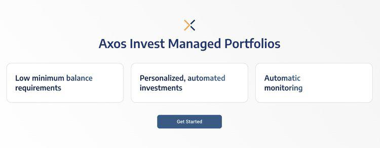

In 2024, Axos Managed Portfolios has emerged as a formidable player in the automated investing sector. As technological advancements continue to redefine financial strategies, robo-advisors like Axos have gained prominence by offering automated, user-centric platforms tailored to meet the needs of both novice and seasoned investors. With the inherent complexity of financial markets, automating investment decisions through sophisticated algorithms ensures consistency and efficiency, allowing users to pursue financial objectives with minimized manual intervention.

Axos Managed Portfolios present an intriguing blend of features and services that merit detailed evaluation. Its platform is designed to aid investors in navigating the intricacies of the market by providing customizable investment options and competitive fee structures. The introduction of algorithmic trading within Axos' offerings allows for optimized portfolio management, enhancing the potential for diversified and risk-adjusted returns. This article aims to thoroughly assess Axos Managed Portfolios by analyzing its distinguishing features, cost structures, advantages and disadvantages, and a comparative analysis with other notable robo-advisors. Additionally, the article will investigate the role and impact of algorithmic trading on investment outcomes, positioning Axos as a robust choice for the current financial landscape.



As investors increasingly seek solutions that balance complexity with accessibility, understanding what Axos Managed Portfolios offers in the spectrum of robo-advisory services is crucial. The integration of algorithmic strategies not only augments the investment process but also facilitates tax-efficient and goal-oriented investment planning. Through this examination, we aim to provide insights into why Axos Managed Portfolios stands out as a potentially valuable option in 2024 for those looking to optimize their financial strategies through modern technology.

## Table of Contents

## Axos Managed Portfolios Overview

Axos Managed Portfolios provides a comprehensive platform tailored for investors who aim to achieve efficient and low-cost investment management. Distinguished by its economical fee structure, Axos sets a competitive account minimum of $500, accompanied by a management fee of 0.24% of assets under management. This makes it accessible for both entry-level and seasoned investors who are conscientious about minimizing costs.

The platform is designed to support a broad spectrum of investment goals, facilitating tools that cater to both immediate and future financial objectives. Users are empowered with the flexibility to customize their investment portfolios from a diverse selection of over 30 asset classes. This extensive choice allows for precision in aligning investment strategies with individual risk tolerances and financial aspirations.

Recent enhancements have expanded the platform's capabilities, focusing on portfolio optimization and comprehensive financial management. These updates enable more efficient allocation and reallocation of assets within a portfolio, reflecting changes in market conditions and personal financial needs. By incorporating advanced algorithmic features and intelligent financial planning tools, Axos Managed Portfolios strives to equip investors with the resources needed to optimize their portfolios for both profitability and risk management.

Such innovations are indicative of Axos's commitment to providing user-centric solutions that not only meet but anticipate the evolving demands of modern investors. Through robust portfolio customization options and up-to-date financial management tools, Axos ensures that investors are well-positioned to manage their investments effectively and strategically in 2024 and beyond.

## Features and Tools

Axos Managed Portfolios offers a range of features designed to provide investors with flexibility and comprehensive portfolio management capabilities. One significant advantage of the platform is its ability to support multiple unique portfolios, allowing users to tailor their investment strategies according to personal preferences and financial goals. This flexibility enables investors to diversify their holdings across different asset classes and sectors, potentially enhancing returns and mitigating risks.

The platform incorporates several advanced tools, such as tax-loss harvesting and automatic rebalancing, which are essential for maintaining an efficient and effective portfolio. Tax-loss harvesting helps in reducing taxable income by offsetting gains with losses, thereby optimizing tax efficiency. Automatic rebalancing ensures that portfolios remain aligned with the investor's target allocations, adjusting for market fluctuations to maintain intended risk levels without manual intervention.

Furthermore, Axos Managed Portfolios provides robust goal-planning tools, enabling users to set and track various financial objectives. Whether planning for retirement, buying a home, or accumulating savings for education, these tools facilitate a structured approach to achieving specific financial milestones. The platform's all-in-one mobile app enhances user experience by offering a consolidated view of both internal and external accounts. By syncing numerous financial accounts, investors can conveniently manage and monitor their complete financial landscape in one place, ensuring cohesive strategy implementation.

Investors also benefit from a suite of calculators available on the Axos platform, which assist in planning for retirement, savings, and mortgage scenarios. These calculators are invaluable in projecting future financial needs and evaluating different investment scenarios, aiding in informed decision-making. By leveraging these features, Axos Managed Portfolios empowers investors to construct diverse, tax-efficient portfolios aligned with their individual financial goals.

## Pros and Cons

Axos Managed Portfolios offers several advantages that make it a compelling option for investors seeking automated investment solutions. One of the key benefits is its low management fees, set at 0.24% of assets under management, which is competitive among robo-advisors. This low-cost structure enables investors to retain a more significant portion of their returns over time.

Additionally, Axos Managed Portfolios includes tax optimization features, such as tax-loss harvesting, which can help investors minimize tax liability and improve after-tax returns. This feature is particularly advantageous for those in higher tax brackets or with taxable accounts, as it allows for strategic offsetting of gains with losses.

The platform's extensive customization options also stand out. It supports the creation of multiple unique portfolios, allowing users to tailor their investment strategies according to their specific financial goals and risk tolerance. With access to over 30 asset classes, investors can effectively diversify their portfolios to align with their preferences.

Axos Managed Portfolios facilitate a comprehensive financial overview by integrating internal and external accounts. This capability provides users with a consolidated view of their financial situation, enabling more informed investment decisions and better financial planning.

However, there are some limitations associated with the platform. The range of account types is somewhat restricted, primarily focusing on individual investment accounts and IRAs. This limitation may deter investors seeking other types of financial accounts or specialized services.

Moreover, the user interface of Axos Managed Portfolios may not be as intuitive as some of its competitors, potentially presenting a learning curve for new users. Additionally, the absence of direct financial advisor support can be a drawback for investors who prefer personalized guidance and advice in managing their portfolios. These drawbacks must be weighed against the platform's benefits when considering Axos Managed Portfolios as an investment solution.

## Algorithmic Trading in Axos Managed Portfolios

Algorithmic trading plays a fundamental role in managing Axos Managed Portfolios through the use of automated trading systems that execute buy and sell decisions following predefined strategies. This advanced technology leverages quantitative models to identify market efficiencies, effectively optimizing the process of portfolio rebalancing. The goal is to minimize risks and enhance returns by systematically adjusting asset allocations in response to market changes and user-defined parameters.

By employing algorithmic solutions, Axos facilitates strategic trading that resonates with individual investor objectives and risk tolerance levels. The algorithms assess multiple market indicators, such as price movements and trading volumes, to enact trades that align with the investor's financial goals. This systematic approach reduces human error and removes emotional biases, ensuring more objective investment decisions.

The benefits of [algorithmic trading](/wiki/algorithmic-trading) within Axos Managed Portfolios include improved consistency of performance and enhanced tax efficiency. Algorithms can continuously monitor portfolios, enabling timely rebalancing and the harvesting of tax losses, which can lower the investor's taxable capital gains. As a result, algorithmic trading supports the achievement of a more stable and tax-efficient investment strategy that can adapt over time as markets fluctuate and user objectives evolve.

In addition to risk management, algorithm-driven strategies can incorporate modern portfolio theory principles, optimizing portfolios for expected returns given a specified level of risk. This involves calculating the expected risk and return for various asset combinations and selecting those that maximize expected return for a given risk level, potentially implemented through convex optimization problems. These principles, encoded in advanced algorithms, facilitate the creation of robust, dynamic investment strategies that are mathematically validated. 

Here's a simple example of how a Python algorithm could be structured to optimize a portfolio based on expected return and risk:

```python
import numpy as np
import cvxpy as cp

# Define expected returns and covariances
expected_returns = np.array([0.1, 0.12, 0.14])
cov_matrix = np.array([[0.1, 0.02, 0.04],
                       [0.02, 0.08, 0.06],
                       [0.04, 0.06, 0.15]])

# Define portfolio weights variable
weights = cp.Variable(len(expected_returns))

# Define constraints
constraints = [cp.sum(weights) == 1, weights >= 0]

# Define objective function for risk minimization
objective = cp.Minimize(cp.quad_form(weights, cov_matrix))

# Setup the problem
problem = cp.Problem(objective, constraints)

# Solve the problem
problem.solve()

# Optimal portfolio
optimal_weights = weights.value
print("Optimal Portfolio Weights:", optimal_weights)
```

In this code, the `cvxpy` library helps solve the optimization problem where the goal is to minimize portfolio risk subject to constraints. Such algorithmic approaches are integral to the strategies employed by Axos Managed Portfolios to ensure investment decisions are both robust and adaptive.

## Comparison with Other Robo-Advisors

Axos Managed Portfolios offers attractive features such as flexible portfolio options and low management fees, which place it in favorable competition with other robo-advisors like SoFi and Wealthfront. One significant advantage Axos holds over its competitors is its emphasis on tax efficiency and customization options, which are critical for investors focused on optimizing their financial strategies.

While other services might present similar features, Axos’s competitive 0.24% annual fee for assets under management can be seen as a decisive [factor](/wiki/factor-investing) for cost-conscious investors. For comparison, Wealthfront charges a similar management fee of 0.25%[1], and SoFi offers no management fees, potentially making it more appealing for those primarily cost-driven[2]. However, Axos distinguishes itself with its advanced tax-loss harvesting and automatic rebalancing capabilities, which can lead to improved after-tax returns.

Account minimums are another point of differentiation. Axos requires a minimum initial investment of $500, whereas Wealthfront has a minimum requirement of $500[3], aligning closely with Axos. In contrast, SoFi's lack of a minimum threshold provides a more accessible entry point for new investors who may have limited initial capital[4]. This variation in account requirements means that while Axos offers stronger portfolio optimization techniques, potential investors must consider their initial funding capacity.

Further, the diversity of investment account types is a notable factor when comparing robo-advisors. While Axos primarily focuses on individual investment accounts and IRAs, Wealthfront offers a broader array of account types, including 529 college savings plans and trusts[5]. SoFi also provides diverse financial products but concentrates more on integration with financial services such as loans and credit solutions[6].

Thus, while Axos Managed Portfolios excels through customized investment strategies and tax optimization, its competitors may offer more diverse account options and potentially lower barriers to entry. This positions Axos favorably for investors who prioritize detailed financial strategies and are willing to meet its initial investment threshold.

**References**
1. Wealthfront - Pricing and Fees.
2. SoFi - Pricing and Fees.
3. Wealthfront - Account Minimums.
4. SoFi - Pricing and Fees.
5. Wealthfront - Account Types.
6. SoFi - Financial Integration and Services.

## Conclusion

Axos Managed Portfolios remains a significant player in the competitive robo-advisory landscape, especially appealing to investors prioritizing customization and tax efficiency in their investment strategies. The integration of algorithmic trading within Axos Managed Portfolios significantly elevates the platform's portfolio management capabilities, offering distinct strategic advantages that align with diverse investor goals. Algorithmic trading allows for precise execution of investment strategies, optimizing asset allocation, and ensuring tax-efficient practices, which can contribute to improved overall performance.

Despite some notable limitations, such as a narrower range of account types and an interface that might not be as user-friendly as some competitors, Axos presents a compelling option in 2024. The platform's robust features, including tax-loss harvesting and portfolio customization, offset these drawbacks to a considerable extent. For investors, particularly those who seek detailed control over their investment processes and tax implications, Axos stands out for its ability to deliver both.

Ultimately, the decision to utilize Axos Managed Portfolios should be rooted in a thorough evaluation of one's specific investment goals and personal preferences. For investors who value strategic customization and tax optimization, Axos Managed Portfolios is an apt choice. Understanding one's financial strategies and objectives is vital, and Axos offers tools that empower investors to align their portfolios effectively with these aims.

## References & Further Reading

[1]: Bergstra, J., Bardenet, R., Bengio, Y., & Kégl, B. (2011). ["Algorithms for Hyper-Parameter Optimization."](https://papers.nips.cc/paper/4443-algorithms-for-hyper-parameter-optimization) Advances in Neural Information Processing Systems.

[2]: Lopez de Prado, M. (2018). ["Advances in Financial Machine Learning."](https://www.amazon.com/Advances-Financial-Machine-Learning-Marcos/dp/1119482089) Wiley.

[3]: Aronson, D. R. (2006). ["Evidence-Based Technical Analysis: Applying the Scientific Method and Statistical Inference to Trading Signals."](https://www.amazon.com/Evidence-Based-Technical-Analysis-Scientific-Statistical/dp/0470008741) Wiley.

[4]: Jansen, S. (2018). ["Machine Learning for Algorithmic Trading."](https://github.com/stefan-jansen/machine-learning-for-trading) Packt Publishing.

[5]: Chan, E. P. (2009). ["Quantitative Trading: How to Build Your Own Algorithmic Trading Business."](https://github.com/ftvision/quant_trading_echan_book) John Wiley & Sons.