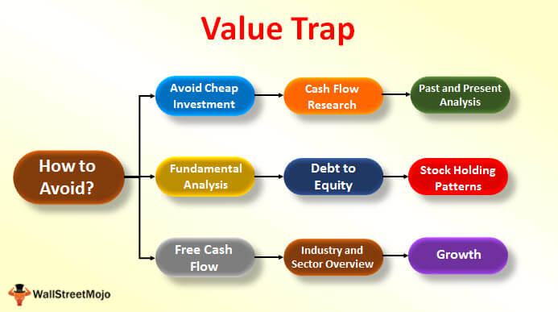

Navigating the stock market can be both an exciting and daunting task, especially when searching for investment opportunities in cheap stocks. The appeal of acquiring shares at a low cost can lure investors with the promise of significant returns and the potential for substantial financial gains. However, this allure of low-priced stocks often masks hidden pitfalls, known as value traps, which can significantly impact investment outcomes.

Value traps are stocks that appear undervalued based on their market price and valuation multiples, such as price-to-earnings (P/E) ratios. At first glance, these stocks seem like bargains ripe for acquisition. Yet, beneath their attractive pricing lie underlying weaknesses and risks that may hinder future performance, making them deceptive investments. Recognizing these traps is crucial for investors seeking to make informed decisions and maximize their returns.



This article aims to explore the dynamics of investing in cheap stocks, providing a comprehensive understanding of value traps. By equipping investors with the knowledge to identify and avoid potential investment pitfalls, we seek to enhance their decision-making capabilities. Furthermore, we will discuss how algorithmic trading methods can influence decisions in navigating these complex market situations. Algorithmic trading, using advanced models and quantitative data analysis, offers tools to detect potential value traps, although it should be combined with traditional analytical methods for comprehensive strategies. 

As we progress through this analysis, the objective is to provide investors with actionable insights and strategies that bridge the gap between the allure of low-cost investments and the necessity of thorough financial evaluation.

## Table of Contents

## The Appeal of Cheap Stocks

Cheap stocks, or those trading at low valuation multiples, hold a particular appeal for investors seeking substantial returns with limited upfront investment. These stocks are often characterized by low price-to-earnings (P/E) ratios, which can suggest they are undervalued compared to their earnings potential. This metric is calculated as:

$$
\text{P/E Ratio} = \frac{\text{Market Price per Share}}{\text{Earnings per Share (EPS)}}
$$

A low P/E ratio might imply that a stock is undervalued, particularly if the company has stable earnings or growth potential not yet recognized by the market. This perceived undervaluation can make such stocks attractive to investors who anticipate that the market will eventually recognize this potential, leading to price increases and substantial capital gains.

Investors are generally drawn to cheap stocks by the allure of acquiring more shares with a limited budget. The notion that these stocks might rebound, either due to market corrections or improvements in the company's business conditions, adds to their attractiveness. For example, if a stock is priced at $5, an investor can purchase 200 shares with a $1,000 investment, compared to buying only 10 shares of a stock priced at $100.

However, the assumption that a low-priced stock will automatically translate into high future returns is a misconception. The market price of a stock incorporates a multitude of factors, and a low price does not necessarily reflect its underlying potential or intrinsic value. It is essential for investors to recognize that some companies may have low stock prices due to valid reasons, such as declining business operations, heightened competition, or broader industry challenges.

Thus, while cheap stocks may initially appear to be attractive opportunities for achieving substantial gains, it is crucial for investors to conduct comprehensive evaluations beyond basic valuation metrics. A rigorous assessment of the company’s financial health, market position, and potential growth drivers is necessary to truly gauge whether an investment in a low-priced stock is justified or if it may instead represent a potential pitfall.

## Understanding Value Traps

A value trap occurs when a stock appears attractive because of its low valuation multiples, yet its seemingly favorable metrics are misleading. Investors frequently fall into value traps because they rely on superficial performance indicators that obscure deeper, more problematic aspects of a company. Such traps can result in suboptimal investment outcomes and financial losses.

To avoid value traps, it's essential to understand their common characteristics. Low growth potential is a significant red flag. Companies trapped in stagnant growth often find it difficult to generate increasing revenues or expand operations effectively. This stagnation may result from competitive pressures, lack of innovation, or unfavorable market dynamics.

Declining revenues serve as another telltale sign of a value trap. A consistent decrease in a company's revenues can indicate a failure to adapt to market demands or a loss of market share. Such declines should prompt a more detailed examination of the company's business model and industry positioning.

High levels of debt relative to equity and earnings accentuate the risks associated with value traps. Overleveraged companies may face constrained cash flows, hindering their ability to invest in growth opportunities or weather economic downturns. This financial fragility can also elevate the risk of default, further eroding shareholder value.

Investors must undertake meticulous due diligence to differentiate between true value investments and traps. This process involves analyzing financial statements, understanding the competitive landscape, and assessing management's strategic vision. By conducting a comprehensive evaluation, investors can better ascertain whether a stock's low valuation is due to temporary challenges or more fundamental issues.

Furthermore, qualitative factors such as changes in consumer behavior, regulatory shifts, and technological disruptions should also be considered. These elements can significantly influence a company's long-term prospects and highlight potential vulnerabilities overlooked by quantitative analysis alone.

By integrating both qualitative and quantitative analyses, investors can enhance their ability to identify genuine investment opportunities while avoiding the pitfalls of value traps. This balanced approach not only mitigates risk but also contributes to more informed and strategic investment decisions.

## Indicators of Value Traps

Declining revenues and shrinking profit margins often serve as early indicators of a potential value trap. These financial metrics can signal underlying issues within a company that might not be readily apparent from its stock price alone. For instance, declining revenues may result from a reduction in market demand, competitive pressures, or operational inefficiencies, which ultimately undermine a company's financial health and ability to generate future profits.

Overleveraged companies present another significant risk, characterized by high debt levels relative to their equity and earnings. This scenario can be mathematically expressed through the debt-to-equity (D/E) ratio and the interest coverage ratio. A high D/E ratio indicates excessive leverage, while a low interest coverage ratio suggests that the company's earnings are insufficient to cover its interest obligations. Here is a simple Python snippet to compute these ratios:

```python
def calculate_debt_equity_ratio(total_debt, total_equity):
    return total_debt / total_equity

def calculate_interest_coverage_ratio(earnings_before_interest_and_taxes, interest_expense):
    return earnings_before_interest_and_taxes / interest_expense

# Example values
total_debt = 500000
total_equity = 300000
earnings_before_interest_and_taxes = 80000
interest_expense = 20000

de_ratio = calculate_debt_equity_ratio(total_debt, total_equity)
interest_coverage = calculate_interest_coverage_ratio(earnings_before_interest_and_taxes, interest_expense)

print("Debt-to-Equity Ratio:", de_ratio)
print("Interest Coverage Ratio:", interest_coverage)
```

Lack of catalysts, such as product innovation or geographic expansion, can lead to a stagnation in stock performance. Without new growth opportunities, a company may fail to attract investor interest, resulting in a prolonged undervaluation or decline in stock price. Companies need to demonstrate clear pathways for growth to maintain investor confidence and drive stock appreciation.

Furthermore, a company with a high level of insider ownership and insufficient institutional backing may be perceived as a riskier investment. High insider ownership could imply that management is reluctant to dilute their control, which might deter external investments. While insider confidence can be seen as a positive sign, the absence of institutional investors might indicate a lack of broader market validation and support.

Identifying these indicators requires thorough analysis. Investors need to scrutinize financial statements, monitor industry trends, and assess the strategic moves of the companies they are interested in to make informed investment decisions.

## Role of Algorithmic Trading

Algorithmic trading, a methodology that employs automated software to execute trades based on pre-set criteria, has gained prominence in the financial markets. By utilizing complex computational models, [algorithmic trading](/wiki/algorithmic-trading) systems can analyze vast amounts of quantitative data to identify patterns and signals that may indicate value traps. Value traps are stocks that seem attractively priced but harbor underlying issues that could hinder their growth potential.

### Data Analysis and Pattern Recognition

Algorithmic trading systems excel at processing large datasets, allowing them to identify correlations and patterns that are not easily discernible through manual analysis. For example, algorithms can be programmed to recognize particular financial metrics or market behaviors that historically precede value traps. By analyzing variables such as price movements, trading volumes, and historical [volatility](/wiki/volatility-trading-strategies), algorithms can provide insights into potential investment pitfalls. A simple Python example to illustrate algorithmic pattern recognition might involve using a moving average to determine price trends:

```python
import pandas as pd

def moving_average(data, window_size):
    return data.rolling(window=window_size).mean()

# Example usage: calculating a 20-day moving average
price_data = pd.Series([100, 102, 101, 98, 105, 110, 108, 112, 115, 117])
moving_avg = moving_average(price_data, 20)
```

### Quantitative Models for Forecasting

Advanced algorithmic models employ statistical techniques and [machine learning](/wiki/machine-learning) algorithms to forecast stock movements. These models can incorporate a wide range of data, including financial ratios, economic indicators, and sentiment analysis derived from news and social media. By predicting future price trends and financial performance, these models aid in distinguishing genuine value stocks from potential value traps.

However, reliance solely on algorithms can lead to erroneous investment outcomes. Algorithms, while adept at handling quantitative data, may not fully account for qualitative factors such as management decisions or regulatory changes that could impact a company's prospects.

### Balancing Algorithmic and Traditional Analysis

A well-rounded investment strategy integrates algorithmic insights with traditional [fundamental analysis](/wiki/fundamental-analysis). Fundamental analysis involves examining a company's financial statements, market position, and competitive landscape to assess its intrinsic value. This comprehensive approach ensures that investors are not solely dependent on quantitative data, which may overlook critical qualitative aspects.

For instance, while an algorithm might flag a stock as a potential value trap due to its declining revenue trend, a thorough fundamental analysis could reveal that the company is undergoing a strategic restructuring likely to enhance future profitability. Thus, balancing algorithms with human insight can enhance decision-making and mitigate the risk of value traps.

In conclusion, while algorithmic trading provides powerful tools for analyzing market data and identifying potential value traps, its efficacy is maximized when combined with robust traditional analysis. By leveraging both methods, investors can develop a more comprehensive strategy that accounts for both quantitative signals and qualitative factors, enabling them to navigate the complexities of the stock market effectively.

## Case Studies

**Case Studies**

Examining the history of investments reveals several notable examples where stocks, initially perceived as bargains, turned out to be value traps. These cases are educational in demonstrating the necessity of looking beyond superficial valuation metrics.

### Real-World Example: Kodak

Kodak, once a colossal name in photography, offers a quintessential example. In the early 2000s, Kodak's stock appeared highly attractive due to its low price-to-earnings (P/E) ratio. To some investors, this suggested Kodak was undervalued, with potential for significant gains.

However, Kodak's deep-rooted reliance on traditional film, amidst a rapid technological shift to digital photography, went largely unacknowledged by some investors. This oversight was a critical internal weakness, as it led to declining revenues and an inability to compete effectively in the digital age. By 2012, the company filed for bankruptcy, marking a stark lesson in how superficial metrics can be misleading when deeper market dynamics are ignored.

### Real-World Example: RadioShack

RadioShack serves as another tale of caution. In the mid-2000s, the company's stock was considered a potential value investment, characterized by its low share price and P/E ratio. Investors were optimistic that changes in management could revive the company's fortunes.

However, RadioShack struggled with a lack of clear differentiation in a highly competitive retail market, compounded by an inability to innovate. Despite initial optimism, declining sales coupled with high debt levels led to multiple bankruptcy filings, underscoring how structural challenges can erode perceived value.

### Analytical Insights

These examples underpin the importance of thorough analysis beyond basic financial ratios. Investors must delve into factors such as industry trends, company management quality, and technological adaptability. Employing a balanced approach that incorporates both qualitative factors and quantitative analysis is crucial.

Incorporating algorithmic systems can assist in identifying patterns that human analysis may overlook. Yet, as demonstrated by our case studies, reliance solely on algorithms, such as those evaluating P/E ratios, without contextual investigation, can lead to misjudgments.

The importance of factoring in qualitative insights cannot be overstated. For example, examining a company's debt-to-equity ratio alongside industry developments and management strategies might have provided clearer risk assessments for both Kodak and RadioShack.

### Code Illustration: Assessing a Stock's Valuation

To assist in preliminary assessments, here's a simple Python function that evaluates a stock's basic valuation metrics.

```python
def assess_stock_valuation(pe_ratio, debt_to_equity, revenue_growth):
    if pe_ratio < 10 and debt_to_equity < 1 and revenue_growth > 0:
        return "Potential Bargain"
    elif revenue_growth < 0 or debt_to_equity > 2:
        return "Potential Value Trap"
    else:
        return "Requires Further Analysis"

# Example use:
# Determine Kodak's hypothetical valuation status in early 2000s
print(assess_stock_valuation(8, 0.7, -0.2))  
```

These historical analyses consistently highlight the significance of comprehensive evaluations. The temptation of cheap stocks must be met with rigorous scrutiny to distinguish genuine bargains from potential traps.

## Conclusion

Investing in cheap stocks necessitates a keen awareness and understanding of the potential pitfalls associated with value traps. Recognizing these traps requires investors to utilize both traditional analysis and modern algorithmic methods to scrutinize stock opportunities thoroughly. Traditional analysis involves examining a company's financial health, market position, and growth prospects, whereas algorithmic methods apply quantitative models to discern patterns and signals that might not be immediately apparent. By combining these approaches, investors can make more informed and balanced investment decisions.

Equipping oneself with the knowledge to identify value traps is paramount for effective stock market navigation. This involves recognizing red flags such as declining revenues, unsustainable debt levels, and a lack of growth initiatives. Understanding these elements helps investors distinguish between truly undervalued stocks and those that might be deceptively cheap due to inherent business weaknesses.

Ultimately, the success of investing in low-cost stocks lies in maintaining a balance between the allure of potential high returns and the necessity of due diligence. Thorough analysis and informed strategy serve as safeguards against the risks of value traps, allowing investors to make decisions that are not solely driven by the stock's price but by its genuine value and potential for growth. Through this balanced approach, investors can enhance their ability to achieve long-term investment success.

## References & Further Reading

[1]: Bergstra, J., Bardenet, R., Bengio, Y., & Kégl, B. (2011). ["Algorithms for Hyper-Parameter Optimization."](https://dl.acm.org/doi/10.5555/2986459.2986743) Advances in Neural Information Processing Systems 24.

[2]: ["Advances in Financial Machine Learning"](https://www.amazon.com/Advances-Financial-Machine-Learning-Marcos/dp/1119482089) by Marcos Lopez de Prado

[3]: ["Evidence-Based Technical Analysis: Applying the Scientific Method and Statistical Inference to Trading Signals"](https://www.amazon.com/Evidence-Based-Technical-Analysis-Scientific-Statistical/dp/0470008741) by David Aronson

[4]: ["Machine Learning for Algorithmic Trading"](https://github.com/stefan-jansen/machine-learning-for-trading) by Stefan Jansen

[5]: ["Quantitative Trading: How to Build Your Own Algorithmic Trading Business"](https://www.amazon.com/Quantitative-Trading-Build-Algorithmic-Business/dp/1119800064) by Ernest P. Chan