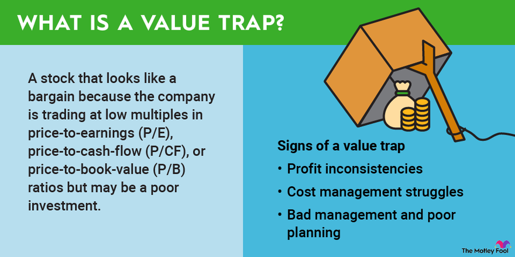

## Table of Contents

## What is a cheap stock?

A cheap stock is a stock that you can buy for a low price. It doesn't mean the company is bad or good. It just means you don't need a lot of money to buy one share. For example, if a stock costs $5, it's cheaper than a stock that costs $100.

People might look for cheap stocks because they want to buy a lot of shares without spending too much money. But, you need to be careful. Just because a stock is cheap doesn't mean it's a good investment. You should always do your research to see if the company is doing well and if it might grow in the future.

## What is a value trap?

A value trap is when a stock looks cheap but is actually not a good investment. It might seem like a bargain because the price is low, but the company might be struggling and not likely to get better soon. This can trick investors into thinking they are getting a good deal, but the stock might keep losing value over time.

For example, imagine a company that used to do well but is now losing money and customers. Its stock price drops a lot, so it looks like a good buy. But if the company's problems are serious and it can't fix them, the stock will probably keep going down. That's why it's important to look closely at why a stock is cheap before buying it.

## How can a beginner identify a cheap stock?

A beginner can identify a cheap stock by looking at the stock's price. If the price per share is low, like $5 or $10, it's considered a cheap stock. You can find this information easily on financial websites or through a stock trading app. Just remember, a low price doesn't always mean it's a good buy. You need to look deeper to see if it's a good investment.

To understand if a cheap stock might be a good investment, you can look at something called the price-to-earnings (P/E) ratio. This number tells you how much you're paying for each dollar of the company's earnings. If the P/E ratio is lower than the average for similar companies, the stock might be a good value. But be careful, because a low P/E ratio can also mean the company is in trouble. Always do some research to see if the company is doing well and if it has a good future ahead.

## What are the common characteristics of a value trap?

A value trap often has a low stock price that looks like a good deal. This can trick people into thinking it's a bargain. But the low price is usually because the company is not doing well. It might be losing money, losing customers, or facing big problems that won't go away easily. If you just look at the price and buy the stock, you might end up losing money as the stock keeps going down.

To spot a value trap, you need to look at more than just the price. Check if the company's earnings are going down, if it has a lot of debt, or if it's losing market share to competitors. These are signs that the company might not get better soon. It's important to do your homework and understand why the stock is cheap. If the reasons are serious and the company can't fix them, it's likely a value trap.

## What financial ratios should be used to evaluate cheap stocks?

When evaluating cheap stocks, one of the most useful financial ratios is the price-to-earnings (P/E) ratio. This ratio tells you how much you're paying for each dollar of the company's earnings. If the P/E ratio is lower than the average for similar companies in the industry, it might mean the stock is undervalued. But be careful, because a low P/E ratio can also mean the company is struggling and might not get better soon. Always compare the P/E ratio with other companies in the same sector to get a better idea of whether the stock is truly a good value.

Another important ratio to look at is the price-to-book (P/B) ratio. This ratio compares the market value of the stock to the company's book value, which is the value of its assets minus its liabilities. A low P/B ratio can suggest that the stock is undervalued, but like the P/E ratio, it's important to compare it with other companies in the industry. If the P/B ratio is much lower than the industry average, it could be a sign of a good deal, but you should also check if the company has other problems that might make it a value trap.

Lastly, consider the debt-to-equity (D/E) ratio. This ratio shows how much debt the company is using compared to its equity. A high D/E ratio can be a red flag, especially for a cheap stock, because it might mean the company is in financial trouble. If the company has a lot of debt and its earnings are not growing, it might struggle to pay back its loans, which could lead to a drop in the stock price. Always look at the D/E ratio in the context of the company's overall financial health and industry standards.

## How can one differentiate between a value trap and a genuine investment opportunity?

To tell the difference between a value trap and a genuine investment opportunity, you need to look at more than just the price of the stock. A value trap looks cheap but is actually a bad investment because the company is not doing well. It might be losing money, losing customers, or have too much debt. On the other hand, a genuine investment opportunity is a stock that is undervalued, meaning it's priced lower than it should be because the market hasn't recognized the company's true worth yet. The company might be growing, making good profits, and have a strong future ahead.

One way to figure this out is by using financial ratios like the price-to-earnings (P/E) ratio and the price-to-book (P/B) ratio. If the P/E ratio is low compared to other companies in the same industry, it might mean the stock is undervalued. But if the company's earnings are going down or it has a lot of debt, it could be a value trap. The P/B ratio can also help; a low P/B ratio might mean the stock is a good deal, but you need to check if the company's assets are worth more than its liabilities. Also, look at the debt-to-equity (D/E) ratio. A high D/E ratio can be a warning sign, especially if the company's earnings are not growing.

In the end, the key is to do your homework. Read the company's financial reports, look at what experts are saying, and think about the company's future. A genuine investment opportunity will show signs of growth and stability, while a value trap will show signs of ongoing problems that the company can't fix easily. By taking the time to understand the company's situation, you can make a smarter decision about whether to invest in the stock.

## What are the key indicators that a stock might be a value trap?

A stock might be a value trap if it looks cheap but is actually a bad investment. The main sign of a value trap is when the company is losing money or its earnings are going down. If a company's profits are shrinking, it might not be able to turn things around, which means the stock price could keep falling. Another sign is if the company is losing customers or market share to competitors. This can happen if the company's products or services are not as good as they used to be or if other companies are doing a better job.

Also, a high amount of debt can make a stock a value trap. If a company has a lot of debt and it's not making enough money to pay it back, it might be in financial trouble. You can see this by looking at the debt-to-equity (D/E) ratio. A high D/E ratio can be a warning sign, especially if the company's earnings are not growing. To figure out if a stock is a value trap, you need to look at the whole picture, not just the low price. If the company has serious problems that it can't fix easily, it's probably a value trap.

## How does industry analysis help in evaluating cheap stocks?

Industry analysis is really important when you want to figure out if a cheap stock is a good investment or a value trap. When you look at the industry, you can see how the company is doing compared to others in the same field. For example, if a company's stock is cheap but the whole industry is doing badly, it might be a sign that the company is in trouble too. But if the industry is doing well and the company's stock is still cheap, it might mean the stock is undervalued and could be a good buy.

By looking at the industry, you can also learn about trends and what might happen in the future. If the industry is growing and the company is doing better than its competitors, the cheap stock might be a good investment. But if the industry is shrinking or facing big problems, the cheap stock might be a value trap. So, industry analysis helps you see the bigger picture and make a smarter choice about whether to buy the stock.

## What role does management quality play in assessing whether a stock is a value trap?

Management quality is really important when you're trying to figure out if a stock is a value trap. If the company's leaders are good at their jobs, they might be able to fix the company's problems and make it grow again. Good managers know how to make smart choices, keep the company's money safe, and come up with new ideas to help the business do better. If you see that the company has a strong team at the top, it might mean the cheap stock is actually a good investment because the company could turn things around.

On the other hand, if the management is not doing a good job, it's more likely that the stock is a value trap. Bad managers might make bad choices, spend too much money, or not have a good plan for the future. If the company's leaders can't fix the problems or if they keep making things worse, the stock price will probably keep going down. So, when you're looking at a cheap stock, always check the quality of the management to see if they can help the company get better or if the stock is just a trap.

## How can advanced financial modeling be used to predict the future performance of cheap stocks?

Advanced financial modeling can help you predict how a cheap stock might do in the future. It's like using a smart math tool to see what could happen. You put in numbers about how the company is doing now, like its earnings, debts, and how much it's growing. Then, the model uses these numbers to guess what might happen next. It can show you if the company might make more money or if it might keep losing money. This can help you decide if the cheap stock is really a good deal or if it's a value trap.

Financial models can also look at different situations that might happen. For example, what if the company starts selling more products? What if the economy gets worse? By trying out these different situations, you can see how the stock might react. This helps you understand if the cheap stock has a good chance to grow or if it's too risky. Using advanced financial modeling can give you a clearer picture of the future, helping you make smarter choices about whether to buy the stock or not.

## What are the psychological biases that can lead investors to fall into value traps?

One big reason people fall into value traps is because of a psychological bias called the anchoring bias. This happens when investors see a stock's low price and think it's a good deal, without looking at why the price is low. They focus too much on the current price and don't think about the company's future. If the company is losing money or has big problems, the stock might keep going down, but the investor is stuck on the idea that it's a bargain because of the low price.

Another bias that can lead to value traps is the confirmation bias. This is when investors only look for information that supports their belief that the cheap stock is a good buy. They might ignore warning signs like shrinking earnings or high debt. Instead, they pay attention to any good news about the company and use it to convince themselves that the stock will go up. This can make them miss the fact that the stock is actually a value trap and not a good investment.

## How can an expert investor use macroeconomic trends to better evaluate cheap stocks and avoid value traps?

An expert investor can use macroeconomic trends to get a bigger picture of what's happening in the economy and how it might affect a cheap stock. For example, if the economy is growing, industries like technology and consumer goods might do well, making their stocks a good investment even if they look cheap. On the other hand, if the economy is slowing down or going into a recession, companies in industries like luxury goods or travel might struggle, making their cheap stocks more likely to be value traps. By understanding these trends, an expert can see if a cheap stock is in an industry that's likely to do well or if it's in one that's facing tough times.

Another way macroeconomic trends help is by showing how things like interest rates, inflation, and employment rates might affect a company's future. If interest rates are going up, companies with a lot of debt might have a hard time paying it back, which could make their cheap stocks a value trap. But if inflation is low and people are spending more, a cheap stock in a strong industry might be a good buy. By keeping an eye on these big economic factors, an expert investor can better judge if a cheap stock has a bright future or if it's just a trap waiting to catch them.

## What is the appeal of cheap stocks?

Cheap stocks, or those trading at low valuation multiples, hold a particular appeal for investors seeking substantial returns with limited upfront investment. These stocks are often characterized by low price-to-earnings (P/E) ratios, which can suggest they are undervalued compared to their earnings potential. This metric is calculated as:

$$
\text{P/E Ratio} = \frac{\text{Market Price per Share}}{\text{Earnings per Share (EPS)}}
$$

A low P/E ratio might imply that a stock is undervalued, particularly if the company has stable earnings or growth potential not yet recognized by the market. This perceived undervaluation can make such stocks attractive to investors who anticipate that the market will eventually recognize this potential, leading to price increases and substantial capital gains.

Investors are generally drawn to cheap stocks by the allure of acquiring more shares with a limited budget. The notion that these stocks might rebound, either due to market corrections or improvements in the company's business conditions, adds to their attractiveness. For example, if a stock is priced at $5, an investor can purchase 200 shares with a $1,000 investment, compared to buying only 10 shares of a stock priced at $100.

However, the assumption that a low-priced stock will automatically translate into high future returns is a misconception. The market price of a stock incorporates a multitude of factors, and a low price does not necessarily reflect its underlying potential or intrinsic value. It is essential for investors to recognize that some companies may have low stock prices due to valid reasons, such as declining business operations, heightened competition, or broader industry challenges.

Thus, while cheap stocks may initially appear to be attractive opportunities for achieving substantial gains, it is crucial for investors to conduct comprehensive evaluations beyond basic valuation metrics. A rigorous assessment of the company’s financial health, market position, and potential growth drivers is necessary to truly gauge whether an investment in a low-priced stock is justified or if it may instead represent a potential pitfall.

## References & Further Reading

[1]: Bergstra, J., Bardenet, R., Bengio, Y., & Kégl, B. (2011). ["Algorithms for Hyper-Parameter Optimization."](https://dl.acm.org/doi/10.5555/2986459.2986743) Advances in Neural Information Processing Systems 24.

[2]: ["Advances in Financial Machine Learning"](https://www.amazon.com/Advances-Financial-Machine-Learning-Marcos/dp/1119482089) by Marcos Lopez de Prado

[3]: ["Evidence-Based Technical Analysis: Applying the Scientific Method and Statistical Inference to Trading Signals"](https://www.amazon.com/Evidence-Based-Technical-Analysis-Scientific-Statistical/dp/0470008741) by David Aronson

[4]: ["Machine Learning for Algorithmic Trading"](https://github.com/stefan-jansen/machine-learning-for-trading) by Stefan Jansen

[5]: ["Quantitative Trading: How to Build Your Own Algorithmic Trading Business"](https://www.amazon.com/Quantitative-Trading-Build-Algorithmic-Business/dp/1119800064) by Ernest P. Chan