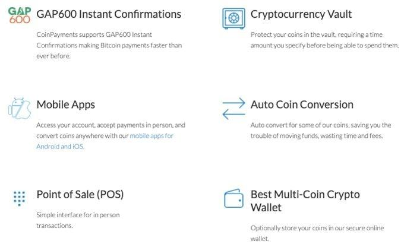

Cryptocurrency continues to transform the financial landscape, with CoinPayments playing a critical role by providing digital payment solutions through a versatile crypto wallet. In this article, we will examine the CoinPayments digital payment cryptocurrency wallet, its integration with algorithmic trading, and the significant potential it holds for both individual and business users.

CoinPayments, a pioneering platform in digital transactions, offers more than just a wallet; it provides a bridge between traditional financial systems and the emerging digital economy. This exploration aims to shed light on the features, advantages, and unique offerings that make CoinPayments an integral part of today's digital economy. Whether you are a novice intrigued by crypto payments or a business aiming to extend your reach into this burgeoning sector, this article caters to both ends of the spectrum.

By exploring the world of digital transactions powered by CoinPayments, we provide a comprehensive overview suitable for anyone interested in the future of cryptocurrency payments.

## Table of Contents

## Understanding CoinPayments: An Overview

CoinPayments is a pioneering crypto payment solution that began operations in 2013. Since its inception, it has positioned itself as a leader in the cryptocurrency payment space, providing users with a platform that supports over 100 different cryptocurrencies. This extensive support allows for a flexible and borderless payment system, enabling users to transact securely across various digital currencies.

The platform has been specifically designed to cater to eCommerce businesses, iGaming sectors, and Forex markets. By integrating CoinPayments, businesses in these industries can significantly reduce the risk of fraud and eliminate the issue of chargebacks. This is particularly beneficial for sectors that frequently deal with international transactions and digital goods, where traditional payment methods often fall short.

One of the standout features of CoinPayments is its competitive advantage provided by low transaction fees and instant settlements. These attributes make it an appealing choice for businesses looking to accept cryptocurrency payments without incurring prohibitive costs. The immediate processing of transactions also enhances cash flow management and financial planning for businesses.

Regulatory compliance is another cornerstone of CoinPayments' offering. For instance, its adherence to EU licensing ensures that transactions conducted through the platform are secure and reliable. This regulatory alignment not only offers peace of mind to users but also facilitates smoother adoption of [cryptocurrency](/wiki/cryptocurrency) payments by businesses that prioritize compliance and security.

Overall, CoinPayments provides a comprehensive solution for businesses and individuals seeking an efficient and secure method of handling cryptocurrency transactions. Its user-centric approach and robust infrastructure make it a pivotal player in the cryptocurrency payment landscape.

## Features of the CoinPayments Cryptocurrency Wallet

The CoinPayments cryptocurrency wallet is recognized for its robust features, catering to cryptocurrency users ranging from casual holders to avid traders and business entities. As a flexible tool for managing various digital assets, it supports a broad spectrum of cryptocurrencies, facilitating a comprehensive approach to digital asset management. This versatility is crucial for users who need to handle multiple currencies without relying on multiple platforms.

One of the standout features of the CoinPayments wallet is its seamless integration with major e-commerce platforms. This integration streamlines the payment process, allowing businesses to accept cryptocurrency payments with ease. The wallet provides several merchant tools, including APIs and customized payment buttons, ensuring that businesses can tailor their checkout experiences to fit their specific needs while also maintaining the flexibility to adapt to future changes in technology and consumer preferences.

Enhanced security is another critical aspect of the CoinPayments wallet, provided through its robust vault service. This feature is designed to mitigate risks associated with storing digital assets by offering users a secure environment for long-term storage. The vault service adds an additional layer of protection, safeguarding cryptocurrencies against potential security threats.

To simplify currency management, CoinPayments enables users to swap cryptocurrencies directly within the wallet. This feature reduces the complexity and time required for converting currencies, offering a more efficient way to manage a diversified portfolio of digital assets. It eliminates the need for third-party exchanges, thereby minimizing transaction costs and improving transaction speed.

In addition to software-based security features, CoinPayments also supports hardware wallet compatibility. This compatibility offers substantial added security for users with significant crypto holdings. Hardware wallets are known for their offline storage capabilities, providing a secure method for storing private keys and protecting assets from online vulnerabilities.

Overall, the CoinPayments wallet encompasses a range of functionalities that enhance its usability, security, and integration capabilities, making it a valuable tool for anyone involved in cryptocurrency transactions.

## Algo Trading and CoinPayments: A Symbiotic Relationship

Algorithmic trading, often abbreviated as algo trading, involves the use of sophisticated algorithms to automate and optimize trading strategies in the cryptocurrency markets. This modern approach to trading enhances both efficiency and accuracy, utilizing computational power to process vast amounts of data quickly and to execute trades based on pre-defined criteria without the need for constant human intervention.

CoinPayments, a digital payment platform, complements the fast-paced nature of [algorithmic trading](/wiki/algorithmic-trading) through its swift and adaptable settlement processes. This is particularly beneficial for traders who rely on high-frequency trading ([HFT](/wiki/high-frequency-trading-strategies)) strategies, where the ability to execute trades at rapid speeds can significantly influence success. With CoinPayments, traders can efficiently manage their digital assets, including converting cryptocurrencies promptly, thereby minimizing exposure to market [volatility](/wiki/volatility-trading-strategies). This capability is crucial in a market that is known for its price unpredictability.

One of the standout features of CoinPayments for algo traders is its low transaction fees. These fees can accumulate quickly when executing a high [volume](/wiki/volume-trading-strategy) of trades, and reducing them is pivotal in optimizing trading costs. Alongside an integrated system designed to streamline the management of various digital assets, CoinPayments offers traders a cost-effective platform to execute and settle trades.

Moreover, CoinPayments facilitates seamless transitions between cryptocurrencies and fiat currencies, which is essential for executing timely trades and maintaining [liquidity](/wiki/liquidity-risk-premium). This versatility is supported by the platform's infrastructure that supports automated crypto conversions, ensuring that traders can always capitalize on market opportunities without delay.

Through a combination of low fees, flexible settlements, and integrated asset management, CoinPayments enhances the operational efficiency of algorithmic trading, making it a preferred solution for traders aiming to reduce costs and exposure to market risks while maintaining the agility required for successful trading.

## Advantages of Using CoinPayments for Digital Transactions

CoinPayments offers a modern alternative for digital transactions by eliminating the traditional complexities associated with cross-border banking. Providing a borderless and near-instantaneous payment solution, it facilitates global operations without the constraints of geographic and economic barriers often seen in traditional banking systems. This characteristic is particularly beneficial for businesses engaged in international trade or those seeking to expand into new markets. By accepting cryptocurrency payments, these businesses can sidestep lengthy transaction times and fees typically incurred through conventional banking methods, providing a competitive edge in the global marketplace.

A significant advantage for businesses utilizing CoinPayments is the absence of chargebacks. Unlike traditional credit card systems, where disputes can lead to costly chargeback fees and potential revenue loss, cryptocurrency transactions on CoinPayments are immutable once confirmed. This attribute not only enhances financial security but also fosters customer trust, as businesses can consistently provide a seamless and reliable transaction experience.

Customer support plays a pivotal role in the functionality of any financial platform, and CoinPayments is no exception. Offering 24/7 customer support, the platform ensures that any transactional issues are promptly addressed. This constant availability provides users with peace of mind, knowing they have reliable support at all times, which is crucial for both individual and business users engaging in fast-paced digital economies where delays can result in significant setbacks.

Security takes precedence in digital transactions, and CoinPayments enhances this with its multi-signature wallet feature. This function allows businesses or individuals to require multiple approvals for transactions, thereby adding an extra layer of security. This feature is essential for organizations managing large volumes of transactions or handling substantial crypto holdings, as it minimizes the risk of unauthorized access and potential losses.

Lastly, CoinPayments has established strategic partnerships across various industries to enhance the usability and acceptance of crypto payments. These collaborations broaden the range of services and products that can accept cryptocurrency, thereby increasing the currency's practicality in everyday transactions. By integrating with numerous platforms and services, CoinPayments not only facilitates the adoption of digital currencies but also helps position them as a mainstream option for payments, further bridging the gap between digital currencies and traditional financial systems.

## Getting Started with CoinPayments: A Step-by-Step Guide

Signing up with CoinPayments is designed to be an efficient and user-friendly process, involving minimal steps to ensure ease of access for both personal and business users. Here's a guide to getting started with CoinPayments:

1. **Registration Process**: Begin the journey by visiting the CoinPayments website. Click on the "Sign Up" button, which will guide you through submitting basic personal and business information. This typically includes your name, email address, and choosing a secure password. CoinPayments may also require certain business details if you plan to integrate its services with your business operations.

2. **Creating Multi-Coin Wallets**: Upon successful registration, users can create multi-coin wallets. This feature supports over 100 cryptocurrencies, enabling users to manage and diversify their digital asset portfolios effectively. The user interface is straightforward, facilitating easy navigation and management of various cryptocurrencies.

3. **Accessing Integration Tutorials**: CoinPayments provides comprehensive tutorials aimed at simplifying the integration of its solutions into different business models. These resources are invaluable for newcomers, offering step-by-step instructions on how to embed CoinPayments' features into eCommerce sites, increase security measures with vault services, or capitalize on the platform's payment tools. 

4. **Tools for Algorithmic Trading**: For users interested in algorithmic trading, CoinPayments equips them with tools necessary for executing automated conversions. This feature is crucial in high-frequency trading environments, where efficient and fast settlements are necessary to capitalize on market opportunities. Direct payment integrations further streamline processes, ensuring seamless and swift transactions.

5. **Exploring Additional Features**: Beyond basic wallet and trading functionalities, users can explore advanced features like Payment Buttons and Shopping Cart Plugins. These tools are specifically designed to optimize payment processes for businesses, enhancing customer experience and ensuring smooth transaction flows. Activating these features is straightforward, typically involving following setup wizards or using provided code snippets for integration.

By following these steps, users can fully leverage the capabilities of CoinPayments, optimizing their management of digital currencies whether for personal use, algo trading, or enhancing business operations. CoinPayments' robust infrastructure and supportive resources provide a solid foundation for engaging with the digital economy effectively.

## Conclusion

CoinPayments is a versatile and robust platform tailored to meet the diverse needs of cryptocurrency users, ranging from individuals interested in personal digital transactions to businesses seeking efficient trading and payment solutions. With a comprehensive suite of features, CoinPayments provides a secure and reliable environment for engaging with cryptocurrencies. Its emphasis on security, including vault services and multi-signature wallet capabilities, ensures that users can trust the platform with their digital assets.

As the adoption of cryptocurrencies continues to rise globally, platforms like CoinPayments play a critical role in linking traditional financial systems with digital currencies. They provide the necessary tools to facilitate seamless crypto transactions, reducing the complexities typically associated with digital payments. By addressing the needs of both individual traders and large-scale enterprises, CoinPayments offers an adaptable and encompassing service that meets the evolving demands of the crypto market.

CoinPayments empowers users to fully embrace the potentials of cryptocurrency payments, inviting them to discover the efficiencies and opportunities these digital solutions present. With advanced features and reliability, CoinPayments is a valuable resource for anyone ready to engage with the digital finance landscape, marking its significance as a pioneering force in the crypto ecosystem.

## References & Further Reading

[1]: Antonopoulos, A. M. (2017). ["Mastering Bitcoin: Unlocking Digital Cryptocurrencies"](https://books.google.com/books/about/Mastering_Bitcoin.html?id=IXmrBQAAQBAJ). O'Reilly Media.

[2]: Narayanan, A., Bonneau, J., Felten, E., Miller, A., & Goldfeder, S. (2016). ["Bitcoin and Cryptocurrency Technologies: A Comprehensive Introduction"](https://press.princeton.edu/books/hardcover/9780691171692/bitcoin-and-cryptocurrency-technologies). Princeton University Press.

[3]: Franco, P. (2014). ["Understanding Bitcoin: Cryptography, Engineering and Economics"](https://onlinelibrary.wiley.com/doi/book/10.1002/9781119019138). Wiley.

[4]: Harvey, C. R., & Gabor, G. (2021). ["DeFi and the Future of Finance"](https://papers.ssrn.com/sol3/papers.cfm?abstract_id=3711777). Wiley.

[5]: Alexopoulos, M. (2021). ["Learning Cryptocurrency Trading: The ultimate guide to mining and exchanging cryptocurrencies"](https://www.coursera.org/articles/how-does-cryptocurrency-work). Packt Publishing.