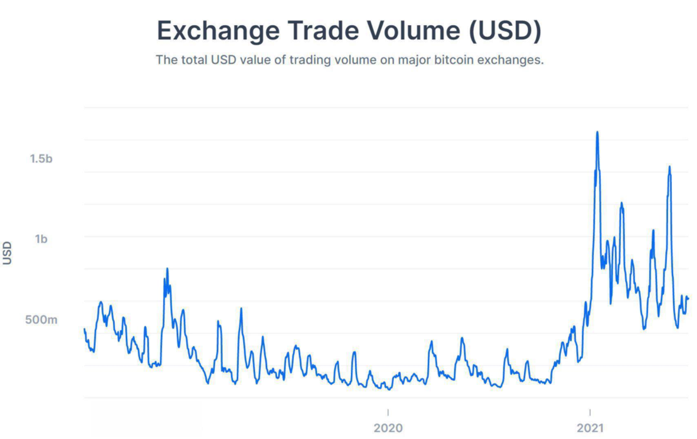

Since the introduction of Bitcoin in 2009, the cryptocurrency market has experienced remarkable growth, capturing the attention of investors and financial institutions worldwide. This rapid expansion, while offering substantial investment opportunities, has also brought to light significant concerns regarding market integrity. Among such concerns, market manipulation and faked trading volumes have emerged as critical issues. Market manipulation, commonly seen in traditional securities markets, involves artificially altering the price or volume of a security to present a deceptive image to investors. In the context of cryptocurrencies, this practice can severely undermine trust and safety within the market.

Cryptocurrency markets, by their very nature, are particularly vulnerable to these manipulative practices, given their decentralized and largely unregulated landscape. Consequently, understanding the interaction between cryptocurrency, market manipulation, trading volumes, and algorithmic trading becomes essential. Each of these factors plays a crucial role in determining the stability and reliability of digital currency markets. Faked trading volumes, often a symptom of market manipulation, can mislead stakeholders about a cryptocurrency's liquidity and demand, affecting investment decisions based on inaccurate data representations.

Algorithmic trading, increasingly prevalent in these markets, adds another layer of complexity. While algorithms can facilitate efficient trading, they can also be exploited to execute manipulative strategies at speeds and scales unimaginable in manual trading environments. Therefore, comprehending the dynamics of these interrelated elements is vital for investors and regulators alike, as it enables the development of effective strategies to safeguard market integrity and protect against potential financial risks. Ultimately, a thorough grasp of these issues will help foster a secure and transparent trading environment, ensuring the continued growth and maturation of the cryptocurrency market.

## Table of Contents

## Understanding Market Manipulation in Cryptocurrency

Market manipulation in cryptocurrency involves deceptive tactics intended to manipulate trading dynamics for personal gain. In essence, these practices aim to distort the perception of supply, demand, and price in the market, often resulting in misleading information for investors. 

### Common Manipulation Tactics

#### Pump-and-Dump Schemes

One of the most notorious forms of market manipulation is the pump-and-dump scheme. Here, perpetrators artificially inflate the price of a [cryptocurrency](/wiki/cryptocurrency) through misleading or exaggerated statements, often through social media or other online platforms. Once the price has been driven up, the manipulators sell off their holdings at a profit, causing the price to drop sharply, to the detriment of unsuspecting investors.

#### Spoofing

Spoofing involves placing large orders to buy or sell a cryptocurrency with the intent to cancel before execution. This creates a false impression of demand or supply, misleading other traders into making decisions based on these deceptive orders. By influencing perceptions, spoofing can effectively manipulate market prices without making any actual transactions.

#### Wash Trading

Wash trading occurs when an entity simultaneously buys and sells the same cryptocurrency to create artificial activity in the market. This practice can inflate the apparent [volume](/wiki/volume-trading-strategy) of a cryptocurrency, misleading investors about its [liquidity](/wiki/liquidity-risk-premium) and stability. By creating a facade of heightened trading activity, manipulators can attract more investors under false pretenses.

### Impact of Market Manipulation

The unregulated nature of the cryptocurrency market makes it particularly vulnerable to these manipulative practices. The lack of centralized oversight and the anonymous nature of transactions complicate the detection and prosecution of manipulators. These activities lead to significant price distortions, impacting investor decisions and eroding the credibility of the market as a whole.

### Case Studies: FTX Collapse

A prominent example highlighting the severe consequences of unchecked market manipulation is the FTX collapse. The exchange faced allegations of engaging in fraudulent practices, including manipulation of trading volumes and misuse of customer funds. The fallout from this scandal underscored the vulnerabilities inherent in the cryptocurrency market and spurred calls for stricter regulatory oversight.

In conclusion, understanding market manipulation tactics is crucial for both investors and regulators to mitigate risks and protect the integrity of the cryptocurrency market. The implementation of effective regulatory measures and technological innovations is essential to curtail these practices and foster a more equitable trading environment.

## Trading Volumes: Real vs. Faked

Trading volume serves as a fundamental indicator in the cryptocurrency market, reflecting the level of activity and liquidity associated with a particular cryptocurrency. High trading volumes generally signal greater liquidity, suggesting that an asset can be easily traded without causing significant price changes, thus representing stability and potential price movements. However, these apparent dynamics can be misrepresented through various manipulative practices.

One primary tactic to artificially inflate trading volumes is wash trading. This practice involves the simultaneous buying and selling of a cryptocurrency to create a misleading impression of heightened activity. The superficial boost in trading volume can lead investors to believe there is substantial demand or market interest in a particular asset, influencing their investment decisions based on inaccurate data. This deceptive tactic undermines market integrity by distorting the true supply and demand dynamics.

Another common method used to fake trading volumes is through algorithmic bots designed to perform rapid trades automatically. These bots can generate an illusion of market activity by executing a large number of transactions within a short period. Such simulated transactions inflate trading volumes, concealing the genuine market interest and stability of the cryptocurrency. As a result, investors are misled regarding the asset’s actual liquidity and demand.

The misrepresentation of trading volumes poses significant challenges for both investors and market regulators. As trading volumes are often a key [factor](/wiki/factor-investing) in investment decisions, falsified figures can lead to ill-informed strategies and potential financial losses. Recognizing the gravity of this issue, regulators and market analysts are developing advanced techniques to identify and mitigate false volume reporting effectively.

To address these issues, algorithms and analytical models are being employed to detect anomalous trading patterns that suggest potential manipulation. By analyzing the frequency, size, and timing of trades, sophisticated models can flag suspicious activity indicative of wash trading or bot interference. Additionally, data validation methods are being refined to ensure the accuracy of reported trading volumes, thus enhancing transparency.

In sum, ensuring the accuracy of trading volume data is imperative to maintaining the integrity of the cryptocurrency market. By leveraging technological advancements and regulatory scrutiny, measures are being implemented to curtail manipulative practices, thereby safeguarding investor interests and promoting a more reliable trading environment.

## Role of Algorithmic Trading in Market Manipulation

Algorithmic trading represents a contemporary method of executing trades that leverage computer algorithms built on predefined parameters. This form of trading has become a mainstay in financial markets due to its speed and efficiency, enabling traders to respond to market changes with minimal human intervention. However, it opens avenues for potential misuse, especially concerning market manipulation.

The legal framework recognizes [algorithmic trading](/wiki/algorithmic-trading) as a legitimate practice when utilized correctly. Yet, its application can be distorted to manipulate markets. Sophisticated trading bots capitalize on the computational advantages of algorithms to perform activities like wash trading and spoofing, which are intended to distort genuine market behavior.

Wash trading involves executing buy and sell orders to simulate increased activity and volume, misleading participants about a cryptocurrency's true liquidity. This artificial inflation of trading volume can deceive investors into making suboptimal investment decisions, thinking the asset is in high demand.

Similarly, spoofing involves placing large buy or sell orders without the intention of execution, thereby creating a false sense of demand or supply. When perceived market conditions are influenced by these fake orders, actual investors might adjust their trades based on this misinformation, providing opportunities for manipulators to exploit resultant price movements.

The intricacies of algorithmic trading introduce a significant challenge in discerning the intent behind specific trades, complicating the enforcement of regulations. The nature of rapid, high-frequency trades conducted by algorithms can obfuscate clues on whether trading patterns are part of a legitimate strategy or a manipulative scheme.

Moreover, the integration of [artificial intelligence](/wiki/ai-artificial-intelligence) in trading adds a layer of complexity. AI-powered trading systems can autonomously learn and adapt strategies in real-time. This adaptability makes it increasingly difficult to delineate between beneficial trading strategies and those designed to manipulate the market. AI's capability to evolve trading strategies based on environmental inputs necessitates a cautious and sophisticated regulatory approach.

Given these challenges, regulators are tasked with developing advanced tools and methodologies to detect and counteract algorithmic manipulations. Efforts include the enhancement of monitoring systems to track suspicious trading activities and fostering collaboration among international regulatory bodies to address the global nature of cryptocurrency markets. While algorithmic trading remains a crucial component of the financial ecosystem, ensuring its use aligns with market integrity is paramount to maintaining investor confidence and a fair trading environment.

## Regulatory Actions and Market Safeguards

Regulatory bodies, such as the U.S. Securities and Exchange Commission (SEC), are increasingly working to combat market manipulation in the cryptocurrency sector. With the rapid evolution and expansion of the cryptocurrency market, these entities are adopting various measures to ensure market integrity and protect investors.

Prosecuting offenders plays a central role in regulatory efforts. Authorities are actively investigating and litigating cases where fraudulent activities, such as pump-and-dump schemes, spoofing, and wash trading, are detected. The SEC, for example, has pursued numerous cases against individuals and organizations involved in deceptive practices that mislead investors and distort market prices. These legal actions serve both to penalize wrongdoings and to deter future offenses.

In addition to legal recourse, technological solutions are being developed to detect and prevent fraudulent activities in real-time. The adoption of advanced data analytics and [machine learning](/wiki/machine-learning) algorithms enables regulators and exchanges to monitor trading patterns and identify unusual behaviors indicative of manipulation. For instance, anomalous trading volumes or erratic price movements may trigger alerts that prompt further investigation.

Data aggregators and cryptocurrency market platforms are also implementing stricter data validation methods to ensure the accuracy of reporting. By enhancing the transparency of trading volumes and price information, these entities contribute to reducing the room for manipulation. Techniques such as blockchain analysis and transaction verification help ascertain the legitimacy of reported activities.

Given the international nature of cryptocurrencies, cooperation between countries and regulatory bodies is essential. Market manipulation can easily transcend borders, as cryptocurrencies are traded globally across numerous exchanges. International collaborations and agreements are, therefore, vital to establish harmonized regulations that can effectively address manipulation on a global scale. Forums such as the Financial Action Task Force (FATF) play a pivotal role in facilitating dialogue and cooperation among countries in establishing robust regulatory frameworks.

Ongoing discussions aim to establish a comprehensive regulatory framework to minimize market manipulation risks. These discussions encompass determining the scope of legal jurisdictions, standardizing regulatory requirements, and developing unified approaches to monitor trading activities across borders. The goal is to create a more secure and stable trading environment, fostering investor confidence and supporting the sustainable growth of the cryptocurrency market.

As the cryptocurrency landscape continues to evolve, regulatory bodies and market platforms must remain vigilant and adaptable. The constant development of new technologies and trading strategies requires continuous updates and refinements in both regulatory measures and technological tools. Ultimately, these actions are critical in curbing market manipulation, ensuring accurate market representation, and protecting investors in an ever-changing digital marketplace.

## Future Implications for Cryptocurrency Markets

The future of cryptocurrency trading will be significantly shaped by the effectiveness of addressing market manipulation. As technological advancements, particularly in artificial intelligence (AI) and machine learning, continue to evolve, they will transform trading practices. These technologies offer opportunities to enhance the efficiency and accuracy of trading strategies, but they also introduce complexities that could be exploited for manipulative purposes.

One of the primary opportunities presented by AI is its ability to analyze vast datasets to identify trading patterns and trends that might be missed by human traders. This capability can be harnessed to create more effective predictive models and trading algorithms. However, the same technology could be used to develop more sophisticated methods of market manipulation, such as more advanced spoofing or the creation of misleading trading volumes through automated bots. It is essential for regulatory frameworks to keep pace with these technological developments to mitigate potential misuse.

Effective regulation and investor education are crucial in fostering a more transparent and secure trading environment. Regulatory bodies need to adopt innovative tools to monitor trading activities, ensuring that they can identify and address manipulative behaviors swiftly. Collaborative efforts between regulators, market platforms, and data analysts are essential to develop standards that can adapt to the rapid changes in cryptocurrency markets. Similarly, educating investors about the risks and signs of market manipulation empowers them to make informed decisions and avoid potential pitfalls.

Investors themselves play a critical role in safeguarding against market manipulation by utilizing available technologies and information. This involves not only staying informed about market trends and regulatory changes but also leveraging analytical tools that can provide insights into real trading volumes and activity patterns. Platforms offering data validation and analytics can be invaluable resources for distinguishing between genuine market movements and deceptive practices.

The dynamic nature of cryptocurrency markets necessitates adaptive strategies from all participants. Keeping abreast of technological and regulatory developments, as well as understanding the interplay between market forces and manipulation techniques, will be critical. Market participants must be capable of agile responses to shifts in trading dynamics, regulatory landscapes, and technological innovations to maintain a robust and equitable trading environment.

## Conclusion

Market manipulation continues to pose a substantial threat within the cryptocurrency space, undermining market integrity and eroding investor trust. This persistent issue necessitates increased regulatory oversight and the implementation of innovative technological solutions to mitigate associated risks effectively. Regulatory bodies must prioritize the development and enforcement of robust frameworks that address the specific nuances of cryptocurrency markets. Enhanced oversight, coupled with emerging technologies, can significantly reduce the potential for manipulative practices.

Understanding the interconnections between trading volumes, manipulation tactics, and algorithmic trading is crucial for investors aiming to make informed decisions. By comprehensively analyzing these components, market participants can better gauge the market's genuine state, avoid deceptive schemes, and align their strategies accordingly. The continuous evolution of the crypto market demands adaptive measures that prioritize securing a transparent and equitable trading landscape for all stakeholders.

As the cryptocurrency domain advances, emerging trends and technologies will reshape the strategies employed by market participants and regulators alike. These developments present new opportunities for safeguarding market integrity through innovative mechanisms such as blockchain analytics, AI-driven fraud detection, and decentralized finance protocols. Stakeholders must remain vigilant and proactive, utilizing cutting-edge tools and methodologies to ensure a resilient crypto market ecosystem. A collaborative effort between regulators, investors, and technology developers is essential to maintain trust and foster sustainable growth within the cryptocurrency sector.

## References & Further Reading

[1]: Gandal, N., Hamrick, J. T., Moore, T., & Oberman, T. (2018). ["Price manipulation in the Bitcoin ecosystem."](https://www.sciencedirect.com/science/article/pii/S0304393217301666) Journal of Monetary Economics, 95, 86-96.

[2]: Xin, L., & Hilary, G. (2018). ["Bitcoin pump-and-dump schemes."](https://www.researchgate.net/journal/Crime-Science-2193-7680/publication/329193706_To_the_moon_defining_and_detecting_cryptocurrency_pump-and-dumps/links/5fc47151458515b797893be0/To-the-moon-defining-and-detecting-cryptocurrency-pump-and-dumps.pdf?origin=journalDetail&_rtd=e30%3D) Available at SSRN 3267041.

[3]: Makarov, I., & Schoar, A. (2019). ["Trading and arbitrage in cryptocurrency markets."](https://www.sciencedirect.com/science/article/pii/S0304405X19301746) National Bureau of Economic Research.

[4]: Griffin, J. M., & Shams, A. (2020). ["Is Bitcoin really un-tethered?"](https://onlinelibrary.wiley.com/doi/full/10.1111/jofi.12903) The Review of Financial Studies, 33(11), 4550-4596.

[5]: Moore, T., & Christin, N. (2013). ["Beware the middleman: Empirical analysis of Bitcoin-exchange risk."](https://link.springer.com/chapter/10.1007/978-3-642-39884-1_3) In Financial Cryptography and Data Security. Springer, Berlin, Heidelberg.

[6]: Garatt, R., & van Oordt, M. R. (2019). ["Why Are Bitcoin Prices So Volatile?"](https://research.vu.nl/ws/portalfiles/portal/227432167/Privacy_as_a_Public_Good_A_Case_for_Electronic_Cash.pdf) Bank of Canada Staff Working Paper 2019-4.