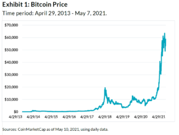

## Table of Contents

## What is cryptocurrency trading volume?

Cryptocurrency trading volume is the total amount of a specific cryptocurrency that is bought and sold over a certain period, usually a day. It shows how much activity there is in the market for that cryptocurrency. If the trading volume is high, it means a lot of people are trading that cryptocurrency, which can make the price go up or down more quickly.

High trading volume can also mean that the cryptocurrency is popular and that people are interested in it. On the other hand, if the trading volume is low, it might mean that fewer people are trading it, and the price might not change as much. Traders often look at trading volume to help them decide when to buy or sell a cryptocurrency.

## Why is it important to evaluate trading volumes in cryptocurrencies?

Evaluating trading volumes in cryptocurrencies is important because it helps people understand how active the market is for a specific coin. When a lot of people are buying and selling a cryptocurrency, it means the trading volume is high. This can show that the cryptocurrency is popular and that many people are interested in it. If the trading volume is low, it might mean that fewer people are trading it, which could suggest that it's less popular or that people are not as interested in it.

Looking at trading volumes can also help traders make better decisions about when to buy or sell a [cryptocurrency](/wiki/cryptocurrency). If the trading [volume](/wiki/volume-trading-strategy) is high, the price of the cryptocurrency can change quickly, which might be a good time for traders to act. On the other hand, if the trading volume is low, the price might not change as much, which could be a safer time to trade. By understanding trading volumes, traders can get a better sense of the market and make smarter choices.

## How can beginners start tracking cryptocurrency trading volumes?

Beginners can start tracking cryptocurrency trading volumes by using websites and apps that show this information. Websites like CoinMarketCap and CoinGecko are popular and easy to use. They show the trading volume for many different cryptocurrencies. All you need to do is go to the website, find the cryptocurrency you're interested in, and look at the trading volume number. Some apps, like Blockfolio and Delta, also let you track trading volumes on your phone, which can be handy if you're always on the go.

It's a good idea to check the trading volume regularly to see how it changes over time. You can do this by looking at the same cryptocurrency's trading volume at different times of the day or week. This will help you understand if the volume is usually high or low and if it's going up or down. By keeping an eye on the trading volume, you'll get a better feel for how active the market is for that cryptocurrency, which can help you make better decisions about when to buy or sell.

## What are the common sources for obtaining trading volume data?

Common sources for obtaining trading volume data are websites like CoinMarketCap and CoinGecko. These websites are easy to use and show the trading volume for many different cryptocurrencies. All you need to do is go to the website, find the cryptocurrency you're interested in, and look at the trading volume number. They update this information often, so you can see the latest numbers.

Another common source is mobile apps like Blockfolio and Delta. These apps let you track trading volumes on your phone, which can be handy if you're always on the go. You can add the cryptocurrencies you want to follow, and the app will show you their trading volumes. This makes it easy to check the numbers whenever you want, without needing to use a computer.

Some cryptocurrency exchanges also provide trading volume data. Exchanges like Binance and Coinbase show the trading volume for the cryptocurrencies they list. You can find this information on their websites or in their trading platforms. This can be useful if you're already using these exchanges to buy and sell cryptocurrencies.

## How do trading volumes affect the price of cryptocurrencies?

Trading volumes can affect the price of cryptocurrencies in a big way. When the trading volume is high, it means a lot of people are buying and selling the cryptocurrency. This can make the price go up or down more quickly. For example, if a lot of people are buying a cryptocurrency, the price might go up because there's more demand for it. On the other hand, if a lot of people are selling, the price might go down because there's more supply.

Low trading volumes can also impact the price, but in a different way. When the trading volume is low, it means fewer people are trading the cryptocurrency. This can make the price more stable because there's less activity in the market. However, it can also make it harder to buy or sell the cryptocurrency quickly, which might affect the price if someone wants to trade a large amount. By understanding how trading volumes affect prices, traders can make better decisions about when to buy or sell.

## What are the differences between spot and futures trading volumes?

Spot trading volume and futures trading volume are two different things in the world of cryptocurrencies. Spot trading volume is the total amount of a cryptocurrency that is bought and sold for immediate delivery. When you trade on a spot market, you are exchanging one cryptocurrency for another or for fiat money right away. The trading volume here shows how many people are actively buying and selling the cryptocurrency at that moment. It's like going to a store and buying something with cash; you get the item right away.

Futures trading volume, on the other hand, is the total amount of futures contracts that are bought and sold. Futures contracts are agreements to buy or sell a cryptocurrency at a future date for a price that is set now. When you trade futures, you are not trading the actual cryptocurrency but a promise to trade it later. The trading volume in futures markets shows how many people are betting on what the price of the cryptocurrency will be in the future. It's like making a bet on what the price of something will be in a few months, rather than buying it right away.

Both spot and futures trading volumes are important to look at, but they tell us different things about the market. Spot trading volume can show us how popular a cryptocurrency is right now, while futures trading volume can give us an idea of what people think will happen to the price in the future. By understanding both, traders can get a better picture of the overall market and make smarter decisions.

## How can one distinguish between genuine and manipulated trading volumes?

Telling the difference between real and fake trading volumes can be tricky, but there are some signs to look for. Real trading volumes come from lots of different people buying and selling a cryptocurrency. You can check if the volume is real by looking at how many different exchanges are showing the same high volume. If many exchanges show similar numbers, it's more likely to be real. Also, if the volume goes up and down in a way that makes sense with what's happening in the news or with the price, it's probably real.

Fake trading volumes, on the other hand, can happen when someone or a group of people try to make it look like a cryptocurrency is more popular than it really is. This can be done by trading the cryptocurrency back and forth between accounts they control, making it seem like there's a lot of activity. If the volume suddenly jumps a lot without any good reason, or if it's only high on one exchange, it might be fake. Also, if the volume doesn't match up with what's happening in the market or with the news, it could be a sign that someone is trying to trick people.

## What advanced metrics can be used to analyze trading volumes beyond basic data?

Beyond just looking at the total number of trades, there are some advanced metrics that can help you understand trading volumes better. One of these is the volume-weighted average price (VWAP). This tells you the average price of a cryptocurrency, taking into account how much was traded at each price. It's useful because it shows you if the price is higher or lower than what most people are paying, which can help you decide if it's a good time to buy or sell. Another metric is the moving average convergence divergence (MACD), which looks at the difference between two moving averages of the trading volume. This can help you spot trends and see if the volume is going up or down over time, which can be a sign of whether the market is getting more or less active.

Another useful metric is the relative volume, which compares the current trading volume to the average volume over a certain period. This can show you if the volume is unusually high or low, which might mean something important is happening in the market. For example, if the relative volume is much higher than normal, it could mean that a lot of people are suddenly interested in the cryptocurrency, which might push the price up. On the other hand, if it's much lower, it might mean that people are losing interest, which could push the price down. By looking at these advanced metrics, you can get a deeper understanding of what's happening with the trading volumes and make better trading decisions.

## How do trading volumes correlate with market liquidity and volatility?

Trading volumes are closely tied to market [liquidity](/wiki/liquidity-risk-premium) and [volatility](/wiki/volatility-trading-strategies). When trading volumes are high, it means a lot of people are buying and selling the cryptocurrency. This usually makes the market more liquid, which means it's easier to buy or sell without the price changing too much. High liquidity is good because it lets you trade quickly and easily. But, high trading volumes can also make the market more volatile. When a lot of people are trading, the price can go up or down quickly because there's more activity. This can be risky if you're not careful, but it can also be a chance to make money if you know what you're doing.

On the other hand, when trading volumes are low, the market is usually less liquid. This means it can be harder to buy or sell the cryptocurrency without affecting the price a lot. If you want to trade a big amount, you might find it harder to do so without moving the price. Low trading volumes can also make the market less volatile because there's less activity. The price might not change as much, which can make trading safer but also less exciting. By understanding how trading volumes affect liquidity and volatility, you can make better choices about when to buy or sell.

## What role does trading volume play in technical analysis for cryptocurrency trading?

Trading volume is a big part of technical analysis in cryptocurrency trading. It helps traders understand how much people are buying and selling a cryptocurrency, which can show if the market is strong or weak. When the trading volume is high, it means a lot of people are trading, which can make the price go up or down quickly. Traders look at this to see if a price change is real or just a fluke. For example, if the price goes up and the volume is high, it might mean the price will keep going up because a lot of people believe in it.

On the other hand, if the price goes up but the volume is low, it might not be a strong move, and the price could go back down. Traders also use volume to find trends and patterns. They might look at charts that show volume over time to see if the market is getting more or less active. This can help them decide when to buy or sell. By using trading volume in their technical analysis, traders can get a better idea of what might happen next in the market and make smarter choices.

## How can institutional investors use trading volume data to make informed decisions?

Institutional investors, like big companies and funds, use trading volume data to understand how active the market is for a cryptocurrency. They look at the trading volume to see if a lot of people are buying and selling, which can tell them if the cryptocurrency is popular. If the volume is high, it might mean the cryptocurrency is in demand, and the price could go up. On the other hand, if the volume is low, it might mean fewer people are interested, and the price might not change much. By understanding the trading volume, institutional investors can decide if it's a good time to buy or sell a cryptocurrency.

They also use trading volume to check if the price changes they see are real or just temporary. For example, if the price goes up and the trading volume is high, it's more likely that the price will keep going up because many people believe in it. But if the price goes up and the volume is low, it might not be a strong move, and the price could go back down. Institutional investors use this information to make sure their decisions are based on solid data, helping them manage their investments better and reduce risks.

## What are the latest research findings on the impact of trading volumes on cryptocurrency markets?

Recent research has shown that trading volumes play a big role in how cryptocurrency markets work. One study found that high trading volumes can make the price of a cryptocurrency go up or down quickly. This is because when a lot of people are buying and selling, it shows that the market is active and the cryptocurrency is popular. Researchers also found that high volumes can make the market more liquid, which means it's easier to buy or sell without affecting the price too much. But, they also pointed out that high volumes can lead to more volatility, making the price change a lot in a short time.

Another important finding is that trading volumes can help predict future price movements. Researchers have used trading volume data to build models that guess where the price might go next. They found that if the volume is high and the price is going up, it's more likely that the price will keep going up. On the other hand, if the volume is low and the price is going up, it might not last long. This information can help traders and investors make better decisions about when to buy or sell. Overall, the latest research shows that understanding trading volumes is key to understanding how cryptocurrency markets work.

## References & Further Reading

[1]: Gandal, N., Hamrick, J. T., Moore, T., & Oberman, T. (2018). ["Price manipulation in the Bitcoin ecosystem."](https://www.sciencedirect.com/science/article/pii/S0304393217301666) Journal of Monetary Economics, 95, 86-96.

[2]: Xin, L., & Hilary, G. (2018). ["Bitcoin pump-and-dump schemes."](https://www.researchgate.net/journal/Crime-Science-2193-7680/publication/329193706_To_the_moon_defining_and_detecting_cryptocurrency_pump-and-dumps/links/5fc47151458515b797893be0/To-the-moon-defining-and-detecting-cryptocurrency-pump-and-dumps.pdf?origin=journalDetail&_rtd=e30%3D) Available at SSRN 3267041.

[3]: Makarov, I., & Schoar, A. (2019). ["Trading and arbitrage in cryptocurrency markets."](https://www.sciencedirect.com/science/article/pii/S0304405X19301746) National Bureau of Economic Research.

[4]: Griffin, J. M., & Shams, A. (2020). ["Is Bitcoin really un-tethered?"](https://onlinelibrary.wiley.com/doi/full/10.1111/jofi.12903) The Review of Financial Studies, 33(11), 4550-4596.

[5]: Moore, T., & Christin, N. (2013). ["Beware the middleman: Empirical analysis of Bitcoin-exchange risk."](https://link.springer.com/chapter/10.1007/978-3-642-39884-1_3) In Financial Cryptography and Data Security. Springer, Berlin, Heidelberg.

[6]: Garatt, R., & van Oordt, M. R. (2019). ["Why Are Bitcoin Prices So Volatile?"](https://research.vu.nl/ws/portalfiles/portal/227432167/Privacy_as_a_Public_Good_A_Case_for_Electronic_Cash.pdf) Bank of Canada Staff Working Paper 2019-4.