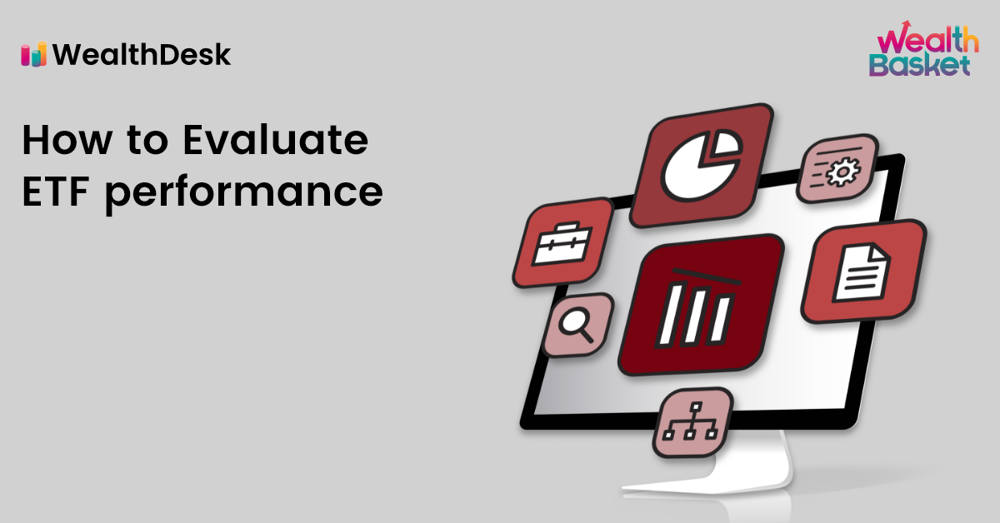

## Table of Contents

## What is an ETF and how does it differ from other investment vehicles?

An ETF, or Exchange-Traded Fund, is a type of investment that holds a collection of assets like stocks, bonds, or commodities. You can buy and sell ETFs on a stock exchange, just like you would with individual stocks. This makes it easy for investors to own a diversified portfolio without having to buy each asset separately. For example, if you want to invest in the technology sector, you can buy an ETF that includes many tech companies instead of picking individual stocks.

ETFs differ from other investment vehicles like mutual funds and individual stocks in a few key ways. Unlike mutual funds, which are typically bought or sold at the end of the trading day at a price based on the net asset value, ETFs can be traded throughout the day at market prices. This gives investors more flexibility to react to market changes. Compared to individual stocks, ETFs offer more diversification, which can help reduce risk. However, while ETFs can give you broad exposure to a market or sector, they might not offer the same potential for high returns that you might get from picking a successful individual stock.

## How do you measure the performance of an ETF?

To measure the performance of an ETF, you look at how its value changes over time. You can do this by checking the ETF's price and comparing it to what it was before. If the price goes up, the ETF is doing well. If it goes down, it's not doing so well. Another way to measure performance is by looking at the ETF's total return, which includes any dividends or interest the ETF pays out. This gives you a better idea of how much money you're really making from the ETF.

You can also compare the ETF's performance to a benchmark, like a stock market index. For example, if you have an ETF that tracks the S&P 500, you can see if it's doing better or worse than the S&P 500 itself. This helps you understand if the ETF is a good investment compared to the overall market. Lastly, you can look at the ETF's expense ratio, which is how much it costs to own the ETF. A lower expense ratio means more of your money stays invested, which can lead to better performance over time.

## What are the key metrics to consider when evaluating ETF performance?

When you want to see how well an ETF is doing, one of the first things to look at is its price. If the price is going up, that's a good sign. But you should also check the total return, which includes any money the ETF pays out as dividends or interest. This gives you a fuller picture of how much you're earning from the ETF. Another thing to consider is how the ETF compares to a benchmark, like the S&P 500. If your ETF is meant to track the S&P 500, you want to see if it's doing better or worse than the index itself. This helps you know if the ETF is a good investment compared to the overall market.

Another important metric is the expense ratio. This is how much it costs to own the ETF. A lower expense ratio means more of your money stays invested, which can lead to better performance over time. You might also want to look at the ETF's trading volume, which shows how many shares are being bought and sold. High trading volume can mean the ETF is popular and easy to buy or sell. Lastly, consider the ETF's tracking error, which measures how closely the ETF follows its benchmark. A smaller tracking error means the ETF is doing a good job of matching the performance of its index.

## How does the expense ratio impact the overall performance of an ETF?

The expense ratio of an ETF is like a fee you pay for owning it. It's a percentage of your investment that goes to cover the costs of managing the ETF. If an ETF has a high expense ratio, it means a bigger chunk of your money is being used to pay these fees instead of staying invested. Over time, this can really add up and eat into your returns. So, an ETF with a lower expense ratio can be better for your overall performance because more of your money stays in the market, working for you.

For example, imagine you invest $10,000 in an ETF with a 1% expense ratio. That means you'll pay $100 each year just to own the ETF. If another ETF has a 0.1% expense ratio, you'd only pay $10 a year. Over many years, that difference can make a big impact on how much money you end up with. So when you're choosing an ETF, looking at the expense ratio is a smart move to help keep more of your money invested and growing.

## What role does the tracking error play in evaluating an ETF's performance?

Tracking error is a way to see how well an ETF follows the index it's supposed to copy. If an ETF has a small tracking error, it means it's doing a good job of matching the performance of its index. A big tracking error means the ETF isn't following the index as closely, which could be a problem if you're trying to get the same returns as the index.

When you're looking at an ETF, checking the tracking error can help you understand if it's a good choice for your investment goals. If you want your investment to act just like the index, you'll want an ETF with a low tracking error. But if the tracking error is high, it might mean the ETF is taking different risks or using different strategies, which could affect how well it does compared to the index.

## How can historical performance data be used to assess an ETF's potential?

Historical performance data can give you a good idea of how an ETF has done in the past. By looking at this data, you can see if the ETF has been able to grow over time and how it has handled different market conditions. For example, if the ETF did well during a market downturn, it might be a sign that it could handle future downturns better than others. This data can also show you how the ETF compares to its benchmark, like the S&P 500, which helps you see if it's a good choice for what you want to achieve with your investments.

However, it's important to remember that past performance doesn't guarantee future results. Just because an ETF did well in the past doesn't mean it will keep doing well. Markets change, and what worked before might not work in the future. So, while historical performance data is useful for understanding an ETF's track record, you should also look at other things like the ETF's expense ratio, the quality of its holdings, and the overall market conditions before deciding to invest.

## What are the tax implications of investing in ETFs and how do they affect performance?

Investing in ETFs can have some tax benefits that might help your overall performance. One big advantage is that ETFs often have lower capital gains distributions than mutual funds. This happens because of how ETFs are structured. When people buy and sell ETF shares, it usually doesn't cause the ETF to sell its holdings, which can create taxable events. This means you might pay less in taxes each year, leaving more money in your investment to grow over time.

However, there are still taxes to think about. If you sell your ETF shares for a profit, you'll owe capital gains tax on that profit. The rate you pay depends on how long you held the ETF. If you held it for more than a year, you'll pay a long-term capital gains tax, which is usually lower than the short-term rate you'd pay if you held it for less than a year. Also, if your ETF pays dividends, you'll have to pay taxes on those too. So while ETFs can be tax-efficient, it's important to consider these tax implications when thinking about how they might affect your investment's performance.

## How does the liquidity of an ETF influence its performance and investor accessibility?

The liquidity of an ETF affects how easy it is for investors to buy and sell shares. If an ETF has high liquidity, it means there are a lot of shares being traded every day. This makes it easier for you to buy or sell your shares quickly, without affecting the price too much. High liquidity can also mean the ETF's price stays closer to its actual value, which is good for investors because it makes the ETF more predictable and less risky. On the other hand, if an ETF has low liquidity, it might be harder to buy or sell shares without moving the price a lot, which can be a problem if you need to get your money out quickly.

Liquidity can also influence how many investors are willing to put their money into an ETF. If an ETF is very liquid, more people might want to invest in it because they know they can easily get their money back when they need to. This can attract more investors, which can help the ETF's performance by bringing in more money. But if an ETF is not very liquid, some investors might stay away because they're worried about not being able to sell their shares when they want to. So, liquidity plays a big role in both how an ETF performs and how accessible it is to investors.

## What are the risks associated with ETFs and how can they be mitigated?

Investing in ETFs comes with some risks you should know about. One big risk is market risk, which means the value of the ETF can go down if the market goes down. Since ETFs often track a whole market or sector, if that market or sector does poorly, your ETF will too. Another risk is liquidity risk. If an ETF isn't very popular and doesn't have a lot of people buying and selling it, you might find it hard to sell your shares quickly or at a good price. There's also tracking error risk, where the ETF doesn't follow its index as closely as it should, which can affect your returns.

You can take steps to lessen these risks. To deal with market risk, you can spread your money across different types of ETFs, like ones that track different markets or sectors. This way, if one market goes down, others might go up and balance out your losses. For liquidity risk, you can choose ETFs that are more popular and have a lot of trading activity. This makes it easier to buy and sell shares. To handle tracking error risk, look for ETFs with a low tracking error, which means they do a good job of matching the performance of their index. By understanding these risks and taking these steps, you can make smarter choices about which ETFs to invest in.

## How do sector-specific and broad-market ETFs differ in performance evaluation?

Sector-specific ETFs and broad-market ETFs are evaluated differently because they have different goals. A sector-specific ETF focuses on a particular industry, like technology or healthcare. When you look at how well it's doing, you want to see if it's performing better or worse than the sector it's meant to track. You also need to think about what's happening in that industry. If the sector is doing well, the ETF should do well too, but if the sector is struggling, the ETF might not do as well. You can compare the ETF's performance to a sector-specific index to see how it's doing.

On the other hand, a broad-market ETF tries to give you a piece of the whole market, like the entire U.S. stock market. When you're checking how it's doing, you'll compare it to a broad market index, like the S&P 500. You want to see if the ETF is keeping up with the overall market or doing better. Broad-market ETFs are usually less risky than sector-specific ETFs because they're more spread out, but they might not have the same chance for big gains that a sector-specific ETF could have if it picks the right industry at the right time.

## What advanced statistical methods can be used to predict future ETF performance?

To predict how an ETF might do in the future, you can use some advanced math methods. One way is called time series analysis. This method looks at how the ETF's price has changed over time and uses that information to guess what might happen next. It's like looking at the weather patterns to predict if it will rain tomorrow. Another method is regression analysis, which helps you see how different things, like interest rates or the overall market, affect the ETF's performance. By understanding these relationships, you can make better guesses about the ETF's future.

Another useful method is machine learning. This is a bit like teaching a computer to learn from past data and then use that learning to predict what might happen next. Machine learning can look at a lot of different information at once, like economic reports, news, and even social media, to find patterns that might not be obvious to people. While these methods can help you make better predictions, it's important to remember that nothing is certain in the stock market. The future can always surprise us, so these predictions are just educated guesses.

## How do macroeconomic factors and market conditions affect ETF performance evaluation?

Macroeconomic factors and market conditions play a big role in how well an ETF does. Things like interest rates, inflation, and the overall health of the economy can make a big difference. For example, if interest rates go up, it can slow down the economy and make ETFs that focus on growth stocks do worse. On the other hand, if the economy is doing well and growing, ETFs that track the whole market or certain sectors might do better because more people are spending money and businesses are doing well.

When you're looking at how an ETF is doing, you need to think about these big economic factors. If the market is going through a rough patch, like a recession, even a good ETF might not do as well as you hope. But if the market is booming, an ETF might do better than usual. So, when you're trying to figure out if an ETF is a good investment, you should look at how it's doing compared to what's happening in the economy and the market. This helps you understand if the ETF is doing well because it's a good choice or just because the market is doing well overall.

## How can one evaluate the performance of an ETF?

Evaluating the performance of Exchange-Traded Funds (ETFs) is an essential task for investors looking to optimize their portfolios. The assessment process involves examining several key metrics, including expense ratios, liquidity, and tracking error, each of which offers insight into different facets of [ETF](/wiki/etf-trading-strategies) performance.

Expense ratios are critical as they represent the cost of managing and operating the ETF. Lower expense ratios typically indicate more efficient management, potentially enhancing investor returns over time. The importance of minimizing costs is underscored by the compounding effect, where seemingly small differences in expense ratios can result in significant divergence in investment outcomes in the long term.

Liquidity is another vital metric that determines how easily an ETF can be bought or sold in the market without affecting its price. Highly liquid ETFs are preferable as they offer tighter bid-ask spreads and ensure that investors can enter or [exit](/wiki/exit-strategy) positions with minimal market impact. Liquidity is often correlated with the ETF’s trading [volume](/wiki/volume-trading-strategy); higher volumes generally signal better liquidity.

Tracking error measures how closely an ETF's performance mirrors the performance of its benchmark index. Lower tracking errors indicate that the ETF effectively replicates the benchmark, ensuring that investors receive returns that closely match the index's performance. The formula for tracking error can be expressed as:

$$
\text{Tracking Error} = \sqrt{\frac{1}{n-1} \sum_{i=1}^{n} (R_{p,i} - R_{b,i})^2}
$$

where $R_{p,i}$ is the return of the ETF, $R_{b,i}$ is the return of the benchmark, and $n$ is the number of observations.

Understanding the benchmark indices that ETFs track is crucial. Different indices come with varying levels of risk and exposure to sectors or geographical regions. Investors should ensure that the ETF’s benchmark aligns with their risk tolerance and investment strategy, as performance deviation can occur if market conditions favor sectors not well-represented by the benchmark.

Lastly, evaluating an ETF’s composition is essential to understand how it might react to market changes. An ETF's holdings determine its exposure to various assets and sectors, influencing its sensitivity to economic cycles and trends. For instance, an ETF heavily weighted in technology stocks may perform differently than one focused on consumer goods during economic fluctuations.

In conclusion, a thorough evaluation of expense ratios, liquidity, tracking error, and the benchmark index provides investors with a comprehensive understanding of an ETF’s potential performance. Aligning these factors with individual investment goals is key to constructing a successful ETF portfolio.

## What is the role of financial analysis in ETF investment?

Financial analysis is a critical component for investors selecting Exchange-Traded Funds (ETFs). It encompasses a variety of techniques and metrics that aid in deciphering market trends, thus facilitating informed investment decisions. By employing quantitative analysis, investors can assess the potential risks and returns associated with different ETFs effectively.

A foundational element of financial analysis in ETF investment is the examination of key financial metrics. Expense ratios are crucial, as they directly impact investors' returns. A lower expense ratio generally indicates a more cost-effective investment, enabling investors to achieve better net returns. Additionally, understanding the tracking error of an ETF is vital, as it measures how closely the ETF follows its benchmark index. A smaller tracking error signifies better benchmark tracking, making the ETF a more reliable investment. 

Liquidity analysis is another significant consideration. High liquidity in an ETF allows investors to enter and exit positions with minimal price impact and lower transaction costs. The bid-ask spread is a commonly used indicator of liquidity, with narrower spreads reflecting a more liquid ETF.

Data analytics plays an indispensable role in ETF selection by highlighting strengths and weaknesses. Various metrics, such as historical performance data, [volatility](/wiki/volatility-trading-strategies), and Sharpe ratios, can be scrutinized to ascertain an ETF's suitability within a portfolio. For example, the Sharpe ratio provides insight into the risk-adjusted return of an ETF. It is calculated as:

$$

\text{Sharpe Ratio} = \frac{R_p - R_f}{\sigma_p} 
$$

where $R_p$ is the average return of the portfolio, $R_f$ denotes the risk-free rate, and $\sigma_p$ represents the standard deviation of the portfolio's return. A higher Sharpe ratio implies better risk-adjusted returns.

Investors can also leverage analytical tools for [backtesting](/wiki/backtesting) investment strategies. These tools simulate how a portfolio strategy might have performed using historical data, allowing investors to refine their approach. Python, with its rich ecosystem of libraries such as NumPy, pandas, and matplotlib, is often used for backtesting. Here is a simple example of how Python can be employed for this purpose:

```python
import pandas as pd
import numpy as np
import matplotlib.pyplot as plt

# Load historical price data
data = pd.read_csv('etf_prices.csv', parse_dates=True, index_col='Date')

# Calculate daily returns
returns = data.pct_change()

# Simulate a simple moving average crossover strategy
short_window = 40
long_window = 100
signals = pd.DataFrame(index=data.index)
signals['signal'] = 0.0

# Short moving average
signals['short_mavg'] = data['Close'].rolling(window=short_window, min_periods=1, center=False).mean()

# Long moving average
signals['long_mavg'] = data['Close'].rolling(window=long_window, min_periods=1, center=False).mean()

# Generate signals
signals['signal'][short_window:] = np.where(signals['short_mavg'][short_window:] > signals['long_mavg'][short_window:], 1.0, 0.0)   

# Generate trading orders
signals['positions'] = signals['signal'].diff()

# Plot signals
plt.figure(figsize=(10, 5))
plt.plot(data.index, data['Close'], color='black', lw=1, label='Price')
plt.plot(signals.index, signals['short_mavg'], color='blue', lw=1, label='Short Moving Avg')
plt.plot(signals.index, signals['long_mavg'], color='red', lw=1, label='Long Moving Avg')
plt.plot(signals.loc[signals.positions == 1.0].index, signals.short_mavg[signals.positions == 1.0], '^', markersize=10, color='g', label='Buy Signal')
plt.plot(signals.loc[signals.positions == -1.0].index, signals.short_mavg[signals.positions == -1.0], 'v', markersize=10, color='r', label='Sell Signal')
plt.title('Backtest of Moving Average Crossover Strategy')
plt.xlabel('Date')
plt.ylabel('Price')
plt.legend()
plt.show()
```

This example demonstrates a moving average crossover strategy, one of many methods investors can use for backtesting ETF investments. By effectively combining these financial analysis techniques, investors can optimize their ETF portfolios, ensuring alignment with their investment goals and risk appetite.

## References & Further Reading

[1]: Khorana, A., Servaes, H., & Tufano, P. (2009). ["Mutual fund fees around the world."](https://www.jstor.org/stable/pdf/30225692.pdf) The Review of Financial Studies, 22(3), 1279-1310.

[2]: Lioui, A., & Poncet, P. (2003). ["Optimal Portfolio Allocation among Stocks, Bonds, and Bills"](https://nscpolteksby.ac.id/ebook/files/Ebook/Journal/2015/Banking%20and%20Finance/Vol.%2027/Volume%2027%20Issue%2011/International%20asset%20allocation%20A%20new%20perspective.pdf). Financial Markets, Institutions & Instruments, 12(4), 243-282.

[3]: Hasbrouck, J. (2003). ["Intraday price formation in U.S. equity index markets"](https://onlinelibrary.wiley.com/doi/10.1046/j.1540-6261.2003.00609.x)00097-2). The Journal of Financial Markets, 6(3), 201-222.

[4]: Hendershott, T., Jones, C.M., & Menkveld, A.J. (2011). ["Does Algorithmic Trading Improve Liquidity?"](https://onlinelibrary.wiley.com/doi/full/10.1111/j.1540-6261.2010.01624.x). Management Science, 57(1), 1-20.

[5]: Hill, J., Nadig, D., Hougan, M. (2015). ["A Comprehensive Guide to Exchange-Traded Funds (ETFs)"](https://papers.ssrn.com/sol3/papers.cfm?abstract_id=2616223). CFA Institute Research Foundation.

[6]: Narang, R.K. (2013). ["Inside the Black Box: A Simple Guide to Quantitative and High Frequency Trading"](https://onlinelibrary.wiley.com/doi/book/10.1002/9781118662717). John Wiley & Sons.

[7]: Pomeranets, A., & Weaver, D. (2010). ["Security Transaction Taxes and Market Quality"](https://www.jstor.org/stable/26591913). Staff Working Papers.