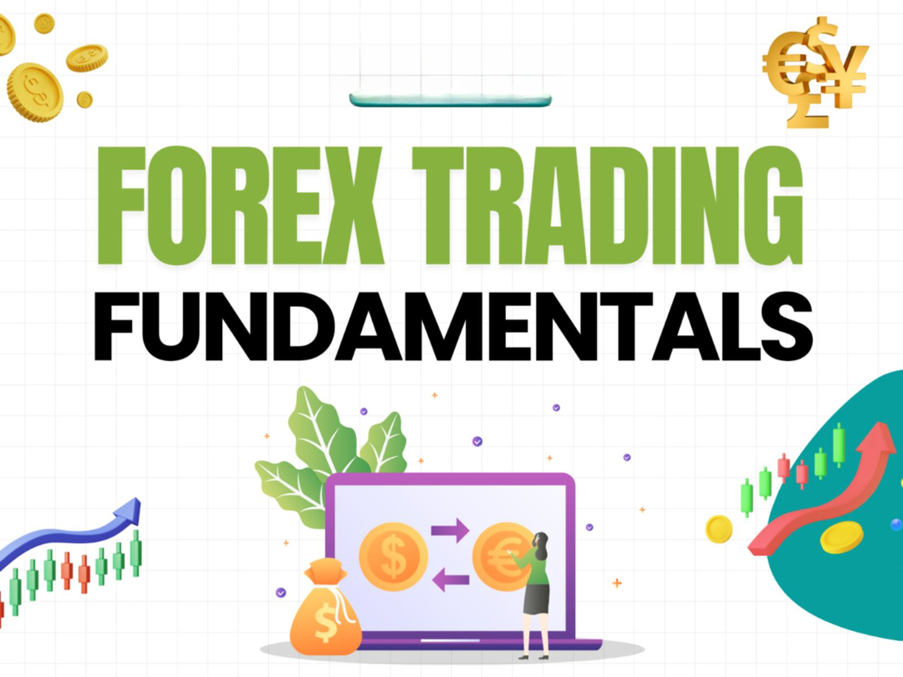

Understanding the forex market is critical for traders looking to capitalize on currency fluctuations. It is the largest financial market globally, with a daily trading volume exceeding $6 trillion. Traders engage in buying and selling currency pairs to profit from changes in exchange rates. The market operates 24 hours a day, five days a week, encompassing various participants, including banks, financial institutions, corporations, governments, and individual traders.

The evaluation of currencies is primarily governed by forex fundamental analysis. This analytical approach focuses on assessing the intrinsic value of currencies through economic indicators, geopolitical developments, and monetary policies. Traders analyze these fundamental aspects to understand and predict currency price movements. Economic indicators such as Gross Domestic Product (GDP), Consumer Price Index (CPI), and employment data are essential for assessing a country's economic health and its influence on currency valuation.



In addition to fundamental analysis, technological advancements have profoundly transformed forex trading. Algorithmic trading has revolutionized the market by introducing automated processes that enable speed and efficiency. Traders now use complex algorithms to execute trades based on predefined criteria, enhancing decision-making and reducing the need for manual intervention. Despite its benefits, algorithmic trading also presents inherent risks, particularly in volatile markets, which require careful strategy management. 

Understanding these elements of forex trading — fundamental analysis and technological advancements — is essential for traders aiming to navigate this complex financial landscape effectively.

## Table of Contents

## The Role of Economic Indicators in Forex Analysis

Economic indicators are pivotal tools that provide insights into a country's economic health and consequently influence currency valuation in the forex market. These indicators include metrics such as Gross Domestic Product (GDP), Consumer Price Index (CPI), and retail sales, each offering valuable information that can guide traders in predicting currency movements and shaping their trading strategies.

GDP is one of the most comprehensive indicators of a country's economic performance. It measures the total value of all goods and services produced over a specific time period and serves as a broad indicator of economic activity. A higher GDP growth rate typically suggests a robust economy, which can strengthen the national currency as investors seek to capitalize on the country's economic vitality.

The Consumer Price Index (CPI) reflects changes in the price level of a basket of consumer goods and services purchased by households. It is a key measure of inflation. Increasing inflation, as shown by a rising CPI, can lead to the anticipation of higher interest rates by a country's central bank, which often results in a stronger currency. This occurs because higher interest rates tend to attract foreign capital, increasing demand for the national currency.

Retail sales data, another critical economic indicator, reflect consumer spending, a major driver of economic activity. Rising retail sales suggest increased consumer confidence and economic expansion, potentially leading to a stronger currency. Conversely, declining sales may indicate economic weakness and could result in currency depreciation.

Forex traders utilize these indicators to make informed predictions about future currency movements. For instance, if GDP growth exceeds expectations, traders might anticipate currency appreciation and adjust their strategies accordingly. Similarly, unexpected changes in CPI can prompt traders to reassess their positions in anticipation of central bank actions. 

In practice, traders often incorporate these economic indicators into [algorithmic trading](/wiki/algorithmic-trading) systems to automate decision-making processes. Here's an example of a simple algorithm in Python that uses GDP, CPI, and retail sales data to issue a hypothetical buy or sell signal:

```python
def trading_signal(gdp_growth, cpi_change, retail_sales_growth):
    if gdp_growth > 2.0 and cpi_change < 2.0 and retail_sales_growth > 1.0:
        return "Buy"
    elif gdp_growth < 1.0 or cpi_change > 3.0 or retail_sales_growth < 0.5:
        return "Sell"
    else:
        return "Hold"

# Example usage
signal = trading_signal(gdp_growth=2.5, cpi_change=1.8, retail_sales_growth=1.2)
print(f"Trading Signal: {signal}")
```

This simplistic algorithm suggests a buy signal when economic indicators reflect a strong economy, sell when indicators show potential economic issues, and hold when conditions are uncertain. 

In conclusion, economic indicators are invaluable in [forex](/wiki/forex-system) analysis, enabling traders to assess economic health and predict currency trends. By integrating these metrics into their strategies, traders can enhance their ability to make informed decisions in the dynamic forex market.

## Forex Fundamentals: A Closer Look

Fundamental analysis in the forex market centers on the evaluation of economic conditions that influence a currency's value over time. This approach considers a variety of factors, including interest rates, economic policies, and geopolitical developments, all of which play significant roles in determining currency strength.

Interest rates are one of the most critical factors. Central banks, such as the Federal Reserve or the European Central Bank, set interest rates to control inflation and stabilize their currencies. Higher interest rates offer lenders in an economy a higher return relative to other countries. Consequently, high interest rates attract foreign capital and trigger an increase in the currency value. Conversely, low interest rates can lead to currency depreciation.

Economic policies, including fiscal and monetary policy, also significantly affect currency values. Fiscal policies involve government spending and tax measures, which can impact economic growth and thus influence currency strength. Monetary policy, governed by central banks, can involve changing interest rates or implementing quantitative easing measures, directly affecting currency value.

Geopolitical developments have the potential to affect currency valuation significantly. Political stability and predictability are favored in the forex market, as they foster confidence among investors. Conversely, political unrest or instability can lead to currency depreciation, as investors seek safer investments.

Gross Domestic Product (GDP) is a vital metric in [fundamental analysis](/wiki/fundamental-analysis). It represents the total economic output of a country. A strong GDP growth rate is often indicative of a healthy economy, attracting foreign investment, and bolstering the national currency. For instance, a country experiencing robust GDP growth can expect strengthening currency, as international investors seek to capitalize on the country's economic performance.

Forex traders incorporating fundamental analysis into their strategies pay close attention to governmental announcements, central bank reports, and economic data releases. Understanding these elements and their potential impacts on currency values is essential for making informed trading decisions.

## Algorithmic Trading in the Forex Market

Algorithmic trading has significantly impacted forex markets by offering unparalleled speed and efficiency in executing trades. This technology utilizes complex algorithms that can process vast amounts of market data and make trading decisions in fractions of a second, significantly faster than any human trader could manage.

An essential aspect of algorithmic trading is the use of predetermined criteria to automate trading processes. These criteria are often based on technical analysis, statistical models, or a combination of the two. For example, an algorithm might be programmed to execute a buy order when a currency pair's moving average crosses a particular threshold, or to sell when market [volatility](/wiki/volatility-trading-strategies) surpasses a set limit.

To illustrate, consider a simple moving average crossover strategy implemented in Python. This algorithm buys a currency pair when the short-term moving average rises above the long-term moving average, signaling an uptrend, and sells when the opposite occurs.

```python
import numpy as np

def moving_average(data, window_size):
    return np.convolve(data, np.ones(window_size), 'valid') / window_size

def trading_strategy(price_data, short_window, long_window):
    short_ma = moving_average(price_data, short_window)
    long_ma = moving_average(price_data, long_window)

    signals = []
    for short, long in zip(short_ma, long_ma):
        if short > long:
            signals.append('Buy')
        elif short < long:
            signals.append('Sell')
        else:
            signals.append('Hold')
    return signals

# Example usage:
prices = [1.3, 1.5, 1.6, 1.4, 1.6, 1.7, 1.8]  # Hypothetical price data
signals = trading_strategy(prices, 2, 3)
print(signals)
```

Despite the potential for increased profitability, algorithmic trading is not without its risks. The Forex market is known for its volatility, and rapid market movements can lead to significant losses if an algorithm is not carefully designed and monitored. Market conditions can change quickly, leading to situations where an algorithm might execute trades based on outdated assumptions, resulting in unintended losses. Furthermore, technical issues such as latency and hardware failures can also impact the performance of trading algorithms.

To mitigate these risks, traders often employ rigorous [backtesting](/wiki/backtesting) and stress testing of algorithms under various market conditions to ensure their robustness. Additionally, implementing real-time monitoring and fail-safes can help manage unexpected market behavior or technical difficulties. Understanding these limitations is crucial for traders aiming to leverage the benefits of algorithmic trading effectively.

## Risks and Challenges in Forex Trading

Forex trading poses inherent risks which traders must navigate cautiously. One significant source of risk is leverage. While leverage amplifies potential profits, it equally magnifies potential losses. For example, a trader using a 50:1 leverage ratio can control a $50,000 position with just $1,000. This high level of leverage can lead to substantial losses, often exceeding the initial investment, if not carefully managed.

Market volatility presents another challenge. Currency markets are highly sensitive to economic events, geopolitical developments, and changing market sentiments. Such events can trigger rapid price movements, leading to increased market volatility. Traders must remain vigilant, as extreme volatility can result in significant financial losses.

Geopolitical factors also contribute to forex market risks. Political instability, sudden policy changes, or international conflicts can lead to unpredictable currency movements. For instance, unexpected election outcomes or trade negotiations can alter currency strength overnight.

Effective risk management strategies are essential for traders to mitigate these risks. Stop-loss orders allow traders to set predetermined [exit](/wiki/exit-strategy) points to limit potential losses. Diversification, spreading investments across various assets or currencies, can reduce exposure to market volatility. Here's an example of setting a stop-loss order using Python:

```python
# Example of setting a stop-loss order in a trading strategy

def calculate_stop_loss(entry_price, risk_percent):
    risk_amount = entry_price * (risk_percent / 100)
    stop_loss_price = entry_price - risk_amount
    return stop_loss_price

entry_price = 1.2500  # Example entry price in USD
risk_percent = 2  # Risking 2% of the entry price
stop_loss = calculate_stop_loss(entry_price, risk_percent)

print(f"Set stop-loss at: {stop_loss}")
```

Algorithmic trading introduces its own set of risks. While algorithms enhance speed and efficiency, they can also amplify losses if not properly monitored. Algorithms may struggle to adapt to unexpected market conditions or system failures, leading to flawed execution of trades. Thus, implementing robust backtesting, continuous monitoring, and risk management protocols is crucial for traders employing algorithmic strategies.

In summary, understanding and managing the multifaceted risks of forex trading is vital. Traders should employ effective strategies like stop-losses and diversification to navigate leverage and volatility challenges. Equally critical is awareness of the specific risks associated with algorithmic trading, ensuring systems are monitored and adjusted to protect against potential losses.

## Making Money in Forex: Strategies and Tips

Profitable forex trading hinges on a comprehensive understanding of market fundamentals combined with the skillful interpretation of economic indicators. Effective forex strategies often require the integration of both technical and fundamental analysis. Technical analysis involves studying past price movements and patterns in order to forecast future behavior. Common tools in technical analysis include moving averages, trend lines, support and resistance levels, and various chart patterns. For instance, a moving average can help identify the direction of a trend and potential points of reversal or continuation.

Conversely, fundamental analysis focuses on understanding the economic, financial, and geopolitical factors that affect currency value. This includes evaluating macroeconomic indicators like interest rates, inflation, and employment figures. A country with strong economic growth, evidenced by high GDP or low unemployment rates, might see its currency appreciating against others.

Traders can employ a balanced approach by blending these two forms of analysis. A fundamental perspective helps assess the likely long-term trends and intrinsic value of a currency, while technical analysis can be used to determine entry and exit points for trades.

Continuous learning and adaptation are crucial for long-term success in the forex market. Market dynamics are ever-changing, influenced by myriad factors such as technological shifts, policy changes, and unforeseen economic events. Keeping abreast of these developments and refining strategies accordingly is essential. Moreover, maintaining emotional discipline and adhering to a robust trading plan can mitigate risks and improve profitability.

Risk management is also a pivotal component of successful forex trading. Employing strategies like stop-loss orders helps manage downside risk by automatically selling a position when it reaches a certain price level, thus containing potential losses. Diversification, whereby traders spread their investments across different currency pairs, can also lower exposure to any single adverse market movement.

In conclusion, by mastering the blend of technical and fundamental analysis, committing to continuous learning, and maintaining disciplined risk management, traders can enhance their ability to succeed in the forex market.

## Conclusion

The forex market presents remarkable opportunities for traders who possess a deep understanding of its intricacies. Mastering currency fundamentals is crucial, as these fundamentals drive the intrinsic value of currencies and influence their long-term trends. By effectively analyzing economic indicators—such as GDP, CPI, and interest rates—traders gain insights into the health of national economies, which in turn affects currency valuations. 

In addition to fundamental analysis, embracing algorithmic trading can enhance a trader's success. Algorithms optimize trading efficiency by automating decisions based on predefined criteria, thus enabling rapid execution and minimizing human error. However, it remains essential for traders to remain vigilant regarding the risks, particularly during periods of market volatility.

Prudent risk management is indispensable in forex trading. Given the leverage involved and the ever-changing geopolitical landscape, traders must employ strategies like stop-loss orders, hedging, and diversification to mitigate potential losses. Success in forex trading is not just about strategy but also about adaptation and continuous learning, as market conditions are in constant flux. A disciplined approach to risk management and strategy refinement can significantly improve a trader’s ability to navigate the dynamic forex market landscape and capitalize on its opportunities.

## References & Further Reading

[1]: Frankel, J. A., & Froot, K. A. (1990). "Chartists, fundamentalists, and trading in the foreign exchange market." American Economic Review, 80(2), 181-185.

[2]: Murphy, J. J. (1999). ["Technical Analysis of the Financial Markets: A Comprehensive Guide to Trading Methods and Applications"](https://archive.org/details/technicalanalysi0000murp). New York Institute of Finance.

[3]: Harris, L. (2003). ["Trading and Exchanges: Market Microstructure for Practitioners"](https://www.amazon.com/Trading-Exchanges-Market-Microstructure-Practitioners/dp/0195144708). Oxford University Press.

[4]: Menkhoff, L., Sarno, L., Schmeling, M., & Schrimpf, A. (2012). ["Currency Momentum Strategies."](https://papers.ssrn.com/sol3/papers.cfm?abstract_id=1809776) Review of Financial Studies, 25(2), 3003-3040.

[5]: Chaboud, A. P., Chiquoine, B., Hjalmarsson, E., & Vega, C. (2014). ["Rise of the Machines: Algorithmic Trading in the Foreign Exchange Market."](https://www.jstor.org/stable/43612951) Journal of Finance, 69(5), 2045-2084.

[6]: Narang, R. K. (2013). ["Inside the Black Box: A Simple Guide to Quantitative and High Frequency Trading."](https://onlinelibrary.wiley.com/doi/book/10.1002/9781118662717) Wiley.