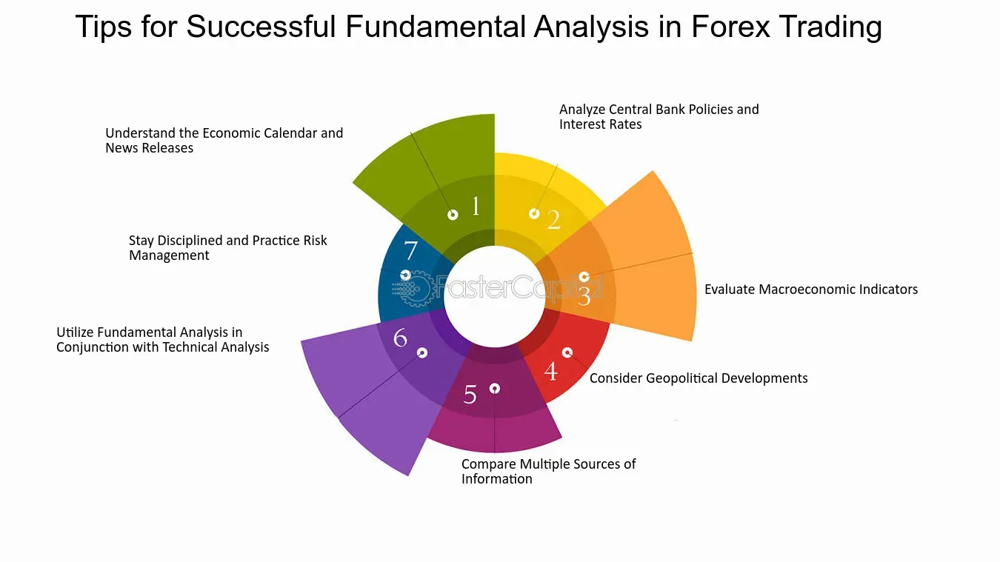

## Table of Contents

## What are Forex fundamentals and why are they important?

Forex fundamentals are the basic factors that influence the value of currencies in the foreign exchange market. These include economic indicators like GDP growth, inflation rates, employment data, and interest rates set by central banks. They also cover political stability, trade balances, and other macroeconomic factors. Understanding these fundamentals helps traders and investors predict how currencies might move based on changes in the economy.

These fundamentals are important because they provide a foundation for making informed trading decisions. For example, if a country's economy is growing strongly, its currency might strengthen because investors want to buy assets in that country. On the other hand, if a country is facing high inflation or political uncertainty, its currency might weaken. By keeping an eye on these fundamental factors, traders can better anticipate market movements and adjust their strategies accordingly. This knowledge can lead to more successful trades and better risk management.

## How do economic indicators influence Forex markets?

Economic indicators are important pieces of information that show how well a country's economy is doing. They can include things like how many people have jobs, how much things cost (inflation), and how much the country is making and spending (GDP). When these indicators show that an economy is doing well, it usually makes the country's currency stronger. People and businesses want to invest in a strong economy, so they buy that country's currency. On the other hand, if the indicators show the economy is doing poorly, the currency might get weaker because people don't want to invest there.

For example, if the unemployment rate goes down, it means more people are working and [earning](/wiki/earning-announcement) money. This can make the economy grow, and the currency might become more valuable. But if inflation goes up a lot, it means prices are rising quickly, which can make the currency weaker because it loses value over time. Traders in the Forex market watch these indicators closely to guess how currency values might change. By understanding these economic signs, they can make better choices about when to buy or sell currencies.

## What is the impact of interest rates on currency values?

Interest rates set by a country's central bank can have a big effect on how valuable its currency is. When a country raises its interest rates, it usually makes its currency stronger. This happens because higher interest rates mean people and businesses can earn more money by keeping their savings in that country's banks or by investing there. So, they want to buy more of that country's currency to take advantage of the higher returns. For example, if the U.S. raises its interest rates, more people might want to buy U.S. dollars to invest in the U.S., which can make the dollar stronger compared to other currencies.

On the other hand, when a country lowers its interest rates, its currency often becomes weaker. Lower interest rates mean less return on savings and investments, so people and businesses might move their money to countries where they can earn more. This can lead to less demand for the currency of the country that lowered its rates. For instance, if Japan lowers its interest rates, people might sell Japanese yen to buy currencies from countries with higher interest rates, making the yen weaker. Understanding how interest rates affect currency values is important for anyone trading in the Forex market, as it helps them predict how currencies might move in the future.

## How does inflation affect Forex trading?

Inflation is when prices for things go up, and it can really change how Forex trading works. If a country has high inflation, its currency usually becomes less valuable. This happens because when prices go up a lot, the money in that country doesn't buy as much as it used to. So, people might not want to keep their money in that country or buy things from there. Traders in the Forex market watch inflation closely because it can tell them if a currency might go down in value. If they see high inflation, they might decide to sell that currency before it loses more value.

On the other hand, if a country has low inflation, its currency can become stronger. Low inflation means prices aren't going up very fast, so the money keeps its value better. This makes the country's currency more attractive to people and businesses who want to invest or buy things. Traders might buy the currency of a country with low inflation because they think it will keep its value or even go up. Knowing about inflation helps traders make smart choices in the Forex market, trying to predict how currencies will move based on how prices are changing.

## What role do political events play in Forex fundamentals?

Political events can have a big impact on Forex fundamentals because they can change how people feel about a country's economy. If there's a lot of political uncertainty, like elections or big policy changes, it can make people worried. They might think the country's economy will do worse because of the uncertainty. This can make the country's currency weaker because people don't want to invest in a place that feels risky. For example, if there's a big election coming up and people aren't sure who will win, they might sell the country's currency until they know more.

On the other hand, if a country seems politically stable and has good policies, people might feel more confident about its economy. They could think the country will do well, so they want to invest there. This can make the country's currency stronger because more people want to buy it. For instance, if a country passes laws that help businesses grow, it might make people think the economy will get better, so they buy more of that country's currency. Political events are important for Forex traders to watch because they can give clues about how a currency might move in the future.

## How can one analyze a country's economic health using Forex fundamentals?

To analyze a country's economic health using Forex fundamentals, you need to look at different pieces of information that show how the economy is doing. One important thing to check is the country's Gross Domestic Product (GDP), which tells you if the country is making and spending more money than before. If GDP is growing, it usually means the economy is doing well. Another thing to watch is the unemployment rate. If fewer people are out of work, it's a good sign because it means more people are earning money and spending it, which helps the economy grow. You should also look at inflation, which is when prices go up. If inflation is too high, it can hurt the economy because people's money doesn't buy as much as it used to.

Interest rates set by the country's central bank are also a big clue. If interest rates go up, it can mean the economy is doing well because the central bank wants to slow down inflation. But if interest rates are low, it might mean the economy needs a boost. Trade balances are another piece of the puzzle. If a country is selling more things to other countries than it's buying, that's good for the economy and can make its currency stronger. Political events can also shake things up. If there's a lot of uncertainty or big changes happening, it can make people worried about the economy, which can weaken the currency. By keeping an eye on all these things, you can get a good picture of how healthy a country's economy is.

## What are the key reports to watch for Forex fundamental analysis?

When you're doing Forex [fundamental analysis](/wiki/fundamental-analysis), there are a few key reports you should keep an eye on. The Gross Domestic Product (GDP) report is really important because it shows how much a country's economy is growing or shrinking. If GDP is going up, it usually means the economy is doing well, and that can make the country's currency stronger. Another big report to watch is the unemployment rate. When fewer people are out of work, it's good for the economy because more people are earning and spending money. The Consumer Price Index (CPI) is also key because it tells you about inflation. If prices are going up too fast, it can hurt the economy and weaken the currency.

Interest rate decisions by the central bank are another critical report. When interest rates go up, it often means the economy is strong, and the currency might get stronger too because people want to invest where they can earn more. On the other hand, if interest rates go down, it might mean the economy needs help, and the currency could weaken. The trade balance report is also important. It shows if a country is selling more things to other countries than it's buying. A positive trade balance can make a currency stronger. By watching these reports, you can get a good idea of how a country's economy is doing and how its currency might move.

## How do central bank policies impact Forex markets?

Central bank policies can really change how currencies move in the Forex market. One big way they do this is by changing interest rates. When a central bank raises interest rates, it usually makes the country's currency stronger. This happens because higher interest rates mean people can earn more money by keeping their savings in that country or by investing there. So, more people want to buy that country's currency. For example, if the U.S. Federal Reserve raises interest rates, it can make the U.S. dollar stronger because more people want to invest in the U.S.

Another way central banks affect Forex markets is through their statements and actions. If a central bank says it's worried about the economy and might lower interest rates, people might start selling the country's currency because they think it will get weaker. Central banks can also buy or sell their own currency to try to control its value. For instance, if a central bank wants to make its currency weaker to help its exports, it might sell a lot of its currency in the Forex market. By watching what central banks are doing and saying, Forex traders can guess how currencies might move and make better trading decisions.

## What advanced techniques can be used to predict currency movements based on fundamentals?

One advanced technique to predict currency movements based on fundamentals is to use economic models. These models look at different pieces of economic data like GDP growth, inflation rates, and employment numbers to guess how a currency might move. Traders can use these models to see patterns and make predictions. For example, if a model shows that when GDP goes up by a certain amount, the currency usually gets stronger, traders can use this information to decide when to buy or sell a currency. This kind of analysis can be really helpful, but it takes a lot of data and math to get it right.

Another technique is to look at what's called "market sentiment." This means trying to understand how people feel about a country's economy and its currency. Traders can do this by reading news, watching what central banks are saying, and even looking at social media to see what people are talking about. If everyone is worried about a country's economy, it might make its currency weaker. On the other hand, if people are excited about a country's future, its currency might get stronger. By combining this sentiment analysis with economic data, traders can get a better picture of where a currency might be headed.

## How do global trade balances affect Forex rates?

Global trade balances can have a big effect on Forex rates. When a country exports more than it imports, it has a trade surplus. This means more money is coming into the country than going out, which can make its currency stronger. People from other countries need to buy the exporting country's currency to pay for the goods, so the demand for that currency goes up. On the other hand, if a country imports more than it exports, it has a trade deficit. This means more money is leaving the country than coming in, which can make its currency weaker because there's less demand for it.

Trade balances are important because they show how much a country is trading with the rest of the world. Changes in trade balances can tell Forex traders a lot about how a currency might move. For example, if a country starts exporting a lot more than before, its currency might get stronger because more people want to buy it. But if a country's imports go up a lot, its currency might get weaker because more of its currency is being used to pay for things from other countries. By watching trade balances, traders can make better guesses about how currencies will change in value.

## What is the relationship between commodity prices and currency strength?

Commodity prices can affect how strong a country's currency is. If a country makes a lot of a certain commodity, like oil or gold, and the price of that commodity goes up, it can make the country's currency stronger. This happens because when the commodity price goes up, the country earns more money from selling it. More people want to buy the country's currency to pay for the commodity, so the demand for the currency goes up, making it stronger. For example, if oil prices go up a lot and a country like Canada, which produces a lot of oil, will see its currency, the Canadian dollar, get stronger.

On the other hand, if commodity prices go down, it can make the currency weaker. When the price of a commodity falls, the country earns less money from selling it. This means fewer people want to buy the country's currency, so the demand goes down, and the currency gets weaker. For instance, if the price of gold drops and a country like Australia, which exports a lot of gold, will see its currency, the Australian dollar, become weaker. By watching commodity prices, traders can guess how a country's currency might move based on how much money the country makes from its commodities.

## How can one integrate Forex fundamental analysis with technical analysis for better trading decisions?

Integrating Forex fundamental analysis with technical analysis can help traders make better trading decisions by combining the big picture of an economy with the short-term movements of currency prices. Fundamental analysis looks at economic indicators like GDP growth, inflation rates, and employment data to understand how strong a country's economy is. This can tell you if a currency should get stronger or weaker over time. For example, if a country's economy is doing well, its currency might get stronger because more people want to invest there. By using fundamental analysis, traders can spot long-term trends and decide when it might be a good time to buy or sell a currency.

Technical analysis, on the other hand, looks at past price movements and patterns on charts to predict what might happen next. It uses tools like moving averages, support and resistance levels, and other chart patterns to find good times to enter or [exit](/wiki/exit-strategy) trades. For instance, if a currency's price is hitting a resistance level and then starts to go down, a trader might decide it's a good time to sell. By combining technical analysis with fundamental analysis, traders can use the big economic picture to guide their long-term strategy, and then use technical analysis to find the best times to make their trades. This way, they can make more informed decisions and hopefully improve their chances of making successful trades.

## References & Further Reading

[1]: Frankel, J. A., & Froot, K. A. (1990). "Chartists, fundamentalists, and trading in the foreign exchange market." American Economic Review, 80(2), 181-185.

[2]: Murphy, J. J. (1999). ["Technical Analysis of the Financial Markets: A Comprehensive Guide to Trading Methods and Applications"](https://archive.org/details/technicalanalysi0000murp). New York Institute of Finance.

[3]: Harris, L. (2003). ["Trading and Exchanges: Market Microstructure for Practitioners"](https://www.amazon.com/Trading-Exchanges-Market-Microstructure-Practitioners/dp/0195144708). Oxford University Press.

[4]: Menkhoff, L., Sarno, L., Schmeling, M., & Schrimpf, A. (2012). ["Currency Momentum Strategies."](https://papers.ssrn.com/sol3/papers.cfm?abstract_id=1809776) Review of Financial Studies, 25(2), 3003-3040.

[5]: Chaboud, A. P., Chiquoine, B., Hjalmarsson, E., & Vega, C. (2014). ["Rise of the Machines: Algorithmic Trading in the Foreign Exchange Market."](https://www.jstor.org/stable/43612951) Journal of Finance, 69(5), 2045-2084.

[6]: Narang, R. K. (2013). ["Inside the Black Box: A Simple Guide to Quantitative and High Frequency Trading."](https://onlinelibrary.wiley.com/doi/book/10.1002/9781118662717) Wiley.