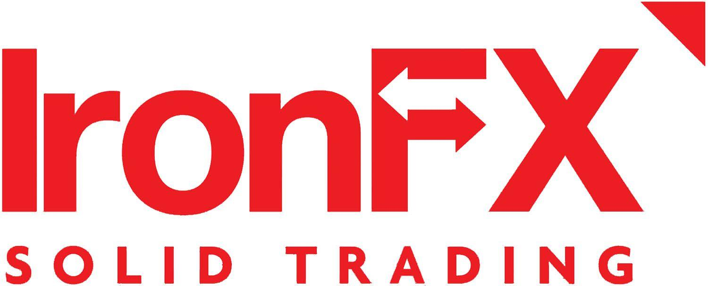

Forex trading continues to be a popular venture for both individual and institutional investors across the globe. As a highly liquid and dynamic market, forex trading offers substantial opportunities for profit but also presents considerable risks. Therefore, the choice of a forex trading broker can significantly impact the success of a trader, making it crucial to choose a trustworthy and efficient platform. 

IronFX is a well-known name in the forex trading space, offering a range of features tailored for both new and intermediate traders. Established in 2010 and headquartered in Cyprus, IronFX serves a diverse clientele, extending its reach to over 1.5 million clients in more than 180 countries. The broker is recognized for its competitive trading environment, a wide variety of trading instruments, and extensive resources aimed at facilitating trading success. 

In the evolving landscape of trading, algorithmic trading—often referred to as algo trading—has gained prominence. Algo trading involves using computer programs and algorithms to execute trades based on predefined criteria, offering advantages in speed and precision. It allows traders to maintain an objective approach, minimizing emotional bias and improving execution accuracy. IronFX has integrated these advanced capabilities, enhancing its platform to meet the growing demands of traders seeking efficiency and technological sophistication. 

In this article, we will provide a comprehensive review of IronFX, focusing on its algo trading capabilities, to help you make an informed decision regarding your trading needs. By examining its features, account types, educational resources, and customer support, we aim to present a clear picture of what IronFX has to offer in the competitive world of forex trading.

## Table of Contents

## Overview of IronFX

IronFX, established in 2010, is headquartered in Cyprus and provides services to over 1.5 million clients across more than 180 countries. The broker operates under regulation from esteemed authorities including the Financial Conduct Authority (FCA) in the United Kingdom and the Financial Sector Conduct Authority (FSCA) in South Africa, ensuring adherence to stringent regulatory standards aimed at safeguarding traders' interests.

IronFX presents a diverse array of trading instruments, accommodating various preferences and trading strategies. Clients have access to foreign exchange (forex) markets alongside commodities, indices, shares, cryptocurrencies, and precious metals. This extensive selection allows traders to diversify their portfolios and tailor their investments according to market conditions and individual risk appetites.

The broker is noted for its competitive trading environment, offering favorable conditions such as low spreads and flexible leverage options. These features are designed to enhance trading efficiency and effectiveness, making IronFX an appealing choice for both individual and institutional investors.

In addition to its trading offerings, IronFX places a strong emphasis on education, providing a wealth of resources that cater to beginners and seasoned traders alike. This includes webinars, tutorials, and a variety of educational articles and e-[books](/wiki/algo-trading-books) designed to enhance traders' knowledge and skills in the financial markets. Such resources aim to empower traders by providing them with the tools and information necessary to make informed trading decisions.

## Features of IronFX Algo Trading

IronFX equips its clients with the MetaTrader 4 (MT4) platform, renowned for its sophisticated [algorithmic trading](/wiki/algorithmic-trading) capabilities. Through MT4, traders can create and implement automated trading strategies using Expert Advisors (EAs), which are scripts written in the MQL4 programming language. These EAs allow for the automation of trading processes, from market analysis to the execution of trades, based on predefined criteria without the need for manual intervention. 

The company has announced plans to introduce the MetaTrader 5 (MT5) platform as an enhancement to its existing offerings. MT5 will provide expanded algo trading functionalities, improved execution speeds, and a wider range of technical indicators, alongside support for trading a broader array of financial instruments. Such features are designed to meet the needs of advanced traders seeking greater control and more analytics tools in their trading practices.

Additionally, IronFX offers a Personal Multi-Account Manager (PMAM), which is particularly beneficial for professional traders and money managers. This tool allows for the simultaneous management of multiple accounts from a single interface, streamlining the process and providing comprehensive oversight of various portfolios. The PMAM feature is engineered to facilitate batch trading, where orders can be executed simultaneously across all managed accounts, enhancing efficiency and reducing the potential for discrepancies. 

In summary, IronFX's commitment to providing robust algo trading options makes it versatile for both novice traders looking to enter automated trading and seasoned professionals managing multiple portfolios.

## Account Types and Trading Conditions

IronFX provides traders with a variety of account types tailored to different trading styles and preferences, including Standard, Premium, VIP, and STP/ECN accounts. These options enable traders to select an account that best suits their trading strategy and financial goals.

One of the standout account types offered by IronFX is the Absolute Zero account, which features raw spreads starting from 0.0 pips. This account type is particularly appealing to traders who prioritize low-cost trading and seek to minimize spread-related expenses. Such an account offers the advantage of tighter spreads, which can significantly impact profitability, especially for high-frequency trading strategies.

IronFX is known for its flexible leverage options, with leverage levels reaching up to 1:1000 in certain jurisdictions. This high leverage can amplify a trader's buying power, allowing for larger positions than their account balance would typically permit. However, while leverage can magnify profits, it also increases the potential for losses, necessitating careful risk management.

To accommodate traders at all experience levels, IronFX offers the ability to open a demo account. This feature provides a risk-free environment for practicing trading strategies and familiarizing oneself with the IronFX platform. A demo account is an invaluable tool for beginners to gain confidence without financial exposure and for experienced traders to test new strategies under market conditions without real financial stakes.

By providing a comprehensive suite of account types and accommodating trading conditions, IronFX enables traders to craft and execute tailored trading approaches in alignment with their financial objectives and risk tolerance.

## Research and Educational Resources

IronFX is committed to supporting its traders with a comprehensive suite of educational resources designed to enhance trading skills and market understanding. These resources are diverse and accessible, catering to traders of all levels, from beginners to seasoned professionals.

The broker regularly hosts trading webinars, enabling traders to learn from industry experts in real-time and gain insights into various market aspects. These webinars cover a range of topics, including market analysis, trading strategies, and risk management techniques. In addition to webinars, IronFX provides video tutorials that guide traders through essential trading concepts and platform functionalities, making it easier for users to navigate and make the most of their trading experience.

Further complementing these resources are [forex](/wiki/forex-system) educational articles and downloadable e-books that cover a broad spectrum of trading topics. These materials are crafted to build a strong foundational knowledge for novice traders while also offering advanced insights for those with more experience. The content is regularly updated to reflect market developments and emerging trends.

IronFX's integration with Trading Central, a leading provider of investment research, further enhances its educational offerings. This integration gives traders access to expert market analysis, trading signals, and technical analysis tools. These resources are invaluable for making informed trading decisions, as they provide timely information on market movements and potential trading opportunities.

Overall, IronFX’s educational resources aim to empower traders with the knowledge and tools necessary for successful trading, fostering an environment of continuous learning and improvement.

## Customer Support and Security

IronFX prides itself on its comprehensive customer support, which is available 24 hours a day, five days a week, and is accessible in multiple languages. This ensures that traders can obtain the necessary assistance in their preferred language, enhancing the overall trading experience. The multi-language support reflects IronFX’s commitment to serving a diverse clientele from over 180 countries.

In terms of security, IronFX places a strong emphasis on adhering to regulatory requirements. Client funds are meticulously stored in segregated accounts, which are separate from the broker's operational funds. This segregation is in compliance with strict regulatory standards, ensuring that clients’ assets are protected even in the unlikely event of the broker's financial insolvency.

Additionally, IronFX provides negative balance protection. This vital feature ensures that traders cannot lose more than their initial deposit, offering a layer of financial safety especially crucial during periods of high market [volatility](/wiki/volatility-trading-strategies). Negative balance protection acts as a fail-safe, preventing traders from incurring debt with the broker due to leveraged trading activities.

Furthermore, IronFX employs SSL (Secure Socket Layer) encryption technology to secure all transactions conducted on its platforms. SSL encryption is a standard security protocol that establishes an encrypted link between the server and the client, ensuring that all transmitted data, such as personal information and trade details, are protected from unauthorized access. By using SSL encryption, IronFX significantly reduces the risk of data breaches, thus maintaining client confidentiality and trust.

Overall, IronFX's customer support and security measures are designed to offer a secure and client-centric trading environment, providing peace of mind to traders as they navigate the complexities of the forex market.

## Pros and Cons of IronFX

IronFX provides several advantages and potential drawbacks for traders to consider. On the positive side, IronFX offers a wide range of trading instruments including forex, commodities, indices, shares, cryptocurrencies, and precious metals. This diversity allows traders to create a well-balanced portfolio and capitalize on various market opportunities. Furthermore, IronFX is noted for its low trading fees, which can significantly reduce the overall cost of trading and increase potential returns, particularly for high-frequency traders.

The broker also provides extensive educational content that supports both novice and seasoned traders in enhancing their market knowledge and trading skills. Resources such as webinars, video tutorials, articles, and e-books are available, which facilitate continuous learning and improvement. Additionally, the provision of robust trading platforms, namely MetaTrader 4 and the anticipated MetaTrader 5, supports advanced trading strategies, particularly for those interested in algorithmic trading.

On the downside, IronFX does have some limitations. Notably, the broker lacks a proprietary trading platform, which could be a disadvantage for traders who prefer a customized trading environment or who are seeking unique features not available on standard platforms like MetaTrader. Moreover, the availability of certain services is restricted to specific jurisdictions, which may affect traders based in regions not covered by IronFX's operations. 

Lastly, IronFX does not accept clients from several countries, including the USA, Cuba, Sudan, Syria, and North Korea. This non-acceptance policy could limit the broker’s appeal to potential clients from these regions. Despite these drawbacks, IronFX's strengths in trading diversity, cost efficiency, and educational offerings make it a competitive choice for many traders globally.

## Conclusion

IronFX is a commendable option for traders seeking a dependable and adaptable forex trading broker. The platform's algorithmic trading functionalities, facilitated through the widely used MetaTrader 4 platform, allow for the creation and deployment of automated strategies tailored to diverse market conditions. This feature, combined with the competitive trading conditions offered by IronFX, such as various account types and leverage options, enhances its appeal to both novice and professional traders.

The robust educational resources provided by IronFX further augment its value proposition, equipping traders with the knowledge and skills necessary to navigate the forex market effectively. These resources include webinars, video tutorials, and expert market analyses, which support traders at different stages of their trading journey.

While IronFX does face certain limitations, such as restricted service availability in some jurisdictions and the absence of a proprietary trading platform, its regulatory compliance and comprehensive customer support systems are noteworthy. This positions IronFX as a viable option for traders prioritizing security and assistance in their trading activities.

Potential users should meticulously evaluate their priorities and conduct thorough research to ascertain whether IronFX aligns with their specific trading needs and objectives. This due diligence will ensure that they engage with a broker that best serves their individual trading strategies and financial goals.

## References & Further Reading

[1]: ["Algorithms for Hyper-Parameter Optimization."](https://dl.acm.org/doi/10.5555/2986459.2986743) Bergstra, J., Bardenet, R., Bengio, Y., & Kégl, B. (2011). Advances in Neural Information Processing Systems 24.

[2]: ["Advances in Financial Machine Learning"](https://www.amazon.com/Advances-Financial-Machine-Learning-Marcos/dp/1119482089) by Marcos Lopez de Prado

[3]: ["Evidence-Based Technical Analysis: Applying the Scientific Method and Statistical Inference to Trading Signals"](https://www.amazon.com/Evidence-Based-Technical-Analysis-Scientific-Statistical/dp/0470008741) by David Aronson

[4]: ["Machine Learning for Algorithmic Trading"](https://github.com/stefan-jansen/machine-learning-for-trading) by Stefan Jansen

[5]: ["Quantitative Trading: How to Build Your Own Algorithmic Trading Business"](https://www.amazon.com/Quantitative-Trading-Build-Algorithmic-Business/dp/1119800064) by Ernest P. Chan