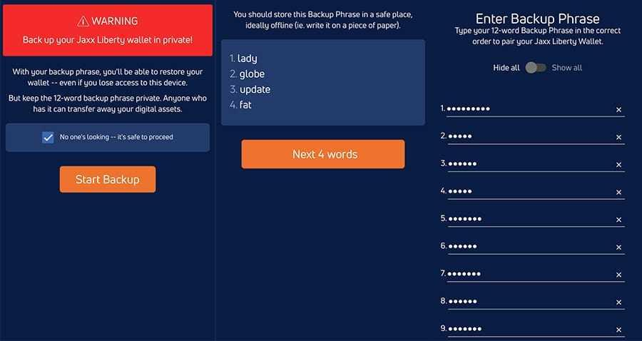

## Table of Contents

## What is Jaxx Liberty Wallet and what is its primary purpose?

Jaxx Liberty Wallet is a type of digital wallet that helps you store and manage different kinds of cryptocurrencies, like Bitcoin and Ethereum. It's designed to be easy to use, so even if you're new to cryptocurrencies, you can still use it without any trouble. You can use Jaxx Liberty Wallet on your computer, phone, or tablet, which makes it convenient for people who are always on the go.

The main purpose of Jaxx Liberty Wallet is to give you a safe and simple way to keep your cryptocurrencies. It lets you send and receive different cryptocurrencies, and also helps you keep track of how much you have. Plus, it has a feature that lets you swap one type of cryptocurrency for another, which can be really handy if you want to trade or invest in different digital currencies.

## How do I download and install Jaxx Liberty Wallet on my device?

To download and install Jaxx Liberty Wallet on your device, first go to the official Jaxx Liberty website using your computer, phone, or tablet. On the website, you'll see options to download the wallet for different devices like Android, iOS, Windows, Mac, or Linux. Click on the one that matches your device. For mobile devices, this will take you to the app store where you can download the app. For computers, you'll download a file that you need to open and follow the instructions to install.

Once the download is complete, open the app or the installed program. You'll be asked to create a new wallet or import an existing one. If you're new to Jaxx Liberty, choose to create a new wallet. You'll need to set up a strong password and write down your recovery phrase, which is very important for getting your cryptocurrencies back if something goes wrong. Follow the on-screen instructions to finish setting up your wallet, and you'll be ready to start using Jaxx Liberty Wallet to manage your cryptocurrencies.

## What cryptocurrencies does Jaxx Liberty Wallet support?

Jaxx Liberty Wallet supports many different cryptocurrencies. Some of the most popular ones you can use with it are Bitcoin, Ethereum, and Litecoin. It also works with other well-known cryptocurrencies like Bitcoin Cash, Ethereum Classic, and Dash. This means you can keep all your different types of digital money in one place, which makes it easier to manage them.

Besides these, Jaxx Liberty Wallet also supports newer or less common cryptocurrencies. For example, you can use it with Zcash, which focuses on privacy, and also with tokens like Augur and Golem. This wide range of supported cryptocurrencies makes Jaxx Liberty Wallet a good choice if you want to try out different types of digital money or if you already own a variety of them.

## How do I set up a new wallet in Jaxx Liberty and what security measures should I take?

To set up a new wallet in Jaxx Liberty, first open the app on your device. You'll see an option to create a new wallet. Click on it and you'll be asked to set a strong password. Make sure your password is hard to guess and includes a mix of letters, numbers, and symbols. After setting your password, Jaxx Liberty will give you a recovery phrase. This is a list of words that you need to write down and keep safe. This phrase is very important because it can help you get your cryptocurrencies back if you lose access to your wallet. Follow the instructions on the screen to finish setting up your new wallet.

For security, there are a few things you should do. First, keep your recovery phrase in a safe place, like a locked drawer or a safe, and never share it with anyone. Don't store it on your computer or phone where it could be hacked. Also, make sure to use a strong password and change it regularly. Be careful when downloading the app and only get it from the official Jaxx Liberty website or trusted app stores. Lastly, always double-check the addresses when sending cryptocurrencies to make sure you're sending them to the right place. By following these steps, you can help keep your wallet and your cryptocurrencies safe.

## What are the fees associated with using Jaxx Liberty Wallet for transactions?

When you use Jaxx Liberty Wallet to send cryptocurrencies, you might have to pay a fee. This fee is not set by Jaxx Liberty, but by the network of the [cryptocurrency](/wiki/cryptocurrency) you're using. For example, if you're sending Bitcoin, the Bitcoin network decides the fee based on how busy it is and how fast you want your transaction to go. The same goes for other cryptocurrencies like Ethereum or Litecoin. Jaxx Liberty lets you choose how much you want to pay in fees, but if you pick a lower fee, your transaction might take longer to go through.

Jaxx Liberty itself doesn't charge you any fees just for using the wallet. You can store, receive, and manage your cryptocurrencies without paying anything extra to Jaxx Liberty. The only time you'll see fees is when you're sending cryptocurrencies, and those fees go to the network, not to Jaxx Liberty. So, if you're just keeping your cryptocurrencies in the wallet and not sending them anywhere, you won't have to worry about any fees at all.

## How does Jaxx Liberty Wallet handle private keys and what are the backup options?

Jaxx Liberty Wallet keeps your private keys safe on your own device. It doesn't store them on any servers, which means you're the only one who can access your cryptocurrencies. When you set up your wallet, you get a recovery phrase. This is a list of words that you can use to get your private keys back if you lose them or if something happens to your device. It's very important to keep this recovery phrase safe and secret, because anyone with it can access your wallet.

For backing up your wallet, Jaxx Liberty gives you the recovery phrase. You should write it down on paper and keep it in a secure place, like a safe or a locked drawer. Don't store it on your computer or phone, because if those get hacked, someone could find your recovery phrase. If you ever need to use your backup, you can enter the recovery phrase into Jaxx Liberty on another device to restore your wallet and access your cryptocurrencies.

## Can I use Jaxx Liberty Wallet for trading cryptocurrencies and how does it integrate with exchanges?

Jaxx Liberty Wallet has a feature called ShapeShift that lets you trade one type of cryptocurrency for another right from the wallet. You don't need to go to a separate exchange website. It's easy to use: you just pick the cryptocurrency you want to trade and the one you want to get, and then you can make the trade happen in the wallet. This is good for people who want to swap their digital money quickly and easily without leaving the app.

However, Jaxx Liberty Wallet doesn't connect directly with big trading platforms like Coinbase or Binance. If you want to trade on those exchanges, you'll need to send your cryptocurrencies from Jaxx Liberty to the exchange, do your trading there, and then send the cryptocurrencies back to your Jaxx Liberty Wallet. So, while Jaxx Liberty makes simple trades easy with ShapeShift, for more advanced trading, you'll need to use other exchange services.

## What are the user interface features of Jaxx Liberty Wallet and how user-friendly is it for beginners?

Jaxx Liberty Wallet has a simple and easy-to-use interface that makes it good for beginners. When you open the app, you see a main screen that shows all your cryptocurrencies in one place. You can see how much you have of each one, and there are big buttons that say "Send" and "Receive" to help you move your digital money around. The wallet also has a menu at the bottom where you can go to different parts of the app, like the ShapeShift trading feature or the settings. Everything is laid out in a way that's easy to understand, so even if you're new to cryptocurrencies, you can figure out how to use it.

The wallet also has some helpful features that make it easier for beginners. For example, when you want to send cryptocurrencies, the app helps you check the address to make sure you're sending it to the right place. It also lets you see the current prices of your cryptocurrencies and how much they've changed recently, which can be useful if you're thinking about trading. Plus, if you ever need help, there's a support section in the app where you can find answers to common questions. Overall, Jaxx Liberty Wallet is designed to be user-friendly, so even if you're just starting out with digital money, you should find it easy to use.

## How does Jaxx Liberty Wallet ensure the security of my funds and what are its vulnerability points?

Jaxx Liberty Wallet keeps your funds safe by storing your private keys right on your own device, not on any servers. This means no one else can get to your cryptocurrencies without your device. When you set up the wallet, you get a recovery phrase that you can use to get your funds back if something happens to your device. It's important to write this down and keep it safe. The wallet also lets you set a strong password to protect your wallet, and you can change it anytime to keep things secure. Jaxx Liberty doesn't charge any fees for using the wallet itself, so you don't have to worry about extra costs.

Even though Jaxx Liberty Wallet is secure, there are some things you need to watch out for. If someone gets your recovery phrase, they can take your cryptocurrencies, so you need to keep it very secret and safe. Also, if your device gets hacked or lost, you could lose access to your wallet unless you have your recovery phrase. It's a good idea to always download the app from the official website or trusted app stores to avoid fake versions that might steal your information. By being careful and following these tips, you can help keep your funds safe in Jaxx Liberty Wallet.

## What are the advanced features of Jaxx Liberty Wallet that cater to expert users?

Jaxx Liberty Wallet has some advanced features that can be useful for expert users. One of these is the ShapeShift integration, which lets you trade different cryptocurrencies right from the wallet without needing to go to a separate exchange. This can be handy for experts who want to quickly swap one type of digital money for another. Another feature is the ability to manage multiple cryptocurrencies in one place. This means you can keep track of a wide variety of digital assets, which is helpful for those who deal with many different types of cryptocurrencies.

The wallet also offers detailed transaction history and the ability to customize transaction fees. Expert users can adjust the fees they pay for sending cryptocurrencies, which can be important for managing costs and transaction speed. Additionally, Jaxx Liberty supports decentralized applications (DApps) on the Ethereum network, allowing expert users to interact with these applications directly from the wallet. This feature can be valuable for those who are involved in the more technical aspects of the cryptocurrency world, like smart contracts and decentralized finance.

## How does Jaxx Liberty Wallet perform in terms of transaction speed and reliability?

Jaxx Liberty Wallet works well for sending and receiving cryptocurrencies. The speed of your transactions depends on the cryptocurrency network you're using, not on Jaxx Liberty itself. For example, Bitcoin transactions can take anywhere from a few minutes to a few hours, while Ethereum transactions are usually faster. Jaxx Liberty lets you choose how much you want to pay in fees, which can help make your transactions go faster if you're willing to pay more. Overall, the wallet is reliable and helps you manage your digital money without any trouble.

Sometimes, if the cryptocurrency network is very busy, your transactions might take longer. But this isn't because of Jaxx Liberty; it's just how the networks work. Jaxx Liberty has been around for a while and has a good reputation for being dependable. People who use it often say it's easy to use and works well for keeping their cryptocurrencies safe and moving them around when they need to.

## What are the community and expert reviews saying about the overall performance and reliability of Jaxx Liberty Wallet?

People in the cryptocurrency community and experts often say good things about Jaxx Liberty Wallet. They like that it's easy to use and works well on different devices like phones and computers. Many users appreciate that it supports a lot of different cryptocurrencies and lets you trade them without leaving the app. Experts also mention that Jaxx Liberty is reliable and doesn't have many problems, which is important for keeping your digital money safe.

However, some users have pointed out a few things they wish were better. For example, some say that the customer support could be faster at answering questions. Others have mentioned that when the cryptocurrency networks are busy, transactions can take longer, but this isn't really Jaxx Liberty's fault. Overall, most people think Jaxx Liberty Wallet is a solid choice for managing cryptocurrencies, especially if you're new to it or if you want a wallet that's easy to use.

## References & Further Reading

[1]: Lopp, J. (2021). ["Comprehensive List of Cryptocurrency Wallets"](https://github.com/jlopp/physical-bitcoin-attacks). Lopp.net.

[2]: ShapeShift. ["ShapeShift - Decentralized Exchange and Crypto Management"](https://shapeshift.com/dex). ShapeShift Official Website.

[3]: Karp, K. (2018). ["Inside Jaxx Liberty: The Multi-Currency Crypto Wallet"](https://blog.jaxx.io/sunsetting-jaxx-liberty-what-you-need-to-know/). CoinTelegraph.

[4]: Hashemi, L. (2017). ["How Does AES-256 Encryption Work?"](https://www.makeuseof.com/what-is-aes-256-encryption-how-does-it-work/). UpGuard Blog.

[5]: Antonopoulos, A. M. (2017). ["Mastering Bitcoin: Unlocking Digital Cryptocurrencies"](https://books.google.com/books/about/Mastering_Bitcoin.html?id=IXmrBQAAQBAJ). O'Reilly Media.

[6]: Rosenfeld, M. (2012). ["Analysis of Bitcoin Pooled Mining Reward Systems"](https://arxiv.org/abs/1112.4980). ArXiv preprint arXiv:1112.4980.