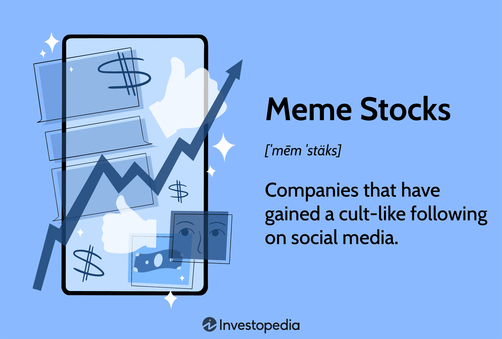

## Table of Contents

## What are meme stocks and how do they differ from traditional investments?

Meme stocks are stocks that become popular because of social media and online communities, rather than because of the company's financial performance. They often get a lot of attention and their prices can go up and down quickly. People talk about them a lot on the internet, and this can make more people want to buy them, even if the company isn't doing well financially. A famous example of a meme stock is GameStop, which became very popular on social media in early 2021.

Traditional investments, on the other hand, are usually chosen based on a company's financial health and future potential. Investors look at things like earnings, growth, and market position before deciding to buy a stock. These investments are often seen as more stable because they are based on solid financial analysis rather than social media trends. While traditional investments can still go up and down in value, their movements are usually more predictable and based on the company's actual performance.

## What are some popular examples of meme stocks?

Some well-known meme stocks include GameStop, AMC Entertainment, and Bed Bath & Beyond. GameStop, a video game retailer, became famous in early 2021 when a lot of people on social media, especially on the Reddit forum WallStreetBets, started talking about it. They thought the stock was undervalued and encouraged others to buy it, which made its price go up a lot in a short time. AMC Entertainment, a movie theater company, also became a meme stock around the same time. People on social media thought it could recover after the COVID-19 pandemic and bought a lot of its stock, causing its price to go up.

Bed Bath & Beyond is another example of a meme stock. This home goods retailer saw its stock price rise in 2022 after it was mentioned a lot on social media. Even though the company was struggling financially, many people bought its stock because they believed in the meme stock trend. These stocks show how social media can influence stock prices, even if the companies behind them are not doing well financially.

## How does social media influence the value of meme stocks?

Social media can make meme stocks go up and down a lot. When a lot of people start talking about a stock on social media, more people might want to buy it. This can make the price go up fast, even if the company is not doing well. For example, when people on Reddit started talking about GameStop, more and more people bought the stock, and its price went up a lot in a short time.

But social media can also make the price go down fast. If people start saying bad things about a stock or if the hype goes away, people might start selling the stock. This can make the price drop quickly. Because the price of meme stocks can change so much based on what people are saying online, they can be risky to invest in.

## What are the basic risks involved in investing in meme stocks?

Investing in meme stocks can be risky because their prices can go up and down a lot. This happens because people on social media can make a stock popular very quickly, but if the hype goes away, the price can drop just as fast. If you buy a meme stock when it's popular and the price goes down, you could lose a lot of money. This is different from traditional investments, where the price usually goes up or down based on how the company is doing.

Another risk is that meme stocks are often based on what people are saying online, not on how well the company is doing. This means you might be buying a stock in a company that is not doing well financially. If the company keeps struggling, the stock price could keep going down, even if people on social media stop talking about it. So, it's important to think about the company's financial health before investing in a meme stock.

## How can beginners identify potential meme stock opportunities?

Beginners can identify potential meme stock opportunities by paying attention to what people are talking about on social media platforms like Reddit, Twitter, and TikTok. If a lot of people are suddenly talking about a certain stock and saying it's a good investment, it might be becoming a meme stock. Look for stocks that are mentioned a lot on popular investing forums like WallStreetBets on Reddit. If you see a stock being discussed a lot and people are excited about it, that could be a sign it's turning into a meme stock.

It's also important to look at how quickly the stock's price is changing. Meme stocks often see their prices go up very fast because a lot of people are buying them at the same time. You can use financial news websites or stock tracking apps to see if a stock's price is going up a lot in a short time. But remember, just because a stock is popular on social media doesn't mean it's a good investment. Always do your own research and think about the risks before you decide to buy a meme stock.

## What are the key factors to consider before investing in a meme stock?

Before you invest in a meme stock, think about how much risk you're willing to take. Meme stocks can go up and down a lot because they're popular on social media, not because the company is doing well. If you buy a meme stock when it's popular and the price drops, you could lose money. So, it's important to only invest money you can afford to lose. Also, think about how long you want to keep the stock. Meme stocks can be good for short-term gains if you buy and sell at the right time, but they're risky for long-term investments.

It's also a good idea to look at the company's financial health before buying its stock. Even if a lot of people are talking about a stock on social media, the company might not be doing well. Check things like the company's earnings, debts, and future plans. If the company is struggling, the stock price might keep going down even if the hype goes away. So, while social media can tell you about a potential meme stock, always do your own research and think about the company's real value before you invest.

## How does market sentiment analysis help in evaluating meme stock investments?

Market sentiment analysis helps in evaluating meme stock investments by looking at what people are saying and feeling about a stock on social media and other platforms. When a lot of people are talking positively about a stock and seem excited about it, it might be a good time to buy. This is because the positive sentiment can push the stock's price up as more people want to buy it. On the other hand, if people are talking negatively about a stock or if the excitement is fading, it might be a sign that the stock's price could go down. By keeping an eye on market sentiment, you can get a better idea of when to buy or sell a meme stock.

However, market sentiment is just one part of the puzzle. It's important to also look at the company's financial health and other factors before investing in a meme stock. Just because a lot of people are excited about a stock doesn't mean it's a good investment if the company is struggling. By combining market sentiment analysis with a look at the company's earnings, debts, and future plans, you can make a more informed decision about whether a meme stock is worth the risk.

## What technical analysis tools are useful for assessing meme stock trends?

Technical analysis tools can help you understand how meme stocks are moving. One useful tool is the moving average, which shows the average price of a stock over a certain time. If the stock's price is above the moving average, it might be a good time to buy because the price is going up. If it's below, it might be a good time to sell because the price is going down. Another tool is the Relative Strength Index (RSI), which tells you if a stock is overbought or oversold. If the RSI is over 70, the stock might be overbought and could go down soon. If it's under 30, it might be oversold and could go up.

Volume indicators are also important for meme stocks. They show how many shares of the stock are being traded. If the [volume](/wiki/volume-trading-strategy) is high, it means a lot of people are buying and selling the stock, which can make the price move a lot. The volume can tell you if the trend is strong or if it might change soon. For example, if the price is going up and the volume is high, the trend might keep going. But if the price is going up and the volume is low, the trend might not last long. By using these tools, you can get a better idea of when to buy or sell a meme stock.

## How do short squeezes affect meme stock prices and investment strategies?

A short squeeze can make meme stock prices go up a lot. It happens when a lot of people have bet that a stock's price will go down, but then the price starts going up instead. These people who bet against the stock, called short sellers, have to buy the stock to cover their bets. When a lot of short sellers are trying to buy the stock at the same time, it can make the price go up even more. This is what happened with GameStop in 2021. People on social media started buying the stock and talking about it a lot, which made the price go up and forced short sellers to buy back the stock, pushing the price even higher.

Short squeezes can change how people invest in meme stocks. If you think a short squeeze might happen, you might want to buy the stock before it goes up. But short squeezes can be risky because they can end quickly. Once the short sellers have bought back all the stock they need, the price can drop fast. So, if you're thinking about investing in a meme stock because of a possible short squeeze, you need to be ready to sell the stock quickly to make a profit. It's important to watch the stock closely and be ready to act fast.

## What are advanced strategies for managing a portfolio that includes meme stocks?

Managing a portfolio with meme stocks means you need to be ready for big changes. Meme stocks can go up and down a lot because people on social media can make them popular quickly. So, you should only use a small part of your money for meme stocks. This way, if the price goes down, you won't lose too much. It's also a good idea to set clear goals for when you want to sell the stock. If the price goes up a lot, you might want to sell some of your stock to make a profit. And if the price starts going down, you might want to sell to avoid losing more money. Watching the stock closely and being ready to act fast can help you manage the risk.

Another important thing is to keep an eye on what people are saying on social media. If a lot of people are talking about a meme stock and seem excited, it might be a good time to buy. But if the excitement is going away or people start saying bad things about the stock, it might be a good time to sell. You can also use tools like moving averages and the Relative Strength Index (RSI) to see if the stock's price is going up or down. By combining what you see on social media with these tools, you can make better decisions about when to buy or sell. Remember, meme stocks are risky, so always think about the company's real value and be ready for the price to change a lot.

## How can investors use options trading to leverage meme stock investments?

Investors can use options trading to make their meme stock investments more powerful. Options let you bet on whether a stock's price will go up or down without buying the stock itself. If you think a meme stock's price will go up, you can buy a call option. This gives you the right to buy the stock at a certain price later. If the stock's price goes up a lot, you can make more money with the option than if you had just bought the stock. But if the stock's price doesn't go up, you might lose the money you spent on the option.

Using options can also help you make money if you think a meme stock's price will go down. You can buy a put option, which gives you the right to sell the stock at a certain price later. If the stock's price goes down a lot, the put option can be worth more, and you can make money. But options trading can be risky, especially with meme stocks because their prices can change a lot. It's important to understand how options work and only use money you can afford to lose when you're trading them.

## What long-term impacts might meme stock investments have on an investor's portfolio?

Investing in meme stocks can have big effects on your portfolio over a long time. Meme stocks can go up and down a lot because they're popular on social media, not because the company is doing well. If you put a lot of money into meme stocks and their prices go down, you could lose a big part of your savings. This can make it hard to reach your long-term goals, like saving for a house or retirement. Also, if you focus too much on meme stocks, you might miss out on more stable investments that grow slowly but steadily over time.

On the other hand, if you're lucky and the meme stocks you pick go up a lot, you could make a lot of money quickly. But even if you make money, it's important to think about how you use it. If you take the money out of your portfolio, you might not have as much to invest in the future. And if you keep the money in meme stocks, you're still taking a big risk. So, it's a good idea to only put a small part of your money into meme stocks and keep most of it in safer investments. This way, you can have some fun with meme stocks but still keep your portfolio safe for the long term.

## How can one craft an effective investment strategy?

Developing a balanced investment strategy that incorporates both meme stocks and [algorithmic trading](/wiki/algorithmic-trading) requires a nuanced understanding of market dynamics and risk management. The inherent [volatility](/wiki/volatility-trading-strategies) of meme stocks, often driven by social media narratives and retail investor enthusiasm, necessitates a strategic approach to mitigate potential losses while maximizing returns.

### Risk Management Techniques

Effective risk management is imperative for safeguarding investments against market fluctuations. Techniques such as portfolio diversification, stop-loss orders, and hedging can help manage risk. Diversification involves spreading investments across various asset classes and securities to minimize the impact of any single investment’s poor performance on the overall portfolio. Stop-loss orders automatically sell a security when its price falls to a predetermined level, limiting potential losses. Hedging strategies, such as using options or futures, can provide a layer of protection against adverse price movements.

Consider implementing a Value-at-Risk (VaR) model to quantify potential losses in the portfolio over a specified time horizon. VaR is expressed as:

$$
VaR = \text{S} \times \sigma \times \sqrt{T}
$$

where:
- $\text{S}$ is the current portfolio value,
- $\sigma$ is the standard deviation of the portfolio's returns,
- $T$ represents the time period in years.

### Staying Informed and Updating Strategies

The financial landscape is continuously evolving, underscoring the importance of staying informed about market trends, economic indicators, and technological advancements. Investors should regularly review and update their strategies to reflect the latest information. Subscribing to financial news, attending webinars, and participating in investment forums can provide valuable insights.

### Leveraging Data Analytics and Economic Indicators

Data analytics plays a crucial role in refining investment decisions. Advanced analytics can help identify patterns and trends that inform stock selection and timing. Economic indicators such as GDP growth, unemployment rates, and consumer sentiment indices offer insights into the broader economic context affecting stock performance.

### Future Trends and Predictions

The influence of meme stocks and algorithmic trading is expected to expand as technologies advance and market participation diversifies. Algorithms are likely to become more sophisticated, integrating [artificial intelligence](/wiki/ai-artificial-intelligence) to enhance decision-making processes. The cultural and psychological factors driving meme stock trends may lead to the development of algorithms that can better interpret market sentiment derived from online platforms.

For investors interested in these trends, it is essential to adopt a proactive approach, integrating robust analytical tools and maintaining a flexible strategy capable of adjusting to the financial zeitgeist. This approach not only promises financial growth but also contributes to a more resilient investment portfolio in the face of market evolutions.

## References & Further Reading

[1]: Bergstra, J., Bardenet, R., Bengio, Y., & Kégl, B. (2011). ["Algorithms for Hyper-Parameter Optimization."](https://dl.acm.org/doi/10.5555/2986459.2986743) Advances in Neural Information Processing Systems 24.

[2]: ["Advances in Financial Machine Learning"](https://www.amazon.com/Advances-Financial-Machine-Learning-Marcos/dp/1119482089) by Marcos Lopez de Prado

[3]: ["Evidence-Based Technical Analysis: Applying the Scientific Method and Statistical Inference to Trading Signals"](https://www.amazon.com/Evidence-Based-Technical-Analysis-Scientific-Statistical/dp/0470008741) by David Aronson

[4]: ["Machine Learning for Algorithmic Trading"](https://github.com/PacktPublishing/Machine-Learning-for-Algorithmic-Trading-Second-Edition) by Stefan Jansen

[5]: ["Quantitative Trading: How to Build Your Own Algorithmic Trading Business"](https://books.google.com/books/about/Quantitative_Trading.html?id=j70yEAAAQBAJ) by Ernest P. Chan