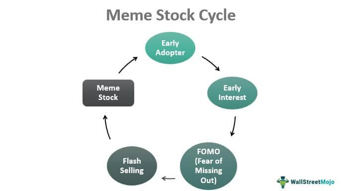

The landscape of investing in the stock market has evolved significantly with the interplay of traditional methods, meme stocks, and algorithmic trading. These elements are collectively reshaping how investments are made, analyzed, and perceived. The emergence of meme stocks as a cultural phenomenon has introduced a new layer of volatility and opportunity. These stocks, often driven by social media influence and retail investor enthusiasm, challenge conventional evaluation metrics by generating unexpected momentum irrespective of fundamental values.

Algorithmic trading, which leverages mathematical models and software to execute trades at high speeds, plays a critical role in the modern investing framework. By relying on complex algorithms to analyze data and execute orders, this method has amplified the efficiency of financial markets. Algorithms can assess vast amounts of real-time data, making it possible to capitalize on short-lived market trends, including those instigated by the meme stock craze.



The intersection of these trends presents both opportunities and challenges for investors. For novices, meme stocks offer a seemingly accessible entry point into trading, enhanced by the rapid sharing of information through online communities. However, the associated risks, such as heightened volatility and speculative nature, necessitate a measured approach. Seasoned investors, meanwhile, must adapt traditional strategies to include algorithmic insights and account for cultural dynamics impacting stock valuation.

As such, the ongoing convergence of stock market investing, meme stock phenomena, and algorithmic trading has created a vibrant and dynamic environment. For investors who embrace these changes, the potential for significant returns exists, provided they navigate the associated risks with vigilance and informed strategies. Whether new or experienced, developing a holistic understanding of these elements is crucial to thrive in today's financial landscape.

## Table of Contents

## Understanding the Stock Market

The stock market serves as a critical revenue-generating platform for investors by facilitating the buying and selling of stocks and other financial instruments. At its core, the stock market allows companies to raise capital by issuing shares to the public, while providing investors the opportunity to earn returns through dividends and capital appreciation. Traditional investment strategies have evolved significantly over time, reflecting changes in technology, market dynamics, and investor behavior.

Historically, traditional investment approaches relied heavily on fundamental and technical analysis. Fundamental analysis evaluates a company’s financial health, including earnings, revenue, and growth prospects, while technical analysis focuses on patterns in stock price movements and trading volumes. Over time, these methods have been enhanced by technological advancements, enabling more sophisticated analyses and faster decision-making processes.

Key concepts integral to understanding the stock market include stocks, indices, and market performance metrics. Stocks represent ownership shares in a company and entitle the holder to a portion of the company’s profits. Indices, such as the S&P 500 or Dow Jones Industrial Average, track the performance of a selected group of stocks, providing a snapshot of market trends and aiding in the assessment of economic health. Market performance metrics, including price-to-earnings ratios and dividend yields, provide insight into a stock’s valuation and potential return on investment.

Technological advancements have reshaped trading practices dramatically. The advent of electronic trading platforms has increased accessibility and reduced transaction costs for individual investors. High-frequency trading, powered by sophisticated algorithms, enables the execution of trades at speeds and volumes far beyond human capability. These advancements have democratized access to the markets, but have also introduced new challenges, such as increased [volatility](/wiki/volatility-trading-strategies) and the risk of algorithmic errors.

In this rapidly evolving landscape, adapting to current trends is essential for successful market participation. Investors must remain informed about economic indicators, market news, and technological developments to make well-informed decisions. Embracing tools such as data analytics and financial modeling can provide a competitive edge, allowing investors to anticipate market movements and adjust their strategies accordingly.

As the investment world continues to change, understanding the fundamentals of the stock market and embracing new tools and strategies remain crucial for achieving financial goals. Whether through traditional analysis or the integration of technological advances, investors who stay abreast of market trends are better positioned to succeed in the ever-evolving market environment.

## The Phenomenon of Meme Stocks

Meme stocks have emerged as a unique phenomenon in the world of investing, characterized by rapid price increases often driven by viral trends rather than traditional financial metrics. These stocks, typically those of companies that have captured the public's imagination or have been the focus of online communities, gain sudden popularity through social media platforms such as Reddit, Twitter, and TikTok. 

Defined broadly, meme stocks are shares of publicly-traded companies that see a surge in interest and trading [volume](/wiki/volume-trading-strategy) due to viral internet memes and discussions on online forums. This starkly contrasts with traditional stocks, which generally align their value with the company's financial health, industry performance, and economic conditions.

### Case Studies and Market Impact

GameStop (GME) and AMC Entertainment (AMC) are quintessential examples of meme stocks that have captivated both retail and institutional investors. 

1. **GameStop (GME)**: In early 2021, GameStop's stock price soared from under $20 to an astonishing $483 within weeks. This surge was primarily fueled by retail investors on the Reddit forum WallStreetBets, who were reacting against perceived short-sell pressures from hedge funds. The market impact was significant, leading to substantial losses for short sellers and raising questions about market volatility and regulation.

2. **AMC Entertainment (AMC)**: Similarly, AMC saw its stock price skyrocket as retail investors mobilized to save it from potential bankruptcy. The coordinated effort, again catalyzed by online communities, inflated AMC's share price beyond traditional valuation metrics, substantially impacting its liquidity position.

Both cases underscore how meme stocks can disrupt traditional market dynamics, causing significant swings in market capitalization and financial statements unrelated to company fundamentals.

### The Role of Social Media and Online Communities

Social media platforms play a crucial role in the meme stock phenomenon, serving as channels for information exchange and group coordination. Online communities, like those found on Reddit, facilitate real-time discussions, sharing of insights, and the amplification of investment strategies among thousands of users. This collective behavior can drastically influence stock prices within short periods, challenging traditional investment wisdom that relies on thorough financial analysis and economic indicators.

### Risk Factors and Volatility

Investing in meme stocks is inherently risky due to their volatility. Prices can skyrocket in a short time and drop just as quickly, making them unpredictable investment vehicles. Contributing factors include:

- **Speculation and Hype:** Driven by social media trends, speculation fuels price increases without solid financial backing, creating bubbles that eventually burst.
- **FOMO (Fear of Missing Out):** Retail investors, influenced by the fear of missing potential gains, may enter trades without proper analysis, increasing market unpredictability.
- **Market Manipulation Concerns:** The potential for coordinated efforts to artificially inflate stock prices raises ethical and regulatory questions.

### Strategies for Investors

For those considering entering the meme stock arena, several strategies can help manage the associated risks:

1. **Conduct Thorough Research:** Understanding company fundamentals, despite the hype, is crucial. Investors should evaluate financial statements, industry conditions, and competitive positioning.

2. **Diversify Portfolio:** To mitigate risk, maintain a diversified portfolio that includes a mix of asset classes beyond meme stocks.

3. **Set Clear Limits and Exits:** Establish predefined limits for buying and selling to avoid emotional trading decisions influenced by market fluctuations.

4. **Stay Informed:** Regularly monitor social media trends and news that may affect stock prices but maintain a critical perspective to avoid impulsive reactions.

Investing in meme stocks offers a glimpse into the future of trading, where social dynamics and digital platforms can sway market forces. Yet, it also demands a careful approach to risk management and market analysis to navigate the volatility inherent in this new investment territory.

## Algorithmic Trading in Modern Investing

Algorithmic trading, also known as algo trading, has become a cornerstone of modern financial markets. This approach utilizes computer programs and algorithms to execute trades at speeds and frequencies that are impossible for human traders. The significance of [algorithmic trading](/wiki/algorithmic-trading) today lies in its ability to process vast amounts of market data, execute trades with precision, and automate complex strategies with minimal human intervention.

Algorithms for trading are often designed to follow a set of predefined rules or strategies. These strategies can range from simple moving averages and [arbitrage](/wiki/arbitrage) opportunities to complex statistical models and high-frequency trading tactics. The design and execution of these strategies generally involve several steps: data input, signal generation, risk management, and execution. Python, a widely-used programming language for financial algorithms, provides libraries such as Pandas and NumPy for data analysis and [backtesting](/wiki/backtesting) trading strategies. Here's an example of a simple moving average crossover strategy in Python:

```python
import pandas as pd

# Dataframe with stock data
data = pd.read_csv('stock_data.csv')  
short_window = 40
long_window = 100

# Generate signals based on moving average
data['Short_MA'] = data['Close'].rolling(window=short_window, min_periods=1).mean()
data['Long_MA'] = data['Close'].rolling(window=long_window, min_periods=1).mean()
data['Signal'] = 0.0
data['Signal'][short_window:] = np.where(data['Short_MA'][short_window:] > data['Long_MA'][short_window:], 1.0, 0.0)   
data['Positions'] = data['Signal'].diff()
```

One of the primary advantages of algorithmic trading is speed. Algorithms can execute trades in milliseconds, enabling traders to capitalize on short-lived market inefficiencies. Another advantage is precision; algorithms eliminate human errors made due to emotion or haste, ensuring consistent implementation of strategies.

However, algorithmic trading also has its downsides and ethical considerations. The speed and volume of trades can lead to market volatility and flash crashes, as seen in the 2010 Flash Crash. Additionally, the lack of regulatory oversight can lead to market manipulation by sophisticated algorithms. Ethical considerations include the fairness of these tools, as they are often available only to institutional investors who can afford the significant resources required for development and maintenance.

Despite these challenges, algorithmic trading can complement traditional investment methods by providing [liquidity](/wiki/liquidity-risk-premium) and reducing transaction costs. For retail investors, algorithmic strategies can be harnessed to automate aspects of their portfolio management, enabling them to benefit from systematic and disciplined trading.

In conclusion, algorithmic trading plays a crucial role in modern financial markets, offering speed, efficiency, and new opportunities for investment. However, it also presents risks and ethical challenges that necessitate careful consideration and regulation. As technology evolves, the integration of algorithmic strategies into traditional investing practices is likely to continue growing, allowing investors to tailor their approaches to the rapidly changing market landscape.

## Interplay of Meme Stocks and Algorithmic Trading

The intersection of meme stocks and algorithmic trading represents a fascinating development in the stock market, characterized by a complex relationship marked by volatility, rapid information dissemination, and cultural influences. This dynamic creates unique challenges and opportunities for algorithms designed to execute trades automatically based on predefined criteria.

Algorithmic trading, which involves the use of computers programmed to follow a defined set of instructions for placing a trade, has become increasingly prevalent. These algorithms are capable of processing large volumes of data at high speeds, enabling them to capitalize on short-lived market disparities. However, the sudden surges in stock prices characteristic of meme stocks—often fueled by social media platforms and online communities—can disrupt the assumptions underlying many algorithmic models.

**Response to Meme Stock Volatility**

Algorithms typically rely on historical data and trend analysis to make predictions. Meme stocks, however, can defy traditional valuation methods and exhibit unexpected behavior. For example, the dramatic price swings seen in stocks like GameStop and AMC in early 2021 challenged conventional algorithmic strategies that depend on market stability and rational price movements. Algorithms designed to react to price changes within certain thresholds may find themselves executing trades that lead to substantial unforeseen losses or gains due to the erratic price behavior of meme stocks.

**Potential Synergies and Conflicts**

The synergy between meme stock dynamics and algorithmic trading exists in the ability of algorithms to rapidly adjust to new information, such as trending topics on social media that may impact stock prices. Nevertheless, conflicts arise when these algorithms misinterpret cultural-driven price shifts as signals based on fundamental or technical analysis, leading to actions that are poorly aligned with the stock's social context. 

**Case Examples**

There have been instances where algorithmic strategies succeeded with meme stocks by adapting to their volatile nature. Some algorithms have been adjusted to monitor social media sentiment and other real-time data, thus better capturing the meme stock zeitgeist. Conversely, there have been notable failures, such as when algorithms underestimated the intensity and velocity of price movements initiated by retail investors banding together on platforms like Reddit.

**Adaptability to Cultural-Driven Movements**

Adapting algorithmic trading strategies to encompass cultural-driven movements requires integrating non-traditional data sources, such as sentiment analysis from social media. Machine learning models, for example, can be trained to recognize patterns indicative of impending meme stock rallies, though developing such models involves substantial complexity and real-time data handling capabilities.

Here is a basic outline of how one might develop a simple Python script to gauge social media sentiment as part of an algorithmic trading strategy:

```python
import tweepy
import re
from textblob import TextBlob

# Twitter API credentials
consumer_key = 'your_consumer_key'
consumer_secret = 'your_consumer_secret'
access_token = 'your_access_token'
access_token_secret = 'your_access_token_secret'

# Authenticate with Twitter
auth = tweepy.OAuthHandler(consumer_key, consumer_secret)
auth.set_access_token(access_token, access_token_secret)
api = tweepy.API(auth)

def clean_tweet(tweet):
    """Utility function to clean tweet text by removing links, special characters using regex statements."""
    return ' '.join(re.sub("(@[A-Za-z0-9]+)|([^0-9A-Za-z \t])|(\w+:\/\/\S+)", " ", tweet).split())

def get_tweet_sentiment(tweet):
    """Utility function to classify sentiment of passed tweet using textblob's sentiment method."""
    analysis = TextBlob(clean_tweet(tweet))
    # Set sentiment
    if analysis.sentiment.polarity > 0:
        return 'positive'
    elif analysis.sentiment.polarity == 0:
        return 'neutral'
    else:
        return 'negative'

# Collect tweets that mention a stock
tweets = api.search(q='GME', count=100)

# Analyze sentiment
for tweet in tweets:
    sentiment = get_tweet_sentiment(tweet.text)
    print(f"Tweet: {tweet.text}")
    print(f"Sentiment: {sentiment}\n")
```

**Future Prospects**

Looking forward, the fusion of meme stock trends and algorithmic strategies will likely focus on enhancing real-time data analytics, leveraging [machine learning](/wiki/machine-learning) to interpret social cues, and improving the flexibility of algorithms to execute trades based on more diverse data inputs. As algorithms become more adept at interpreting the social dimensions of stock movements, their ability to successfully navigate the unpredictable waters of meme stocks is expected to improve, thus providing a more robust framework for modern investing strategies.

## Crafting an Effective Investment Strategy

Developing a balanced investment strategy that incorporates both meme stocks and algorithmic trading requires a nuanced understanding of market dynamics and risk management. The inherent volatility of meme stocks, often driven by social media narratives and retail investor enthusiasm, necessitates a strategic approach to mitigate potential losses while maximizing returns.

### Risk Management Techniques

Effective risk management is imperative for safeguarding investments against market fluctuations. Techniques such as portfolio diversification, stop-loss orders, and hedging can help manage risk. Diversification involves spreading investments across various asset classes and securities to minimize the impact of any single investment’s poor performance on the overall portfolio. Stop-loss orders automatically sell a security when its price falls to a predetermined level, limiting potential losses. Hedging strategies, such as using options or futures, can provide a layer of protection against adverse price movements.

Consider implementing a Value-at-Risk (VaR) model to quantify potential losses in the portfolio over a specified time horizon. VaR is expressed as:

$$
VaR = \text{S} \times \sigma \times \sqrt{T}
$$

where:
- $\text{S}$ is the current portfolio value,
- $\sigma$ is the standard deviation of the portfolio's returns,
- $T$ represents the time period in years.

### Staying Informed and Updating Strategies

The financial landscape is continuously evolving, underscoring the importance of staying informed about market trends, economic indicators, and technological advancements. Investors should regularly review and update their strategies to reflect the latest information. Subscribing to financial news, attending webinars, and participating in investment forums can provide valuable insights.

### Leveraging Data Analytics and Economic Indicators

Data analytics plays a crucial role in refining investment decisions. Advanced analytics can help identify patterns and trends that inform stock selection and timing. Economic indicators such as GDP growth, unemployment rates, and consumer sentiment indices offer insights into the broader economic context affecting stock performance.

### Future Trends and Predictions

The influence of meme stocks and algorithmic trading is expected to expand as technologies advance and market participation diversifies. Algorithms are likely to become more sophisticated, integrating [artificial intelligence](/wiki/ai-artificial-intelligence) to enhance decision-making processes. The cultural and psychological factors driving meme stock trends may lead to the development of algorithms that can better interpret market sentiment derived from online platforms.

For investors interested in these trends, it is essential to adopt a proactive approach, integrating robust analytical tools and maintaining a flexible strategy capable of adjusting to the financial zeitgeist. This approach not only promises financial growth but also contributes to a more resilient investment portfolio in the face of market evolutions.

## Conclusion

The convergence of meme stocks, algorithmic trading, and traditional investing methods marks a transformative period in the financial markets. Together, these elements underscore a pivotal shift from conventional practices, driven by technology and cultural phenomena. Memes stocks have emerged not just as a financial anomaly but as a representation of popular interest and sentiment infiltrating the market, often characterized by heightened volatility and unpredictability. Algorithmic trading, with its foundations in computational precision and speed, offers a counterbalance, providing investors with tools to navigate these volatile landscapes efficiently.

In this evolving market environment, the emphasis on a versatile and informed approach to stock market investments becomes crucial. A diversified strategy that incorporates elements of both meme-driven trends and algorithmic precision can position investors better to capitalize on unique opportunities while mitigating risks. By embracing new technologies and understanding the rhythmic patterns of social sentiments exemplified by meme stocks, investors can craft resilient investment strategies that remain adaptive to rapid market changes.

Achieving financial growth and security in such dynamic markets requires a proactive stance on learning and adaptation. As algorithmic models evolve alongside market sentiments, staying informed about technological advancements and market trends is not just beneficial but essential. Encouraging continuous education and awareness helps investors to foresee and react to market shifts, ensuring their strategies remain robust and forward-looking.

In conclusion, the synthesis of traditional investing with meme stock phenomena and algorithmic frameworks offers a pathway to success in today's financial landscape. Embracing these changes and continuously adapting to new challenges will empower investors to achieve long-term growth and financial stability in an ever-changing market.

## References & Further Reading

[1]: Bergstra, J., Bardenet, R., Bengio, Y., & Kégl, B. (2011). ["Algorithms for Hyper-Parameter Optimization."](https://dl.acm.org/doi/10.5555/2986459.2986743) Advances in Neural Information Processing Systems 24.

[2]: ["Advances in Financial Machine Learning"](https://www.amazon.com/Advances-Financial-Machine-Learning-Marcos/dp/1119482089) by Marcos Lopez de Prado

[3]: ["Evidence-Based Technical Analysis: Applying the Scientific Method and Statistical Inference to Trading Signals"](https://www.amazon.com/Evidence-Based-Technical-Analysis-Scientific-Statistical/dp/0470008741) by David Aronson

[4]: ["Machine Learning for Algorithmic Trading"](https://github.com/PacktPublishing/Machine-Learning-for-Algorithmic-Trading-Second-Edition) by Stefan Jansen

[5]: ["Quantitative Trading: How to Build Your Own Algorithmic Trading Business"](https://books.google.com/books/about/Quantitative_Trading.html?id=j70yEAAAQBAJ) by Ernest P. Chan