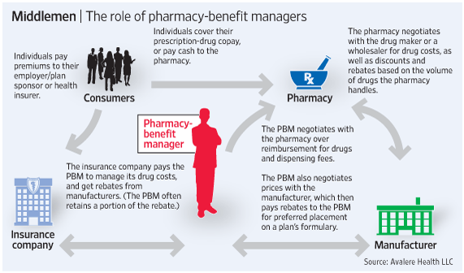

The pharmaceutical industry is recognized for its intricate dynamics and operational complexities, which stem from several critical factors. Among these are the long development cycles inherent to drug discovery and commercialization, rigorous regulatory approval processes enforced by entities such as the U.S. Food and Drug Administration (FDA), and the significant research and development (R&D) investments required for innovation. These elements together define the landscape of the pharmaceutical sector, influencing not only how companies operate but also how they are valued.

Valuing pharmaceutical companies is a sophisticated process that goes beyond traditional financial metrics. While standard financial analysis, such as examining balance sheets and income statements, provides a baseline understanding, industry-specific evaluations are essential. This includes a thorough examination of a company's drug development pipeline, a critical determinant of future revenue potential. Analysts must consider factors such as the potential success of upcoming drug candidates, patents and exclusivity periods, and the ability to navigate complex regulatory hurdles.



The valuation process in pharma is further complicated by the need to assess market potential and competitive positioning. This involves estimating the demand for new drugs, competitive advantages over existing therapies, and the ability to secure and maintain market share in a rapidly evolving landscape. Various techniques used in valuation, like Discounted Cash Flow (DCF) and Risk-Adjusted Net Present Value (rNPV), incorporate both financial and industry-specific metrics to provide a comprehensive valuation.

Moreover, the emergence of algorithmic trading has introduced a new dimension to pharmaceutical investments. Algorithmic trading employs complex algorithms to execute rapid trading decisions, which is particularly advantageous in sectors sensitive to news and data, such as pharmaceuticals. These algorithms can efficiently respond to regulatory announcements, clinical trial outcomes, and other market-moving events, thereby impacting investment strategies and decisions.

This article examines the comprehensive approach required to evaluate pharmaceutical companies, encompassing not only traditional financial analysis but also the specific challenges and opportunities unique to the industry. It also highlights the impact of algorithmic trading on investment decisions, providing insights into how investors can navigate the complexities of pharmaceutical investments.

## Table of Contents

## Understanding the Pharmaceutical Industry

The pharmaceutical industry is heavily regulated to ensure that drugs released into the market are both safe and effective. This regulatory framework is essential in mitigating risks associated with pharmaceuticals, given the direct impact these products have on human health. Key regulatory bodies, such as the U.S. Food and Drug Administration (FDA) and the European Medicines Agency (EMA), set rigorous guidelines that companies must adhere to throughout the drug development process.

Central to a pharmaceutical company's value and future growth is its drug development pipeline. This pipeline encompasses all stages of drug development, from discovery and pre-clinical testing to clinical trials and eventual regulatory approval. Each stage of the pipeline serves as a critical inflection point, influencing a company's future revenue potential. A robust pipeline not only reflects a company's innovative capacity but also its ability to generate sustained profitability.

Pipeline management requires strategic oversight to balance the allocation of resources and focus on high-potential projects. Managing a pipeline involves assessing each candidate's progression through pre-defined development phases. A vital aspect of this management is the decision-making process regarding which projects to advance, pause, or terminate—decisions often informed by a range of factors including scientific data, competitive positioning, and potential market demand.

Understanding the competitive landscape is equally important for sustained growth in the pharmaceutical industry. Companies must continuously monitor competitors' pipelines to anticipate emerging threats and opportunities. This competitive analysis helps firms position themselves strategically, either by accelerating particular candidates or by seeking partnerships and collaborations.

In summary, navigating the pharmaceutical industry's stringent regulations and effectively managing a drug development pipeline are essential for companies to thrive. The ability to adeptly handle these components paves the way for sustained success in an increasingly competitive market.

## Valuation of Pharmaceutical Companies

Valuation in the pharmaceutical industry is a complex process that extends beyond simple financial analysis, requiring a deep understanding of pipeline analysis, market potential, and regulatory considerations. Accurate valuation is crucial for investors seeking to make informed decisions in a highly dynamic sector.

### Pipeline Analysis
The pipeline of a pharmaceutical company refers to the drugs in various stages of development, from preclinical trials to post-market surveillance. A robust pipeline is indicative of a company's innovation potential, suggesting higher future revenue streams. Evaluation involves analyzing the stage of development, the projected market launch dates, and the potential peak sales of the drugs.

### Market Potential
Assessing the market potential involves understanding the addressable market size for each drug under development. It includes analyzing the prevalence of the target disease, existing treatments, and the potential advantages of the new drug. Market exclusivity, due to patents or regulatory approvals, significantly boosts a drug's market potential.

### Regulatory Considerations
Regulatory factors play a critical role in pharmaceutical valuation. The approval process of drugs by entities such as the U.S. Food and Drug Administration (FDA) or the European Medicines Agency (EMA) involves significant time and cost, and the outcome is uncertain. These agencies ensure drugs are safe and effective before they can be marketed, affecting the timelines and revenues associated with new product launches.

### Valuation Techniques
Several techniques are employed for valuing pharmaceutical companies:

1. **Discounted Cash Flow (DCF)**:
   The DCF method involves forecasting the company's free cash flows and discounting them to present value using a risk-adjusted discount rate. This method requires estimating future cash flows from existing and pipeline products, taking into account patent expirations, competitive market entry, and regulatory risks.
$$
   \text{DCF} = \sum \frac{\text{FCF}_t}{(1 + r)^t}

$$

   where $\text{FCF}_t$ represents the free cash flow in year $t$, and $r$ is the discount rate.

2. **Risk-Adjusted Net Present Value (rNPV)**:
   rNPV adjusts the NPV calculations by accounting for the probability of success at each development stage of a drug. This technique is particularly suitable for evaluating pharmaceutical projects with high risk and uncertainty.
$$
   \text{rNPV} = \sum \left( \frac{\text{CF}_t \times \text{Probability of Success}}{(1 + r)^t} \right)

$$

### Market Dynamics
Market dynamics, such as pricing strategies and competitive conditions, significantly affect a company's valuation in the pharmaceutical industry. Pricing strategies may involve considerations such as market access agreements, reimbursement scenarios, and competitive pricing strategies within the therapeutic area. Additionally, the competitive landscape, including the presence of generic drugs, and the level of innovation within the sector can impact the potential revenue streams and, consequently, the company’s valuation.

In conclusion, valuing pharmaceutical companies requires a comprehensive approach that integrates traditional financial metrics with industry-specific considerations, such as pipeline analysis, market potential, and regulatory landscapes, alongside sophisticated valuation techniques like DCF and rNPV. Understanding these elements is essential for investors to navigate the complex and rapidly evolving pharmaceutical market.

## Algorithmic Trading in Pharma Stocks

Algorithmic trading, a sophisticated method that utilizes complex computational algorithms to automate trading decisions, has become increasingly influential in the pharmaceutical sector. These algorithms are designed to process vast amounts of data with speed and accuracy, enabling investors to make rapid trading decisions based on real-time market information. 

In the pharmaceutical industry, [algorithmic trading](/wiki/algorithmic-trading) is particularly valuable given the sector's sensitivity to various market-moving events such as regulatory announcements, clinical trial outcomes, and breakthroughs in drug development. These events often lead to significant [volatility](/wiki/volatility-trading-strategies) in stock prices, creating opportunities for algorithmic trading systems to capitalize on short-term price movements.

For instance, when a pharmaceutical company announces the successful results of a late-stage clinical trial or obtains approval from regulatory bodies like the Food and Drug Administration (FDA), their stock price may experience a rapid surge. Conversely, negative news such as trial failures or regulatory rejections can lead to swift declines. Algorithmic trading systems can efficiently respond to these events by executing trades at high speeds, which is crucial in capturing the best prices before the market adjusts.

Moreover, algorithmic trading contributes to market efficiency and [liquidity](/wiki/liquidity-risk-premium). By facilitating the rapid entry and [exit](/wiki/exit-strategy) of trades, these systems help narrow bid-ask spreads, stabilize prices, and ensure smoother market operations. This is especially important in the pharmaceutical industry, where stock valuations can be highly reactive to new information.

One common strategy used in algorithmic trading is statistical [arbitrage](/wiki/arbitrage), which involves using statistical methods to identify mispricings between related securities and profiting from these price discrepancies. Another strategy is event-driven trading, where algorithms are programmed to act on news events, such as the publication of clinical trial data or mergers and acquisitions. These strategies require algorithms to not only interpret complex data but also execute trades at optimal times to maximize returns.

Algorithmic trading systems often rely on [machine learning](/wiki/machine-learning) models to predict price movements based on historical data and real-time inputs. These models can continuously learn and adapt to changing market conditions, enhancing their predictive capabilities. Here is a simple example of how a basic algorithmic trading strategy might be implemented using Python:

```python
import numpy as np
import pandas as pd

# Load historical stock data
data = pd.read_csv('pharma_stock_data.csv')

# Simple Moving Average Crossover Strategy
short_window = 40
long_window = 100

# Calculate moving averages
data['Short_MA'] = data['Close'].rolling(window=short_window, min_periods=1).mean()
data['Long_MA'] = data['Close'].rolling(window=long_window, min_periods=1).mean()

# Generate buy/sell signals
data['Signal'] = 0
data['Signal'][short_window:] = np.where(data['Short_MA'][short_window:] > data['Long_MA'][short_window:], 1, -1)

# Compute returns
data['Returns'] = data['Close'].pct_change() * data['Signal'].shift(1)

# Calculate cumulative returns
data['Cumulative_Returns'] = (1 + data['Returns']).cumprod()

print(data[['Close', 'Short_MA', 'Long_MA', 'Signal', 'Cumulative_Returns']])
```

In this example, a simple moving average crossover strategy is used, where buy and sell signals are generated based on the crossover of short-term and long-term moving averages. This basic form of algorithmic trading illustrates how investors can systematically respond to market trends. 

Overall, algorithmic trading offers significant advantages to investors in the pharmaceutical sector, enabling them to harness the power of automation and data-driven decision-making in an environment characterized by rapid information flow and price volatility.

## Evaluating Drug Pipelines and Market Potential

A robust pipeline in the pharmaceutical industry is indicative of a company's innovative capacity and potential for sustained profitability. This assertion is based on the inherent structure of drug development, which consists of distinct stages, each contributing to the overall risk profile of a company. The development process is typically divided into pre-clinical trials, clinical trials (Phase I, II, and III), and the final FDA approval stage. Each stage presents unique challenges and opportunities, influencing both the time-to-market and the likelihood of successful commercialization.

In the pre-clinical trial phase, drug candidates are evaluated in vitro (test tubes) and in vivo (animal models) to assess their safety and efficacy profiles. This phase, though critical, involves lower financial commitments relative to the succeeding clinical phases but remains fraught with scientific uncertainties. Consequently, the attrition rate is high as many compounds fail to progress beyond this point.

Progression into clinical trials marks a significant escalation in both costs and potential returns. Phase I trials focus on safety and dosage, Phase II gauges efficacy and side effects, and Phase III confirms the efficacy and monitors adverse reactions in larger populations. Success in these phases, particularly Phase III, substantially enhances a drug's profile, laying the groundwork for achieving regulatory approval, which represents a crucial milestone in the pipeline—often influencing stock price movements.

Understanding the addressable market size and competitive landscape also plays an essential role in forecasting revenue and assessing potential risks. Market size estimation involves considering both the prevalent disease burden and the anticipated adoption rate among healthcare providers and patients. For instance, a drug targeting a widespread chronic condition like diabetes may have a substantial market potential, leading to significant revenue generation if successfully brought to market.

Moreover, the competitive landscape must be scrutinized to evaluate how a new entrant may fare against existing therapies. Factors to consider include the efficacy, safety profile, delivery method, and cost of current treatments. A thorough competitive analysis not only aids in understanding the market dynamics but also helps in strategic positioning of the new drug.

To facilitate this analysis, quantitative models are often employed. For instance, the following Python code snippet demonstrates a simple formula to estimate the potential revenue of a drug:

```python
def estimate_revenue(market_size, penetration_rate, price_per_unit):
    """
    Estimate the revenue potential for a drug.

    :param market_size: Total addressable market size (in units).
    :param penetration_rate: Estimated market penetration rate (as a decimal).
    :param price_per_unit: Price per unit of the drug.
    :return: Estimated revenue.
    """
    return market_size * penetration_rate * price_per_unit

# Example usage
estimated_revenue = estimate_revenue(1_000_000, 0.1, 500)  # market size, penetration rate, price per unit
print(f"Estimated Revenue: ${estimated_revenue}")
```

This code calculates estimated revenue by considering market size, expected market penetration, and unit pricing, allowing companies to gauge the financial prospects of their drug products.

In conclusion, understanding the nuances of drug pipeline stages and evaluating market potential through robust quantitative and qualitative analysis is imperative for accurate predictions of a company's future revenue and risk assessment.

## Key Risk Factors in Pharmaceutical Investment

Pharmaceutical investments are inherently associated with a range of risk factors that can significantly impact the valuation of companies in the sector. One of the primary risks is related to clinical trials. These trials are essential for ensuring the safety and efficacy of new drugs, but they also represent a considerable gamble. Clinical trials are typically divided into several phases, and the transition from one phase to the next involves rigorous evaluation and significant cost. The risk of a drug failing at any stage can result in substantial financial losses for companies. According to a study published by the Biotechnology Innovation Organization in 2016, only approximately 9.6% of drugs that enter clinical trials ultimately receive approval from the Food and Drug Administration (FDA) [1].

Regulation plays an equally pivotal role. Pharmaceutical companies are subject to strict regulatory frameworks worldwide, which are designed to protect public health. Changes in these regulations, as well as the varying requirements across different countries, can introduce additional uncertainty. Regulatory delays or rejections can postpone or entirely prevent a drug from reaching the market, potentially leading to missed revenue opportunities and increased sunk costs.

Market dynamics further complicate the risk landscape. Pricing pressures, driven by healthcare policies and competition, continually challenge companies. The emergence of generic drugs can erode proprietary drug market share, affecting long-term profitability. Moreover, fluctuations in demand, influenced by demographic changes and economic conditions, can lead to unpredictable revenue streams.

From a financial perspective, cash flow stability is a critical concern. Pharmaceutical companies often operate with high R&D expenditures, necessitating consistent financing to ensure ongoing projects are adequately supported. Insufficient cash flow can hinder the ability to explore new R&D initiatives or even continue existing ones. It is, therefore, crucial for firms to balance investment in research with financial prudence.

Investors must weigh these risks against the potential rewards inherent in pharmaceutical investments. Drugs that successfully navigate the complex clinical and regulatory pathways can achieve substantial returns, transforming the financial outlook of a company. A balanced investment strategy that acknowledges the potential for both high reward and high risk can better equip investors to handle the intricacies of the pharmaceutical industry.

---
[1] Biotechnology Innovation Organization (2016). Clinical Development Success Rates 2006-2015.

## Conclusion

Pharmaceutical valuation requires a nuanced understanding that integrates both financial metrics and industry-specific factors. Traditional financial analyses, while necessary, often fall short of capturing the full spectrum of variables unique to the pharmaceutical sector. These include the intricacies of drug pipeline valuation, regulatory pathways, and market potential, which all significantly impact a firm's future earnings.

Algorithmic trading has emerged as a powerful tool in optimizing investment strategies in the highly volatile pharmaceutical market. By leveraging complex algorithms, traders can execute trades with speed and precision, enabling them to capitalize on rapid shifts caused by regulatory announcements, clinical trial outcomes, or competitive actions. This technology enhances market efficiency and liquidity, allowing investors to respond promptly and effectively to news and data-driven events.

A comprehensive analysis approach is crucial for investors aiming to navigate the complexities inherent in pharmaceutical investments. This involves not only the application of traditional valuation models, such as Discounted Cash Flow (DCF) and Risk-Adjusted Net Present Value (rNPV) but also an in-depth evaluation of drug pipelines, competitive landscapes, regulatory environments, and market dynamics. Considering these multifaceted factors positions investors to better assess potential risks and rewards, ultimately improving decision-making and investment outcomes in the pharmaceutical industry.

## References & Further Reading

[1]: Biotechnology Innovation Organization. (2016). ["Clinical Development Success Rates 2006-2015"](http://go.bio.org/rs/490-EHZ-999/images/Clinical%20Development%20Success%20Rates%202006-2015%20-%20BIO%2C%20Biomedtracker%2C%20Amplion%202016.pdf).

[2]: Damodaran, A. (2012). ["Investment Valuation: Tools and Techniques for Determining the Value of Any Asset"](https://books.google.com/books/about/Investment_Valuation.html?id=5SRHAAAAQBAJ). Wiley Finance.

[3]: Lopez de Prado, M. (2018). ["Advances in Financial Machine Learning"](https://www.amazon.com/Advances-Financial-Machine-Learning-Marcos/dp/1119482089). Wiley.

[4]: Baum, C. F. (2012). ["Quantitative Methods for Finance and Investments"](https://pages.stern.nyu.edu/~jteall/arithbook.htm). Springer.

[5]: Hull, J. C. (2018). ["Options, Futures, and Other Derivatives"](https://www.semanticscholar.org/paper/Options%2C-Futures%2C-and-Other-Derivatives-Hull/89bdee500c8623864fc9eb7a471546aa713acc44). Pearson.