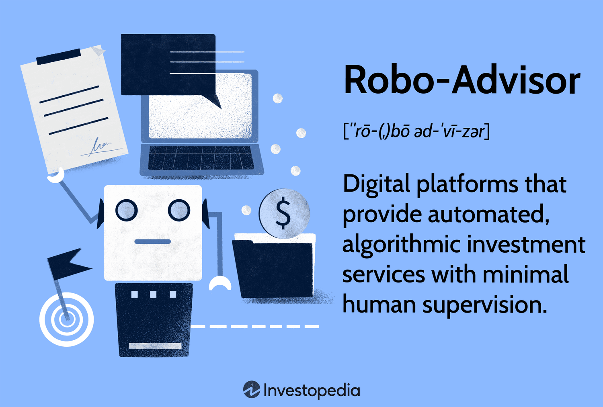

## Table of Contents

## What is a robo-advisor?

A robo-advisor is a type of online investment service that uses computer algorithms to manage your money. Instead of talking to a human financial advisor, you use a website or app to set up your investment goals and the robo-advisor does the rest. It picks investments for you based on how much risk you're okay with and what you want to achieve with your money.

These services are popular because they are usually cheaper than hiring a human advisor. They charge small fees, often less than 1% of the money you invest. Robo-advisors are great for people who want to invest but don't know much about it or don't want to spend a lot of time managing their investments. They make investing easier and more accessible for everyone.

## How do robo-advisors work?

Robo-advisors work by using computer programs to manage your investments. When you sign up, you'll answer some questions about your financial goals, how much risk you're willing to take, and when you'll need your money. Based on your answers, the robo-advisor creates a personalized investment plan for you. It picks a mix of investments like stocks and bonds that match your goals and risk level. Then, it automatically buys these investments for you.

Once your money is invested, the robo-advisor keeps an eye on your portfolio. It uses algorithms to make adjustments over time to keep your investments on track with your goals. This might mean buying or selling investments to keep your portfolio balanced or to take advantage of market changes. Robo-advisors do all this work without you having to do anything, making investing simple and hands-off.

## What are the benefits of using a robo-advisor?

Using a robo-advisor has many benefits. One big benefit is that it's usually a lot cheaper than hiring a human financial advisor. Robo-advisors charge small fees, often less than 1% of the money you invest. This means you get to keep more of your money. They also make investing easy. You don't need to know a lot about investing or spend time managing your investments. The robo-advisor does all the work for you, so it's perfect if you're new to investing or just want something simple.

Another benefit is that robo-advisors are good at keeping your investments balanced. They use smart computer programs to make sure your money is spread out in a way that matches your goals and how much risk you're okay with. If the market changes, the robo-advisor can quickly adjust your investments to keep everything on track. This can help you feel more secure about your money. Plus, robo-advisors are available online, so you can use them anytime and from anywhere, making it very convenient.

## What are the potential drawbacks of robo-advisors?

One potential drawback of using robo-advisors is that they might not give you the personal touch you'd get from a human financial advisor. Robo-advisors use computer programs to manage your money, so they can't really understand your unique financial situation or personal goals in the same way a person can. If you have a complicated financial situation or need specific advice, a robo-advisor might not be able to help you as well as a human advisor could.

Another issue is that robo-advisors might not react as quickly or effectively to big changes in the market. While they use algorithms to adjust your investments, these programs are based on past data and might not always predict or respond to sudden market shifts as well as a human advisor could. This could mean your investments might not be as protected during times of big market changes.

## How do robo-advisors compare to traditional financial advisors?

Robo-advisors and traditional financial advisors both help you with your money, but they do it in different ways. Robo-advisors use computer programs to pick and manage your investments. They are usually cheaper because they don't need a person to do the work. They are good if you want something simple and don't need a lot of personal advice. You just answer some questions about your goals and how much risk you're okay with, and the robo-advisor does the rest.

Traditional financial advisors, on the other hand, are people who you can talk to directly. They can understand your unique situation and give you advice that fits your specific needs. They can help with more than just investing, like planning for retirement or buying a house. But, they usually cost more because you're paying for their time and expertise. If you have a lot of money or a complicated financial situation, a traditional advisor might be a better choice because they can offer more personalized help.

In summary, robo-advisors are great for people who want an easy, low-cost way to invest, while traditional financial advisors are better if you need personal advice and have more complex financial needs. Both have their place, and the best choice depends on what you're looking for in managing your money.

## What are the key features to look for in a robo-advisor?

When choosing a robo-advisor, it's important to look at how much they charge in fees. Robo-advisors are usually cheaper than human advisors, but the fees can still vary. Some might charge a percentage of the money you invest, while others might have a flat fee. Make sure the fees are low enough so you can keep more of your money. Another thing to consider is the minimum amount of money you need to start investing. Some robo-advisors let you start with a small amount, which is good if you're just beginning.

You should also check what kind of investments the robo-advisor offers. Most will invest your money in a mix of stocks and bonds, but some might offer other options like real estate or even socially responsible investments. It's good to pick a robo-advisor that has investments that match your goals. Finally, look at the tools and features they provide. Some robo-advisors have easy-to-use apps and websites, and they might offer extra features like tax strategies or automatic rebalancing to keep your investments on track. Picking a robo-advisor with the right features can make managing your money a lot easier.

## How are robo-advisors regulated?

Robo-advisors are regulated by government agencies to make sure they are safe and fair for people to use. In the United States, the main agency that watches over robo-advisors is the Securities and Exchange Commission (SEC). The SEC makes rules that robo-advisors have to follow, like being honest about what they do and how much they charge. They also have to make sure the investments they pick are good for their clients and not too risky.

Another important part of regulation is that robo-advisors have to follow rules about keeping your information safe. This is to protect you from things like identity theft. The Financial Industry Regulatory Authority (FINRA) also helps to make sure robo-advisors are doing things the right way. They check to see if robo-advisors are giving good advice and treating their clients fairly. By following these rules, robo-advisors can help you invest your money without worrying too much about safety.

## What are the different fee structures among robo-advisors?

Robo-advisors have different ways of charging fees. Some robo-advisors charge a percentage of the money you invest. This fee is usually small, often less than 1% of your total investment. For example, if you have $10,000 invested and the robo-advisor charges 0.25%, you would pay $25 a year. Other robo-advisors might charge a flat fee, which means you pay the same amount no matter how much money you have invested. This can be good if you have a lot of money because the fee won't go up as your investment grows.

Some robo-advisors also have extra fees for things like account management or trading. These fees can add up, so it's important to look at all the costs before you choose a robo-advisor. Some might even offer a free service for a small amount of money, but then charge more if you want to invest more. Understanding the fee structure can help you pick a robo-advisor that fits your budget and keeps more of your money working for you.

## How do robo-advisors manage risk and portfolio diversification?

Robo-advisors manage risk by using computer programs to pick a mix of investments that match how much risk you're okay with. When you start, you answer questions about your goals and how much risk you want to take. Based on your answers, the robo-advisor creates a plan that spreads your money across different types of investments like stocks and bonds. This helps lower the risk because if one type of investment goes down, the others might go up, balancing things out.

Portfolio diversification is a big part of how robo-advisors work. They make sure your money is spread out in a way that keeps your investments safe and on track with your goals. The robo-advisor keeps an eye on your portfolio and uses its algorithms to make changes when needed. If the market changes or if your investments start to get out of balance, the robo-advisor will buy or sell things to keep everything in line. This helps protect your money and makes sure it's working hard for you.

## What advanced algorithms and technologies do robo-advisors use?

Robo-advisors use smart computer programs called algorithms to pick and manage your investments. These algorithms look at a lot of information, like how the stock market is doing and what's happening in the economy. They use this information to decide which investments are best for you based on how much risk you're okay with and what you want to achieve with your money. Some robo-advisors even use something called [artificial intelligence](/wiki/ai-artificial-intelligence) (AI) to make their decisions even better. AI can learn from past data and find patterns that help the robo-advisor make smarter choices about your investments.

Another important technology robo-advisors use is called automatic rebalancing. This means the robo-advisor will check your investments regularly and make changes if they start to get out of balance. For example, if your stocks do really well and become a bigger part of your portfolio than you wanted, the robo-advisor will sell some stocks and buy more bonds to keep things the way you wanted. This helps keep your investments safe and on track with your goals without you having to do anything.

## How can the performance of robo-advisors be evaluated and compared?

To evaluate and compare the performance of robo-advisors, you can look at how much money they help you make over time. This is called the return on investment. You can compare different robo-advisors by seeing which one gives you the highest return. But remember, past performance doesn't always mean the same will happen in the future. It's also important to think about the fees they charge. Some robo-advisors might give you good returns but charge high fees, which can eat into your earnings. So, you want to find a robo-advisor that gives you good returns and doesn't charge too much.

Another way to compare robo-advisors is by looking at the services they offer. Some robo-advisors might give you extra features like tax strategies or the ability to talk to a human advisor if you need help. These extra services can be really helpful, especially if you're new to investing or have a lot of questions. You can also check how easy it is to use their website or app. A robo-advisor that is simple to use can make managing your money a lot easier. By looking at all these things together – returns, fees, services, and ease of use – you can pick the robo-advisor that's best for you.

## What future trends and developments are expected in the robo-advisor industry?

The robo-advisor industry is expected to keep growing and changing in the future. More people are starting to use robo-advisors because they are easy to use and don't cost a lot of money. As technology gets better, robo-advisors will probably use even smarter computer programs to pick and manage investments. They might start using more artificial intelligence to make decisions that are even better for their clients. This could mean robo-advisors will be able to give more personalized advice and help with more kinds of financial planning, like saving for college or buying a house.

Another big trend is that robo-advisors might work more with human financial advisors. This could give people the best of both worlds – the low cost and ease of a robo-advisor, and the personal touch and specific advice from a human. Some robo-advisors already let you talk to a human if you need help, and this is expected to become more common. Also, as more people learn about investing and want to have a say in their investments, robo-advisors might offer more options for people to choose their own investments while still getting help from the computer programs.

## What is the understanding of Robo-Advisors?

Robo-advisors represent a significant advancement in financial technology, providing automated, algorithm-driven financial planning services with minimal human intervention. These platforms utilize sophisticated algorithms to manage investment portfolios, aiming to optimize returns while reducing associated costs. The primary function of robo-advisors is to offer portfolio management that is both efficient and tailored to the investor's risk tolerance, goals, and timeline.

The algorithms employed by robo-advisors typically follow modern portfolio theory (MPT) principles, attempting to maximize returns for a given level of risk through asset diversification. This is achieved by analyzing vast amounts of financial data and identifying the optimal allocation of assets across various securities like stocks, bonds, and ETFs. For example, algorithms may calculate the expected return of a portfolio using the formula:

$$
E(R_p) = \sum_{i=1}^{n} w_i \times E(R_i)
$$

where $E(R_p)$ is the expected return of the portfolio, $w_i$ are the weights of each asset in the portfolio, and $E(R_i)$ are the expected returns of individual assets.

The advantages of using robo-advisors are numerous. First, they offer lower costs compared to traditional financial advisors. By automating processes, robo-advisors can charge lower fees—often a fraction of what human advisors might charge—making investment services accessible to a broader audience. Furthermore, they typically require minimal account balances, making them suitable for investors with smaller initial investments. Another significant advantage is their ability to manage portfolios automatically, including rebalancing and tax-loss harvesting, which ensures that the investment remains aligned with the investor's goals without requiring constant manual oversight.

However, robo-advisors come with certain drawbacks. One potential disadvantage is the lack of personalization. While algorithms can efficiently allocate assets and manage portfolios, they may not fully incorporate an individual's unique financial situation or preferences. Additionally, investment options may be limited compared to what might be available through a human advisor or self-directed investing, such as specific securities or advanced investment strategies.

Popular examples of robo-advisors in the market include Betterment, Wealthfront, and Vanguard's Personal Advisor Services. These platforms vary in their specific offerings but generally provide competitive fee structures and a simplified approach to investing, attracting a wide range of investors from novices to more experienced individuals looking for a hands-off strategy.

## References & Further Reading

[1]: Parikh, H. (2020). ["Robo-Advisors: A Portfolio Management Perspective."](https://economics.yale.edu/sites/default/files/2023-01/Jonathan_Lam_Senior%20Essay%20Revised.pdf) Financial Innovation, 6(1).

[2]: Agapova, A., & Madura, J. (2018). ["Robo-Advisors: Investing through a Digital Platform."](https://papers.ssrn.com/sol3/papers.cfm?abstract_id=3360125) Journal of Corporate Accounting & Finance, 29(2), 68-74.

[3]: Aldridge, I., & Krawciw, S. (2017). ["Real-Time Risk: What Investors Should Know About FinTech, High-Frequency Trading, and Flash Crashes."](https://en.wikipedia.org/wiki/High-frequency_trading) Wiley.

[4]: Narang, R. (2013). ["Inside the Black Box: A Simple Guide to Quantitative and High-Frequency Trading."](https://books.google.com/books/about/Inside_the_Black_Box.html?id=aYA0LnecyTgC) Wiley.

[5]: Dourish, P., & Bell, G. (2011). ["Divining a Digital Future: Mess and Mythology in Ubiquitous Computing."](https://ieeexplore.ieee.org/book/6731155) MIT Press. (Applicable for understanding data-driven decision-making).