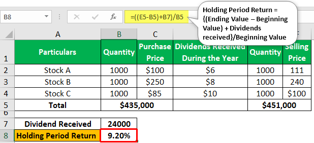

In the modern financial world, the evaluation of stock performance, the analysis of financial data, and the making of informed investment choices are fundamental components for achieving economic objectives. These elements are critical not just for individual investors, but also for institutional investors and financial professionals who aim to optimize portfolios and achieve favorable investment outcomes. The rise of algorithmic trading introduces an additional layer to contemporary investment strategies by utilizing computer algorithms for executing trades at high speeds. This shift has transformed traditional investment methodologies, necessitating a re-evaluation of how stocks are valued and financial performances are assessed.

This article explores the interconnection between stock evaluation, financial performance analysis, and algorithmic trading, providing insights that are crucial for developing effective investment analysis frameworks. In understanding these elements, investors can more accurately assess stock valuation, employ key financial performance metrics, and incorporate the benefits of algorithmic trading within modern investment portfolios. 



Today, technology plays a pivotal role in reshaping the traditional processes of financial performance evaluation and investment analysis. Advanced data analytics, machine learning, and cloud computing have enabled investors to process vast amounts of financial information with unprecedented speed and accuracy. These technological advancements allow for more sophisticated analyses and models, which can lead to more informed and strategic investment decisions. 

By the end of this article, readers will have a comprehensive understanding of the available tools and techniques to proficiently navigate the complexities of investment management. Such understanding is essential for capturing emerging opportunities and mitigating risks in a rapidly evolving financial landscape. The integration of traditional and algorithmic trading methodologies is not only advantageous but also increasingly necessary for investors aiming to thrive in this dynamic environment.

## Table of Contents

## Understanding Stock Valuation

Stock valuation is a fundamental component of investment analysis, essential for assessing whether a stock is overvalued, undervalued, or fairly priced. Accurate stock valuation enables investors to make informed decisions regarding the buying or selling of shares, thus mitigating potential investment risks. The valuation process involves various quantitative and qualitative assessments, with key ratios playing a pivotal role.

The Price-to-Earnings (P/E) ratio is one of the most commonly used metrics in stock valuation. It is calculated by dividing a company's current share price by its earnings per share (EPS):

$$
\text{P/E Ratio} = \frac{\text{Market Value per Share}}{\text{Earnings per Share (EPS)}}
$$

A lower P/E ratio may indicate that a stock is undervalued relative to its earnings, whereas a higher P/E ratio could suggest overvaluation. However, P/E ratios should be analyzed in relation to industry standards and economic conditions to provide meaningful insights.

The Price-to-Book (P/B) ratio is another critical metric, determined by dividing a company's market price by its book value. The formula is expressed as:

$$
\text{P/B Ratio} = \frac{\text{Market Price per Share}}{\text{Book Value per Share}}
$$

This ratio assesses a company's market valuation relative to its book value, offering insights into how much investors are willing to pay for each dollar of net assets.

Dividend Yield is also crucial in the valuation process, representing a stock's annual dividend payments divided by its current share price:

$$
\text{Dividend Yield} = \frac{\text{Annual Dividends per Share}}{\text{Price per Share}}
$$

Investors often seek stocks with higher dividend yields as they suggest a steady income stream. Nonetheless, it is essential to consider the company's dividend payout history to evaluate sustainability.

Beyond these quantitative measures, effective stock valuation requires a qualitative assessment of market conditions and company-specific factors. These include management effectiveness, competitive positioning, market trends, and economic indicators. For instance, a company with a robust competitive edge but a high P/E ratio may still be a viable investment due to its growth potential.

In summary, stock valuation intricately combines quantitative metrics like P/E, P/B ratios, and Dividend Yield with qualitative evaluations to estimate a stock's intrinsic value accurately. This approach aids in identifying investment opportunities while alleviating the risks associated with market [volatility](/wiki/volatility-trading-strategies). By integrating these tools, investors can develop a more comprehensive understanding of potential investments and strategize accordingly.

## Analyzing Financial Performance

Evaluating a company's financial performance is a vital process for investors seeking to make informed investment decisions. At the core of this evaluation are three fundamental financial documents: the income statement, balance sheet, and cash flow statement. Together, these statements provide a comprehensive view of a company's financial health.

The income statement, also known as the profit and loss statement, details a company's revenues, expenses, and profits over a specific period. Key figures from this statement include net income, which is a primary indicator of profitability, and gross margin, calculated as:

$$
\text{Gross Margin} = \left( \frac{\text{Revenue} - \text{Cost of Goods Sold}}{\text{Revenue}} \right) \times 100
$$

This metric assesses how efficiently a company uses its resources to produce goods or services.

The balance sheet offers a snapshot of a company's financial position at a single point in time, highlighting assets, liabilities, and shareholders' equity. From this statement, investors can derive metrics like Return on Equity (ROE) and Return on Assets (ROA). ROE, defined as:

$$
\text{ROE} = \left( \frac{\text{Net Income}}{\text{Shareholders' Equity}} \right) \times 100
$$

provides insights into how effectively a company generates profit from its equity investments. Similarly, ROA, calculated as:

$$
\text{ROA} = \left( \frac{\text{Net Income}}{\text{Total Assets}} \right) \times 100
$$

indicates how efficiently a company's assets are being utilized to produce earnings.

The cash flow statement complements the other two documents by detailing the inflows and outflows of cash, elucidating the company's [liquidity](/wiki/liquidity-risk-premium) and cash management strategies.

Comparative analysis with industry peers is another crucial aspect of financial performance evaluation. By juxtaposing a company's financial metrics with those of its competitors, investors can discern its competitive positioning and market performance. Such comparisons can reveal relative strengths or weaknesses, aiding in the identification of strategic opportunities or risks.

Additionally, analyzing financial trends over multiple periods provides valuable insights into the company's growth prospects and potential risks. This trend analysis helps in predicting future performance by considering historical data, allowing investors to anticipate possible trajectories and make more informed decisions.

In conclusion, effective financial performance analysis is indispensable for identifying lucrative investment opportunities. By examining key financial statements and metrics, conducting comparative assessments, and analyzing historical trends, investors can gain a nuanced understanding of a company's operational efficiency and market standing.

## The Role of Algorithmic Trading

Algorithmic trading implements computer algorithms to execute trades based on predefined criteria. These algorithms are capable of processing large volumes of market data with greater speed and accuracy than human traders, facilitating strategies like high-frequency trading ([HFT](/wiki/high-frequency-trading-strategies)). For HFT, speed is paramount as it involves executing thousands of orders per second, capitalizing on minute price discrepancies.

Common types of [algorithmic trading](/wiki/algorithmic-trading) strategies include:

1. **Statistical Arbitrage**: This method involves utilizing quantitative models to exploit the price differences of assets that should theoretically have the same price, capturing profit from short-lived mispricings. The strategy often requires running complex mathematical models to identify arbitrage opportunities quickly.

2. **Trend-Following**: This strategy is based on technical analysis and aims to capitalize on patterns within market prices. Algorithms are designed to identify emerging trends in asset prices and execute trades that align with these trends. By employing algorithms, traders can systematically exploit statistical patterns over time without emotional interference.

3. **Sentiment Analysis**: This modern approach involves analyzing market sentiment derived from news, social media, and other sources to assess the collective mood of investors. Algorithms are used to parse through large datasets to evaluate sentiment and predict market movements, often utilizing natural language processing (NLP) techniques.

The effectiveness of algorithmic trading strategies is measured by several key performance metrics:

- **Sharpe Ratio**: This metric evaluates the risk-adjusted return of an investment strategy. It is calculated by subtracting the risk-free rate from the expected return of the portfolio and then dividing by the standard deviation of the portfolio's returns. The Sharpe Ratio helps determine how much return is received per unit of risk.
$$
  \text{Sharpe Ratio} = \frac{E[R] - R_f}{\sigma}

$$

  where $E[R]$ is the expected return, $R_f$ is the risk-free rate, and $\sigma$ is the standard deviation of returns.

- **Maximum Drawdown**: This represents the largest drop from a peak to a trough in the portfolio's value, indicating the risk of a huge loss. It provides insight into the strategy’s vulnerability during periods of loss.

- **Win Rate**: This metric indicates the proportion of successful trades to total trades executed. A higher win rate implies more successful trades, though it should be evaluated alongside other metrics like the average profit and loss per trade.

Algorithmic trading offers several advantages. It dramatically improves trade execution speed and efficiency, reduces transaction costs through optimal order execution, and minimizes emotional biases that can cloud human judgment. Additionally, it enables simultaneous monitoring of multiple market conditions and automated reactions to changes. The reduction of human emotions like fear and greed amplifies the probability of sticking to predefined strategies, which is crucial for long-term success. 

Though these advantages are significant, it is essential to remember the necessity of robust risk management and continual system updates to meet fast-paced market changes.

## Integrating Investment Analysis and Algorithmic Trading

Integrating traditional investment analysis with algorithmic trading offers significant enhancements to decision-making processes, leveraging computational efficiency and expansive data analysis capabilities. Algorithms can be engineered to incorporate detailed financial performance data and stock valuation models, making them robust tools for evaluating market positions in real-time. These systems are designed to react and adjust swiftly to market condition changes, thus enabling investors to capitalize on [arbitrage](/wiki/arbitrage) opportunities effectively. 

For instance, an algorithm might consider various inputs such as Price-to-Earnings (P/E) ratios, Return on Equity (ROE), and market sentiment indicators to execute decisions. By doing so, it can drive trade executions based on rules defined through rigorous investment analysis. For example, an algorithm may be set to purchase stocks when the P/E ratio falls below industry average and ROE figures exceed performance benchmarks, suggesting undervaluation and efficient management.

The following Python pseudo-code demonstrates a simple example of an algorithm designed for basic stock evaluation:

```python
def evaluate_stock(pe_ratio, roe, industry_avg_pe, bench_roe):
    if pe_ratio < industry_avg_pe and roe > bench_roe:
        return "Buy"
    else:
        return "Hold"

# Example Usage
industry_avg_pe = 15
bench_roe = 10

stock_pe_ratio = 14
stock_roe = 12

decision = evaluate_stock(stock_pe_ratio, stock_roe, industry_avg_pe, bench_roe)
print(f"Investment Decision: {decision}")
```

This basic framework could form the basis for more sophisticated algorithms, incorporating [machine learning](/wiki/machine-learning) techniques to refine decision-making as new data becomes available. Real-time data feeds would facilitate the adjustment of trading strategies based on up-to-date market analyses.

The adaptability of these systems allows them to effectively manage portfolios, minimizing risk while maximizing returns. However, the success of these systems relies on their continuous evaluation and refinement. Algorithms must be updated with new data and emerging market trends to preserve their effectiveness over time. This iterative process ensures that the algorithms benefit from continual learning and adaptation, maintaining an edge in the variable landscape of financial markets.

Incorporating these advanced systems requires thoughtful oversight, balancing the advantages of automation with the nuanced insight that human expertise provides. This complementary approach sustains optimal outcomes, benefiting from both rigorous data analysis and strategic human intervention.

## Challenges and Considerations

Algorithmic trading, while offering numerous benefits, also presents several challenges that must be addressed to ensure its effective implementation. One of the primary challenges is the high initial setup cost, which includes expenses related to developing sophisticated algorithms, acquiring the necessary technological infrastructure, and securing access to relevant financial data. These costs can be prohibitive for smaller investment firms or individual traders.

Another significant issue is the risk of overfitting historical data. Algorithms can be excessively tailored to past market conditions, leading to models that perform well on historical data but fail in real-time applications. To mitigate this, developers often employ techniques such as cross-validation and [backtesting](/wiki/backtesting) with out-of-sample data, although these methods are not foolproof.

Market changes and unforeseen events can also affect algorithm performance. Algorithms need regular updates and maintenance to remain effective, as they must adapt to evolving market conditions and incorporate new data. Unforeseen events such as geopolitical disruptions or sudden economic changes can lead to market conditions outside the algorithms' training scope, potentially resulting in poor performance or significant losses.

Transaction costs, liquidity issues, and technical failures are additional considerations. High-frequency trading often involves numerous small trades that can incur significant transaction costs, reducing overall profitability. Liquidity issues may prevent trades from being executed at desired prices, particularly in volatile or thinly traded markets. Technical failures, such as network outages or software bugs, can lead to missed opportunities or unintended trades.

Implementing effective risk management strategies is crucial for safeguarding investments and ensuring stable returns. This involves setting appropriate stop-loss levels, diversifying strategy portfolios, and continuously monitoring algorithm performance. Automated systems should be designed to manage risk actively, reacting to adverse market conditions by adjusting trading parameters or temporarily halting trading activities.

Balancing human oversight with automation is vital to mitigate potential pitfalls of fully automated systems. Human intervention can provide a qualitative assessment that algorithms may lack, offering insights into market sentiment or potential risks not captured by numerical data. In practice, this often means setting up systems where humans oversee algorithm performance and intervene when necessary to adjust strategies or manage exceptional market events. 

In conclusion, while algorithmic trading offers improved efficiency and the potential for enhanced returns, addressing these challenges is essential for successful implementation. Adapting to changing markets, implementing robust risk management strategies, and balancing automation with human oversight can help investors navigate the complexities associated with algorithmic trading.

## Conclusion

Effective stock evaluation, financial performance analysis, and the integration of algorithmic trading are increasingly pivotal in modern investment management. Mastery of these elements enables investors to make more informed decisions, optimize their portfolios, and improve financial outcomes. Traditional methods of stock evaluation, such as price-to-earnings and price-to-book ratios, provide insights into a stock's intrinsic value, while financial performance metrics such as return on equity and gross margin offer a detailed understanding of a company's profitability and efficiency. 

Algorithmic trading complements these analyses by allowing for the execution of trades based on advanced algorithmic systems that process market data quickly and efficiently. This capability offers advantages not only in speed but also in minimizing emotional biases that can affect human traders. The capability to adapt to rapid changes in market conditions is crucial in today's dynamic financial environment.

Yet, the field is not without its challenges. The evolving nature of technology and financial markets requires continuous learning and strategy adaptation. The fast pace introduces risks such as overfitting historical data in algorithms or unforeseen impacts of market events. Hence, regular updates and maintenance of algorithmic systems are important to maintain their effectiveness. 

Investors who effectively leverage these tools are more likely to find success in a competitive financial landscape. As technology and methodologies continue to evolve, staying informed about new developments is essential. Balancing automated processes with human oversight can mitigate risks and improve the likelihood of long-term financial success, ensuring stability and growth in investment portfolios.

## References & Further Reading

[1]: Bergstra, J., Bardenet, R., Bengio, Y., & Kégl, B. (2011). ["Algorithms for Hyper-Parameter Optimization."](https://papers.nips.cc/paper/4443-algorithms-for-hyper-parameter-optimization) Advances in Neural Information Processing Systems 24.

[2]: ["Advances in Financial Machine Learning"](https://www.amazon.com/Advances-Financial-Machine-Learning-Marcos/dp/1119482089) by Marcos Lopez de Prado

[3]: ["Evidence-Based Technical Analysis: Applying the Scientific Method and Statistical Inference to Trading Signals"](https://www.amazon.com/Evidence-Based-Technical-Analysis-Scientific-Statistical/dp/0470008741) by David Aronson

[4]: ["Machine Learning for Algorithmic Trading"](https://github.com/stefan-jansen/machine-learning-for-trading) by Stefan Jansen

[5]: ["Quantitative Trading: How to Build Your Own Algorithmic Trading Business"](https://www.amazon.com/Quantitative-Trading-Build-Algorithmic-Business/dp/1119800064) by Ernest P. Chan