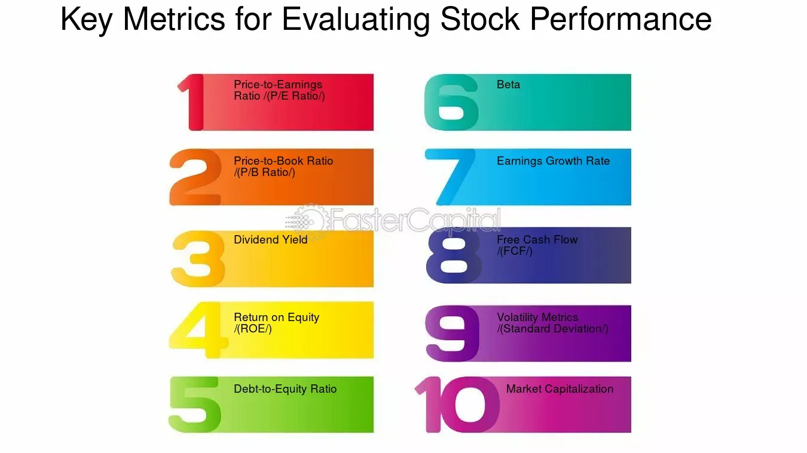

## Table of Contents

## What is stock performance and why is it important to evaluate?

Stock performance refers to how well a company's stock is doing in the stock market. It is measured by looking at the changes in the stock's price over time. When people talk about stock performance, they are usually looking at things like how much the stock price has gone up or down, how the stock is doing compared to other stocks, and how much money the stock is making for investors.

It's important to evaluate stock performance because it helps investors make smart choices about where to put their money. By understanding how a stock has performed in the past, investors can get a better idea of how it might do in the future. This can help them decide whether to buy, sell, or hold onto a stock. Good stock performance can mean more money for investors, while poor performance might lead them to look for better opportunities elsewhere.

## How can beginners start evaluating the performance of a stock?

Beginners can start evaluating the performance of a stock by looking at its price changes over time. They can use simple tools like stock charts, which are available on many financial websites. These charts show how the stock's price has moved up or down over days, weeks, or even years. By looking at these charts, beginners can see if the stock's price is generally going up, which is good, or if it's going down, which might be a warning sign.

Another way beginners can evaluate stock performance is by comparing it to other stocks or to the overall market. They can use something called a stock index, like the S&P 500, to see how their stock is doing compared to a big group of other stocks. If the stock is doing better than the index, that's a good sign. Also, beginners can look at something called the stock's return, which is how much money the stock has made or lost over a certain time. This can help them understand if the stock is a good investment.

Lastly, beginners should also pay attention to news and reports about the company. If the company is doing well, making more money, and growing, its stock is likely to perform better. They can find this information in the company's financial reports or in news articles. By putting all this information together, beginners can start to get a good picture of how a stock is performing and make better decisions about whether to buy, sell, or hold onto it.

## What are the key financial metrics to consider when evaluating stock performance?

When you want to understand how well a stock is doing, there are a few important numbers to look at. One of these is the stock's price-to-earnings ratio, or P/E ratio. This tells you how much you're paying for each dollar of the company's earnings. A lower P/E ratio might mean the stock is a good deal, but you need to compare it to other stocks in the same industry. Another key number is the company's earnings per share (EPS), which shows how much profit the company makes for each share of stock. If the EPS is growing, that's usually a good sign because it means the company is making more money.

Another important thing to look at is the stock's dividend yield. This tells you how much money you get back from the company as a percentage of the stock's price. If a company pays a high dividend yield, it can be a good thing because you get regular payments, but you also need to check if the company can keep paying those dividends. Finally, you should look at the company's revenue growth and profit margins. Revenue growth shows if the company is selling more stuff over time, and profit margins tell you how much of that money turns into profit. If both are going up, it's a good sign that the company, and its stock, are doing well.

## How do you calculate and interpret the return on investment (ROI) for a stock?

To calculate the return on investment (ROI) for a stock, you need to know how much money you made or lost from the stock. First, take the current price of the stock and subtract the price you paid for it. This gives you the profit or loss from the change in the stock's price. Next, if the company pays dividends, add up all the dividends you received while you owned the stock. Add this to your profit or loss from the price change. Then, divide this total by the amount you originally paid for the stock. Finally, multiply by 100 to turn it into a percentage. That's your ROI.

Interpreting the ROI is pretty simple. If your ROI is a positive number, it means you made money on your investment. The higher the percentage, the better your investment did. For example, an ROI of 10% means you made 10% more than what you put in. If your ROI is a negative number, it means you lost money. The bigger the negative number, the more you lost. So, if your ROI is -5%, you lost 5% of what you invested. By looking at the ROI, you can quickly see if your stock was a good investment or not.

## What role does the price-to-earnings (P/E) ratio play in stock evaluation?

The price-to-earnings (P/E) ratio is a key number that helps you figure out if a stock is a good deal. It tells you how much you're paying for each dollar of the company's earnings. To find the P/E ratio, you take the stock's current price and divide it by the company's earnings per share (EPS). A lower P/E ratio can mean the stock is cheap compared to how much money the company is making. But, you have to be careful because you need to compare the P/E ratio to other stocks in the same industry. A P/E ratio that's low for one industry might be high for another.

Using the P/E ratio helps you see if a stock is overvalued or undervalued. If the P/E ratio is high, it might mean people are expecting the company to grow a lot in the future, so they're willing to pay more for the stock. But, a high P/E ratio can also mean the stock is too expensive. On the other hand, a low P/E ratio might show that the stock is a good buy because it's cheap compared to the company's earnings. But, it could also mean that people think the company isn't going to do well in the future. So, the P/E ratio is a helpful tool, but you should use it along with other information to make the best choices about stocks.

## How can historical stock price data be used to assess performance?

Historical stock price data is a great way to see how a stock has done over time. By looking at a stock's price history, you can see if it has gone up or down, and by how much. You can use charts that show the stock's price over days, weeks, months, or even years. These charts help you spot patterns, like if the stock usually goes up in certain months or if it falls after certain events. This can give you a good idea of how the stock might act in the future, but remember, past performance doesn't guarantee future results.

Another way to use historical data is to compare the stock's performance to the overall market or other stocks. You can look at how the stock did during different economic times, like when the market was doing well or when it was struggling. This can help you see if the stock is a good investment compared to others. By studying the stock's price history, you can make smarter choices about buying, selling, or holding onto the stock. Just make sure to also look at other information, like the company's financial health and news about the company, to get the full picture.

## What are the differences between absolute and relative stock performance measures?

Absolute stock performance measures how much a stock's price has changed over time, without comparing it to anything else. It tells you the total gain or loss in the stock's value. For example, if you bought a stock at $50 and it's now worth $60, the absolute performance is a $10 gain. This measure is useful because it shows you exactly how much money you've made or lost. But, it doesn't tell you if the stock did better or worse than other stocks or the market as a whole.

Relative stock performance, on the other hand, compares a stock's performance to something else, like a stock index or another stock. It helps you see if your stock did better or worse than the market. For instance, if your stock went up by 10% but the market went up by 15%, your stock underperformed the market even though its price increased. Relative performance is important because it gives you a sense of how well your stock is doing compared to other investments. This can help you decide if your stock is a good choice or if you should look for better opportunities.

## How do market conditions and economic indicators influence stock performance evaluation?

Market conditions and economic indicators play a big role in how you evaluate stock performance. When the market is doing well, like when stock prices are going up and there's a lot of buying, a stock that goes up might not be as impressive if most other stocks are also going up. On the other hand, if the market is struggling and stock prices are falling, a stock that holds its value or even goes up a little bit can be seen as a strong performer. So, you need to look at what's happening in the market to understand if a stock's performance is good or not.

Economic indicators, like unemployment rates, inflation, and GDP growth, also affect how you judge a stock's performance. If the economy is growing and people are spending more money, companies usually do better, and their stocks might go up. But if the economy is slowing down, with high unemployment and less spending, companies might struggle, and their stocks could go down. By keeping an eye on these economic signs, you can get a better idea of why a stock is doing well or poorly and make smarter choices about your investments.

## What advanced statistical tools can be used to predict future stock performance?

Advanced statistical tools can help you guess how a stock might do in the future. One tool is called regression analysis. This tool looks at how different things, like the company's earnings or the overall economy, have affected the stock's price in the past. By studying these patterns, regression analysis can make predictions about where the stock's price might go next. Another tool is time series analysis, which focuses on the stock's price history. It looks for patterns and trends over time, like if the stock goes up in certain months or after certain events. This can help you guess what might happen to the stock's price in the future.

Another useful tool is machine learning. This is a type of computer program that can learn from data and make predictions. You can feed the program lots of information about a stock, like its price history, the company's financial reports, and even news articles. The machine learning program can then find patterns and relationships that might be hard for a person to see. It can use these patterns to predict how the stock might perform in the future. While these tools can be very helpful, it's important to remember that no one can predict the future perfectly. So, always use these predictions along with other information to make the best investment choices.

## How do you incorporate qualitative factors into the evaluation of stock performance?

When you're looking at how well a stock is doing, it's not just about numbers. You also need to think about qualitative factors, which are things you can't measure with numbers. For example, the quality of the company's management team is really important. If the people running the company are smart and good at their jobs, the company is more likely to do well. Another thing to think about is the company's brand. If people really like and trust the company's products, that can help the stock do better. Also, you should pay attention to what's happening in the industry. If the company is in a growing industry, like technology, that can be good for the stock. But if the industry is shrinking, like some traditional retail businesses, that might not be so good.

Another qualitative factor to consider is the company's strategy and how well it's working. If the company has a clear plan for growing and making money, and if that plan is working, that's a good sign. You can learn about the company's strategy by reading what the company says in its reports or by listening to what the CEO says in interviews. It's also important to think about any news or events that might affect the company. For example, if the company is getting sued or if there's a big change in the law that affects the company's business, that can impact the stock's performance. By putting all these qualitative factors together with the numbers, you can get a fuller picture of how well a stock is really doing.

## What are the common pitfalls to avoid when evaluating stock performance?

One common mistake people make when looking at stock performance is focusing too much on short-term changes. Stock prices can go up and down a lot in a short time because of things like news or rumors. If you only look at these short-term changes, you might miss the bigger picture of how the stock is doing over a longer time. It's better to look at how the stock has done over months or years to see if it's really a good investment.

Another pitfall is ignoring the bigger market and economic conditions. A stock might look like it's doing well if you just look at its price going up, but if the whole market is going up even more, the stock might actually be underperforming. Also, if the economy is doing badly, even a stock that's holding steady might be doing better than you think. So, it's important to compare the stock's performance to the market and think about what's happening in the economy.

Lastly, people often forget about qualitative factors when evaluating stocks. They might focus only on numbers like earnings and stock prices, but they should also think about things like the quality of the company's management, its brand, and its strategy. These things can have a big impact on how well the stock does in the long run. By considering both the numbers and the qualitative factors, you can make smarter choices about your investments.

## How can an expert develop a comprehensive stock performance evaluation model?

To develop a comprehensive stock performance evaluation model, an expert needs to combine both quantitative and qualitative factors. Start by gathering historical stock price data, which can be used to calculate key financial metrics like the price-to-earnings ratio, earnings per share, and return on investment. These numbers give a clear picture of how the stock has performed in the past. Next, compare the stock's performance to the overall market using stock indices like the S&P 500. This helps to see if the stock is doing better or worse than other investments. Also, use advanced statistical tools like regression analysis and machine learning to predict future performance based on past trends and patterns. These tools can help make more accurate guesses about where the stock's price might go.

In addition to numbers, qualitative factors are crucial for a complete evaluation. Look at the quality of the company's management team, its brand strength, and the health of the industry it's in. For example, a company with a strong brand and good management is more likely to do well in the long run. Pay attention to the company's strategy and how well it's working, as well as any news or events that could affect the company's future. By combining these qualitative insights with the quantitative data, an expert can create a model that gives a fuller picture of a stock's performance. This model should be flexible enough to adjust to changing market conditions and economic indicators, ensuring that it remains relevant and useful for making investment decisions.

## What is Understanding Stock Valuation?

Stock valuation is a fundamental component of investment analysis, essential for assessing whether a stock is overvalued, undervalued, or fairly priced. Accurate stock valuation enables investors to make informed decisions regarding the buying or selling of shares, thus mitigating potential investment risks. The valuation process involves various quantitative and qualitative assessments, with key ratios playing a pivotal role.

The Price-to-Earnings (P/E) ratio is one of the most commonly used metrics in stock valuation. It is calculated by dividing a company's current share price by its earnings per share (EPS):

$$
\text{P/E Ratio} = \frac{\text{Market Value per Share}}{\text{Earnings per Share (EPS)}}
$$

A lower P/E ratio may indicate that a stock is undervalued relative to its earnings, whereas a higher P/E ratio could suggest overvaluation. However, P/E ratios should be analyzed in relation to industry standards and economic conditions to provide meaningful insights.

The Price-to-Book (P/B) ratio is another critical metric, determined by dividing a company's market price by its book value. The formula is expressed as:

$$
\text{P/B Ratio} = \frac{\text{Market Price per Share}}{\text{Book Value per Share}}
$$

This ratio assesses a company's market valuation relative to its book value, offering insights into how much investors are willing to pay for each dollar of net assets.

Dividend Yield is also crucial in the valuation process, representing a stock's annual dividend payments divided by its current share price:

$$
\text{Dividend Yield} = \frac{\text{Annual Dividends per Share}}{\text{Price per Share}}
$$

Investors often seek stocks with higher dividend yields as they suggest a steady income stream. Nonetheless, it is essential to consider the company's dividend payout history to evaluate sustainability.

Beyond these quantitative measures, effective stock valuation requires a qualitative assessment of market conditions and company-specific factors. These include management effectiveness, competitive positioning, market trends, and economic indicators. For instance, a company with a robust competitive edge but a high P/E ratio may still be a viable investment due to its growth potential.

In summary, stock valuation intricately combines quantitative metrics like P/E, P/B ratios, and Dividend Yield with qualitative evaluations to estimate a stock's intrinsic value accurately. This approach aids in identifying investment opportunities while alleviating the risks associated with market [volatility](/wiki/volatility-trading-strategies). By integrating these tools, investors can develop a more comprehensive understanding of potential investments and strategize accordingly.

## How can we analyze financial performance?

Evaluating a company's financial performance is a vital process for investors seeking to make informed investment decisions. At the core of this evaluation are three fundamental financial documents: the income statement, balance sheet, and cash flow statement. Together, these statements provide a comprehensive view of a company's financial health.

The income statement, also known as the profit and loss statement, details a company's revenues, expenses, and profits over a specific period. Key figures from this statement include net income, which is a primary indicator of profitability, and gross margin, calculated as:

$$
\text{Gross Margin} = \left( \frac{\text{Revenue} - \text{Cost of Goods Sold}}{\text{Revenue}} \right) \times 100
$$

This metric assesses how efficiently a company uses its resources to produce goods or services.

The balance sheet offers a snapshot of a company's financial position at a single point in time, highlighting assets, liabilities, and shareholders' equity. From this statement, investors can derive metrics like Return on Equity (ROE) and Return on Assets (ROA). ROE, defined as:

$$
\text{ROE} = \left( \frac{\text{Net Income}}{\text{Shareholders' Equity}} \right) \times 100
$$

provides insights into how effectively a company generates profit from its equity investments. Similarly, ROA, calculated as:

$$
\text{ROA} = \left( \frac{\text{Net Income}}{\text{Total Assets}} \right) \times 100
$$

indicates how efficiently a company's assets are being utilized to produce earnings.

The cash flow statement complements the other two documents by detailing the inflows and outflows of cash, elucidating the company's [liquidity](/wiki/liquidity-risk-premium) and cash management strategies.

Comparative analysis with industry peers is another crucial aspect of financial performance evaluation. By juxtaposing a company's financial metrics with those of its competitors, investors can discern its competitive positioning and market performance. Such comparisons can reveal relative strengths or weaknesses, aiding in the identification of strategic opportunities or risks.

Additionally, analyzing financial trends over multiple periods provides valuable insights into the company's growth prospects and potential risks. This trend analysis helps in predicting future performance by considering historical data, allowing investors to anticipate possible trajectories and make more informed decisions.

In conclusion, effective financial performance analysis is indispensable for identifying lucrative investment opportunities. By examining key financial statements and metrics, conducting comparative assessments, and analyzing historical trends, investors can gain a nuanced understanding of a company's operational efficiency and market standing.

## What is the Role of Algorithmic Trading?

Algorithmic trading implements computer algorithms to execute trades based on predefined criteria. These algorithms are capable of processing large volumes of market data with greater speed and accuracy than human traders, facilitating strategies like high-frequency trading ([HFT](/wiki/high-frequency-trading-strategies)). For HFT, speed is paramount as it involves executing thousands of orders per second, capitalizing on minute price discrepancies.

Common types of [algorithmic trading](/wiki/algorithmic-trading) strategies include:

1. **Statistical Arbitrage**: This method involves utilizing quantitative models to exploit the price differences of assets that should theoretically have the same price, capturing profit from short-lived mispricings. The strategy often requires running complex mathematical models to identify arbitrage opportunities quickly.

2. **Trend-Following**: This strategy is based on technical analysis and aims to capitalize on patterns within market prices. Algorithms are designed to identify emerging trends in asset prices and execute trades that align with these trends. By employing algorithms, traders can systematically exploit statistical patterns over time without emotional interference.

3. **Sentiment Analysis**: This modern approach involves analyzing market sentiment derived from news, social media, and other sources to assess the collective mood of investors. Algorithms are used to parse through large datasets to evaluate sentiment and predict market movements, often utilizing natural language processing (NLP) techniques.

The effectiveness of algorithmic trading strategies is measured by several key performance metrics:

- **Sharpe Ratio**: This metric evaluates the risk-adjusted return of an investment strategy. It is calculated by subtracting the risk-free rate from the expected return of the portfolio and then dividing by the standard deviation of the portfolio's returns. The Sharpe Ratio helps determine how much return is received per unit of risk.
$$
  \text{Sharpe Ratio} = \frac{E[R] - R_f}{\sigma}

$$

  where $E[R]$ is the expected return, $R_f$ is the risk-free rate, and $\sigma$ is the standard deviation of returns.

- **Maximum Drawdown**: This represents the largest drop from a peak to a trough in the portfolio's value, indicating the risk of a huge loss. It provides insight into the strategy’s vulnerability during periods of loss.

- **Win Rate**: This metric indicates the proportion of successful trades to total trades executed. A higher win rate implies more successful trades, though it should be evaluated alongside other metrics like the average profit and loss per trade.

Algorithmic trading offers several advantages. It dramatically improves trade execution speed and efficiency, reduces transaction costs through optimal order execution, and minimizes emotional biases that can cloud human judgment. Additionally, it enables simultaneous monitoring of multiple market conditions and automated reactions to changes. The reduction of human emotions like fear and greed amplifies the probability of sticking to predefined strategies, which is crucial for long-term success. 

Though these advantages are significant, it is essential to remember the necessity of robust risk management and continual system updates to meet fast-paced market changes.

## References & Further Reading

[1]: Bergstra, J., Bardenet, R., Bengio, Y., & Kégl, B. (2011). ["Algorithms for Hyper-Parameter Optimization."](https://papers.nips.cc/paper/4443-algorithms-for-hyper-parameter-optimization) Advances in Neural Information Processing Systems 24.

[2]: ["Advances in Financial Machine Learning"](https://www.amazon.com/Advances-Financial-Machine-Learning-Marcos/dp/1119482089) by Marcos Lopez de Prado

[3]: ["Evidence-Based Technical Analysis: Applying the Scientific Method and Statistical Inference to Trading Signals"](https://www.amazon.com/Evidence-Based-Technical-Analysis-Scientific-Statistical/dp/0470008741) by David Aronson

[4]: ["Machine Learning for Algorithmic Trading"](https://github.com/stefan-jansen/machine-learning-for-trading) by Stefan Jansen

[5]: ["Quantitative Trading: How to Build Your Own Algorithmic Trading Business"](https://www.amazon.com/Quantitative-Trading-Build-Algorithmic-Business/dp/1119800064) by Ernest P. Chan