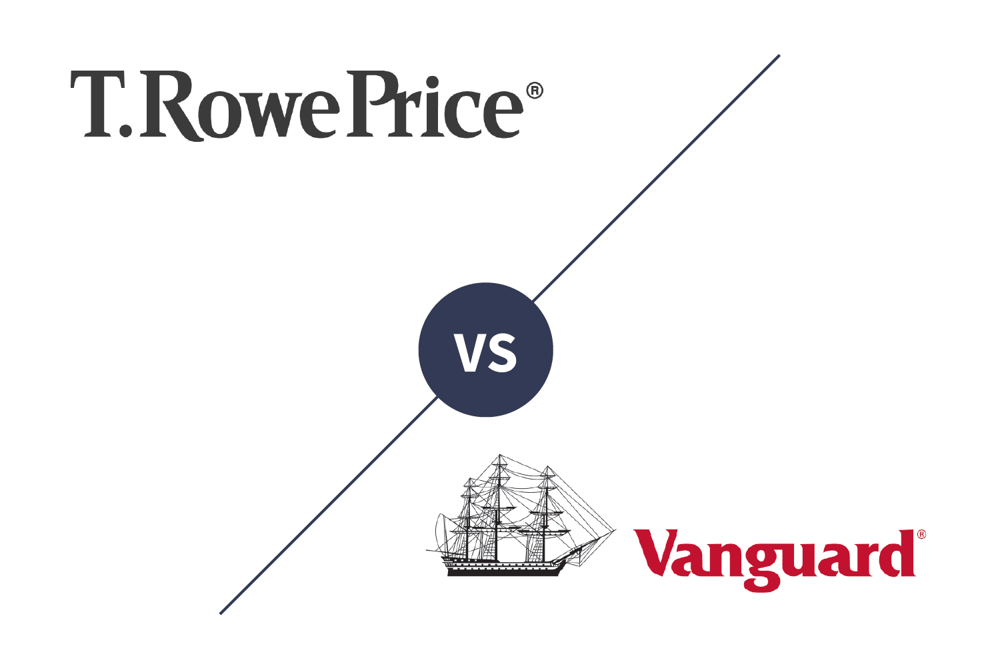

Financial services play a crucial role in the modern economy by facilitating transactions, providing credit, and managing risk. They help allocate resources efficiently across sectors and individuals, thereby driving economic growth and stability. These services span a wide array of activities, including banking, investments, insurance, and asset management, each contributing to the financial system's overall health.

T. Rowe Price stands as a prominent player in the financial services industry, recognized for its robust asset management offerings and commitment to delivering value to its clients. Established in 1937, the firm has built a strong reputation for its disciplined investment approach and its dedication to research-driven strategies. With a comprehensive range of financial products and services, T. Rowe Price serves a diverse clientele, including individual investors, financial intermediaries, and institutions.

Investment reviews are an essential tool for investors, offering valuable insights into the performance and potential of investment products and firms. These reviews assess various aspects, including financial stability, strategy effectiveness, risk management, and past performance, enabling investors to make informed decisions. In a competitive landscape, such evaluations are crucial for investors seeking to optimize their portfolios and achieve their financial goals.

Algorithmic trading, commonly known as algo trading, represents a significant evolution in the trading landscape. Unlike traditional trading, which relies on manual decision-making, algorithmic trading utilizes computer programs to execute trades according to predetermined criteria and strategies. This approach enhances trading efficiency by minimizing human error and allowing for rapid execution of complex trading models. Algorithmic trading's relevance has surged with advancements in technology, making it a vital component of modern investment strategies.

This article will explore T. Rowe Price's investment review and its approach to algorithmic trading. By examining the firm's methodologies and strategies, this piece aims to provide a comprehensive understanding of how T. Rowe Price leverages these tools to enhance its service offerings and maintain its competitive edge in the financial services industry.

## Table of Contents

## Overview of T. Rowe Price

T. Rowe Price, established in 1937 by Thomas Rowe Price Jr., is an esteemed firm in the financial services industry offering comprehensive investment management solutions. Its headquarters are located in Baltimore, Maryland, and it has grown to be a prominent player in the global financial market. The firm is known for its disciplined investment philosophy and client-focused approach, characteristics that have earned it a strong reputation over the decades.

The range of financial services provided by T. Rowe Price encompasses mutual funds, sub-advisory services, and separate account management for individual and institutional clients. It caters to a diverse client base, including individual investors, institutional investors, financial intermediaries, and retirement plan sponsors. By offering a broad spectrum of services, T. Rowe Price aims to address various investment needs and objectives, helping clients achieve their financial goals.

T. Rowe Price holds a significant position in the market, attributed to its consistent performance and commitment to innovation. As of 2023, the firm manages assets worth hundreds of billions of dollars, placing it among the top-tier asset management companies globally. Its reputation is built on the foundation of delivering strong, long-term investment results to its clients. The firm's enduring market presence is also supported by a client-centric approach and an emphasis on maintaining transparency and trust with investors.

The firm employs several key investment strategies, including active management and rigorous research-based portfolio construction. T. Rowe Price’s investment approach is characterized by deep [fundamental analysis](/wiki/fundamental-analysis), which involves scrutinizing economic factors, industry trends, and company-specific data to make informed decisions. The firm prioritizes identifying high-quality, growth-oriented companies that possess the potential for sustainable earnings and value creation over time.

Recent performance metrics highlight T. Rowe Price's ability to adapt and grow even amidst challenging economic conditions. The firm has demonstrated resilience and agility, maintaining steady growth in assets under management (AUM) and outperforming market benchmarks in various asset classes. Its robust performance is a testament to its sound strategic planning and proficient execution of investment strategies.

In summary, T. Rowe Price distinguishes itself through a storied history, diversified service offerings, and a strong reputation in the financial services sector. Its commitment to excellence and strategic acumen positions it as a formidable entity in the investment management landscape, continually adapting to the evolving needs of its clientele and the broader financial market.

## Understanding Investment Reviews

Investment reviews serve as a critical tool for assessing the effectiveness and quality of financial services offered by investment firms. These reviews aim to provide an objective analysis of a firm's offerings, performance, and strategic approach, thus enabling investors to make well-informed decisions regarding their investment choices.

The importance of investment reviews lies in their ability to synthesize complex financial data into comprehensible insights that are accessible to investors. They empower investors by providing clarity and transparency, which are vital for making informed decisions in the complex field of finance. This transparency also helps to build trust between investors and financial service providers, as it fosters accountability and showcases a firm's commitment to maintaining high standards.

When evaluating an investment firm, several criteria are typically considered. These include the firm's historical performance, the range and quality of services provided, management effectiveness, fee structures, risk management strategies, and compliance with regulatory requirements. Investors also assess the firm's reputation, client satisfaction, and its adaptability to market changes.

Common metrics and indicators in investment reviews include return on investment (ROI), risk-adjusted return, alpha, beta, and the Sharpe ratio. ROI measures the gain or loss generated relative to the investment cost. Risk-adjusted return considers both the investment's return and the risk involved in achieving that return. Alpha indicates the ability of an investment to outperform the market, while beta measures its [volatility](/wiki/volatility-trading-strategies) relative to the market. The Sharpe ratio evaluates the risk-adjusted performance of an investment, calculated as:

$$
\text{Sharpe Ratio} = \frac{\text{Portfolio Return} - \text{Risk-Free Rate}}{\text{Standard Deviation of Portfolio Return}}
$$

T. Rowe Price utilizes investment reviews as a feedback mechanism to continually refine its offerings and maintain competitive advantage. By actively engaging in these evaluations, T. Rowe Price can identify strengths in their current strategies as well as areas needing improvement. This process aids in the optimization of client services, ensuring alignment with evolving investor expectations and market demands. Through such proactive measures, T. Rowe Price enhances its reputation and ensures robust performance metrics remain in place.

## Algorithmic Trading Explained

Algorithmic trading is a method of executing trades using automated and pre-programmed trading instructions. These instructions are based on variables such as timing, price, and [volume](/wiki/volume-trading-strategy). This approach significantly differs from traditional trading, where human traders make decisions manually. In [algorithmic trading](/wiki/algorithmic-trading), computer algorithms analyze large datasets and execute orders at speeds and frequencies that humans cannot replicate.

The technological backbone of algorithmic trading relies on sophisticated software, comprehensive data sets, and advanced analytical tools. The software is designed to process vast amounts of financial data in real time, enabling rapid decision-making. This involves the use of high-frequency trading ([HFT](/wiki/high-frequency-trading-strategies)) systems that can execute thousands of orders per second. Data analytics play a crucial role in identifying patterns, trends, and [arbitrage](/wiki/arbitrage) opportunities across various markets. Machine learning models and [artificial intelligence](/wiki/ai-artificial-intelligence) are increasingly being incorporated to improve prediction accuracy and adapt to changing market conditions.

The advantages of algorithmic trading in portfolio management are numerous. It enhances efficiency by reducing the time required to execute orders and minimizing human errors. Additionally, it enables the exploitation of market opportunities by executing trades at optimal times, potentially leading to better pricing and increased profitability. Algo trading also aids in maintaining market [liquidity](/wiki/liquidity-risk-premium) and allows for back-testing strategies using historical data to assess their effectiveness.

However, algorithmic trading is not without its challenges and risks. One significant concern is the potential for algorithmic errors or malfunctions, which can result in substantial financial losses. The complexity of the systems involved can lead to unforeseen interactions and unintended consequences. Market volatility can be exacerbated by the high speed and volume of trades, occasionally resulting in flash crashes. Additionally, there are regulatory and compliance challenges, as trading algorithms must adhere to strict financial regulations and ethical standards.

T. Rowe Price implements algorithmic trading strategies by integrating technology with its investment decision-making processes. The firm uses proprietary algorithms to identify and capitalize on market opportunities. These strategies include quantitative analysis to assess potential trades and risk management protocols to safeguard assets. While the specific details of these algorithms are proprietary, T. Rowe Price focuses on leveraging technology to enhance its investment performance and provide better outcomes for its clients. Through the careful application of algorithmic trading, T. Rowe Price aims to improve portfolio management and achieve a competitive edge in the financial markets.

## T. Rowe Price's Approach to Algorithmic Trading

T. Rowe Price, a revered entity in the financial services arena, employs a nuanced approach to algorithmic trading, characterized by its robust integration of technology and innovation. This method is pivotal to their investment strategies, significantly enhancing their decision-making capabilities and portfolio management efficiencies.

The technology employed by T. Rowe Price forms the backbone of their algorithmic trading approach. Through continuous innovation, the firm harnesses vast amounts of data and cutting-edge software solutions to execute trades with speed and precision unattainable through traditional methods. Advanced data analytics tools and [machine learning](/wiki/machine-learning) algorithms are integral to their system, enabling the analysis of complex market patterns and forecasting future price movements more accurately.

Proprietary algorithms, developed in-house, are at the core of T. Rowe Price’s trading strategy. These algorithms are crafted to optimize trade execution and manage risk effectively. For instance, they utilize complex mathematical models to assess market volatility and capitalize on arbitrage opportunities. Such proprietary systems ensure that trading decisions are grounded in quantitative analysis and real-time market data, reducing exposure to unexpected market shifts.

Successful outcomes from T. Rowe Price's algorithmic strategies are exemplified in several case studies. For instance, their algorithms have enabled substantial improvements in transaction costs efficiency and execution speed during volatile market conditions. Moreover, by adapting to market corrections swiftly, these algorithms have maintained a commendable performance stability, an edge over competitors relying on manual trading processes.

The integration of algorithmic trading has notably impacted T. Rowe Price’s investment performance. The firm reports improved returns attributed to cost efficiencies and enhanced risk-adjusted returns. Algorithm-driven strategies have not only enriched their investment portfolio management but have also cemented their reputation for innovative and effective investment solutions.

Through the strategic adoption of algorithmic trading, T. Rowe Price continues to set benchmarks in the financial services sector, demonstrating that technological prowess and insightful algorithmic design are crucial for maintaining a competitive investment edge.

## Investment Review of T. Rowe Price

### Investment Review of T. Rowe Price

Recent investment reviews of T. Rowe Price reveal several insights into the company's performance and strategic direction. Overall, T. Rowe Price is well-regarded for its consistent historical performance, diversified investment strategies, and strong management team. Analysts often highlight these strengths as core reasons the firm retains its competitive position within the financial services industry.

#### Strengths Highlighted in Reviews

Investment reviews consistently commend T. Rowe Price for its robust performance metrics. The firm's ability to deliver resilient returns across varying market conditions showcases its adept risk management and adaptive strategy. Reviewers frequently underscore T. Rowe Price's strategic asset allocation and rigorous research methodologies as key contributors to the firm’s sustained performance. The balanced blend of active management and innovative investment solutions enables T. Rowe Price to appeal to a broad range of investors, from individuals to institutional clients.

#### Areas for Improvement

Despite its strengths, reviews also point to potential areas where T. Rowe Price can improve. Some critiques focus on the firm's need to continue enhancing its technological infrastructure, particularly in terms of digital client engagement and algorithmic trading capabilities. Additionally, while T. Rowe Price maintains a strong active management presence, some reviewers suggest an increased focus on expanding its passive investment offerings to meet the growing demand for such products.

#### Comparative Analysis with Competitors

In comparison to its competitors, T. Rowe Price often stands out due to its reputation for strategic depth and a long-term investment perspective. Nevertheless, it faces stiff competition from other industry giants like Vanguard and BlackRock, known for their expansive index fund offerings and technological innovations. When matched against these firms, T. Rowe Price is frequently lauded for its personalized service and deep market analysis capabilities but is sometimes viewed as needing to quicken its pace in adopting cutting-edge fintech solutions.

#### Client Testimonials and Feedback

Client feedback further supports the findings of professional reviews. Testimonials indicate a high level of satisfaction with T. Rowe Price's customer service, noting the company's responsiveness and personalized attention as significant positives. Many clients express appreciation for the comprehensive market insights and advice provided by T. Rowe Price's advisors, which help inform their individual investment decisions. However, a minority of clients voice a desire for more streamlined digital tools and platforms, suggesting room for enhancement in the firm's digital service offerings.

In summary, T. Rowe Price's investment reviews reflect a predominantly positive assessment of its performance and strategic positioning. By addressing areas for improvement, such as expanding its technological and passive investment capabilities, T. Rowe Price could further solidify its market standing and continue to enhance its service offerings for clients.

## Conclusion

In summarizing the key points discussed about T. Rowe Price, it becomes apparent that the firm stands out as a notable entity in the financial services industry, with a strong reputation for its performance and strategic approach. The investment reviews provide a comprehensive view of the firm's strengths, highlighting its effective strategies and robust performance over recent years. T. Rowe Price's integration of algorithmic trading demonstrates a commitment to innovation and efficiency in portfolio management, which is a crucial aspect considering the evolving nature of modern financial markets.

The firm's approach to algorithmic trading is anticipated to be a significant driver of its future direction. As technological advancements continue, T. Rowe Price is well-positioned to leverage these innovations to enhance its trading strategies further and improve its investment outcomes. This forward-thinking approach not only solidifies T. Rowe Price's competitive edge but also aligns with the global trend towards more automated and data-driven trading solutions.

Selecting the right financial service provider is essential for investors aiming to achieve their financial goals. T. Rowe Price's demonstrated expertise, excellent service, and commitment to embracing new technologies make it a compelling choice for those exploring investment opportunities. Investors are encouraged to consider the firm's offerings, as its blend of traditional expertise and modern technological practices presents a balanced and effective approach to investment management.

## References & Further Reading

[1]: Nosfinger, J. (2017). ["The Psychology of Investing"](https://www.taylorfrancis.com/books/mono/10.4324/9781315230856/psychology-investing-john-nofsinger). Pearson.

[2]: López de Prado, M. (2018). ["Advances in Financial Machine Learning"](https://www.amazon.com/Advances-Financial-Machine-Learning-Marcos/dp/1119482089). Wiley.

[3]: Chan, E. P. (2008). ["Quantitative Trading: How to Build Your Own Algorithmic Trading Business"](https://github.com/ftvision/quant_trading_echan_book). John Wiley & Sons.

[4]: Aronson, D. (2007). ["Evidence-Based Technical Analysis: Applying the Scientific Method and Statistical Inference to Trading Signals"](https://www.amazon.com/Evidence-Based-Technical-Analysis-Scientific-Statistical/dp/0470008741). John Wiley & Sons.

[5]: Jansen, S. (2020). ["Machine Learning for Algorithmic Trading"](https://github.com/stefan-jansen/machine-learning-for-trading). Packt Publishing.

[6]: O'Shaughnessy, J. P. (2005). ["What Works on Wall Street: The Classic Guide to the Best-Performing Investment Strategies of All Time"](https://www.amazon.com/What-Works-Wall-Street-Fourth/dp/0071625763). McGraw-Hill Education.