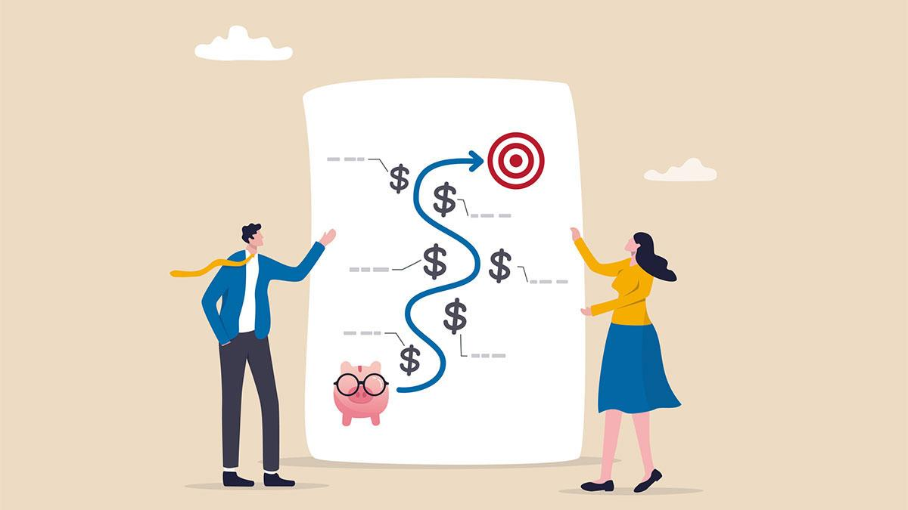

## Table of Contents

## What is T. Rowe Price?

T. Rowe Price is a big company that helps people save and invest their money. It started in 1937 and is based in Baltimore, Maryland. They offer different ways for people to grow their money, like mutual funds, retirement plans, and other investment options. People trust T. Rowe Price because they have been around for a long time and have a good reputation.

The company is known for doing a lot of research before making investment decisions. This means they look at a lot of information to decide which companies or projects to invest in. They believe that by doing this, they can help their customers make more money over time. T. Rowe Price also focuses on helping people plan for their future, especially when it comes to saving for retirement.

## How long has T. Rowe Price been in operation?

T. Rowe Price has been helping people with their money since 1937. That means they have been around for over 80 years. They started in Baltimore, Maryland, and have grown a lot since then.

The company is known for doing a lot of research before they decide where to invest. They want to make sure they are making smart choices so their customers can grow their money. T. Rowe Price helps people save for the future, especially for retirement.

## What types of investment products does T. Rowe Price offer?

T. Rowe Price offers many different ways for people to invest their money. They have mutual funds, which are a popular choice because they let people invest in a mix of stocks and bonds. They also have exchange-traded funds (ETFs), which are similar to mutual funds but can be bought and sold like stocks during the trading day. For people who want to invest in just one company, T. Rowe Price also offers individual stocks and bonds.

In addition to these options, T. Rowe Price helps people save for retirement with different kinds of retirement accounts. They offer 401(k) plans, which are often used by people who work for companies. They also have Individual Retirement Accounts (IRAs), which anyone can open to save for their future. T. Rowe Price also provides tools and advice to help people plan their investments and make smart choices about their money.

Overall, T. Rowe Price tries to meet the needs of different kinds of investors. Whether someone is just starting to save or is planning for their retirement, T. Rowe Price has products and services that can help them reach their financial goals.

## How does T. Rowe Price's performance compare to industry benchmarks?

T. Rowe Price's performance is often measured against industry benchmarks like the S&P 500 or other relevant indices. Over the years, T. Rowe Price has shown strong performance in many of its funds. For example, their equity funds have often beaten the S&P 500 over long periods, which means they have helped their investors earn more money than if they had just invested in the S&P 500. However, like all investment companies, T. Rowe Price's performance can vary from year to year, and not all of their funds outperform the benchmarks all the time.

It's also important to look at how T. Rowe Price performs compared to other mutual fund companies. In many cases, T. Rowe Price's funds have been in the top half or even the top quartile of their categories. This means that when you compare their funds to similar funds from other companies, T. Rowe Price often does better. They focus a lot on research and long-term investing, which helps them pick good investments and manage risk well. Overall, T. Rowe Price has a good track record, but it's always smart to look at the latest data and consider what fits best with your own investment goals.

## What are the fees associated with T. Rowe Price's investment products?

T. Rowe Price charges different fees depending on which investment product you choose. For their mutual funds, they often have an expense ratio, which is a small percentage of your investment that goes towards managing the fund. These expense ratios can vary, but T. Rowe Price is known for keeping their fees competitive. For example, some of their index funds might have an expense ratio around 0.15% to 0.30%, while actively managed funds might have higher expense ratios, sometimes around 0.50% to 1.00% or more.

In addition to mutual funds, T. Rowe Price also offers other investment products like ETFs and retirement accounts. Their ETFs usually have lower expense ratios, often around 0.20% to 0.50%. For retirement accounts like 401(k)s and IRAs, T. Rowe Price might charge administrative fees, which are costs for managing the account. These fees can vary but are typically around 0.25% to 0.50% of the account balance. It's important to check the specific fees for the products you're interested in because they can affect how much money you keep in the end.

## How does T. Rowe Price approach investment management and research?

T. Rowe Price takes a careful and thorough approach to managing investments and doing research. They believe that doing a lot of homework before investing helps them pick the best companies and projects. Their team of experts looks at many different things like how a company is doing, what the world economy is like, and what might happen in the future. This helps them make smart choices about where to put their customers' money. They also keep watching their investments to make sure they are still a good choice, and they might change things if they need to.

T. Rowe Price focuses on long-term investing. They think that by looking at the big picture and not just what's happening right now, they can help their customers grow their money over time. They use a mix of different types of investments to spread out the risk. This means they might invest in stocks, bonds, and other things to make sure that if one type of investment does badly, the others might do well. This approach helps them try to give their customers steady growth and protect their money from big ups and downs in the market.

## What is T. Rowe Price's strategy for risk management?

T. Rowe Price uses a smart way to manage risk. They believe in not putting all their eggs in one basket. This means they spread out their investments across different types of things like stocks, bonds, and other stuff. By doing this, if one type of investment does badly, the others might do well and help balance things out. They also look at how risky each investment might be and try to pick a mix that fits with what their customers want.

They keep a close eye on their investments all the time. If something looks too risky or if things change, they might sell it or buy something else. This helps them keep their customers' money safe. T. Rowe Price also thinks about what might happen in the future, not just what's happening right now. This long-term view helps them make choices that can protect their customers' money over time.

## How does T. Rowe Price's customer service and support compare to competitors?

T. Rowe Price is known for having really good customer service. They have people who can help you over the phone, through email, or even in person at their offices. They try to make sure that whenever you have a question or need help with your investments, someone is there to help you. A lot of their customers say that the people at T. Rowe Price are friendly and know a lot about investing. Compared to some other big investment companies, T. Rowe Price's customer service often gets higher marks because they focus on helping people feel confident about their money.

When you look at how T. Rowe Price stacks up against other companies, you'll see that they do a good job of making things easy for their customers. They have a lot of tools and information on their website that can help you learn about investing and make smart choices. Other companies might have good customer service too, but T. Rowe Price stands out because they really care about giving you the support you need. Whether you're just starting to invest or you've been doing it for a while, T. Rowe Price tries to make sure you feel taken care of.

## What are the key financial metrics to consider when evaluating T. Rowe Price's performance?

When you want to see how well T. Rowe Price is doing, you should look at a few important numbers. One big one is their assets under management (AUM), which tells you how much money people have trusted them to invest. If this number is going up, it usually means more people are choosing T. Rowe Price and they're doing a good job. Another important number is their revenue, which shows how much money they're making from managing those investments. If their revenue is growing, it's a good sign that they're doing well. You should also check their net income, which is how much money they have left after paying all their bills. If net income is going up, it means they're making more profit.

Another thing to look at is their expense ratio, which tells you how much it costs to invest in their funds. Lower expense ratios can make T. Rowe Price more attractive to investors because it means more of your money stays in your pocket. It's also good to look at their fund performance compared to industry benchmarks like the S&P 500. If their funds are doing better than the benchmarks, it shows they're making smart investment choices. Finally, consider their customer satisfaction ratings and how well they're managing risk. If people are happy with their service and they're keeping investments safe, it's another sign that T. Rowe Price is doing a good job.

## How has T. Rowe Price adapted to changes in the financial markets and regulatory environment?

T. Rowe Price has been really good at keeping up with changes in the financial markets and new rules. They always do a lot of research to understand what's going on in the world. When things change, like when new laws come out or the economy shifts, T. Rowe Price looks at how these changes might affect their investments. They might change their investment strategies or start offering new types of funds to make sure they're still helping their customers make money. For example, when rules about how much people can invest in certain things changed, T. Rowe Price made sure their funds followed the new rules and still worked well for their customers.

They also use technology to stay on top of things. T. Rowe Price has made their website and apps better so people can easily check their investments and get help whenever they need it. They've added tools that help people understand the markets and make smart choices about their money. This way, even if the markets or rules change a lot, T. Rowe Price can keep giving good advice and support to their customers. By always learning and using new technology, T. Rowe Price stays ahead and keeps helping people reach their financial goals.

## What are the expert opinions and ratings of T. Rowe Price's funds and services?

Experts often think T. Rowe Price does a good job with their funds and services. Many financial websites and magazines rate their funds highly. For example, Morningstar, which is a big name in rating funds, gives a lot of T. Rowe Price's funds high marks. They like how T. Rowe Price does a lot of research and picks good investments. Also, experts say that T. Rowe Price's customer service is really helpful. People who invest with them often say that the staff is friendly and knows a lot about money.

Some experts also talk about how T. Rowe Price keeps their fees low. This is important because lower fees mean more money stays in your pocket. They also like how T. Rowe Price is good at managing risk. This means they try to keep your money safe even when the markets go up and down. Overall, experts think T. Rowe Price is a solid choice for people who want to invest their money wisely and get good support along the way.

## How does T. Rowe Price's corporate governance and ethical practices impact its evaluation?

T. Rowe Price takes corporate governance and ethical practices very seriously. They believe that being honest and fair is important for keeping their customers' trust. They have rules and a team that make sure everyone at the company follows these ethical standards. This helps them make good choices and avoid problems that could hurt their reputation or their customers' money. When people see that T. Rowe Price cares about doing things the right way, they feel more comfortable investing with them.

Experts and customers often look at how well a company handles these things when they decide if they want to invest with them. T. Rowe Price's strong focus on ethics and good governance makes them look reliable and trustworthy. This can make people feel more confident about choosing T. Rowe Price for their investments. Overall, their commitment to doing things the right way is a big part of why they are seen as a good and safe choice in the world of investing.

## What is the importance of understanding investment reviews?

Investment reviews serve as a critical tool for assessing the effectiveness and quality of financial services offered by investment firms. These reviews aim to provide an objective analysis of a firm's offerings, performance, and strategic approach, thus enabling investors to make well-informed decisions regarding their investment choices.

The importance of investment reviews lies in their ability to synthesize complex financial data into comprehensible insights that are accessible to investors. They empower investors by providing clarity and transparency, which are vital for making informed decisions in the complex field of finance. This transparency also helps to build trust between investors and financial service providers, as it fosters accountability and showcases a firm's commitment to maintaining high standards.

When evaluating an investment firm, several criteria are typically considered. These include the firm's historical performance, the range and quality of services provided, management effectiveness, fee structures, risk management strategies, and compliance with regulatory requirements. Investors also assess the firm's reputation, client satisfaction, and its adaptability to market changes.

Common metrics and indicators in investment reviews include return on investment (ROI), risk-adjusted return, alpha, beta, and the Sharpe ratio. ROI measures the gain or loss generated relative to the investment cost. Risk-adjusted return considers both the investment's return and the risk involved in achieving that return. Alpha indicates the ability of an investment to outperform the market, while beta measures its [volatility](/wiki/volatility-trading-strategies) relative to the market. The Sharpe ratio evaluates the risk-adjusted performance of an investment, calculated as:

$$
\text{Sharpe Ratio} = \frac{\text{Portfolio Return} - \text{Risk-Free Rate}}{\text{Standard Deviation of Portfolio Return}}
$$

T. Rowe Price utilizes investment reviews as a feedback mechanism to continually refine its offerings and maintain competitive advantage. By actively engaging in these evaluations, T. Rowe Price can identify strengths in their current strategies as well as areas needing improvement. This process aids in the optimization of client services, ensuring alignment with evolving investor expectations and market demands. Through such proactive measures, T. Rowe Price enhances its reputation and ensures robust performance metrics remain in place.

## References & Further Reading

[1]: Nosfinger, J. (2017). ["The Psychology of Investing"](https://www.taylorfrancis.com/books/mono/10.4324/9781315230856/psychology-investing-john-nofsinger). Pearson.

[2]: López de Prado, M. (2018). ["Advances in Financial Machine Learning"](https://www.amazon.com/Advances-Financial-Machine-Learning-Marcos/dp/1119482089). Wiley.

[3]: Chan, E. P. (2008). ["Quantitative Trading: How to Build Your Own Algorithmic Trading Business"](https://github.com/ftvision/quant_trading_echan_book). John Wiley & Sons.

[4]: Aronson, D. (2007). ["Evidence-Based Technical Analysis: Applying the Scientific Method and Statistical Inference to Trading Signals"](https://www.amazon.com/Evidence-Based-Technical-Analysis-Scientific-Statistical/dp/0470008741). John Wiley & Sons.

[5]: Jansen, S. (2020). ["Machine Learning for Algorithmic Trading"](https://github.com/stefan-jansen/machine-learning-for-trading). Packt Publishing.

[6]: O'Shaughnessy, J. P. (2005). ["What Works on Wall Street: The Classic Guide to the Best-Performing Investment Strategies of All Time"](https://www.amazon.com/What-Works-Wall-Street-Fourth/dp/0071625763). McGraw-Hill Education.