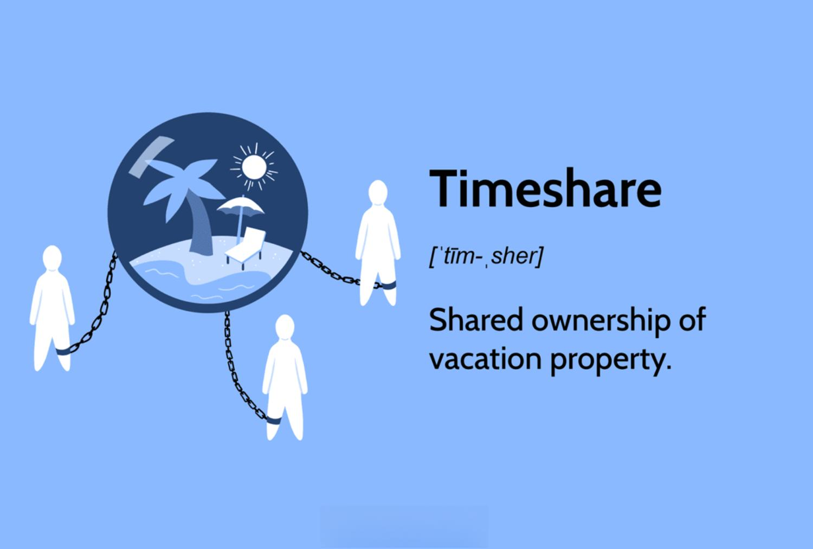

## Table of Contents

## What is a timeshare?

A timeshare is a type of vacation ownership where you buy the right to use a property for a certain period each year. Instead of owning the whole property, you own a part of it, usually a week or two. This can be a good option if you like to go to the same place every year for your vacation. You pay for the timeshare once, and then you don't have to worry about booking a hotel every year.

Timeshares can be found in many popular vacation spots, like beaches, mountains, or cities. They often come with amenities like pools, gyms, and restaurants. However, there are also some things to think about before buying a timeshare. They can be expensive, and it can be hard to sell them if you change your mind later. Also, you have to pay yearly maintenance fees, which can add up over time.

## How does a timeshare work as a vacation investment?

A timeshare can be seen as a vacation investment because you pay for it once and then you get to use it every year. This can save you money if you always go to the same place for your vacation. Instead of paying for a hotel each time, you just use your timeshare. It's like owning a little piece of a vacation home that you can use whenever you want.

However, there are some things to think about before buying a timeshare as an investment. They can be expensive to buy at first, and you also have to pay yearly fees to keep it up. These fees can go up over time. Also, if you decide you don't want the timeshare anymore, it can be hard to sell it. So, while a timeshare can be a good way to save money on vacations, it's important to think about all the costs and if you will really use it every year.

## What are the different types of timeshares available?

There are a few different types of timeshares you can choose from. The most common type is called a fixed week timeshare. This means you own the right to use the timeshare during the same week every year. For example, you might own the third week of July every year. Another type is called a floating week timeshare. With this, you can choose which week you want to use your timeshare, but you have to book it in advance and it depends on what weeks are available.

Another type of timeshare is called a points-based timeshare. Instead of owning a specific week, you own points that you can use to book time at different places. This can give you more flexibility because you can use your points to go to different locations or at different times of the year. Lastly, there are fractional ownership timeshares. These are more like owning a part of a home, where you own a bigger piece of the property and can use it for longer periods, like a month or more each year.

## What are the initial costs associated with purchasing a timeshare?

The first cost you'll face when buying a timeshare is the purchase price. This can be pretty high, sometimes costing thousands of dollars. It's like buying a small piece of a vacation home. The price can change depending on where the timeshare is, how nice it is, and when you get to use it. Timeshares in popular places like beaches or ski resorts might cost more than ones in less popular spots.

On top of the purchase price, there are other costs to think about. You'll usually have to pay closing costs, which are fees for finishing the purchase. These can add a few hundred dollars to your total cost. There might also be a sales commission if you buy through a salesperson. And don't forget about taxes. Just like buying a house, you'll have to pay taxes on your timeshare. All these costs together can make the initial price of a timeshare a lot higher than you might expect.

## What ongoing fees should be expected with timeshare ownership?

When you own a timeshare, you'll have to pay yearly maintenance fees. These fees help keep the place nice and pay for things like cleaning, fixing stuff, and keeping the pool clean. The cost can be different depending on where your timeshare is and how big it is. You might pay a few hundred dollars each year, and sometimes these fees can go up over time.

There might also be other fees to think about. Some timeshares have special assessment fees, which are extra costs if something big needs to be fixed, like the roof or the plumbing. If you're in a points-based timeshare, you might have to pay exchange fees if you want to use your points to stay somewhere else. All these fees can add up, so it's important to think about them when deciding if a timeshare is right for you.

## How can the value of a timeshare be assessed?

The value of a timeshare can be assessed by looking at a few things. First, think about where the timeshare is located. Timeshares in popular vacation spots, like beaches or ski resorts, might be worth more than ones in less popular places. Also, consider the time of year you can use the timeshare. Weeks during peak vacation times, like summer or holidays, are usually more valuable. The size and quality of the timeshare also matter. A bigger, nicer timeshare will be worth more than a smaller, older one.

Another way to assess the value is by looking at the market. You can check what similar timeshares are selling for. Websites and resale companies can give you an idea of the current market value. Remember, timeshares often lose value over time, so they might be worth less than what you paid for them. Also, think about the ongoing costs like maintenance fees. These costs can affect how much someone is willing to pay for your timeshare. By considering all these factors, you can get a good idea of what your timeshare is worth.

## What are the pros and cons of investing in a timeshare?

Investing in a timeshare can have some good points. It's like owning a little piece of a vacation home that you can use every year. This can save you money if you always go to the same place for your vacation. Instead of paying for a hotel each time, you just use your timeshare. It can also be nice because timeshares often come with amenities like pools, gyms, and restaurants. If you like having a home away from home and always going to the same spot, a timeshare might be a good choice.

However, there are also some downsides to think about. Timeshares can be expensive to buy at first, and you have to pay yearly maintenance fees, which can go up over time. If you decide you don't want the timeshare anymore, it can be hard to sell it. Timeshares often lose value, so you might not get back what you paid for it. Also, if you like to go to different places for your vacation, a timeshare might not be the best choice because it ties you to one spot. So, while a timeshare can be a good way to save money on vacations, it's important to think about all the costs and if you will really use it every year.

## How does the resale market for timeshares function?

The resale market for timeshares is a place where people who own timeshares can sell them to someone else. If you want to sell your timeshare, you can list it on websites that specialize in timeshare resales. These websites are like a big online store where people can look at different timeshares and see how much they cost. You might also work with a resale company that helps you sell your timeshare for a fee. The price you can get for your timeshare depends on where it is, how nice it is, and what time of year you can use it.

Selling a timeshare on the resale market can be hard. Timeshares often lose value over time, so you might not get back what you paid for it. Sometimes, people even give their timeshares away for free just to stop paying the yearly fees. If you're thinking about buying a timeshare on the resale market, you can find some good deals. But remember, you'll still have to pay those yearly fees, and it can be hard to sell the timeshare later if you change your mind. So, it's important to think about all the costs and if you'll really use the timeshare every year.

## What are the tax implications of owning a timeshare?

When you buy a timeshare, you have to think about taxes. When you first buy it, you might have to pay sales tax, just like you do when you buy other things. The amount of sales tax depends on where the timeshare is. Also, if you ever sell your timeshare, you might have to pay capital gains tax if you make a profit. But, because timeshares usually lose value over time, you might not have to worry about this tax.

You also have to pay yearly maintenance fees for your timeshare, and sometimes you can deduct these fees from your taxes. But, you can only do this if you rent out your timeshare and use it for business. If you just use it for your own vacations, you can't deduct the fees. It's a good idea to talk to a tax professional to understand all the tax rules about timeshares and make sure you're doing everything right.

## How do timeshares compare to other vacation investment options like vacation rentals or second homes?

Timeshares, vacation rentals, and second homes are all ways to invest in vacations, but they work differently. A timeshare lets you own a part of a property that you can use for a certain time each year. It's good if you like going to the same place every year and want to save money on hotels. But timeshares can be expensive to buy and you have to pay yearly fees. Also, they can be hard to sell if you change your mind.

Vacation rentals are when you rent out a place for your vacation. You don't own it, so you don't have to worry about maintenance fees or losing money if the place loses value. It's more flexible because you can go to different places each time. But you have to pay for the rental every time you go on vacation, which can add up.

A second home is when you buy a whole house or apartment to use for vacations. This gives you the most freedom because you can use it whenever you want and for as long as you want. You can also rent it out when you're not using it to help pay for the costs. But second homes are very expensive to buy and maintain. You have to pay for things like taxes, insurance, and repairs, which can be a lot of money. So, it's important to think about how often you'll use it and if you can afford all the costs.

## What strategies can be used to maximize the return on a timeshare investment?

To get the most out of your timeshare, you should use it as much as you can. If you only use it for a week each year, you're not getting the full value. Try to go for longer stays or use it during different times of the year if your timeshare allows it. Some timeshares let you trade your week for time at other places, so you can go to different spots and make your vacation more fun. Also, if you're in a points-based system, you can save up points to use for longer stays or better places.

Another good way to make your timeshare more valuable is to rent it out when you're not using it. This can help you earn some money to cover the yearly fees. You can list your timeshare on rental websites and set a price that people will want to pay. Just make sure to check the rules of your timeshare because some don't allow renting. Also, keep an eye on the resale market. If you decide you don't want the timeshare anymore, selling it at the right time can help you get some of your money back, even if timeshares usually lose value over time.

## How have recent trends and economic factors affected the timeshare market?

Recent trends and economic factors have changed the timeshare market a lot. One big change is that people are traveling differently now. More people are taking short trips and going to different places instead of always going to the same spot. This has made timeshares less popular because they tie you to one place. Also, the internet has made it easier to find and book vacation rentals, which are often cheaper and more flexible than timeshares. Because of this, the resale market for timeshares has gotten bigger, but it's also harder to sell them because there are so many for sale.

Economic factors have also affected timeshares. When the economy is not doing well, people have less money to spend on vacations. This means fewer people are buying new timeshares, and it can be even harder to sell the ones they already own. The yearly fees for timeshares can go up, which makes them even less attractive when money is tight. But, when the economy is good, more people might be interested in timeshares again because they have more money to spend on vacations. So, the timeshare market goes up and down with the economy, and it's always changing because of how people travel and how much money they have.

## Is a Financial Assessment Necessary for Evaluating Timeshare Investments?

Understanding the financial implications of timeshare investments is essential for making sound financial decisions. A timeshare represents a shared ownership model where individuals have rights to use a property for a specific period each year. While timeshares offer the allure of vacationing in a luxurious setting, they come with various cost factors that require careful financial assessment.

### Cost Factors in Timeshare Investments

The primary cost factors associated with timeshare investments include upfront purchase costs and ongoing maintenance fees. The initial cost can range significantly based on the location, size, and luxury level of the property. This initial investment often forms the basis of any subsequent financial evaluation.

Maintenance fees, which are recurring annual costs, cover expenses related to the upkeep of the property, such as repairs, utilities, and property management. These fees can increase over time due to inflation and rising property maintenance costs, impacting the overall financial burden on the timeshare owner. It is crucial to consider these fees when evaluating the long-term affordability of a timeshare investment.

### Evaluating Return on Investment (ROI) for Timeshares

To evaluate the potential return on investment (ROI) of a timeshare, one must consider both financial returns and personal value derived from using the property. The formula for calculating ROI is:

$$
ROI = \frac{\text{Gains from investment} - \text{Cost of investment}}{\text{Cost of investment}} \times 100
$$

For timeshares, "Gains from investment" might include rental income, if the timeshare is rented out during unused periods, and the personal enjoyment or savings from not having to book separate hotel accommodations. However, calculating financial ROI is challenging because resale values for timeshares often depreciate, and rental markets vary greatly. Therefore, ROI should also [factor](/wiki/factor-investing) in intangible benefits, such as vacation quality and convenience.

### Importance of Location, Market Trends, and Exit Strategies

The location of a timeshare significantly influences its value and ROI potential. Properties in prime tourist destinations or areas with high demand for vacationing typically maintain or appreciate in value compared to less desirable locations. Monitoring market trends, such as tourism growth and real estate developments in the area, can provide insights into future value prospects.

Exit strategies are another critical aspect of financial assessment. The secondary market for timeshares can be restrictive due to limited demand and legal complexities, often resulting in lower resale values than anticipated. Therefore, understanding the potential challenges in selling or transferring ownership is vital for anyone considering a timeshare purchase.

In summary, a thorough financial assessment of timeshare investments involves analyzing upfront and ongoing costs, estimating potential ROI, and considering factors such as location, market trends, and feasible [exit](/wiki/exit-strategy) strategies. These evaluations help investors make smarter, more informed decisions about their vacation investment portfolios.

## What is Algorithmic Trading: A New Frontier for Investment Strategies?

Algorithmic trading is at the forefront of innovation in the financial markets, providing investors with cutting-edge tools to enhance their investment strategies, including those in the vacation real estate sector. By leveraging complex algorithms, traders can execute rapid transactions and utilize large data sets to make informed predictions. 

In the context of vacation real estate, algorithms can analyze various data points — such as historical pricing, occupancy rates, and market trends — to predict future market movements. This predictive capability enables more strategic decision-making, allowing investors to capitalize on potential opportunities and mitigate risks. For instance, a predictive model could use time series analysis to forecast vacation property prices based on seasonal demand fluctuations and external economic indicators.

The optimization of investment portfolios through [algorithmic trading](/wiki/algorithmic-trading) involves employing strategies that maximize returns while minimizing risks. This may be achieved by diversifying investments across different asset classes or geographies. Algorithms can undertake this complex analysis by evaluating variables like correlation matrices and expected returns. The Markowitz Mean-Variance optimization framework, for instance, is a method that can be used to balance portfolio risk and return, represented mathematically by:

$$
\text{Minimize: } \sigma^2_p = w^T \Sigma w
$$
$$
\text{Subject to: } \sum_{i=1}^{n} w_i \cdot \mu_i = \mu_p
$$

where $\sigma^2_p$ is the portfolio variance, $w$ is the vector of asset weights, $\Sigma$ is the covariance matrix of asset returns, and $\mu_p$ is the expected portfolio return.

Moreover, algorithmic trading helps in risk management by enabling the continuous monitoring of various risk factors and automating response strategies. For instance, it can trigger automatic rebalancing of portfolios when certain thresholds are breached, adhering to predefined risk management protocols.

However, reliance on algorithms for financial decisions introduces several ethical and functional implications. Ethical concerns encompass the transparency of algorithmic processes and the potential for biased outcomes resulting from flawed data sets or assumptions. Functionally, the dependence on computer-driven models can lead to systemic risks, where software glitches or unexpected market events might cause erratic behaviors in automated trading systems. 

While algorithmic trading offers transformative benefits, a cautious approach is necessary to harness its full potential in the vacation real estate sector. The responsible application of these technological tools can significantly refine investment strategies, positioning investors to navigate the intricacies of the market more effectively.

## References & Further Reading

[1]: Bergstra, J., Bardenet, R., Bengio, Y., & Kégl, B. (2011). ["Algorithms for Hyper-Parameter Optimization."](https://dl.acm.org/doi/10.5555/2986459.2986743) Advances in Neural Information Processing Systems 24.

[2]: ["Advances in Financial Machine Learning"](https://www.amazon.com/Advances-Financial-Machine-Learning-Marcos/dp/1119482089) by Marcos Lopez de Prado

[3]: ["Evidence-Based Technical Analysis: Applying the Scientific Method and Statistical Inference to Trading Signals"](https://www.semanticscholar.org/paper/Evidence-Based-Technical-Analysis%3A-Applying-the-and-Aronson/3b33df8737f1772e9e14d66a08c9696f140a2ee1) by David Aronson

[4]: ["Machine Learning for Algorithmic Trading"](https://github.com/stefan-jansen/machine-learning-for-trading) by Stefan Jansen

[5]: ["Quantitative Trading: How to Build Your Own Algorithmic Trading Business"](https://books.google.com/books/about/Quantitative_Trading.html?id=j70yEAAAQBAJ) by Ernest P. Chan