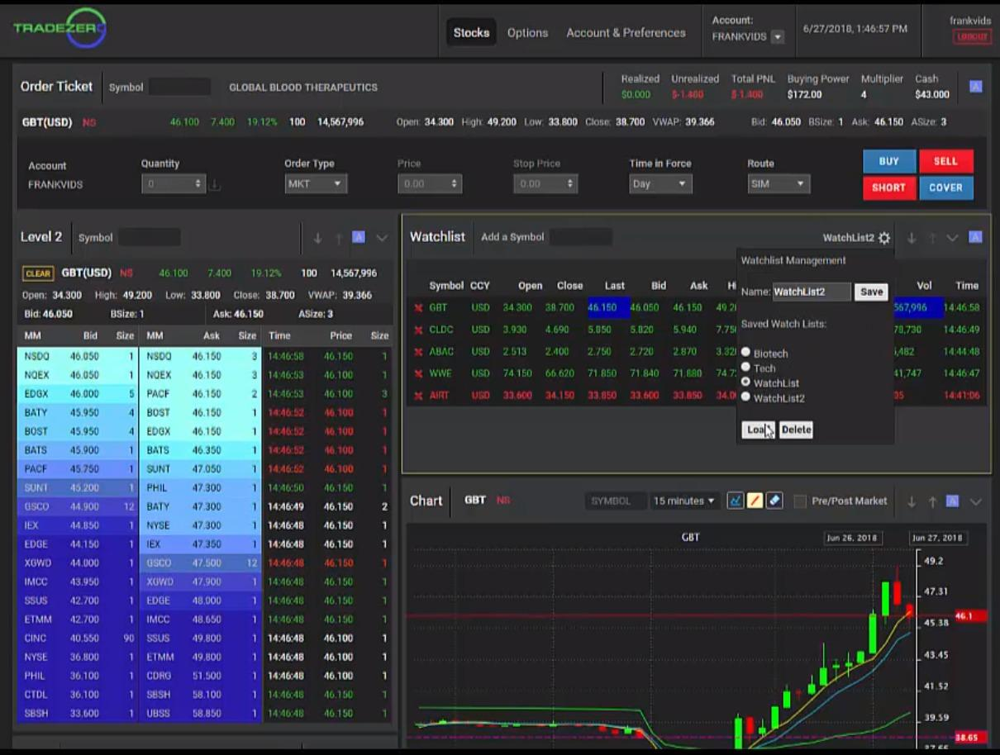

## Table of Contents

## What is TradeZero and what are its main features?

TradeZero is a trading platform that helps people buy and sell stocks easily. It is popular among traders who like to trade quickly and often. The platform is known for its low fees and good customer service. TradeZero is available on computers and mobile devices, so you can use it wherever you are.

One of the main features of TradeZero is its short selling tool. This lets traders borrow stocks and sell them, hoping to buy them back later at a lower price. Another important feature is the platform's real-time data and charts. These help traders make smart decisions by showing them what is happening in the market right away. TradeZero also offers a practice account, where people can try trading without using real money.

Overall, TradeZero is designed to be user-friendly and efficient. It has tools that help both new and experienced traders. Whether you want to trade stocks, options, or do short selling, TradeZero provides the features you need to do it well.

## How does TradeZero compare to other trading platforms for beginners?

TradeZero is a good choice for beginners because it is easy to use and has low fees. The platform has a practice account where new traders can learn without risking real money. This can help beginners feel more comfortable before they start trading with real money. TradeZero also has good customer support, so if beginners have questions, they can get help easily. The real-time data and charts on TradeZero are simple to understand, which helps beginners make better trading decisions.

Compared to other platforms like Robinhood or E*TRADE, TradeZero stands out with its focus on short selling. This feature might be more complex for beginners, but TradeZero makes it easier to understand. Robinhood is also user-friendly and has no commission fees, which is great for beginners. However, it does not offer a practice account like TradeZero. E*TRADE, on the other hand, has more educational resources and tools, which can be helpful for beginners who want to learn more about trading. But E*TRADE's fees can be higher than TradeZero's, which might be a downside for new traders trying to keep costs low.

## What are the account types available on TradeZero?

TradeZero offers two main types of accounts: a cash account and a margin account. A cash account is simple and lets you trade with the money you put into it. You can only use the money you have in the account to buy stocks. This type of account is good for beginners who want to start trading without borrowing money.

A margin account lets you borrow money from TradeZero to buy more stocks than you could with just your own money. This can help you make more trades, but it also comes with more risk because you have to pay back the borrowed money. Margin accounts are good for experienced traders who understand the risks and want to trade more actively.

## How can one set up and start trading with a TradeZero account?

To set up a TradeZero account, first visit their website and click on the "Open an Account" button. You will need to fill out an application form with your personal information, like your name, address, and social security number. After submitting the form, you will need to verify your identity by uploading documents like a driver's license or passport. Once TradeZero approves your application, you can fund your account. You can do this by transferring money from your bank account, and it usually takes a few days for the money to show up in your TradeZero account.

Once your account is funded, you can start trading. If you are new to trading, it's a good idea to start with the practice account, where you can trade with fake money to learn how the platform works. When you feel ready, you can switch to trading with real money. On the TradeZero platform, you can buy and sell stocks, options, and even do short selling. The platform has tools like real-time data and charts to help you make smart trading decisions. If you have any questions, TradeZero's customer support team is there to help you.

## What are the fees and commissions associated with TradeZero?

TradeZero charges different fees depending on what you do on their platform. For trading stocks, TradeZero has a commission of $0.005 per share, with a minimum of $1.99 per trade. This means if you buy or sell 100 shares, you will pay at least $1.99. For options trading, there is a commission of $0.75 per contract. If you want to use a margin account, TradeZero charges a margin [interest rate](/wiki/interest-rate-trading-strategies), which can change and depends on how much you borrow. There are also fees for short selling, like a stock borrow fee that can vary from day to day.

Some other fees you might see on TradeZero include a fee for transferring your account to another broker, which is $75. There is also an inactivity fee of $50 if you don't make any trades for six months. If you need to use the customer support line, there might be a fee for that too, depending on how you contact them. It's important to read TradeZero's fee schedule carefully so you know what to expect and can plan your trading accordingly.

## Can you explain the trading tools and resources provided by TradeZero?

TradeZero offers many tools and resources to help you trade better. One important tool is the real-time data and charts. These show you what is happening in the market right now, so you can make smart choices about buying and selling stocks. The platform also has a feature called Level 2 quotes, which shows you more details about the prices people are willing to buy and sell at. This can help you understand the market better and make better trades. TradeZero also lets you set up alerts, so you get notified when a stock reaches a price you are interested in. This can help you act quickly and not miss out on trading opportunities.

Another useful resource is the practice account. This lets you trade with fake money, so you can learn how to use the platform without risking real money. It's a great way for beginners to get comfortable with trading. TradeZero also has a tool for short selling, which lets you borrow stocks and sell them, hoping to buy them back later at a lower price. This can be a bit tricky, but TradeZero makes it easier with clear instructions and tools. If you ever need help, TradeZero's customer support team is there to answer your questions and guide you through the platform.

## How effective is TradeZero's customer support and educational resources?

TradeZero's customer support is very good. They have a team ready to help you with any questions or problems you have. You can reach them by phone, email, or live chat. Many people say that TradeZero's support team is quick to respond and helpful. This is important for new traders who might need a lot of guidance as they learn to use the platform. If you run into any issues or just need advice, TradeZero's support is there to make sure you can keep trading without too much trouble.

TradeZero also offers some educational resources, but they could be better. They have a section on their website with some articles and guides about trading. These can help you understand basic things like how to buy and sell stocks or what short selling is. However, compared to other platforms, TradeZero's educational content is not as detailed or extensive. If you are new to trading, you might need to look for more resources outside of TradeZero to learn everything you need to know. Still, the practice account is a great way to learn by doing, which can be very helpful for beginners.

## What are the pros and cons of using TradeZero for day trading?

TradeZero is a good choice for [day trading](/wiki/day-trading-spy) because it has low fees and fast trading tools. The commission for trading stocks is just $0.005 per share, with a minimum of $1.99 per trade. This can save you a lot of money if you trade a lot during the day. TradeZero also has real-time data and charts, which are very important for day traders who need to make quick decisions. The short selling tool is another big plus, as it lets you borrow stocks and sell them, hoping to buy them back at a lower price later in the day. Plus, TradeZero's customer support is great, so if you have any questions or problems while trading, you can get help fast.

However, there are some downsides to using TradeZero for day trading. The educational resources are not as good as some other platforms, so if you are new to day trading, you might need to look elsewhere to learn more about it. Also, there are some extra fees you should know about, like the inactivity fee if you don't trade for six months, and fees for transferring your account or using customer support. These can add up if you're not careful. Lastly, while the practice account is helpful for learning, it's not the same as trading with real money, so you might feel a bit different when you start trading for real.

## How does TradeZero handle order execution and what are its speed and reliability?

TradeZero is known for fast and reliable order execution. When you place an order to buy or sell a stock, TradeZero's system works quickly to make sure your order goes through as fast as possible. This is very important for day traders who need to act fast to make the best trades. TradeZero uses advanced technology to keep things running smoothly, so you can trust that your orders will be executed without many delays. Many users say that TradeZero's speed is one of the best things about it, which helps them feel confident when they trade.

While TradeZero does a good job most of the time, there can be some issues during very busy trading times. If a lot of people are trading at once, like when there's big news about a stock, the system might slow down a bit. This can happen with any trading platform, not just TradeZero. But overall, TradeZero's order execution is fast and reliable enough for most traders. If you ever have a problem with an order, their customer support team is there to help you fix it quickly.

## What advanced features does TradeZero offer for experienced traders?

TradeZero has many advanced features that experienced traders like. One of the main ones is the short selling tool. This lets traders borrow stocks and sell them, hoping to buy them back later at a lower price. It's a bit tricky, but TradeZero makes it easy to use. They also have Level 2 quotes, which show more details about the prices people are willing to buy and sell at. This can help experienced traders understand the market better and make smarter trades. Another useful feature is the ability to set up alerts, so you get notified when a stock reaches a certain price. This can help you act quickly and not miss out on trading opportunities.

TradeZero also offers margin accounts, which let experienced traders borrow money to buy more stocks than they could with just their own money. This can help them make more trades, but it also comes with more risk because they have to pay back the borrowed money. The platform's real-time data and charts are also very important for experienced traders. They show what is happening in the market right away, so traders can make quick decisions. If you ever need help with these advanced features, TradeZero's customer support team is there to answer your questions and guide you through the platform.

## How does TradeZero comply with regulatory requirements and ensure security?

TradeZero takes following the rules and keeping your information safe very seriously. They are registered with the Financial Industry Regulatory Authority (FINRA) and the Securities Investor Protection Corporation (SIPC). This means they follow the rules set by these organizations to protect traders. TradeZero also uses strong security measures like encryption to keep your personal and financial information safe. They have systems in place to watch for any strange activity and make sure that only you can access your account.

Besides following the rules and keeping your data safe, TradeZero also makes sure that your money is protected. They have insurance through SIPC, which can cover up to $500,000 if something goes wrong. TradeZero also works with well-known banks to keep your money safe. If you ever have any questions about how TradeZero keeps things safe and follows the rules, their customer support team is always ready to help you understand.

## What are user experiences and expert reviews saying about TradeZero's performance and reliability?

Many users and experts say good things about TradeZero's performance and reliability. People like how fast the platform is and how well it works for trading. Day traders often say that TradeZero's speed helps them make quick decisions without delays. Experts also praise TradeZero's customer support, saying it's easy to get help when you need it. The low fees are another big plus that many users mention, as it helps them save money on their trades.

However, there are some things that users and experts point out as areas for improvement. Some people say that TradeZero's educational resources could be better. New traders might need to look elsewhere to learn more about trading. There are also some complaints about extra fees, like the inactivity fee if you don't trade for six months. During very busy trading times, a few users have mentioned that the platform can slow down a bit. But overall, most users and experts agree that TradeZero is a reliable and effective platform for trading.

## References & Further Reading

[1]: Bergstra, J., Bardenet, R., Bengio, Y., & Kégl, B. (2011). ["Algorithms for Hyper-Parameter Optimization."](https://papers.nips.cc/paper/4443-algorithms-for-hyper-parameter-optimization) Advances in Neural Information Processing Systems 24.

[2]: ["Advances in Financial Machine Learning"](https://www.amazon.com/Advances-Financial-Machine-Learning-Marcos/dp/1119482089) by Marcos Lopez de Prado

[3]: ["Evidence-Based Technical Analysis: Applying the Scientific Method and Statistical Inference to Trading Signals"](https://www.wiley.com/en-us/Evidence+Based+Technical+Analysis%3A+Applying+the+Scientific+Method+and+Statistical+Inference+to+Trading+Signals-p-9780470008744) by David Aronson

[4]: ["Machine Learning for Algorithmic Trading"](https://github.com/PacktPublishing/Machine-Learning-for-Algorithmic-Trading-Second-Edition) by Stefan Jansen

[5]: ["Quantitative Trading: How to Build Your Own Algorithmic Trading Business"](https://www.amazon.com/Quantitative-Trading-Build-Algorithmic-Business/dp/0470284889) by Ernest P. Chan