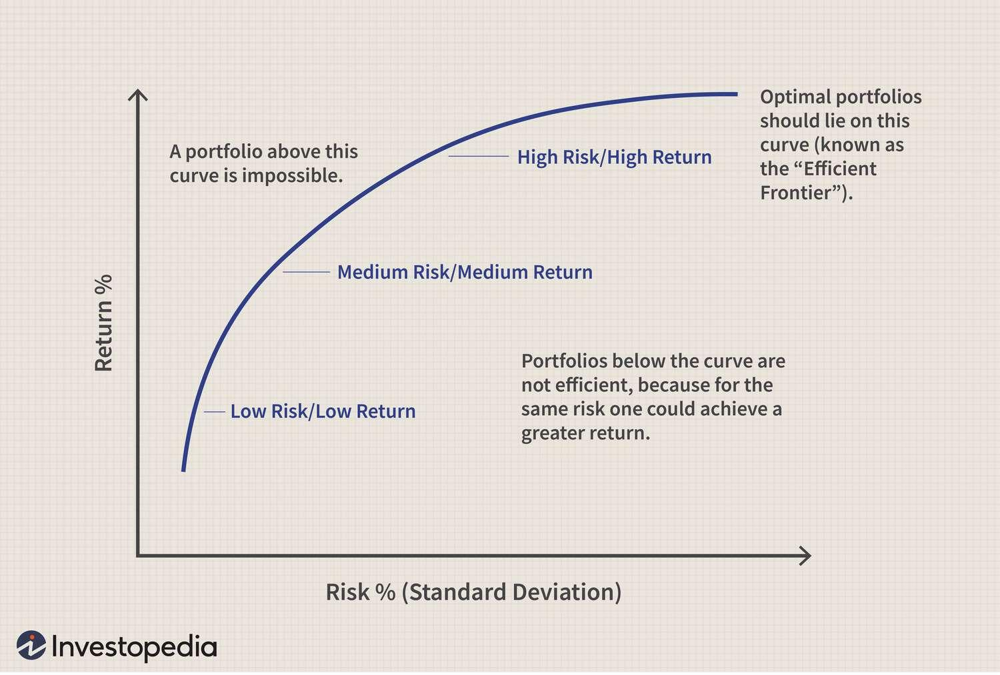

Financial risk refers to the possibility of losing financial resources due to changes in the market, which can affect the value of assets or investments. In trading, understanding and managing financial risk is crucial as it directly impacts profitability and long-term success. Traders face several types of financial risks, including market risk, credit risk, and operational risk. Market risk arises from fluctuations in asset prices, interest rates, or currency exchange rates. Credit risk involves the potential for a loss when a counterparty fails to fulfill contractual obligations, while operational risk stems from failures in internal processes, people, or systems.

The risk-free rate is a fundamental concept in financial analysis, representing the theoretical return on an investment with zero risk. Typically associated with government bonds due to their low default risk, the risk-free rate serves as a benchmark for evaluating the attractiveness of riskier investments. It is crucial in calculating the cost of capital and assessing investment opportunities, guiding traders and investors in making informed decisions.

Return analysis is another essential component of trading, focusing on evaluating the performance of investments. It involves distinguishing between different types of returns, such as nominal vs. real returns and expected vs. actual returns. By utilizing metrics like Return on Investment (ROI), Compound Annual Growth Rate (CAGR), and Sharpe Ratio, traders assess the effectiveness of their strategies and make data-driven decisions to optimize returns.

Algorithmic trading has become an integral part of modern finance, where pre-programmed computer algorithms execute trades automatically based on predefined criteria. This method helps manage financial risks by reacting swiftly to market changes and reducing human error. Algorithmic trading offers numerous benefits, including increased speed, efficiency, and the ability to manage large trade volumes. However, it also presents challenges, such as the need for complex infrastructure and the potential for systemic risks.

This article discusses the interconnectedness of financial risk, risk-free rates, return analysis, and algorithmic trading in financial markets. It underscores the importance of understanding these elements for developing effective trading strategies and highlights how algorithmic trading can enhance risk management and profitability.

## Table of Contents

## Understanding Financial Risk

Financial risk refers to the possibility of losing money on an investment or business venture due to various factors affecting the financial markets. It is a key consideration for traders and investors, as it directly influences decision-making and strategy development. Financial risk is determined by the volatility and uncertainty inherent in the market, and effectively managing it is crucial for achieving financial objectives.

### Types of Financial Risks

1. **Market Risk**: This is the risk of losses in positions arising from movements in market prices. It includes systematic risk, which affects all investments across the board, such as changes in interest rates or inflation, and unsystematic risk, which is unique to a company or industry. Traders use techniques like diversification and hedging to manage market risk.

2. **Credit Risk**: Credit risk arises when a borrower fails to meet their obligations, leading to a potential loss for the lender. It is particularly significant for bond investors and banks. Tools like credit scoring, credit default swaps (CDS), and portfolio diversification are employed to mitigate credit risk. 

3. **Operational Risk**: This risk stems from failures in internal processes, people, systems, or external events. Operational risk can result in financial loss due to errors, system failures, fraud, or breaches. Companies employ risk assessment frameworks, implement stringent internal controls, and invest in technology to identify and mitigate operational risks.

### Assessment and Management of Financial Risks

Traders and investors assess financial risks using qualitative and quantitative analysis. Techniques such as scenario analysis, stress testing, and value-at-risk (VaR) models are commonly used. Scenario analysis evaluates the potential impact of various market conditions on investment portfolios. Stress testing simulates extreme market conditions to analyze portfolio robustness, while VaR provides a statistical measure of potential loss within a specified confidence interval.

Managing financial risk involves a combination of diversification, hedging, insurance, and the use of financial derivatives. Diversification reduces unsystematic risk by spreading investments across various asset classes, sectors, or geographies. Hedging involves taking offsetting positions in similar assets to reduce exposure, often using derivatives like options and futures. Insurance provides financial protection against specific risks, while derivatives allow for the management of risk by locking in prices or transferring risks to other parties.

### Key Strategies for Mitigating Financial Risk in Trading

Strategies for mitigating financial risk include:

- **Portfolio Diversification**: This strategy involves allocating investments across a variety of asset classes to minimize exposure to any single risk. By diversifying, investors can protect against significant losses due to specific sector downturns.

- **Hedging**: Traders use financial instruments like options, futures, and swaps to hedge against potential losses. For example, buying put options can protect against a decline in stock prices.

- **Risk Limitation and Stop-Loss Orders**: Setting predetermined levels to sell an asset to limit losses, known as stop-loss orders, can prevent excessive losses in volatile markets.

- **Risk-Adjusted Performance Metrics**: Using metrics like the Sharpe ratio, traders can assess returns adjusted for risk, aiding in evaluating the efficiency of an investment or trading strategy.

By understanding and addressing the various dimensions of financial risk, traders and investors can enhance their ability to safeguard capital and optimize returns.

## Exploring the Risk-Free Rate

The risk-free rate is a fundamental concept in financial analysis, representing the theoretical rate of return on an investment with zero risk. This rate is crucial as a benchmark against which the performance of other investments is measured. Typically, the risk-free rate is represented by the yield on government-issued securities, such as U.S. Treasury bills (T-bills), due to their low risk of default.

Government bonds are generally considered risk-free because they are backed by the issuing government's ability to tax its citizens and print its currency, reducing the likelihood of default. Among these, short-term government securities, like the T-bills in the United States, are often used because they possess minimal [interest rate](/wiki/interest-rate-trading-strategies) risk and [liquidity](/wiki/liquidity-risk-premium) risk compared to long-term bonds.

The risk-free rate plays a pivotal role in investment decision-making. It serves as a baseline return that investors expect from a completely safe investment. This expectation enables investors to gauge whether the additional risk associated with a potentially higher-yielding investment is justified. Additionally, the risk-free rate is a critical component in several financial models and formulas.

In capital asset pricing models (CAPM), the risk-free rate is ingrained in calculating the expected return on an asset. The CAPM formula is expressed as:

$$
E(R_i) = R_f + \beta_i (E(R_m) - R_f)
$$

where $E(R_i)$ is the expected return on the investment, $R_f$ is the risk-free rate, $\beta_i$ is the beta of the investment, and $E(R_m)$ is the expected market return. The risk-free rate sets the stage for the asset's additional risk premium, which compensates for market risk.

Moreover, the risk-free rate is integral to calculating the cost of capital, particularly the weighted average cost of capital (WACC), which defines a firm's cost of funding from both equity and debt. The cost of equity, often calculated using CAPM, and the cost of debt both depend on the risk-free rate. Accurately assessing these costs helps businesses in investment appraisals, allowing them to evaluate project returns against the minimum acceptable return rate, or hurdle rate, derived from their specific WACC.

For instance, investment appraisal methodologies such as Net Present Value (NPV) and Internal Rate of Return (IRR) utilize the risk-free rate to discount future cash flows, ensuring comparisons are made against a standard no-risk baseline. In this context, investment opportunities must yield returns that significantly exceed the risk-free rate to be considered viable, considering the inherent risk they [carry](/wiki/carry-trading).

In conclusion, the risk-free rate is a cornerstone measure within the financial markets, deeply influencing investment decisions and strategic evaluations regarding the cost of capital. Its importance remains undisputed in providing a reliable benchmark for comparing and assessing varying investment opportunities' potential returns against their associated risk levels.

## Return Analysis in Financial Trading

Return analysis in financial trading involves assessing the profitability and performance of trading activities. It serves as a critical component in evaluating the effectiveness of different trading strategies by determining the returns generated over a specific period. This analysis can differ significantly depending on the nature of the returns considered, as well as the metrics employed to quantify these returns.

There are several types of returns that traders and investors must navigate. Nominal returns refer to the actual observed returns on an investment without any adjustments. They represent the raw percentage change in the value of an investment over time. Real returns, on the other hand, adjust nominal returns for inflation, providing a more accurate measure of increasing purchasing power. The formula for real return ($R_r$) is:

$$
R_r = \frac{1 + R_n}{1 + i} - 1
$$

where $R_n$ is the nominal return and $i$ symbolizes the inflation rate.

Expected returns are anticipations of future gains based on historical data or probabilistic models, and are utilized by traders to forecast potential outcomes. Actual returns are the real profits or losses realized over a trading period. The comparison between expected and actual returns is fundamental in understanding the accuracy and performance of trading strategies.

Return analysis employs various metrics to quantify returns. Return on Investment (ROI) is a prominent metric, calculated as:

$$
\text{ROI} = \left(\frac{\text{Final Value of Investment} - \text{Initial Investment}}{\text{Initial Investment}}\right) \times 100\%
$$

This metric provides a simple measure of profitability by indicating the percentage increase (or decrease) of an investment's initial value.

The Compound Annual Growth Rate (CAGR) shows the mean annual growth rate of an investment over a specified time period longer than one year, assuming reinvestment of profits. The formula for CAGR is:

$$
\text{CAGR} = \left(\frac{\text{Ending Value}}{\text{Beginning Value}}\right)^{\frac{1}{n}} - 1
$$

where $n$ represents the number of years.

The Sharpe Ratio is another crucial metric, quantifying the risk-adjusted return. It is defined as:

$$
\text{Sharpe Ratio} = \frac{\text{Return of Portfolio} - \text{Risk-Free Rate}}{\text{Standard Deviation of Portfolio's Excess Return}}
$$

This ratio helps in evaluating whether a portfolio's returns are due to smart investment decisions or excessive risk.

The significance of return analysis lies in its capacity to evaluate and compare trading strategies. It enables traders to measure whether they are receiving adequate compensation for the risks taken, ensuring alignment with financial goals. An effective return analysis can inform decision-making by highlighting the strengths and weaknesses of different trading approaches, ultimately guiding traders towards more robust and profitable strategies.

## Algorithmic Trading and Risk Management

Algorithmic trading, often known as algo trading, involves the use of computer programs to execute trades automatically based on predetermined criteria. This practice has seen a significant surge in popularity in financial markets due to its capability to handle large volumes of trades with speed and precision beyond human reach. The automatic execution allows traders to act on opportunities swiftly, thereby optimizing the potential for profit and reducing the likelihood of human error.

Algorithms play a crucial role in both executing trades and managing financial risks. They can be programmed to analyze market conditions, such as price movements and trading volumes, and to identify patterns or [arbitrage](/wiki/arbitrage) opportunities that may indicate a profitable trade. Once these conditions are met, the algorithm triggers a trade without the need for human intervention. This not only allows for more efficient trade execution but also enables simultaneous management of multiple risk factors, such as market, credit, and liquidity risks, through diversification and hedging strategies.

One of the primary benefits of [algorithmic trading](/wiki/algorithmic-trading) in risk management is its ability to handle complex calculations and data analysis at speeds and volumes incomprehensible to the human mind. Algorithms can swiftly adjust trading strategies in response to market changes, thus minimizing potential losses. Additionally, the use of predictive analytics and [machine learning](/wiki/machine-learning) models can further enhance risk management by anticipating potential risks before they materialize. However, algorithmic trading is not without its challenges. The reliance on complex software and systems introduces risks associated with technology failures, system bugs, and cybersecurity threats. Moreover, poorly designed algorithms can exacerbate market [volatility](/wiki/volatility-trading-strategies), as evidenced by several 'flash crashes' where automated trading triggered large-scale sell-offs.

Several case studies highlight the effectiveness of algorithmic trading in risk mitigation. For example, a major investment bank implemented a machine learning-driven algorithm that adjusts its trading positions in response to changing market conditions. This system successfully reduced investment risk by adapting to forecasted market trends and external economic factors. Another instance is a [hedge fund](/wiki/hedge-fund-trading-strategies) that adopted an algorithmic trading model that integrates real-time data analytics and risk assessment tools, allowing it to navigate volatile markets more effectively and safeguard its portfolio against sudden downturns.

In conclusion, algorithmic trading presents both substantial opportunities and notable challenges in risk management. Its ability to process vast amounts of data promptly and reduce human error has made it an essential tool in modern finance. However, ensuring the reliability and stability of these algorithms is crucial to mitigate associated risks. The ongoing development and refinement of algorithmic models continue to shape the landscape of financial risk management, promising even more sophisticated approaches to managing financial risks in the future.

## Integrating Risk-Free Rate and Return Analysis in Algo Trading

Algorithmic trading systems are designed to incorporate the risk-free rate as a benchmark by using it as a foundational element in risk and return assessments. The risk-free rate, often derived from government securities like U.S. Treasury bills, is crucial in determining the opportunity cost of capital. These systems use the risk-free rate to calculate metrics such as the Sharpe Ratio, which evaluates excess return per unit of risk relative to the risk-free asset. This allows for optimized portfolio allocation and enhanced decision-making under uncertainty.

In algorithmic trading models, return analysis frameworks are integrated to evaluate the efficiency and performance of trading strategies. Various return metrics such as Return on Investment (ROI), Compound Annual Growth Rate (CAGR), and Expected Returns are systematically computed. Python libraries like NumPy and pandas are commonly utilized to handle and analyze large datasets, allowing for the efficient calculation of these metrics. For instance, the Sharpe Ratio can be expressed as:

$$
\text{Sharpe Ratio} = \frac{E[R] - R_f}{\sigma_R}
$$

where $E[R]$ represents the expected portfolio return, $R_f$ is the risk-free rate, and $\sigma_R$ is the standard deviation of the portfolio return.

Several algorithms have been developed to manage risk and generate returns effectively by leveraging return analysis and the risk-free rate. For example, mean-variance optimization algorithms focus on maximizing expected return for a given level of risk, often benchmarked against the risk-free rate. Reinforcement learning algorithms are also employed to dynamically adjust trading strategies based on real-time market data and historical performance, providing adaptive risk management and return optimization.

Looking to the future, the integration of risk-free rate and return analysis in algorithmic trading is expected to become more sophisticated with advancements in [artificial intelligence](/wiki/ai-artificial-intelligence) and machine learning. These technologies can process vast amounts of data to produce predictive analytics, further enhancing the precision of return forecasts and risk assessments. Emerging technologies such as quantum computing could revolutionize this field by exponentially increasing computational capabilities, thereby allowing for more complex models and simulations. As algorithmic trading evolves, the risk-free rate and return analysis will remain pivotal components in developing resilient, efficient trading strategies.

## Conclusion

This article has explored the interconnected domains of financial risk, risk-free rates, return analysis, and algorithmic trading, highlighting their significance in modern finance. Understanding financial risk is crucial for traders and investors as it allows them to identify, assess, and mitigate potential losses across various forms such as market, credit, and operational risks. By identifying these risks, stakeholders can employ effective strategies to protect their investments and optimize returns.

The concept of a risk-free rate serves as a fundamental benchmark in financial markets, offering a baseline for evaluating the attractiveness of other investments. It is essential for calculating the cost of capital and performing investment appraisals, thus guiding decision-making processes. Understanding and utilizing the risk-free rate in trading strategies helps investors align their portfolios with risk-adjusted returns.

Return analysis provides valuable insights into the performance of trading strategies, employing metrics like ROI, CAGR, and Sharpe Ratio to evaluate the efficiency and profitability of investments. Accurate return analysis allows traders to refine their strategies, ensuring alignment with their financial goals and risk appetite.

Algorithmic trading stands out as a transformative force in contemporary finance, dynamically integrating these concepts to enhance trading efficiency and manage financial risk. Algorithms enable precise execution of trades and facilitate sophisticated risk management strategies, providing a competitive edge in volatile markets. Despite the challenges inherent in algorithmic trading, such as technological dependencies and market anomalies, its benefits make it an indispensable tool for modern traders.

As we look towards the future, the integration of risk-free rate and return analysis in algorithmic trading models continues to evolve, promising further innovation and refinement of trading strategies. Readers are encouraged to incorporate these elements into their trading or investment plans, recognizing their collective impact on achieving robust, risk-adjusted returns in an increasingly complex financial landscape.

## References & Further Reading

[1]: Bergstra, J., Bardenet, R., Bengio, Y., & Kégl, B. (2011). ["Algorithms for Hyper-Parameter Optimization."](https://papers.nips.cc/paper/4443-algorithms-for-hyper-parameter-optimization) Advances in Neural Information Processing Systems 24.

[2]: ["Advances in Financial Machine Learning"](https://www.amazon.com/Advances-Financial-Machine-Learning-Marcos/dp/1119482089) by Marcos Lopez de Prado

[3]: ["Evidence-Based Technical Analysis: Applying the Scientific Method and Statistical Inference to Trading Signals"](https://www.amazon.com/Evidence-Based-Technical-Analysis-Scientific-Statistical/dp/0470008741) by David Aronson

[4]: ["Machine Learning for Algorithmic Trading"](https://github.com/stefan-jansen/machine-learning-for-trading) by Stefan Jansen

[5]: ["Quantitative Trading: How to Build Your Own Algorithmic Trading Business"](https://www.amazon.com/Quantitative-Trading-Build-Algorithmic-Business/dp/1119800064) by Ernest P. Chan