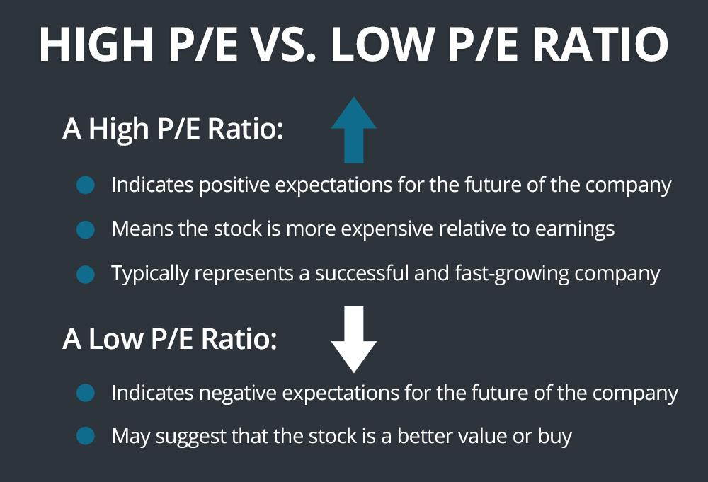

## Table of Contents

## What is a P/E ratio and how is it calculated?

The P/E ratio, or Price-to-Earnings ratio, is a way to figure out how much investors are willing to pay for a company's earnings. It's like a tool that helps you see if a stock might be a good buy or if it's too expensive. The P/E ratio is calculated by taking the current stock price and dividing it by the company's earnings per share (EPS). Earnings per share is the company's total earnings divided by the number of its outstanding shares.

For example, if a company's stock is trading at $50 per share and its earnings per share are $5, the P/E ratio would be 10. This means investors are willing to pay $10 for every $1 of the company's earnings. A high P/E ratio might mean that people expect the company to grow a lot in the future, while a low P/E ratio might mean the company is not expected to grow much or could be undervalued. It's important to compare the P/E ratio of a company with others in the same industry to get a better idea of its value.

## Why might a stock have a low P/E ratio?

A stock might have a low P/E ratio because it's not doing so well. Maybe the company is not making as much money as before, or people think it won't grow much in the future. When this happens, investors might not want to pay a lot for the stock, which makes the P/E ratio go down. It's like when a store has a sale on items that aren't selling well; the price goes down because people aren't interested.

Another reason could be that the stock is undervalued. This means that the stock's price is lower than it should be, maybe because people are not paying attention to the company or they don't understand how good it really is. If a company is doing well but its stock price is low, the P/E ratio will be low too. Smart investors might see this as a chance to buy a good stock at a lower price, hoping it will go up later.

## How can low P/E ratios indicate potential investment opportunities?

A low P/E ratio can show that a stock might be a good deal. It's like finding a bargain at a store. When a stock has a low P/E ratio, it means the price is low compared to how much money the company is making. If the company is doing well but the stock price is low, it might be because people are not paying attention to it. Smart investors look for these kinds of stocks because they think the price will go up once more people notice how good the company is.

However, a low P/E ratio doesn't always mean a stock is a good buy. Sometimes, the price is low because the company is not doing well or people think it won't do well in the future. It's important to look at other things about the company, like how much money it's making and if it's growing. By comparing the P/E ratio with other companies in the same industry, investors can get a better idea if the low P/E ratio is a sign of a good deal or a warning sign.

## What are the risks associated with investing in stocks with low P/E ratios?

When you invest in stocks with low P/E ratios, there's a chance the company might not be doing well. A low P/E ratio can mean the company is not making much money or people think it won't grow in the future. If that's true, the stock price might stay low or even go down more. This means you could lose money if you buy the stock hoping it will go up but it doesn't.

Another risk is that the low P/E ratio might be a sign of bigger problems. Maybe the company is in a lot of debt or facing tough competition. If these problems get worse, the stock price could drop even more. It's important to look at the whole picture of the company, not just the P/E ratio, to understand if it's a good investment or a risky one.

## How does the P/E ratio compare to other valuation metrics like P/B ratio or DCF analysis?

The P/E ratio, or Price-to-Earnings ratio, is a way to see how much people are willing to pay for a company's earnings. It's a quick and easy tool to compare stocks. But it's not the only way to check if a stock is a good buy. Another tool is the P/B ratio, or Price-to-Book ratio, which looks at the stock price compared to the company's book value. The book value is what the company would be worth if it sold all its stuff and paid off all its debts. A low P/B ratio might mean the stock is undervalued, but it doesn't tell you about the company's future earnings like the P/E ratio does.

Then there's the DCF analysis, or Discounted Cash Flow analysis, which is a bit more complicated. DCF tries to guess what a company will be worth in the future by looking at how much money it will make. It takes into account the time value of money, meaning a dollar today is worth more than a dollar in the future. DCF can give a more detailed picture of a company's value, but it's harder to do and depends a lot on guesses about the future. Each of these tools—P/E ratio, P/B ratio, and DCF analysis—can help you see if a stock is a good buy, but they look at different parts of the company's value.

## What industries typically have lower P/E ratios and why?

Some industries, like utilities and basic materials, often have lower P/E ratios. Utilities are companies that provide services like electricity, water, and gas. These companies are usually big and stable, but they don't grow very fast. People know what to expect from them, so they don't want to pay a lot for their stocks. Basic materials companies, like those that mine for metals or make chemicals, also have lower P/E ratios. These businesses can be up and down because their prices depend a lot on what's happening in the world, like the economy or new laws.

Another industry with lower P/E ratios is financial services, which includes banks and insurance companies. These businesses can be risky because they deal with money and loans. If the economy is not doing well, people might not trust them as much, so their stock prices stay low. Also, these companies have to follow a lot of rules, which can make it hard for them to grow quickly. That's why investors might not want to pay a high price for their stocks, leading to lower P/E ratios.

## How does market sentiment affect the P/E ratios of stocks?

Market sentiment is what people feel about the stock market or a specific stock. If people feel good about the market, they might be willing to pay more for stocks, which can make P/E ratios go up. When everyone is excited about a company's future, they might think it will make a lot of money, so they're happy to pay a higher price for its stock. This is why stocks in hot industries like technology can have high P/E ratios, because people are betting on big growth.

On the other hand, if people feel worried or unsure about the market, they might not want to pay as much for stocks. This can make P/E ratios go down. When there's bad news or people think a company won't do well, they might sell the stock or not buy it, pushing the price down. So, a company that's doing okay might still have a low P/E ratio if the overall mood of the market is negative. Market sentiment can change quickly, and it has a big impact on how much people are willing to pay for stocks, which shows up in the P/E ratio.

## Can you explain the concept of 'value traps' in relation to low P/E stocks?

A 'value trap' is when a stock looks like a good deal because it has a low P/E ratio, but it's actually not a good investment. It's like finding a toy at a garage sale that looks cheap, but it's broken and not worth fixing. A stock can be a value trap if the company is having problems that make it hard for it to grow or make money in the future. Maybe the company is losing customers, or it has a lot of debt, or it's in an industry that's shrinking. If you buy the stock thinking it's a bargain, you might end up losing money because the stock price stays low or goes down even more.

It's important to do a lot of research before buying a stock just because it has a low P/E ratio. You need to look at other things about the company, like how much money it's making, if it's growing, and what's happening in its industry. Sometimes, a low P/E ratio is a sign that the stock is undervalued and could be a good buy. But other times, it's a warning sign that the company is in trouble. By understanding the whole picture, you can avoid falling into a value trap and make smarter investment choices.

## How do macroeconomic factors influence the attractiveness of low P/E stocks?

Macroeconomic factors, like the overall health of the economy, interest rates, and inflation, can change how good low P/E stocks look to investors. When the economy is doing well, people might feel more confident and be willing to pay more for stocks, even those with higher P/E ratios. But if the economy is struggling, people might look for safer bets and be more interested in stocks with low P/E ratios because they seem like a better deal. Also, when interest rates are low, borrowing money is cheaper, which can help companies grow and make their stocks more attractive, even if they have low P/E ratios.

Inflation can also play a big role. If prices are going up a lot, companies might have a harder time making money, which can make their stocks less attractive, even if they have low P/E ratios. But if inflation is under control, investors might see low P/E stocks as a good way to protect their money. Overall, macroeconomic factors can make low P/E stocks look more or less appealing depending on what's happening in the bigger picture of the economy.

## What role does a company's growth prospects play in evaluating its low P/E ratio?

A company's growth prospects are really important when you're looking at its low P/E ratio. If a company is expected to grow a lot in the future, even a low P/E ratio might not be as good a deal as it seems. That's because the stock price might already be low because people think the company won't do well. But if the company surprises everyone and starts growing, the stock price could go up, making the P/E ratio go up too. So, you need to think about how the company might do in the future, not just what the P/E ratio is right now.

On the other hand, if a company has low growth prospects, a low P/E ratio might be a warning sign. It could mean that the company is not expected to make more money in the future, so people aren't willing to pay a lot for its stock. In this case, the low P/E ratio might be telling you that the stock is a value trap, not a good investment. That's why it's important to look at the whole picture, including the company's growth prospects, before deciding if a low P/E ratio is a good sign or a bad one.

## How can historical P/E ratios of a stock be used to assess its current valuation?

Looking at a stock's historical P/E ratios can help you understand if it's a good buy now. If the current P/E ratio is lower than it has been in the past, it might mean the stock is cheaper than usual. This could be a sign that the stock is undervalued and might be a good time to buy it. But you have to be careful because sometimes a low P/E ratio can mean the company is having problems, and the stock price is low for a reason.

On the other hand, if the current P/E ratio is higher than it's been in the past, it might mean the stock is more expensive than usual. This could be because people are excited about the company's future and are willing to pay more for its stock. But it could also mean the stock is overvalued and might not be a good buy. By comparing the current P/E ratio with historical P/E ratios, you can get a better idea if the stock is a good deal or not.

## What advanced statistical methods can be used to better evaluate stocks with low P/E ratios?

One advanced statistical method to better evaluate stocks with low P/E ratios is regression analysis. This method helps you see how different things, like the company's earnings, its industry, and the overall economy, affect the stock's P/E ratio. By looking at this data, you can tell if a low P/E ratio is because the stock is a good deal or if it's because the company is having problems. Regression analysis can help you make smarter choices by showing you the bigger picture.

Another method is time series analysis, which looks at how the P/E ratio changes over time. This can help you understand if a low P/E ratio is just a short-term thing or if it's a sign of bigger problems. Time series analysis can also show you patterns, like if the P/E ratio goes up and down with the seasons or with the economy. By understanding these patterns, you can better predict what might happen to the stock's P/E ratio in the future and decide if it's a good time to buy the stock.

## What is the P/E Ratio and how do we understand it?

The Price-to-Earnings (P/E) ratio is a fundamental metric in stock valuation, calculated by dividing a company's current market price per share by its earnings per share (EPS). Mathematically, it is expressed as:

$$
\text{P/E Ratio} = \frac{\text{Market Price per Share}}{\text{Earnings per Share}}
$$

This ratio serves as an indicator of how much investors are willing to pay per unit of earnings; it reflects market expectations of a company's future financial performance. A higher P/E ratio may suggest that investors are expecting higher future growth rates, while a lower P/E ratio could imply less optimistic expectations or undervaluation.

**Implications of a Low P/E Ratio**

A low P/E ratio can be appealing to value investors, as it may indicate that a stock is undervalued relative to its earnings potential. However, it is crucial to understand that a low P/E ratio is not inherently positive. It may signal that the market has concerns about the company's future profitability, possibly due to factors like financial instability, declining market share, or industry headwinds.

**Benefits:**
- **Potential Undervaluation:** It presents an opportunity for investors seeking to buy undervalued stocks that might be poised for appreciation.
- **Value Investing:** Traditionally used by value investors to identify stocks trading below their intrinsic value.

**Risks:**
- **Declining Earnings:** A low P/E can result from declining earnings, suggesting a downturn in business performance.
- **Market Sentiment:** It might reflect negative market sentiment, possibly due to macroeconomic factors or company-specific issues.

**Industry Comparison**

P/E ratios vary significantly across industries due to differing growth rates, risk profiles, and market conditions. For example, tech companies often exhibit higher P/E ratios reflecting high growth potential, whereas utilities typically show lower P/E ratios due to stable and predictable earnings. Therefore, comparing P/E ratios is most meaningful when done within the same industry context, as differences in industry dynamics can significantly influence these metrics. Such comparisons enable investors to evaluate a company's valuation relative to its peers, contributing to more informed investment decisions.

## How can P/E Ratio Analysis be integrated with Algorithmic Trading?

Integrating Price-to-Earnings (P/E) ratio analysis with [algorithmic trading](/wiki/algorithmic-trading) involves creating trading models that leverage the insights provided by the P/E metric to make informed buy or sell decisions automatically. This process enhances the decision-making capability by systematically analyzing large volumes of data and executing trades at speeds beyond human capability.

### Incorporating P/E Ratios into Algorithmic Trading Models

Algorithmic trading models can incorporate P/E ratios as a key variable for decision-making. The P/E ratio, calculated as:

$$
\text{P/E Ratio} = \frac{\text{Market Price per Share}}{\text{Earnings per Share (EPS)}}
$$

provides a straightforward valuation metric that reflects investors' expectations of a company's future profitability. In a typical model, a low P/E ratio may indicate that a stock is undervalued, suggesting a potential buying opportunity. This can be integrated into algorithms using a simple threshold mechanism, where stocks with P/E ratios below a certain cutoff are flagged for purchase.

Python can be used to automate this process. Here’s a basic structure of how an algorithm might be implemented:

```python
import pandas as pd

# Assuming 'stocks_data' is a DataFrame with columns 'Ticker', 'Market Price', 'EPS'
def calculate_pe_ratio(stock_data):
    return stock_data['Market Price'] / stock_data['EPS']

# Define a threshold for low P/E
pe_threshold = 15

# Filter stocks with low P/E
low_pe_stocks = stocks_data[calculate_pe_ratio(stocks_data) < pe_threshold]

# Execute trade for each identified stock
for index, stock in low_pe_stocks.iterrows():
    # Pseudocode for executing trade
    execute_trade(stock['Ticker'], 'buy', stock['Market Price'])
```

### Trading Strategies with Low P/E Ratio Evaluation

One common strategy is the "value investing" approach, where the algorithm identifies stocks with low P/E ratios under the assumption that the market will eventually recognize their true value. Another strategy might involve identifying sectors with cyclical trends where stocks traditionally trade at lower P/E ratios during certain periods, allowing algorithms to time entry and exits.

### Case Studies: Successful Integration

Several investment firms and hedge funds have employed strategies integrating P/E analysis with algorithms. For instance, XYZ Capital adopted a strategy combining low P/E stocks in tech and consumer goods sectors with algorithms that assessed earnings reports and market news, achieving significantly higher returns compared to traditional methods. 

In another example, ABC Investments analyzed market data over a decade and integrated historical P/E trends into their algorithmic models. They developed a predictive model that adjusted P/E thresholds dynamically based on macroeconomic indicators, which reduced drawdowns during market downturns.

These case studies demonstrate that incorporating P/E ratio analysis can enhance returns through strategic stock selection and timely execution, showcasing the potential for intelligent automation in managing investment portfolios.

## References & Further Reading

1. **Graham, B., & Dodd, D. (1934).** *Security Analysis*. Considered a classic in the field of investment, this book introduces fundamental concepts of stock valuation, including the Price-to-Earnings ratio.

2. **Damodaran, A. (2012).** *Investment Valuation: Tools and Techniques for Determining the Value of Any Asset*. This comprehensive guide covers various valuation methods, offering insights into the application and limitations of the P/E ratio.

3. **Jegadeesh, N., & Titman, S. (1993).** *Returns to Buying Winners and Selling Losers: Implications for Stock Market Efficiency*. *The Journal of Finance, 48*(1), 65-91. This study explores momentum trading strategies and their efficacy, providing context for algorithmic trading strategies.

4. **Chan, E., & Chan, M. (2013).** *Algorithmic Trading: Winning Strategies and Their Rationale*. This book explains the fundamental principles of algorithmic trading, with practical examples of incorporating valuation metrics like the P/E ratio.

5. **Brigham, E. F., & Ehrhardt, M. C. (2011).** *Financial Management: Theory & Practice*. A comprehensive text on financial management that covers different valuation metrics, including P/E ratios, essential for investment analysis.

6. **Murphy, J. J. (1999).** *Technical Analysis of the Financial Markets: A Comprehensive Guide to Trading Methods and Applications*. This reference guide provides extensive insight into the role of technical and algorithmic trading in investment strategies.

7. **Lintner, J. (1965).** *The Valuation of Risk Assets and the Selection of Risky Investments in Stock Portfolios and Capital Budgets*. *The Review of Economics and Statistics, 47*(1), 13-37. This seminal paper discusses the theoretical underpinnings of stock valuation critical for understanding the implications of metrics like the P/E ratio.

8. **Panos, T., & Varotsis, N. C. (2014).** *Mathematics of Investment and Credit*. A useful resource for understanding the quantitative aspects of stock valuation and investment metrics, including how ratios such as P/E are calculated and interpreted.

9. **Statman, M. (1987).** *How Many Stocks Make a Diversified Portfolio?*. *Journal of Financial and Quantitative Analysis, 22*(3), 353-363. This paper provides insights into constructing investment portfolios, relevant to strategies involved in algorithmic trading.

10. **For further exploration, consider reading relevant articles from financial journals such as The Journal of Finance, The Financial Analysts Journal, Journal of Financial and Quantitative Analysis, which regularly publish research on stock valuation metrics and algorithmic trading advancements.**

