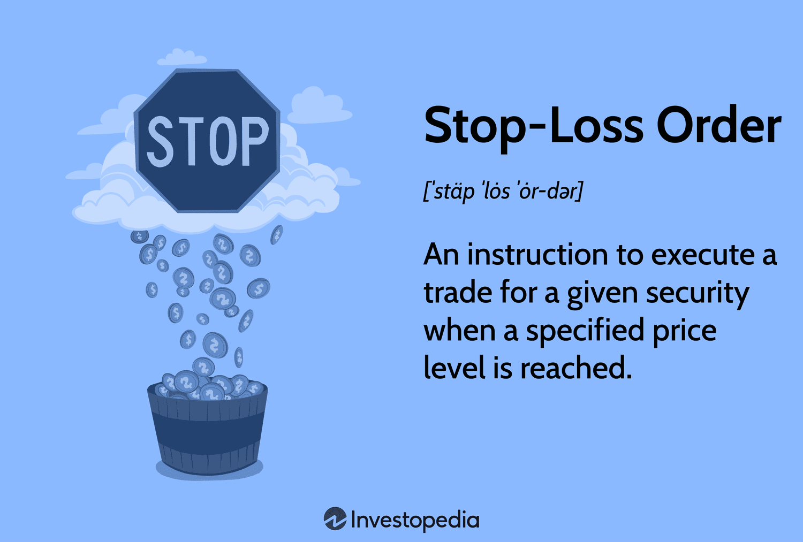

## Table of Contents

## What is a stop-loss order?

A stop-loss order is a tool that investors use to limit their losses when trading stocks, currencies, or other financial assets. It works by setting a specific price at which an asset will be automatically sold if its value drops to that level. This helps protect the investor from losing more money than they are willing to risk on a particular investment.

For example, if you buy a stock at $50 and set a stop-loss order at $45, the stock will be sold automatically if its price falls to $45. This means you would only lose $5 per share, instead of potentially losing more if the stock keeps falling. Stop-loss orders are popular because they help manage risk and can prevent emotional decision-making during volatile market conditions.

## What are ETFs and how do they work?

ETFs, or Exchange-Traded Funds, are a type of investment that combines the benefits of stocks and mutual funds. They are like baskets that hold a collection of assets, such as stocks, bonds, or commodities. You can buy and sell ETFs on a stock exchange, just like you would with individual stocks. This makes them easy to trade and gives you the flexibility to buy or sell them at any time during the trading day.

ETFs work by tracking an index, like the S&P 500, or a specific sector, like technology. When you invest in an [ETF](/wiki/etf-trading-strategies), you are essentially investing in all the assets that make up that index or sector. The value of the ETF goes up or down based on the performance of the assets it holds. This allows you to diversify your investments easily, as you can get exposure to a wide range of assets with just one purchase. Plus, ETFs often have lower fees than mutual funds, making them a cost-effective way to invest.

## How can stop-loss orders be used with ETFs?

Stop-loss orders can be used with ETFs just like they are used with individual stocks. If you buy an ETF and want to limit your potential losses, you can set a stop-loss order at a specific price. For example, if you buy an ETF at $100 and set a stop-loss order at $90, the ETF will be automatically sold if its price drops to $90. This helps you manage risk by capping the amount you could lose if the ETF's value goes down.

Using stop-loss orders with ETFs can be particularly useful because ETFs often track a broad market or sector. If you're investing in an ETF that follows a volatile market, setting a stop-loss order can protect your investment from big drops. It's a way to stay invested in the market while having a safety net in place to limit your losses. Just remember, while stop-loss orders can help manage risk, they don't guarantee you won't lose money, and they can sometimes lead to selling your ETF at a lower price than you might have wanted if the market quickly recovers.

## What are the benefits of using stop-loss orders with ETFs?

Using stop-loss orders with ETFs can help you limit how much money you might lose. When you buy an ETF, you can set a stop-loss order at a certain price. If the ETF's price drops to that level, it will be sold automatically. This means you won't lose more than you're willing to, even if the ETF's value keeps going down. It's like having a safety net that protects your investment from big drops.

Stop-loss orders are especially helpful with ETFs because ETFs often follow a whole market or a specific sector. These markets can be up and down a lot, so having a stop-loss order can give you peace of mind. You can stay invested without worrying too much about sudden drops in value. Just remember, while stop-loss orders can help, they don't promise you won't lose money, and sometimes you might sell the ETF at a lower price than you wanted if the market bounces back quickly.

## What are the potential risks and drawbacks of using stop-loss orders with ETFs?

Using stop-loss orders with ETFs can have some risks. One big risk is that the market can be very up and down. If you set a stop-loss order, your ETF might get sold at a low price during a quick drop, even if it goes back up right after. This means you could miss out on the ETF going up again because you sold it too soon. Another risk is that stop-loss orders don't always work perfectly. Sometimes, if there's a big drop in the market, your ETF might be sold at an even lower price than your stop-loss level because there aren't enough buyers at that price.

Another drawback is that stop-loss orders can make you sell your ETFs more often than you might want. Every time you sell and buy back, you might have to pay fees and taxes, which can add up and eat into your profits. Also, setting a stop-loss order too tight might mean you sell your ETF even if it's just a small, normal drop in price. This can lead to a lot of buying and selling, which might not be good for your overall investment strategy. So, while stop-loss orders can help limit your losses, they also come with these potential risks and drawbacks that you should think about.

## How do you set an appropriate stop-loss level for an ETF?

Setting an appropriate stop-loss level for an ETF depends on how much risk you're willing to take and how the ETF has been acting in the market. First, think about how much money you're okay with losing on this investment. If you buy an ETF at $100, and you're okay with losing $10, then you might set your stop-loss at $90. This way, if the ETF's price drops to $90, it will be sold automatically, and you won't lose more than $10 per share.

Next, look at how the ETF has been moving in the market. Some ETFs go up and down a lot, while others are more steady. If your ETF usually moves a lot, you might want to set your stop-loss a bit further away from the current price to avoid selling it during normal ups and downs. For example, if the ETF often changes by $5 in a day, setting your stop-loss at $95 instead of $90 might be better. This gives the ETF some room to move without triggering the stop-loss too soon. Remember, finding the right stop-loss level is about balancing the risk of losing money with the chance of missing out on gains if the ETF's price bounces back quickly.

## What are the different types of stop-loss orders and how do they apply to ETFs?

There are a few types of stop-loss orders that you can use with ETFs. The first one is a standard stop-loss order. This is the simplest kind where you set a specific price, and if the ETF's price drops to that level, it gets sold automatically. For example, if you buy an ETF at $100 and set a stop-loss at $90, it will be sold if the price hits $90. Another type is a stop-limit order. With this, you set two prices: the stop price and the limit price. When the ETF hits the stop price, it turns into a limit order to sell at the limit price or better. So, if you set a stop price at $90 and a limit price at $89, the ETF will only be sold if it can be sold for $89 or more once it hits $90.

The third type is a trailing stop order. This one is a bit different because it moves with the ETF's price. You set a percentage or dollar amount below the current price, and if the ETF drops by that amount, it gets sold. For example, if you set a 5% trailing stop on an ETF bought at $100, the stop-loss price starts at $95. If the ETF goes up to $110, the stop-loss moves up to $104.50, always staying 5% below the highest price the ETF reached. Each type of stop-loss order has its own way of helping you manage risk with ETFs, and which one you choose depends on what you're comfortable with and how you want to handle your investments.

## Can stop-loss orders protect against market gaps and volatility in ETFs?

Stop-loss orders can help protect your investment in ETFs, but they don't always work perfectly when the market has big gaps or is very up and down. A market gap happens when the price of an ETF jumps from one price to another without trading in between. If the ETF's price gaps below your stop-loss level, it might get sold at an even lower price than you set because there aren't enough buyers at your stop-loss price. This means you could lose more money than you planned.

Volatility, or big ups and downs in the market, can also make stop-loss orders less effective. If the ETF's price drops quickly and then goes back up, your stop-loss might trigger and sell your ETF at a low price, even though the price recovers soon after. This can be frustrating because you might miss out on the ETF going up again. So, while stop-loss orders can help limit your losses, they don't always protect you completely from market gaps and [volatility](/wiki/volatility-trading-strategies).

## How does the choice of ETF affect the effectiveness of stop-loss orders?

The type of ETF you choose can make a big difference in how well stop-loss orders work. Some ETFs follow markets or sectors that move a lot, like technology or small-cap stocks. These ETFs can go up and down quickly, which means your stop-loss order might get triggered even if it's just a normal drop in price. If you set your stop-loss too close to the current price, you might sell your ETF at a low point and miss out on it going back up. On the other hand, if you choose an ETF that tracks a more stable market, like a broad market index, your stop-loss order might work better because the price doesn't jump around as much.

Another thing to think about is how liquid the ETF is. Liquidity means how easy it is to buy and sell the ETF without changing its price too much. If you pick an ETF that's not very liquid, your stop-loss order might not work as well during big market drops. When the price falls fast, there might not be enough buyers at your stop-loss price, so your ETF could get sold at an even lower price. So, choosing an ETF that's more liquid and less volatile can help make your stop-loss orders more effective in protecting your investment.

## What advanced strategies involve stop-loss orders and ETFs?

One advanced strategy that involves stop-loss orders and ETFs is called dollar-cost averaging with a trailing stop-loss. When you use dollar-cost averaging, you invest a fixed amount of money in an ETF at regular times, no matter what the price is. This helps smooth out the ups and downs of the market over time. To add a layer of protection, you can set a trailing stop-loss order. This type of stop-loss moves up as the ETF's price goes up, but if the price drops by a set percentage or amount, it triggers a sale. This way, you can keep buying the ETF at different prices and still have a safety net to limit your losses if the market takes a big dip.

Another strategy is using stop-loss orders with sector rotation. In this approach, you invest in ETFs that focus on different sectors of the economy, like technology, healthcare, or energy. You can set stop-loss orders on these ETFs to protect your investments from big drops. As the economy changes, some sectors might do better than others. By watching how each sector is doing, you can move your money from one ETF to another, always keeping stop-loss orders in place. This way, you can try to catch the best-performing sectors while using stop-loss orders to limit your risk if a sector starts to fall.

A third strategy involves using stop-loss orders in conjunction with options trading on ETFs. You can buy an ETF and set a stop-loss order to protect against big drops. At the same time, you can sell options, like covered calls, on the same ETF to earn extra income. Covered calls mean you agree to sell your ETF at a certain price if someone wants to buy it. This can help you make money from the options while your stop-loss order protects your investment in the ETF. It's a way to balance the potential for extra income with the safety of limiting your losses.

## How can backtesting be used to evaluate the performance of stop-loss orders on ETFs?

Backtesting is a way to see how well stop-loss orders might work with ETFs by looking at what happened in the past. You can use a computer program to pretend you bought an ETF at different times and set stop-loss orders at different levels. The program looks at old price data to see if your stop-loss orders would have been triggered and how much money you would have made or lost. This helps you figure out the best stop-loss level for your ETF, so you can protect your investment without selling it too soon.

By [backtesting](/wiki/backtesting), you can try different stop-loss strategies and see which one works best for the ETF you're interested in. You might find out that a certain percentage or dollar amount works better than others. Backtesting can also show you how stop-loss orders handle big market drops or quick price changes. This way, you can feel more confident about using stop-loss orders with your ETF because you've seen how they might have worked in the past.

## What are the latest research findings on the use of stop-loss orders with ETFs?

Recent research on the use of stop-loss orders with ETFs shows that they can be helpful but also have some challenges. One study found that stop-loss orders can protect investors from big losses, especially in markets that go up and down a lot. The study looked at ETFs that follow tech stocks and saw that stop-loss orders helped limit losses when the market dropped suddenly. However, the research also pointed out that stop-loss orders can sometimes make investors sell their ETFs at a low price, right before the market goes back up. This means investors might miss out on gains if the ETF's price recovers quickly.

Another piece of research looked at how different types of stop-loss orders work with ETFs. It found that trailing stop-loss orders, which move up as the ETF's price goes up, can be more effective than standard stop-loss orders. Trailing stop-loss orders help investors keep more of their gains while still protecting against big drops. However, the study also noted that stop-loss orders don't always work well during times when the market has big gaps or is very volatile. In these cases, the ETF might get sold at a price lower than the stop-loss level because there aren't enough buyers. So, while stop-loss orders can be a useful tool, they need to be used carefully and with an understanding of their limits.

## References & Further Reading

[1]: Chan, E. P. (2009). ["Quantitative Trading: How to Build Your Own Algorithmic Trading Business."](https://github.com/ftvision/quant_trading_echan_book) John Wiley & Sons.

[2]: Jansen, S. (2018). ["Machine Learning for Algorithmic Trading: Predictive Models to Extract Signals from Market and Alternative Data for Systematic Trading Strategies."](https://www.amazon.com/Machine-Learning-Algorithmic-Trading-alternative/dp/1839217715) Packt Publishing.

[3]: Aronson, D. R. (2007). ["Evidence-Based Technical Analysis: Applying the Scientific Method and Statistical Inference to Trading Signals."](https://www.amazon.com/Evidence-Based-Technical-Analysis-Scientific-Statistical/dp/0470008741) John Wiley & Sons.

[4]: Lopez de Prado, M. (2018). ["Advances in Financial Machine Learning."](https://www.amazon.com/Advances-Financial-Machine-Learning-Marcos/dp/1119482089) Wiley.

[5]: Hull, J. C. (2017). ["Options, Futures, and Other Derivatives."](https://www.semanticscholar.org/paper/Options%2C-Futures%2C-and-Other-Derivatives-Hull/89bdee500c8623864fc9eb7a471546aa713acc44) Pearson. 

[6]: Poterba, J. M., & Shoven, J. B. (2002). ["Exchange-Traded Funds: A New Investment Option for Taxable Investors."](https://economics.mit.edu/sites/default/files/publications/Exchange-Traded%20Funds%20A%20New%20Investment%20Option.pdf) National Bureau of Economic Research.

[7]: Hasbrouck, J. (2003). ["Intraday Price Formation in U.S. Equity Markets."](https://onlinelibrary.wiley.com/doi/10.1046/j.1540-6261.2003.00609.x) The Journal of Finance, 58(2), 747-737.